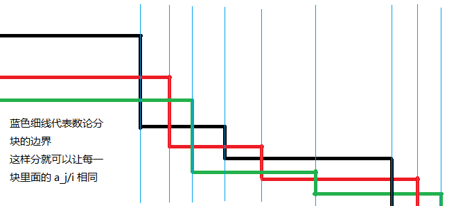
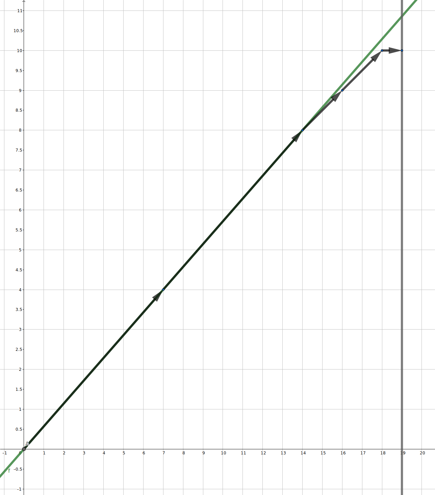
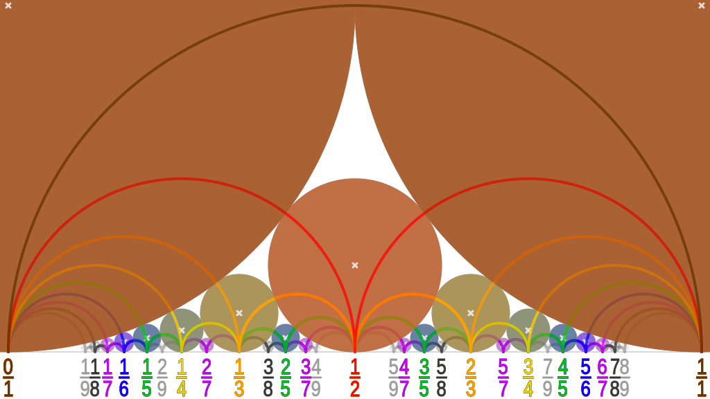

# 目录

GCD&EXGCD
--速算--
素数
亚线性时间内求素数个数——ML算法
快速分解质因数——Rho算法
线性筛
模意义下逆元的计算
模意义下的阶乘计算
模意义下组合数的速算——Lucas定理
--模意义下的方程--
中国剩余定理 CRT
同余方程..
剩余
--推式子--
数论分块
欧拉函数与欧拉反演（SigmaGCD）
莫比乌斯函数及其反演
降幂的基本原理：费马小定理及其推广
升幂引理
--抽代相关--
原根primitive-root
离散对数
--四大筛--
杜教筛
Min_25筛
PN筛
洲阁筛
杂项
--超高级专题--
？二次域.
？连分数.
？ Pell方程的求解.
？ SB树 （useless）

# GCD&EXGCD
## GCD
### 迭代写法
```cpp
int gcd(int a, int b) {
	while (b != 0) {
		int tmp = a;
		a = b;
		b = tmp % b;
	}
	return a;
}
```

对于 C++17，我们可以使用 [`<numeric>`](https://en.cppreference.com/w/cpp/header/numeric) 头中的 [`std::gcd`](https://en.cppreference.com/w/cpp/numeric/gcd) 与 [`std::lcm`](https://en.cppreference.com/w/cpp/numeric/lcm) 来求最大公约数和最小公倍数。

要求多个数的gcd， 由于gcd满足$gcd(a, b, c) = gcd(a, gcd(b, c))$ ,依次求解即可

### O(1)GCD
下面这个做法，可以实现O(值域)的预处理，O(1)的查询。

```cpp
#include <iostream>
using namespace std;

const int Mod = 998244353;

namespace GCD
{
    const int V = 1e6, T = 1e3; // T = sqrt(V)
    int pre[T + 5][T + 5];
    array<int, 3> fac[V + 5];
    bool isnp[V + 5];
    int p[V + 5], tot = 0;
    int TT;
    void init(const int v = V)
    {
        fac[1] = {1, 1, 1};
        for (int i = 2; i <= v; i++)
        {
            if (!isnp[i])
                fac[i] = {i, 1, 1}, p[tot++] = i;
            for (int j = 0; j < tot && i * p[j] <= v; j++)
            {
                int t = i * p[j];
                isnp[t] = true;
                fac[t] = fac[i], *min_element(fac[t].begin(), fac[t].end()) *= p[j];
                if (i % p[j] == 0)
                    break;
            }
        }
        TT = sqrt(v);
        for (int i = 1; i <= TT; i++)
            pre[0][i] = pre[i][0] = i;
        for (int i = 1; i <= TT; i++)
            for (int j = 1; j <= i; j++)
                pre[i][j] = pre[j][i] = pre[j][i % j];
    }
    int g(int x, int y)
    {
        int t = x % y;
        if (t == 0)
            return y;
        return y > TT ? 1 : pre[y][t];
    }
    int gcd(int a, int b)
    {
        if (a == 1 || b == 1)
            return 1;
        int a0 = g(a, fac[b][0]), a1 = g(a /= a0, fac[b][1]), a2 = g(a /= a1, fac[b][2]);
        return a0 * a1 * a2;
    }
}

int main()
{
    GCD::init();
    cin >> a >> b;
    cout << GCD::gcd(a, b) << endl;
    return 0;
}
```

## LCM

 $\gcd(a, b) \times \operatorname{lcm}(a, b) = a \times b$

要求两个数的最小公倍数，先求出最大公约数即可。

要求多个数的lcm， 由于lcm满足$lcm(a, b, c) = lcm(a, lcm(b, c))$ ,依次求解即可

## EXGCD

裴蜀定理告诉我们：$\gcd(a,b) | (ax+by)$,也就是说$\gcd(a,b)$是$(ax+by)$的最小值，那么如何才能取到这个最小值呢？扩展欧几里得算法（EXGCD)就可以用来求 $ax+by=\gcd(a,b)$ 的一组可行解。
### 实现

```cpp
int Exgcd(int a, int b, int &x, int &y) //used
{
	if (!b) 
	{
		x = 1;
		y = 0;
		return a;
	}
	int d = Exgcd(b, a % b, x, y);
	int t = x;
	x = y;
	y = t - (a / b) * y;
	return d;
}
```

函数返回的值为 $\gcd$，在这个过程中计算 $x,y$ 即可。

$ax+by=\gcd(a,b)$ 的解有无数个，那么求解出的 $x,y$ 是哪个呢？可以保证若$b\not= 0$ ，扩展欧几里得算法求出的可行解必有 $|x|\le b,|y|\le a$，处理下正负号即可

### 迭代法编写扩展欧几里得算法

首先，当 $x = 1$，$y = 0$，$x_1 = 0$，$y_1 = 1$ 时，显然有：

$$
\begin{cases}
ax + by     & = a \\
ax_1 + by_1 & = b
\end{cases}
$$

成立。

已知 $a\bmod b = a - (\lfloor \frac{a}{b} \rfloor \times b)$，下面令 $q = \lfloor \frac{a}{b} \rfloor$。参考迭代法求 gcd，每一轮的迭代过程可以表示为：

$$
(a, b) \rightarrow (b, a - qb)
$$

将迭代过程中的 $a$ 替换为 $ax + by = a$，$b$ 替换为 $ax_1 + by_1 = b$，可以得到：

$$
\begin{aligned}
		& \begin{cases}
			  ax + by     & = a \\
			  ax_1 + by_1 & = b
		  \end{cases}                    \\
\rightarrow & \begin{cases}
			  ax_1 + by_1               & = b      \\
			  a(x - qx_1) + b(y - qy_1) & = a - qb
		  \end{cases}
\end{aligned}
$$

据此就可以得到迭代法求 exgcd。

因为迭代的方法避免了递归，所以代码运行速度将比递归代码快一点。

```cpp
int gcd(int a, int b, int& x, int& y) 
{
	x = 1, y = 0;
	int x1 = 0, y1 = 1, a1 = a, b1 = b;
	while (b1) 
	{
		int q = a1 / b1;
		tie(x, x1) = make_tuple(x1, x - q * x1);
		tie(y, y1) = make_tuple(y1, y - q * y1);
		tie(a1, b1) = make_tuple(b1, a1 - q * b1);
	}
	return a1;
}
```

最后我们知道 $a_1$ 就是要求的 $\gcd$，有 $x \cdot a +y \cdot b = g$。

将这个做法改写成矩阵乘法，则有下面这个等价求法

```cpp
int exgcd(int a, int b, int &x, int &y) 
{
	int x1 = 1, x2 = 0, x3 = 0, x4 = 1;
	while (b != 0) 
	{
		int c = a / b;
		tie(x1, x2, x3, x4, a, b) =
		make_tuple(x3, x4, x1 - x3 * c, x2 - x4 * c, b, a - b * c);
	}
	x = x1, y = x2;
	return a;
}
```


-----

# --速算--
# 素数
素数计数函数：小于或等于 $x$ 的素数的个数，用 $\pi(x)$ 表示。随着 $x$ 的增大，有这样的近似结果：$\pi(x) \sim \dfrac{x}{\ln(x)}$。

## 素性测试

**素性测试**（Primality test）可以用于判定所给自然数是否为素数。
### 试除法

暴力做法自然可以枚举从小到大的每个数看是否能整除。

这样做是十分稳妥了，但是真的有必要每个数都去判断吗？

很容易发现这样一个事实：如果 $x$ 是 $a$ 的约数，那么 $\frac{a}{x}$ 也是 $a$ 的约数。

这个结论告诉我们，对于每一对 $(x, \frac{a}{x} )$，只需要检验其中的一个就好了。为了方便起见，我们之考察每一对里面小的那个数。不难发现，所有这些较小数就是 $[1, \sqrt{a}]$ 这个区间里的数。

由于 $1$ 肯定是约数，所以不检验它。

参考实现
```cpp
bool isPrime(int a) 
{
  if (a < 2) return 0;
  for (int i = 2; (ll)i * i <= a; ++i)
	if (a % i == 0) return 0;
  return 1;
}
```

### Miller–Rabin 素性测试

**Miller–Rabin 素性测试**是常用的素数判定方法。这只是一种概率测试，然而实际上没有已知的数字通过了 Miller–Rabin 测试等高级概率性测试但实际上却是合数，因此我们可以放心使用。

在不考虑乘法的复杂度时，对数 $n$ 进行 $k$ 轮测试的时间复杂度是 $O(k \log n)$。Miller-Rabbin 素性测试常用于对高精度数进行测试，此时时间复杂度是 $O(k \log^3n)$，利用 FFT 等技术可以优化到$O(k \log^2n \log \log n \log \log \log n)$ .

#### 二次探测定理

如果 $p$ 是奇素数，则 $x^2 \equiv 1 \pmod p$ 的解为 $x \equiv 1 \pmod p$ 或者 $x \equiv p - 1 \pmod p$。

#### 实现

根据 Carmichael 数的性质，可知其一定不是 $p^e$。

不妨将费马小定理和二次探测定理结合起来使用：

将 $a^{n-1} \equiv 1 \pmod n$ 中的指数 $n−1$ 分解为 $n−1=u \times 2^t$，在每轮测试中对随机出来的 $a$ 先求出 $v = a^{u} \bmod n$，之后对这个值执行最多 $t$ 次平方操作，若发现非平凡平方根时即可判断出其不是素数，否则再使用 Fermat 素性测试判断。

还有一些实现上的小细节：

-   对于一轮测试，如果某一时刻 $a^{u \times 2^s} \equiv n-1 \pmod n$，则之后的平方操作全都会得到 $1$，则可以直接通过本轮测试。
-   如果找出了一个非平凡平方根 $a^{u \times 2^s} \not\equiv n-1 \pmod n$，则之后的平方操作全都会得到 $1$。可以选择直接返回 `false`，也可以放到 $t$ 次平方操作后再返回 `false`。

这样得到了较正确的 Miller Rabin：

参考实现

```cpp
//checked
int qPow(int a, int n, int mod)
{
    int res = 1;
    while (n)
    {
        if (n & 1)
            res = res * a % mod;
        a = a * a % mod;
        n >>= 1;
    }
    return res;
}
bool isPrime(int n)
{
    if (n < 3 || n % 2 == 0)
        return n == 2;
    if (n % 3 == 0)
        return n == 3;
    int u = n - 1, t = 0;
    while (u % 2 == 0)
        u /= 2, ++t;
    // test_time 为测试次数，建议设为不小于 8 的整数以保证正确
    // 率，但也不宜过大，否则会影响效率
    for (int i = 0; i < 10; ++i)
    {
        // 0, 1, n-1 可以直接通过测试, a 取值范围 [2, n-2]
        int a = rand() % (n - 3) + 2, v = qPow(a, u, n);
        if (v == 1)
            continue;
        int s;
        for (s = 0; s < t; ++s)
        {
            if (v == n - 1)
                break; // 得到平凡平方根 n-1，通过此轮测试
            v = (long long)v * v % n;
        }
        // 如果找到了非平凡平方根，则会由于无法提前 break; 而运行到 s == t
        // 如果 Fermat 素性测试无法通过，则一直运行到 s == t 前 v 都不会等于 -1
        if (s == t)
            return 0;
    }
    return 1;
}
```

另外，假如 [广义 Riemann 猜想](https://en.wikipedia.org/wiki/Generalized_Riemann_hypothesis)（generalized Riemann hypothesis, GRH）成立，则对数 $n$ 最多只需要测试 $[2, \min\{n-2, \lfloor 2\ln^2 n \rfloor\}]$ 中的全部整数即可 **确定** 数 $n$ 的素性。

而在 OI 范围内，通常都是对 $[1, 2^{64})$ 范围内的数进行素性检验。对于 $[1, 2^{32})$ 范围内的数，选取 $\{2, 7, 61\}$ 三个数作为基底进行 Miller–Rabin 素性检验就可以确定素性；对于 $[1, 2^{64})$ 范围内的数，选取 $\{2, 325, 9375, 28178, 450775, 9780504, 1795265022\}$ 七个数作为基底进行 Miller–Rabin 素性检验就可以确定素性。

也可以选取 $\{2, 3, 5, 7, 11, 13, 17, 19, 23, 29, 31, 37\}$（即前 $12$ 个素数）检验 $[1, 2^{64})$ 范围内的素数。

注意如果要使用上面的数列中的数 $a$ 作为基底判断 $n$ 的素性：

-   所有的数都要取一遍，不能只选小于 $n$ 的；
-   把 $a$ 换成 $a \bmod n$；
-   如果 $a \equiv 0 \pmod n$ 或 $a \equiv \pm 1 \pmod n$，则直接通过该轮测试。

具体实现如下
```cpp
typedef unsigned long long ull;
typedef unsigned char byte;
const byte test[]={2,3,5,7,11,13,17,19,23,29,31,37};
bool miller_rabin(const ull p)
{
	if(p>40)
	{
    	for(auto a:test)
			if(check(a,p)) return 0;
        return 1;
    }
    for(auto a:test)
		if(p==a) return 1;
	return 0;
}
```
## 反素数

顾名思义，素数就是因子只有两个的数，那么反素数，就是因子最多的数（并且因子个数相同的时候值最小），所以反素数是相对于一个集合来说的。

一种符合直觉的反素数定义是：在一个正整数集合中，因子最多并且值最小的数，就是反素数。

【定义】
对于某个正整数 $n$，如果任何小于 $n$ 的正数的约数个数都小于 $n$ 的约数个数，则称为是 **反素数**

### 过程

那么，如何来求解反素数呢？

首先，既然要求因子数，首先要做的就是素因子分解。把 $n$ 分解成 $n=p_{1}^{k_{1}}p_{2}^{k_{2}} \cdots p_{n}^{k_{n}}$ 的形式，其中 $p$ 是素数，$k$ 为他的指数。这样的话总因子个数就是 $(k_1+1) \times (k_2+1) \times (k_3+1) \cdots \times (k_n+1)$。

但是显然质因子分解的复杂度是很高的，并且前一个数的结果不能被后面利用。所以要换个方法。

我们来观察一下反素数的特点。

1.  反素数肯定是从 $2$ 开始的连续素数的幂次形式的乘积。

2.  数值小的素数的幂次大于等于数值大的素数，即 $n=p_{1}^{k_{1}}p_{2}^{k_{2}} \cdots p_{n}^{k_{n}}$ 中，有 $k_1 \geq k_2 \geq k_3 \geq \cdots \geq k_n$。

解释：

1.  如果不是从 $2$ 开始的连续素数，那么如果幂次不变，把素数变成数值更小的素数，那么此时因子个数不变，但是 $n$ 的数值变小了。交换到从 $2$ 开始的连续素数的时候 $n$ 值最小。

2.  如果数值小的素数的幂次小于数值大的素数的幂，那么如果把这两个素数交换位置（幂次不变），那么所得的 $n$ 因子数量不变，但是 $n$ 的值变小。

另外还有两个问题，

1.  对于给定的 $n$，要枚举到哪一个素数呢？

    最极端的情况大不了就是 $n=p_{1}p_{2} \cdots p_{n}$，所以只要连续素数连乘到刚好小于等于 $n$ 就可以的呢。再大了，连全都一次幂，都用不了，当然就是用不到的啦！

2.  我们要枚举到多少次幂呢？

    我们考虑一个极端情况，当我们最小的素数的某个幂次已经比所给的 $n$（的最大值）大的话，那么展开成其他的形式，最大幂次一定小于这个幂次。`unsigned long long` 的最大值是 $2^{64} - 1$，所以可以枚举到 $2^{64} - 1$。

细节有了，那么我们具体如何具体实现呢？

我们可以把当前走到每一个素数前面的时候列举成一棵树的根节点，然后一层层的去找。找到什么时候停止呢？

1.  当前走到的数字已经大于我们想要的数字了；

2.  当前枚举的因子已经用不到了；

3.  当前因子大于我们想要的因子了；

4.  当前因子正好是我们想要的因子（此时判断是否需要更新最小 $ans$）。

然后 dfs 里面不断一层一层枚举次数继续往下迭代可以。

### 例题

【题目】求具有给定除数个数的最小自然数。答案保证不超过 $10^{18}$。

【解题思路】对于这种题，我们只要以因子数为 dfs 的返回条件基准，不断更新找到的最小值就可以了。

【参考代码】
```cpp
#include <iostream>
unsigned long long p[16] = {
    2,  3,  5,  7,  11, 13, 17, 19,
    23, 29, 31, 37, 41, 43, 47, 53};  // 根据数据范围可以确定使用的素数最大为53

unsigned long long ans;
unsigned long long n;

// depth: 当前在枚举第几个素数
// temp: 当前因子数量为 num的时候的数值
// num: 当前因子数
// up：上一个素数的幂，这次应该小于等于这个幂次嘛
void dfs(unsigned long long depth, unsigned long long temp,
         unsigned long long num, unsigned long long up) {
  if (num > n || depth >= 16) return;  // 边界条件
  if (num == n && ans > temp) {        // 取最小的ans
    ans = temp;
    return;
  }
  for (int i = 1; i <= up; i++) {
    if (temp * p[depth] > ans)
      break;  // 剪枝：如果加一个这个乘数的结果比ans要大，则必不是最佳方案
    dfs(depth + 1, temp = temp * p[depth], num * (i + 1),
        i);  // 取一个该乘数，进行对下一个乘数的搜索
  }
}

using std::cin;
using std::cout;

int main() {
  cin.tie(nullptr)->sync_with_stdio(false);
  cin >> n;
  ans = ~(unsigned long long)0;
  dfs(0, 1, 1, 64);
  cout << ans << '\n';
  return 0;
}
```

【题目】求不超过 $n$ 的数中，除数最多的数。

【解题思路】思路同上，只不过要改改 dfs 的返回条件。注意这样的题目的数据范围，32 位整数可能溢出。

【参考代码】
```cpp
#include <iostream>

int p[16] = {2, 3, 5, 7, 11, 13, 17, 19, 23, 29, 31, 37, 41, 43, 47, 53};
unsigned long long n;
unsigned long long ans,
    ans_num;  // ans 为 n 以内的最大反素数（会持续更新），ans_sum 为
              // ans的因子数。

// depth: 当前在枚举第几个素数
// temp: 当前因子数量为 num的时候的数值
// num: 当前因子数
// up：上一个素数的幂，这次应该小于等于这个幂次嘛
void dfs(int depth, unsigned long long temp, unsigned long long num, int up) {
  if (depth >= 16 || temp > n) return;
  if (num > ans_num) {  // 更新答案
    ans = temp;
    ans_num = num;
  }
  if (num == ans_num && ans > temp) ans = temp;  // 更新答案
  for (int i = 1; i <= up; i++) {
    if (temp * p[depth] > n)
      break;  // 剪枝：如果加一个这个乘数的结果比ans要大，则必不是最佳方案
    dfs(depth + 1, temp *= p[depth], num * (i + 1),
        i);  // 取一个该乘数，进行对下一个乘数的搜索
  }
  return;
}

using std::cin;
using std::cout;

int main() {
  cin.tie(nullptr)->sync_with_stdio(false);
  while (cin >> n) {
    ans_num = 0;
    dfs(0, 1, 1, 60);
    cout << ans << '\n';
  }
  return 0;
}
```

-----

# 亚线性时间内求素数个数——ML算法

「Meissel–Lehmer 算法」是一种能在亚线性时间复杂度内求出 $1\sim n$ 内质数个数的一种算法。

## 记号规定

$\left[x\right]$ 表示对 $x$ 下取整得到的结果。  
$p_k$ 表示第 $k$ 个质数，$p_1=2$。  
$\pi\left(x\right)$ 表示 $1\sim x$ 范围内素数的个数。  
$\mu\left(x\right)$ 表示莫比乌斯函数。  
对于集合 $S$，$\# S$ 表示集合 $S$ 的大小。  
$\delta\left(x\right)$ 表示 $x$ 最小的质因子。  
$P^+\left(x\right)$ 表示 $x$ 最大的质因子。

## Meissel–Lehmer 算法求 π(x)

定义 $\phi\left(x,a\right)$ 为所有小于 $x$ 的正整数中满足其所有质因子都大于 $p_a$ 的数的个数，即：

$$
\phi\left(x,a\right)=\#\big\{n\le x\mid n\bmod p=0 \implies p>p_a\big\}\tag{1}
$$

再定义 $P_k\left(x,a\right)$ 表示为所有小于 $x$ 的正整数中满足可重质因子恰好有 $k$ 个且所有质因子都大于 $p_a$ 的数的个数，即：

$$
P_k\left(x,a\right)=\#\big\{n\le x\mid n=q_1q_2\cdots q_k \implies \forall i,q_i>p_a\big\}\tag{2}
$$

特殊的，我们定义：$P_0\left(x,a\right)=1$，如此便有：

$$
\phi\left(x,a\right)=P_0\left(x,a\right)+P_1\left(x,a\right)+\cdots+P_k\left(x,a\right)+\cdots
$$

这个无限和式实际上是可以表示为有限和式的，因为在 $p_a^k>x$ 时，有 $P_k\left(x,a\right)=0$。

设 $y$ 为满足 $x^{1/3}\le y\le x^{1/2}$ 的整数，再记 $a=\pi\left(y\right)$。

在 $k\ge 3$ 时，有 $P_1\left(x,a\right)=\pi\left(x\right)-a$ 与 $P_k\left(x,a\right)=0$，由此我们可以推出：

$$
\pi\left(x\right)=\phi\left(x,a\right)+a-1-P_2\left(x,a\right)\tag{3}
$$

这样，计算 $\pi\left(x\right)$ 便可以转化为计算 $\phi\left(x,a\right)$ 与 $P_2\left(x,a\right)$。

## 计算 P₂(x,a)

由等式 $\left(2\right)$ 我们可以得出 $P_2\left(x,a\right)$ 等于满足 $y<p\le q$ 且 $pq\le x$ 的质数对 $\left(p,q\right)$ 的个数。

首先我们注意到 $p\in \left[y+1,\sqrt{x}\right]$。此外，对于每个 $p$，我们都有 $q\in\left[p,x/p\right]$。因此：

$$
P_2\left(x,a\right)=\sum_{y<p\le \sqrt{x}}{\left(\pi\left(\dfrac{x}{p}\right)-\pi\left(p\right)+1\right)}\tag{4}
$$

当 $p\in \left[y+1,\sqrt{x}\right]$ 时，我们有 $\dfrac{x}{p}\in \left[1,\dfrac{x}{y}\right]$。因此，我们可以筛区间 $\left[1,\dfrac{x}{y}\right]$，然后对于所有的的质数 $p\in \left[y+1,\sqrt{x}\right]$ 计算 $\pi\left(\dfrac{x}{p}\right)-\pi\left(p\right)+1$。为了减少上述算法的空间复杂度，我们可以考虑分块，块长为 $L$。若块长 $L=y$，则我们可以在 $O\left(\dfrac{x}{y}\log{\log{x}}\right)$ 的时间复杂度，$O\left(y\right)$ 的空间复杂度内计算 $P_2\left(x,a\right)$。

## 计算 ϕ(x,a)

对于 $b\le a$，考虑所有不超过 $x$ 的正整数，满足它的所有质因子都大于 $p_{b-1}$。这些数可以被分为两类：

1.  可以被 $p_b$ 整除的；
2.  不可以被 $p_b$ 整除的。

属于第 $1$ 类的数有 $\phi\left(\dfrac{x}{p_b},b-1\right)$ 个，属于第二类的数有 $\phi\left(x,b\right)$ 个。

因此我们得出结论：

> **定理 $5.1$：** 函数 $\phi$ 满足下列性质
>
> $$
> \phi\left(u,0\right)=\left[u\right]\tag{5}
> $$
>
> $$
> \phi\left(x,b\right)=\phi\left(x,b-1\right)-\phi\left(\dfrac{x}{p_b},b-1\right)\tag{6}
> $$

计算 $\phi\left(x,a\right)$ 的简单方法可以从这个定理推导出来：我们重复使用等式 $\left(7\right)$，知道最后得到 $\phi\left(u,0\right)$。这个过程可以看作从根节点 $\phi\left(x,a\right)$ 开始创建有根二叉树，图 $1$ 画出了这一过程。通过这种方法，我们得到如下公式：

$$
\phi\left(x,a\right)=\sum_{\substack{1\le n\le x\\ P^+\left(n\right)\le y}}{\mu\left(n\right)\left[x/n\right]}
$$

$$
\begin{gathered}
\begin{matrix}&&\phi\left(x,a\right)&&\\
&\swarrow&&\searrow&\\
&\phi\left(x,a-1\right)&&-\phi\left(\frac{x}{p_a},a-1\right)&\\
\swarrow&\downarrow&&\downarrow&\searrow\\
\phi\left(x,a-2\right)&\phi\left(\frac{x}{p_{a-1}},a-2\right)&&-\phi\left(\frac{x}{p_a},a-2\right)&\phi\left(\frac{x}{p_ap_{a-1}},a-2\right)\end{matrix}\\
\vdots\\
\end{gathered}
$$

上图表示计算 $\phi\left(x,a\right)$ 过程的二叉树：叶子节点权值之和就是 $\phi\left(x,a\right)$。

但是，这样需要计算太多东西。因为 $y\geq x^{1/3}$，仅仅计算为 $3$ 个 不超过 $y$ 质数的乘积的数，如果按照这个方法计算，会有至少 $\dfrac{x}{\log^3 x}$ 个项，没有办法我们对复杂度的需求。

为了限制这个二叉树的「生长」，我们要改变原来的终止条件。这是原来的终止条件。

> **终止条件 $1$：** 如果 $b=0$，则不要再对节点 $\mu\left(n\right)\phi\left(\dfrac xn,b\right)$ 调用等式 $\left(6\right)$。

我们把它改成更强的终止条件：

> **终止条件 $2$：** 如果满足下面 $2$ 个条件中的一个，不要再对节点 $\mu\left(n\right)\phi\left(\dfrac xn,b\right)$ 调用等式 $\left(6\right)$:
>
> 1.  $b=0$ 且 $n\le y$；
> 2.  $n>y$。

我们根据 **终止条件 $2$** 将原二叉树上的叶子分成两种：

1.  如果叶子节点 $\mu\left(n\right)\phi\left(\dfrac xn,b\right)$ 满足 $n\le y$，则称这种叶子节点为 **普通叶子**；
2.  如果叶子节点 $\mu\left(n\right)\phi\left(\dfrac xn,b\right)$ 满足 $n>y$ 且 $n=mp_b\left(m\le y\right)$，则称这种节点为 **特殊叶子**。

由此我们得出：

> **定理 $5.2$：** 我们有：
>
> $$
> \phi\left(x,a\right)=S_0+S\tag{7}
> $$
>
> 其中 $S_0$ 表示 **普通叶子** 的贡献：
>
> $$
> S_0=\sum_{n\le y}{\mu\left(n\right)\left[\dfrac xn\right]}\tag{8}
> $$
>
> $S$ 表示 **特殊叶子** 的贡献：
>
> $$
> S=\sum_{n/\delta\left(n\right)\le y\le n}{\mu\left(n\right)\phi\left(\dfrac{x}{n},\pi\left(\delta\left(n\right)\right)-1 \right)}\tag{9}
> $$

计算 $S_0$ 显然是可以在 $O\left(y\log{\log x}\right)$ 的时间复杂度内解决的，现在我们要考虑如何计算 $S$。

## 计算 S

我们有：

$$
S=-\sum_{p\le y}{\ \sum_{\substack{\delta\left(m\right)>p\\ m\le y<mp}}{\mu\left(m\right)\phi\left(\dfrac{x}{mp},\pi\left(p\right)-1\right)}}\tag{10}
$$

我们将这个等式改写为：

$$
S=S_1+S_2+S_3
$$

其中：

$$
S_1=-\sum_{x^{1/3}<p\le y}{\ \sum_{\substack{\delta\left(m\right)>p\\ m\le y<mp}}{\mu\left(m\right)\phi\left(\dfrac{x}{mp},\pi\left(p\right)-1\right)}}
$$

$$
S_2=-\sum_{x^{1/4}<p\le x^{1/3}}{\ \sum_{\substack{\delta\left(m\right)>p\\ m\le y<mp}}{\mu\left(m\right)\phi\left(\dfrac{x}{mp},\pi\left(p\right)-1\right)}}
$$

$$
S_3=-\sum_{p\le x^{1/4}}{\ \sum_{\substack{\delta\left(m\right)>p\\ m\le y<mp}}{\mu\left(m\right)\phi\left(\dfrac{x}{mp},\pi\left(p\right)-1\right)}}
$$

注意到计算 $S_1,S_2$ 的和式中涉及到的 $m$ 都是质数，证明如下：

> 如果不是这样，因为有 $\delta\left(m\right)>p>x^{1/4}$，所以有 $m>p^2>\sqrt{x}$，这与 $m\le y$ 矛盾，所以原命题成立。

更多的，当 $mp>x^{1/2}\ge y$ 时，有 $y\le mp$。因此我们有：

$$
S_1=\sum_{x^{1/3}<p\le y}{\ \sum_{p<q\le y}{\phi\left(\dfrac{x}{pq},\pi\left(p\right)-1\right)}}
$$

$$
S_2=\sum_{x^{1/4}<p\le x^{1/3}}{\ \sum_{p<q\le y}{\phi\left(\dfrac{x}{pq},\pi\left(p\right)-1\right)}}
$$

### 计算 S₁

因为：

$$
\dfrac{x}{pq}<x^{1/3}<p
$$

所以：

$$
\phi\left(\dfrac{x}{pq},\pi\left(p\right)-1\right)=1
$$

所以计算 $S_1$ 的和式中的项都是 $1$。所以我们实际上要计算质数对 $\left(p,q\right)$ 的个数，满足：$x^{1/3}<p<q\le y$。

因此：

$$
S_1=\dfrac{\left(\pi\left(y\right)-\pi\left(x^{1/3}\right)\right)\left(\pi\left(y\right)-\pi\left(x^{1/3}\right)-1\right)}{2}
$$

有了这个等式我们便可以在 $O\left(1\right)$ 的时间内计算 $S_1$。

### 计算 S₂

我们有：

$$
S_2=\sum_{x^{1/4}<p\le x^{1/3}}{\ \sum_{p<q\le y}{\phi\left(\dfrac{x}{pq},\pi\left(p\right)-1\right)}}
$$

我们将 $S_2$ 分成 $q>\dfrac x{p^2}$ 与 $q\le \dfrac x{p^2}$ 两部分：

$$
S_2=U+V
$$

其中：

$$
U=\sum_{x^{1/4}<p\le x^{1/3}}{\ \sum_{\substack{p<q<y\\q>x/p^2}}{\phi\left(\dfrac{x}{pq},\pi\left(p\right)-1 \right)}}
$$

$$
V=\sum_{x^{1/4}<p\le x^{1/3}}{\ \sum_{\substack{p<q<y\\q\le x/p^2}}{\phi\left(\dfrac{x}{pq},\pi\left(p\right)-1 \right)}}
$$

### 计算 U

由 $q>\dfrac x{p^2}$ 可得 $p^2>\dfrac xq\le \dfrac xy,p>\sqrt{\dfrac xy}$，因此：

$$
U=\sum_{\sqrt{x/y}<p\le x^{1/3}}{\ \sum_{\substack{p<q\le y\\q>x/p^2}}{\phi\left(\dfrac{x}{pq},\pi\left(p\right)-1 \right)}}
$$

因此：

$$
U=\sum_{\sqrt{x/y}<p\le x^{1/3}}{\#\left\{q\mid \dfrac x{p^2}<q\le y \right\}}
$$

因此：

$$
U=\sum_{\sqrt{x/y}<p\le x^{1/3}}{\left(\pi\left(y\right)-\pi\left(\dfrac{x}{p^2} \right) \right)}
$$

因为有 $\dfrac x{p^2}<y$，所以我们可以预处理出所有的 $\pi\left(t\right)\left(t\le y\right)$，这样我们就可以在 $O\left(y\right)$ 的时间复杂度内计算出 $U$。

### 计算 V

对于计算 $V$ 的和式中的每一项，我们都有 $p\le \dfrac{x}{pq}<x^{1/2}<p^2$。因此：

$$
\phi\left(\dfrac{x}{pq},\pi\left(p\right)-1 \right)=1+\pi\left(\dfrac{x}{pq} \right)-\left(\pi\left(p\right)-1\right)=2-\pi\left(p\right)+\pi\left(\dfrac{x}{pq} \right)
$$

所以 $V$ 可以被表示为：

$$
V=V_1+V_2
$$

其中：

$$
V_1=\sum_{x^{1/4}<p\le x^{1/3}}{\ \sum_{p<q\le \min\left(x/p^2,y\right)}{\left(2-\pi\left(p\right)\right)}}
$$

$$
V_2=\sum_{x^{1/4}<p\le x^{1/3}}{\ \sum_{p<q\le \min\left(x/p^2,y\right)}{\pi\left(\dfrac{x}{pq} \right)}}
$$

预处理出 $\pi\left(t\right)\left(t\le y\right)$ 我们就可以在 $O\left(x^{1/3}\right)$ 的时间复杂度内计算出 $V_1$。

考虑我们如何加速计算 $V_2$ 的过程。我们可以把 $q$ 的贡献拆分成若干个 $\pi\left(\dfrac{x}{pq} \right)$ 为定值的区间上，这样就只需要计算出每一个区间的长度和从一个区间到下一个区间的 $\pi\left(\dfrac{x}{pq} \right)$ 的改变量。

更准确的说，我们首先将 $V_2$ 分成两个部分，将 $q\le \min\left(\dfrac x{p^2},y\right)$ 这个复杂的条件简化：

$$
V_2=\sum_{x^{1/4}<p\le \sqrt{x/y}}{\ \sum_{p<q\le y}{\pi\left(\dfrac{x}{pq} \right)}}+\sum_{\sqrt{x/y}<p\le x^{1/3}}{\ \sum_{p<q\le x/p^2}{\pi\left(\dfrac{x}{pq} \right)}}
$$

接着我们把这个式子改写为：

$$
V_2=W_1+W_2+W_3+W_4+W_5
$$

其中：

$$
W_1=\sum_{x^{1/4}<p\le x/y^2}{\ \sum_{p<q\le y}{\pi\left(\dfrac{x}{pq} \right)}}
$$

$$
W_2=\sum_{x/y^2<p\le \sqrt{x/y}}{\ \sum_{p<q\le \sqrt{x/p}}{\pi\left(\dfrac{x}{pq} \right)}}
$$

$$
W_3=\sum_{x/y^2<p\le \sqrt{x/y}}{\ \sum_{\sqrt{x/p}<q\le y}{\pi\left(\dfrac{x}{pq} \right)}}
$$

$$
W_4=\sum_{\sqrt{x/y}<p\le x^{1/3}}{\ \sum_{p<q\le \sqrt{x/p}}{\pi\left(\dfrac{x}{pq} \right)}}
$$

$$
W_5=\sum_{\sqrt{x/y}<p\le x^{1/3}}{\ \sum_{\sqrt{x/p}<q\le x/p^2}{\pi\left(\dfrac{x}{pq} \right)}}
$$

#### 计算 W₁ 与 W₂

计算这两个值需要计算满足 $y<\dfrac{x}{pq}<x^{1/2}$ 的 $\pi\left(\dfrac{x}{pq} \right)$ 的值。可以在区间 $[1,\sqrt x]$ 分块筛出。在每个块中我们对于所有满足条件的 $(p,q)$ 都累加 $\pi\left(\dfrac x{pq}\right)$。

#### 计算 W₃

对于每个 $p$，我们把 $q$ 分成若干个区间，每个区间都满足它们的 $\pi\left(\dfrac x{pq}\right)$ 是定值，每个区间我们都可以 $O(1)$ 计算它的贡献。当我们获得一个新的 $q$ 时，我们用 $\pi(t)$（$t\leq y$）的值表计算 $\pi\left(\dfrac x{pq}\right)$。$y$ 以内的质数表可以给出使得 $\pi(t)<\pi(t+1)=\pi\left(\dfrac x{pq}\right)$ 成立的 $t$。以此类推使得 $\pi\left(\dfrac x{pq}\right)$ 变化的下一个 $q$ 的值。

#### 计算 W₄

相比于 $W_3$，$W_4$ 中 $q$ 更小，所以 $\pi\left(\dfrac x{pq}\right)$ 改变得更快。这时候再按照计算 $W_3$ 的方法计算 $W_4$ 就显得没有任何优势。于是我们直接暴力枚举数对 $(p,q)$ 来计算 $W_4$。

#### 计算 W₅

我们像计算 $W_3$ 那样来计算 $W_5$。

## 计算 S₃

我们使用所有小于 $x^{1/4}$ 的素数一次筛出区间 $\left[1,\dfrac xy\right]$。当我们的筛法进行到 $p_k$ 的时候，我们算出了所有 $m$ 满足没有平方因子并且 $\delta(m)>p_k$ 的 $-\mu(m)\phi\left(\dfrac{x}{mp_k},k-1 \right)$ 值。这个筛法是分块进行的，我们在筛选间隔中维护一个二叉树，以实时维护所有素数筛选到给定素数后的中间结果。这样我们就可以只用 $O(\log x)$ 的时间复杂度求出在筛法进行到某一个值的时候没有被筛到的数的数量。

## 算法的时空复杂度

时空复杂度被如下 $3$ 个过程影响：

1.  计算 $P_2\left(x,a\right)$；
2.  计算 $W_1,W_2,W_3,W_4,W_5$；
3.  计算 $S_3$。

### 计算 P₂(x,y) 的复杂度

我们已经知道了这个过程的时间复杂度为 $O\left(\dfrac{x}{y}\log{\log x}\right)$，空间复杂度为 $O\left(y\right)$。

### 计算 W₁,W₂,W₃,W₄,W₅ 的复杂度

计算 $W_1,W_2$ 所进行的块长度为 $y$ 的筛的时间按复杂度为 $O\left(\sqrt{x}\log{\log x}\right)$，空间复杂度为 $O\left(y\right)$。

计算 $W_1$ 所需的时间复杂度为：

$$
\pi\left(\dfrac{x}{y^2} \right)\pi\left(y\right)=O\left(\dfrac{x}{y\log^2 x} \right)
$$

计算 $W_2$ 的时间复杂度为：

$$
O\left(\sum_{x/y^2<p\le \sqrt{x/y}}{\pi\left(\sqrt{\dfrac xp}\right)} \right)=O\left(\dfrac{x^{3/4}}{y^{1/4}\log^2 x} \right)
$$

因此，计算 $W_3$ 的时间复杂度为：

$$
O\left(\sum_{x/y^2<p\le \sqrt{x/y}}{\pi\left(\sqrt{\dfrac xp}\right)} \right)=O\left(\dfrac{x^{3/4}}{y^{1/4}\log^2 x} \right)
$$

计算 $W_4$ 的时间复杂度为：

$$
O\left(\sum_{\sqrt{x/y}<p\le x^{1/3}}{\pi\left(\sqrt{\dfrac xp}\right)} \right)=O\left(\dfrac{x^{2/3}}{\log^2 x} \right)
$$

计算 $W_5$ 的时间复杂度为：

$$
O\left(\sum_{\sqrt{x/y}<p\le x^{1/3}}{\pi\left(\sqrt{\dfrac xp}\right)} \right)=O\left(\dfrac{x^{2/3}}{\log^2 x} \right)
$$

### 计算 S₃ 的复杂度

对于预处理：由于要快速查询 $\phi(u,b)$ 的值，我们没办法用普通的筛法 $O(1)$ 求出，而是要维护一个数据结构使得每次查询的时间复杂度是 $O(\log x)$，因此时间复杂度为 $O\left(\dfrac{x}{y}\log x\log\log x\right)$。

对于求和：对于计算 $S_3$ 和式中的每一项，我们查询上述数据结构，一共 $O\left(\log x\right)$ 次查询。我们还需要计算和式的项数，即二叉树中叶子的个数。所有叶子的形式均为 $\pm\phi\left(\dfrac{x}{mp_b},b-1\right)$，其中 $m\le y,b<\pi(x^{1/4})$。因此，叶子的数目是 $O\left(y\pi\left(x^{1/4}\right)\right)$ 级别的。所以计算 $S_3$ 的总时间复杂度为：

$$
O\left(\dfrac{x}{y}\log x\log\log x+yx^{1/4}\right)
$$

### 总复杂度

这个算法的空间复杂度为 $O\left(y\right)$，时间复杂度为：

$$
O\left(\dfrac{x}{y}\log{\log x}+\dfrac{x}{y}\log x\log{\log x}+x^{1/4}y+\dfrac{x^{2/3}}{\log^2{x}} \right)
$$

我们取 $y=x^{1/3}\log^3{x}\log{\log x}$，就有最优时间复杂度为 $O\left(\dfrac{x^{2/3}}{\log^2 x}\right)$，空间复杂度为 $O\left(x^{1/3}\log^3{x}\log{\log x}\right)$。

## 一些改进

我们在这里给出改进方法，以减少算法的常数，提高它的实际效率。

-   在 **终止条件 $2$** 中，我们可以用一个 $z$ 来代替 $y$，其中 $z$ 满足 $z>y$。我们可以证明这样子计算 $S_3$ 的时间复杂度可以优化到：

    $$
    O\left(\dfrac{x}{z}\log x\log{\log x}+\dfrac{yx^{1/4}}{\log x}+z^{3/2} \right)
    $$

    这也为通过改变 $z$ 的值来检查计算提供了一个很好的方法。

-   为了清楚起见，我们在阐述算法的时候选择在 $x^{1/4}$ 处拆分来计算总和 $S$，但实际上我们只需要有 $p\le \dfrac{x}{pq}<p^2$ 就可以计算。我们可以利用这一点，渐近复杂性保持不变。

-   用前几个素数 $2,3,5$ 预处理计算可以节省更多的时间。

-----

# 快速分解质因数——Rho算法
想要分解质因数，本质上相当于解决下列问题：

给定一个正整数 $N \in \mathbf{N}_{+}$，试快速找到它的一个 [非平凡因数](基础.md)， 任意的一个即可。

显然朴素算法时间复杂度为 $O(\sqrt N)$，太慢了，故引入Rho算法

这里提供 Brent 判环且加上倍增优化的 Pollard-Rho 算法实现。

【实现一，主函数输出的是最大质因数】
```cpp
#include <iostream>
#include <random>
#include <chrono>
using namespace std;
#define int long long
typedef long double ld;
mt19937 rnd(chrono::steady_clock::now().time_since_epoch().count());

int mul(int a, int b, int p)
{
    int d = a * (ld)b / p;
    int res = a * b - d * p;
    res = (res % p + p) % p;
    return res;
}

int qPow(int a, int b, int p)
{
    if (b == 0)
    {
        return 1 % p;
    }
    if (b == 1)
    {
        return a % p;
    }
    int t = 1;
    while (b)
    {
        if (b & 1)
        {
            t = mul(t, a, p);
        }
        a = mul(a, a, p);
        b >>= 1;
    }
    return t;
}

int maxn;
int d[8] = {2, 325, 9375, 28178, 450775, 9780504, 1795265022};
bool check(int x, int p)
{ // 0 means accepted the test , 1 means failed the test
    int val = qPow(x, p - 1, p);
    if (val != 1)
        return 1;
    int now = p - 1;
    while ((now & 1) ^ 1)
    {
        now >>= 1;
        val = qPow(x, now, p);
        if (val == p - 1)
            return 0;
        else if (val != 1)
            return 1;
    }
    return 0;
}
bool Miinter_Rabin(int x)
{ // 1 -> prime , 0 -> not prime
    for (int i = 0; i < 7; i++)
    {
        if (d[i] >= x)
            break;
        if (check(d[i], x))
            return 0;
    }
    return 1;
}
int Pollard_Rho(int x)
{
    int s = 0, t = 0;
    int c = rnd() % x;
    int val = 1;
    for (int goal = 1;; goal <<= 1, s = t, val = 1)
    {
        for (int step = 1; step <= goal; step++)
        {
            t = (mul(t, t, x) + c) % x;
            val = mul(val, abs(t - s), x);
            if (step % 127 == 0)
            {
                int d = gcd(val, x);
                if (d > 1)
                    return d;
            }
        }
        int d = gcd(val, x);
        if (d > 1)
            return d;
    }
}

void solve(int x)
{
    if (x < maxn || x < 2)
        return;
    if (Miinter_Rabin(x))
    {
        maxn = max(maxn, x);
        return;
    }
    int now = Pollard_Rho(x);
    while (x % now == 0)
        x /= now;
    solve(now), solve(x);
    return;
}
signed main()
{
    int T, n;
    cin >> T;
    while (T--)
    {
        cin >> n;
        maxn = 0;
        solve(n); // get max Prime factor of n to maxn
        if (maxn == n)
        {
            cout << "Prime" << endl;
        }
        else
        {
            cout << maxn << endl;
        }
    }
    return 0;
}
```

```cpp
ll Pollard_Rho(ll x)
{
	ll t = 0;
	ll c = rand() % (x - 1) + 1;
	ll s = t;
	int step = 0, goal = 1;
	ll val = 1;
	for (goal = 1;; goal <<= 1, s = t, val = 1)
	{
		for (step = 1; step <= goal; ++step)
		{
			t = f(t, c, x);
			val = val * abs(t - s) % x;
			// 如果 val 为 0，退出重新分解
			if (!val)
				return x;
			if (step % 127 == 0)
			{
				ll d = gcd(val, x);
				if (d > 1)
					return d;
			}
		}
		ll d = gcd(val, x);
		if (d > 1)
			return d;
	}
}
```

#### 复杂度
Pollard-Rho 算法中的期望迭代次数为 $O(\sqrt p)$，这里 $p$ 是 $N$ 的最小素因子。具体实现无论是采用 Floyd 判环还是 Brent 判环，如果不使用倍增优化，期望复杂度都是 $O(\sqrt p\log N)$；在加上倍增优化后，可以近似得到 $O(\sqrt p)$ 的期望复杂度。

-----

# 线性筛
### 线性筛（欧拉筛）求素数

```cpp
vector<int> pri;
bool not_prime[N];

void pre(int n)
{
	for (int i = 2; i <= n; ++i)
	{
		if (!not_prime[i])
		{
			pri.push_back(i);
		}
		for (int pri_j : pri)
		{
			if (i * pri_j > n)
				break;
			not_prime[i * pri_j] = true;
			if (i % pri_j == 0)
			{
				// i % pri_j == 0
				// 换言之，i 之前被 pri_j 筛过了
				// 由于 pri 里面质数是从小到大的，所以 i 乘上其他的质数的结果一定会被
				// pri_j 的倍数筛掉，就不需要在这里先筛一次，所以这里直接 break
				// 掉就好了
				break;
			}
		}
	}
}
```

## 线性筛求欧拉函数

注意到在线性筛中，每一个合数都是被最小的质因子筛掉。比如设 $p_1$ 是 $n$ 的最小质因子，$n' = \frac{n}{p_1}$，那么线性筛的过程中 $n$ 通过 $n' \times p_1$ 筛掉。

观察线性筛的过程，我们还需要处理两个部分，下面对 $n' \bmod p_1$ 分情况讨论。

如果 $n' \bmod p_1 = 0$，那么 $n'$ 包含了 $n$ 的所有质因子。

$$
\begin{aligned}
\varphi(n) & = n \times \prod_{i = 1}^s{\frac{p_i - 1}{p_i}} \\\\
& = p_1 \times n' \times \prod_{i = 1}^s{\frac{p_i - 1}{p_i}} \\\\
& = p_1 \times \varphi(n')
\end{aligned}
$$

那如果 $n' \bmod p_1 \neq 0$ 呢，这时 $n'$ 和 $p_1$ 是互质的，根据欧拉函数性质，我们有：

$$
\begin{aligned}
\varphi(n) & = \varphi(p_1) \times \varphi(n') \\\\
& = (p_1 - 1) \times \varphi(n')
\end{aligned}
$$

### 实现


```cpp
vector<int> pri;
bool not_prime[N];
int phi[N];

void pre(int n)
{
	phi[1] = 1;
	for (int i = 2; i <= n; i++)
	{
		if (!not_prime[i])
		{
			pri.push_back(i);
			phi[i] = i - 1;
		}
		for (int pri_j : pri)
		{
			if (i * pri_j > n)
				break;
			not_prime[i * pri_j] = true;
			if (i % pri_j == 0)
			{
				phi[i * pri_j] = phi[i] * pri_j;
				break;
			}
			phi[i * pri_j] = phi[i] * phi[pri_j];
		}
	}
}
```

## 线性筛求莫比乌斯函数

### 定义

根据莫比乌斯函数的定义，设 $n$ 是一个合数，$p_1$ 是 $n$ 的最小质因子，$n'=\frac{n}{p_1}$，有：

$$
\mu(n)=
\begin{cases}
	0 & n' \bmod p_1 = 0\\\\
	-\mu(n') & \text{otherwise}
\end{cases}
$$

若 $n$ 是质数，有 $\mu(n)=-1$。

### 实现

```cpp
vector<int> pri;
bool not_prime[N];
int mu[N];

void pre(int n)
{
	mu[1] = 1;
	for (int i = 2; i <= n; ++i)
	{
		if (!not_prime[i])
		{
			mu[i] = -1;
			pri.push_back(i);
		}
		for (int pri_j : pri)
		{
			if (i * pri_j > n)
				break;
			not_prime[i * pri_j] = true;
			if (i % pri_j == 0)
			{
				mu[i * pri_j] = 0;
				break;
			}
			mu[i * pri_j] = -mu[i];
		}
	}
}
```


## 筛法求约数个数

用 $d_i$ 表示 $i$ 的约数个数，$num_i$ 表示 $i$ 的最小质因子出现次数。

### 约数个数定理

定理：若 $n=\prod_{i=1}^m p_i^{c_i}$ 则 $d_i=\prod_{i=1}^m (c_i+1)$。

证明：我们知道 $p_i^{c_i}$ 的约数有 $p_i^0,p_i^1,\dots ,p_i^{c_i}$ 共 $c_i+1$ 个，根据乘法原理，$n$ 的约数个数就是 $\prod_{i=1}^m (c_i+1)$。

### 实现

因为 $d_i$ 是积性函数，所以可以使用线性筛。

在这里简单介绍一下线性筛实现原理。

1.  当 $i$ 为质数时，$\textit{num}_i \gets 1,\textit{d}_i \gets 2$，同时设 $q = \left\lfloor \dfrac {i}{p} \right\rfloor$，其中 $p$ 为 $i$ 的最小质因子。
2.  当 $p$ 为 $q$ 的质因子时，$\textit{num}_i \gets \textit{num}_q + 1,\textit{d}_i \gets \dfrac{\textit{d}_q}{\textit{num}_i} \times (\textit{num}_i + 1)$。
3.  当 $p,q$ 互质时，$\textit{num}_i \gets 1,\textit{d}_i \gets \textit{d}_q \times (\textit{num}_i+1)$。


```cpp
vector<int> pri;
bool not_prime[N];
int d[N], num[N];

void pre(int n) {
  d[1] = 1;
  for (int i = 2; i <= n; ++i) {
	if (!not_prime[i]) {
	  pri.push_back(i);
	  d[i] = 2;
	  num[i] = 1;
	}
	for (int pri_j : pri) {
	  if (i * pri_j > n) break;
	  not_prime[i * pri_j] = true;
	  if (i % pri_j == 0) {
		num[i * pri_j] = num[i] + 1;
		d[i * pri_j] = d[i] / num[i * pri_j] * (num[i * pri_j] + 1);
		break;
	  }
	  num[i * pri_j] = 1;
	  d[i * pri_j] = d[i] * 2;
	}
  }
}
```

## 筛法求约数和

$f_i$ 表示 $i$ 的约数和，$g_i$ 表示 $i$ 的最小质因子的 $p^0+p^1+p^2+\dots p^k$.

### 实现

```cpp
vector<int> pri;
bool not_prime[N];
int g[N], f[N];

void pre(int n) {
  g[1] = f[1] = 1;
  for (int i = 2; i <= n; ++i) {
	if (!not_prime[i]) {
	  pri.push_back(i);
	  g[i] = i + 1;
	  f[i] = i + 1;
	}
	for (int pri_j : pri) {
	  if (i * pri_j > n) break;
	  not_prime[i * pri_j] = true;
	  if (i % pri_j == 0) {
		g[i * pri_j] = g[i] * pri_j + 1;
		f[i * pri_j] = f[i] / g[i] * g[i * pri_j];
		break;
	  }
	  f[i * pri_j] = f[i] * f[pri_j];
	  g[i * pri_j] = 1 + pri_j;
	}
  }
}
```

## 一般的积性函数

假如一个 [积性函数](基础.md#积性函数)  $f$ 满足：对于任意质数 $p$ 和正整数 $k$，可以在关于 $k$ 的低次多项式时间内计算 $f(p^k)$，那么可以在 $O(n)$ 时间内筛出 $f(1),f(2),\dots,f(n)$ 的值。

设合数 $n$ 的质因子分解是 $\prod_{i=1}^k p_i^{\alpha_i}$，其中 $p_1<p_2<\dots<p_k$ 为质数，我们在线性筛中记录 $g_n=p_1^{\alpha_1}$，假如 $n$ 被 $x\cdot p$ 筛掉（$p$ 是质数），那么 $g$ 满足如下递推式：

$$
g_n=
\begin{cases}
	g_x\cdot p & x\bmod p=0\\\\
	p & \text{otherwise}
\end{cases}
$$

假如 $n=g_n$，说明 $n$ 就是某个质数的次幂，可以 $O(1)$ 计算 $f(n)$；否则，$f(n)=f(\frac{n}{g_n})\cdot f(g_n)$。

-----

# 模意义下逆元的计算
#### EXGCD求逆元（模数为x的互质数即可）
```cpp
ll exgcd(ll a, ll b, ll &x, ll &y)
{
    if (!b)
    {
        x = 1;
        y = 0;
        return a;
    }
    ll d = exgcd(b, a % b, x, y);
    ll t = x;
    x = y;
    y = t - (a / b) * y;
    return d;
}
int inv(int a)
{
	int x, y;
	exgcd(a, mod, x, y);
	return (x % mod + mod) % mod;
}```

扩展欧几里得法和求解 [线性同余方程](./linear-equation.md) 是一个原理，在这里不展开解释。

#### 快速幂求逆元（模数必须为质数）

因为 $ax \equiv 1 \pmod b$；

所以 $ax \equiv a^{b-1} \pmod b$（根据 [费马小定理](降幂的基本原理：费马小定理及其推广.md)）；

所以 $x \equiv a^{b-2} \pmod b$。

然后我们就可以用快速幂来求了。

注意：快速幂法使用了 [费马小定理](降幂的基本原理：费马小定理及其推广.md)，要求 $b$ 是一个素数；而扩展欧几里得法只要求 $\gcd(a, b) = 1$。

#### 线性求逆元

求出 $1,2,\dots,n$ 中每个数关于质数 $p$ 的逆元时，如果对于每个数进行单次求解，以上两种方法就显得慢了。此时需要线性（$O(n)$）求逆元，具体的说，就是利用下面这个递推式进行求解
$$
i^{-1} \equiv \begin{cases}
1,                                           & \text{if } i = 1, \\
-\lfloor\frac{p}{i}\rfloor (p \bmod i)^{-1}, & \text{otherwise}.
\end{cases} \pmod p
$$
```cpp
inv[1] = 1;
for (int i = 2; i <= n; ++i) {
  inv[i] = (long long)(p - p / i) * inv[p % i] % p;
}
```


注意，当 p 不为质数时，则至少有一个 $i$ 的逆元不存在。此时这个建立在递推式上的方法就不能保证结果的正确性。

### 线性求任意 n 个数的逆元

上面的方法只能求 $1$ 到 $n$ 的逆元，如果需要求任意给定 $n$ 个数（$1 \le a_i < p$）的逆元，就需要下面的方法：

首先计算 $n$ 个数的前缀积，记为 $s_i$，然后使用快速幂或扩展欧几里得法计算 $s_n$ 的逆元，记为 $sv_n$。

因为 $sv_n$ 是 $n$ 个数的积的逆元，所以当我们把它乘上 $a_n$ 时，就会和 $a_n$ 的逆元抵消，于是就得到了 $a_1$ 到 $a_{n-1}$ 的积逆元，记为 $sv_{n-1}$。

同理我们可以依次计算出所有的 $sv_i$，于是 $a_i^{-1}$ 就可以用 $s_{i-1} \times sv_i$ 求得。

所以我们就在 $O(n + \log p)$ 的时间内计算出了 $n$ 个数的逆元。

```cpp
s[0] = 1;
for (int i = 1; i <= n; ++i) s[i] = s[i - 1] * a[i] % p;
sv[n] = qpow(s[n], p - 2);
// 当然这里也可以用 exgcd 来求逆元,视个人喜好而定.
for (int i = n; i >= 1; --i) sv[i - 1] = sv[i] * a[i] % p;
for (int i = 1; i <= n; ++i) inv[i] = sv[i] * s[i - 1] % p;
```

------

# 模意义下的阶乘计算
某一模数下阶乘计算存在一种时间复杂度线性相关于模数大小的计算方法，该方法主要适用于模数不太大（$\sim 10^6$）的情形。

根据 [中国剩余定理](中国剩余定理%20CRT.md)，阶乘取模问题可以转化为模数为素数幂 $p^\alpha$ 的情形，最后在用CRT合并计算结果即可。在处理这类问题时，常常需要对于素数 $p$ 和正整数 $n$，将阶乘 $n!$ 中的所有因子 $p$ 都提取出来，进而得到分解：

$$
n! = p^{\nu_p(n!)}(n!)_p.
$$

其中，$\nu_p(n!)$ 表示阶乘 $n!$ 的素因数分解中 $p$ 的幂次，$(n!)_p$ 表示在阶乘 $n!$ 的结果中去除所有 $p$ 的幂次得到的整数。本文将讨论 $(n!)_p$ 在素数（幂）模下的余数以及幂次 $\nu_p(n!)$ 的具体计算方法。

这种分解在解决阶乘同时出现在所求表达式的分子和分母的问题时尤为有用，比如 [计算某一模数下的二项式系数](模意义下组合数的速算——Lucas定理.md)。对于这类问题，分子和分母中 $p$ 的幂次可以直接相减，而与 $p$ 互素的部分 $(n!)_p$ 则可以利用 [乘法逆元](逆元.md) 计算。

## Wilson 定理

Wilson 定理给出了判断某个自然数是素数的一个充分必要条件。

**定理**： 对于自然数 $n>1$，当且仅当 $n$ 是素数时，$(n-1)!\equiv -1\pmod n$。

利用本文的记号，Wilson 定理可以写作 $(p!)_p\equiv -1\pmod{p}$。

### 推广

Wilson 定理可以推广到一般模数的情形。

【定理（Gauss）】
对于自然数 $m>1$，有

$$
\prod_{1\le k<m,\ k\perp m} k \equiv \pm 1 \pmod{m}.
$$

而且，余数中的 $\pm 1$ 取值为 $-1$ 当且仅当模 $m$ 的 [原根存在](./primitive-root.md#原根存在定理)，即 $m=2,4,p^\alpha,2p^\alpha$ 时，其中 $p$ 是奇素数且 $\alpha$ 是正整数。

在计算中，尤为重要的是模数为素数幂的情形：

【推论】
对于素数 $p$ 和正整数 $\alpha$，有

$$
\prod_{1\le k<p^\alpha,\ k\perp p}k \equiv 
\begin{cases}
1, & p=2\text{ and }\alpha\ge3,\\
-1, &\text{otherwise}
\end{cases}
\pmod{p^\alpha}.
$$

注意，左侧并非 $(p^\alpha!)_p$，因为后者还需要统计 $p$ 的倍数的贡献。

## 阶乘余数的计算

本节讨论余数 $(n!)_p\bmod p^{\alpha}$ 的计算。

### 素数模的情形

算式 $(n!)_p$ 有明显的递归结构。为注意到这一点，首先考察一个具体的例子：

【例子】
要计算 $(32!)_5 \bmod{5}$，可以做如下递归计算：

$$
\begin{aligned}
(32!)_5 &= 1\times 2\times 3 \times 4\times \underbrace{1}_{5}\times 6 \times 7 \times 8\times 9 \times \underbrace{2}_{10} \\
&\quad\times 11 \times 12 \times 13 \times 14\times \underbrace{3}_{15}\times 16 \times 17\times 18\times 19\times \underbrace{4}_{20} \\
&\quad\times 21 \times 22 \times 23 \times 24\times \underbrace{1}_{25}\times 26 \times 27\times 28\times 29\times \underbrace{6}_{30} \times 31 \times 32 \\
&\equiv 1\times 2\times 3 \times 4\times \underbrace{1}_{5}\times 1 \times 2 \times 3\times 4 \times \underbrace{2}_{10} \\
&\quad\times 1 \times 2 \times 3 \times 4\times \underbrace{3}_{15}\times 1 \times 2\times 3\times 4\times \underbrace{4}_{20} \\
&\quad\times 1 \times 2 \times 3 \times 4\times \underbrace{1}_{25}\times 1 \times 2\times 3\times 4\times \underbrace{1}_{30}\times 1\times 2\\
&= (1\times 2\times 3\times 4)^{6}\times(1\times 2)\times(\underbrace{1}_{5}\times \underbrace{2}_{10}\times \underbrace{3}_{15} \times \underbrace{4}_{20}\times \underbrace{1}_{25}\times \underbrace{1}_{30}) \pmod{5}
\end{aligned}
$$

可以看出，利用模 $5$ 余数的周期性，可以将这一乘积划分为若干个长度为 $5$ 的块，每一块的唯一差异就是最后一个元素的余数。因为 $32$ 除以 $5$ 得到的商是 $6$ 且余数是 $2$，所以，该乘积可以划分为 $6$ 个完整的块和最后一段长度为 $2$ 的不完整的块。因此，可以将前 $6$ 个块除了最后一个元素之外的部分提取出来（这一部分恰好是 Wilson 定理能够解决的），再乘上最后一个不完整的块的乘积，最后乘上前 $6$ 个块的最后一个元素的连乘积。每个块的最后一个元素都是 $5$ 的倍数，去掉 $5$ 的幂次后，它们的连乘积恰好是 $(6!)_{5}\pmod{5}$。这就将原来的问题转化为了规模更小的问题。

将该例子中的递归的结构一般化，就得到如下递推公式：

对于素数 $p$ 和正整数 $n$，有

$$
(n!)_p \equiv (-1)^{\left\lfloor n/p\right\rfloor}\cdot (n\bmod p)!\cdot\left(\left\lfloor n/p\right\rfloor!\right)_p\pmod{p}.
$$

利用该递推式做计算，递归深度为 $O(\log_p n)$。如果每次都重新计算中间那一项，那么每层计算的复杂度都是 $O(p)$ 的，总的时间复杂度是 $O(p\log_p n)$；如果对所有 $n=1,2,\cdots,p-1$ 都预先处理了 $n!\bmod p$，那么预处理的复杂度是 $O(p)$ 的，每层计算的复杂度都是 $O(1)$ 的，总的时间复杂度是 $O(p+\log_p n)$ 的。

在实现时，因为是尾递归，可以用迭代实现。下面的实现对前 $p-1$ 个阶乘做了预计算，如果需要多次调用，可以将预计算放到函数外进行。

代码
```cpp
// Calculate (n!)_p mod p.
int factmod(int n, int p) {
  // Pretreatment.
  std::vector<int> f(p);
  f[0] = 1;
  for (int i = 1; i < p; ++i) {
    f[i] = (long long)f[i - 1] * i % p;
  }
  // Recursion.
  int res = 1;
  while (n > 1) {
    if ((n / p) & 1) res = p - res;
    res = (long long)res * f[n % p] % p;
    n /= p;
  }
  return res;
}

int main() {
  int t;
  std::cin >> t;
  for (; t; --t) {
    int n, p;
    std::cin >> n >> p;
    std::cout << factmod(n, p) << '\n';
  }
  return 0;
}

```

如果空间有限，无法存储所有阶乘，也可以将函数调用中实际用到的阶乘 $n!\bmod p$ 中的 $n$ 都计算出来，然后对它们进行排序，从而可以在最后一次性计算出来这些阶乘的值，汇总到最终结果中，而避免存储所有阶乘的值。

### 素数幂模的情形

对于素数幂模的情形，可以仿照素数模的情形解决，只需要将 Wilson 定理替换成它的推广形式。本节两个结论中的 $\pm 1$，均特指这样的定义：当模数 $p=2$ 且 $\alpha\ge 3$ 时取 $1$，其余情形取 $-1$。

【递推公式】
对于素数 $p$ 和正整数 $\alpha,n$，有

$$
(n!)_{p} \equiv (\pm 1)^{\lfloor n/p^\alpha\rfloor}\cdot\left(\prod_{1\le j\le (n\bmod p^\alpha),\ j\perp p}j\right)\cdot(\lfloor n/p\rfloor!)_p\pmod{p^\alpha}.
$$

其中，$\pm 1$ 的取值如同 [Wilson 定理的推广](#推广) 中规定的那样。

与素数模的情形不同之处，除了 $-1$ 可能需要替换为 $\pm 1$ 之外，还需要注意预处理的数据的不同。对于素数幂模的情形，需要对所有不超过 $p^\alpha$ 的正整数 $n$ 预处理自 $1$ 至 $n$ 但并非 $p$ 的倍数的所有整数的乘积，即

$$
\prod_{1\le k\le n,\ k\perp p} k\bmod{p^\alpha}.
$$

在素数模的情形，它退化为 $n!\bmod p$，但是该表达式在一般的素数幂的情形不再适用。

下面提供了在素数幂模的情形下计算阶乘余数的例子，以便理解上述方法：

???+ example "例子"
要计算 $(32!)_3\bmod 9$，可以做如下递归计算：

$$
\begin{aligned}
(32!)_3 
&= 1\times 2\times \underbrace{1}_{3} \times 4\times 5\times \underbrace{2}_{6}\times 7\times 8\times\underbrace{1}_{9}\\
&\quad\times 10\times 11\times\underbrace{4}_{12}\times 13\times 14\times\underbrace{5}_{15}\times 16\times 17\times\underbrace{2}_{18}\\
&\quad\times 19\times 20\times\underbrace{7}_{21}\times 22\times 23\times\underbrace{8}_{24}\times 25\times 26\times\underbrace{1}_{27}\\
&\quad\times 28\times 29\times\underbrace{10}_{30}\times 31\times 32\\
&\equiv 1\times 2\times \underbrace{1}_{3} \times 4\times 5\times \underbrace{2}_{6}\times 7\times 8\times\underbrace{1}_{9}\\
&\quad\times 1\times 2\times\underbrace{4}_{12}\times 4\times 5\times\underbrace{5}_{15}\times 7\times 8\times\underbrace{2}_{18}\\
&\quad\times 1\times 2\times\underbrace{7}_{21}\times 4\times 5\times\underbrace{8}_{24}\times 7\times 8\times\underbrace{1}_{27}\\
&\quad\times 1\times 2\times\underbrace{1}_{30}\times 4\times 5\\
&=(1\times 2\times 4\times 5\times 7\times 8)^{3}\times (1\times 2\times 4\times 5)\\
&\quad\times\begin{pmatrix}\underbrace{1}_{3}\times\underbrace{2}_{6}\times\underbrace{1}_{9}\times\underbrace{4}_{12}\times\underbrace{5}_{15}\times\underbrace{2}_{18}\\\times\underbrace{7}_{21}\times\underbrace{8}_{24}\times\underbrace{1}_{27}\times\underbrace{1}_{30}\end{pmatrix}\pmod{9}.
\end{aligned}
$$

将 $(32!)_3\bmod 9$ 的算式分解的结果同样可以分为三部分：

-   完整的块：由 $1\sim 9$ 之间所有不被 $3$ 整除的整数的乘积，共 $\lfloor 32/9\rfloor=3$ 块；
-   尾部不完整的块：所有不被 $3$ 整除的整数从 $1$ 一直乘到 $32\bmod 9$；
-   所有被 $3$ 整除的整数的乘积，对比倒数第二个等号的结果可知，这就是它的前 $\lfloor 32/3\rfloor=10$ 项，亦即 $(\lfloor 32/3\rfloor!)_3\bmod 9$。

最后一个括号里的递归求解即可，这样就将原问题转化为了更小的问题。

由此，就可以得到如下递推结果：

【递推结果】
对于素数 $p$ 和正整数 $\alpha,n$，有

$$
(n!)_p \equiv (\pm 1)^{\sum_{j\ge\alpha}\lfloor{n}/{p^j}\rfloor}\prod_{j\ge 0}F(\lfloor n/p^j\rfloor\bmod p^\alpha),
$$

其中，$F(m) = \prod_{1\le k\le m,\ k\perp p} k\bmod{p^\alpha}$ 且 $\pm 1$ 的取值与上文所述相同。

素数幂模的情形的实现和素数模的情形类似，只有一些细节上的区别。与上文类似，同样可以将预处理放到函数外进行。

代码
```cpp
// Calculate (n!)_p mod pa.
int factmod(int n, int p, int pa) {
  // Pretreatment.
  std::vector<int> f(pa);
  f[0] = 1;
  for (int i = 1; i < pa; ++i) {
    f[i] = i % p ? (long long)f[i - 1] * i % pa : f[i - 1];
  }
  // Recursion.
  bool neg = p != 2 || pa <= 4;
  int res = 1;
  while (n > 1) {
    if ((n / pa) & neg) res = pa - res;
    res = (long long)res * f[n % pa] % pa;
    n /= p;
  }
  return res;
}

int main() {
  int t;
  std::cin >> t;
  for (; t; --t) {
    int n, p, pa;
    std::cin >> n >> p >> pa;
    std::cout << factmod(n, p, pa) << '\n';
  }
  return 0;
}
```

预处理的时间复杂度为 $O(p^\alpha)$，单次询问的时间复杂度为 $O(\log_p n)$。

## 幂次的计算

本节讨论阶乘 $n!$ 中 $p$ 的幂次 $\nu_p(n!)$ 的计算，它可以用于计算二项式系数的余数。因为二项式系数中，分子和分母都会出现阶乘，而分子和分母中素数 $p$ 能否互相抵消，就成为了决定最后的余数的重要因素。

### Legendre 公式

阶乘 $n!$ 中素数 $p$ 的幂次可以通过 Legendre 公式计算，而且与 $n$ 在 $p$ 进制下的表示有关。

【Legendre 公式】对于正整数 $n$，阶乘 $n!$ 中含有的素数 $p$ 的幂次 $\nu_p(n!)$ 为

$$
\nu_p(n!) = \sum_{i=1}^{\infty} \left\lfloor \dfrac{n}{p^i} \right\rfloor = \dfrac{n-S_p(n)}{p-1},
$$

其中，$S_p(n)$ 为 $p$ 进制下 $n$ 的各个数位的和。特别地，阶乘中 $2$ 的幂次是 $\nu_2(n!)=n-S_2(n)$。

求阶乘中素数幂次的参考实现如下：

```cpp
#include <iostream>

// Obtain multiplicity of p in n!.
int multiplicity_factorial(int n, int p) {
  int count = 0;
  do {
    n /= p;
    count += n;
  } while (n);
  return count;
}

int main() {
  int t;
  std::cin >> t;
  for (; t; --t) {
    int n, p;
    std::cin >> n >> p;
    std::cout << multiplicity_factorial(n, p) << '\n';
  }
  return 0;
}
```

它的时间复杂度为 $O(\log n)$。

### Kummer 定理

组合数对一个数取模的结果，往往构成分形结构，例如谢尔宾斯基三角形就可以通过组合数模 $2$ 得到。

如果仔细分析，$p$ 是否整除组合数其实和上下标在 $p$ 进制下减法是否需要借位有关。这就有了 **Kummer 定理**。

【Kummer 定理】
素数 $p$ 在组合数 $\dbinom{m}{n}$ 中的幂次，恰好是 $p$ 进制下 $m$ 减掉 $n$ 需要借位的次数，亦即

$$
\nu_p\left(\dbinom{m}{n}\right)=\frac{S_p(n)+S_p(m-n)-S_p(m)}{p-1}.
$$

特别地，组合数中 $2$ 的幂次是 $\nu_2\left(\dbinom{m}{n}\right)=S_2(n)+S_2(m-n)-S_2(m)$.

## 例题


给定 $n$, 计算

$$
\sum_{k=1}^n\left\lfloor\frac{(3k+6)!+1}{3k+7}-\left\lfloor\frac{(3k+6)!}{3k+7}\right\rfloor\right\rfloor
$$

【解题思路】
若 $3k+7$ 是质数，则

$$
(3k+6)!\equiv-1\pmod{3k+7}
$$

设 $(3k+6)!+1=k(3k+7)$

则

$$
\left\lfloor\frac{(3k+6)!+1}{3k+7}-\left\lfloor\frac{(3k+6)!}{3k+7}\right\rfloor\right\rfloor=\left\lfloor k-\left\lfloor k-\frac{1}{3k+7}\right\rfloor\right\rfloor=1
$$

若 $3k+7$ 不是质数，则有 $(3k+7)\mid(3k+6)!$，即

$$
(3k+6)!\equiv 0\pmod{3k+7}
$$

设 $(3k+6)!=k(3k+7)$，则

$$
\left\lfloor\frac{(3k+6)!+1}{3k+7}-\left\lfloor\frac{(3k+6)!}{3k+7}\right\rfloor\right\rfloor=\left\lfloor k+\frac{1}{3k+7}-k\right\rfloor=0
$$

因此

$$
\sum_{k=1}^n\left\lfloor\frac{(3k+6)!+1}{3k+7}-\left\lfloor\frac{(3k+6)!}{3k+7}\right\rfloor\right\rfloor=\sum_{k=1}^n[3k+7\text{ is prime}]
$$

参考代码
```cpp
#include <iostream>

constexpr int M = 1e6 + 5, N = 3 * M + 7;

bool not_prime[N];
int sum[M];

int main() {
  for (int i = 2; i < N; ++i)
    if (!not_prime[i])
      for (int j = 2; j * i < N; ++j) not_prime[j * i] = true;
  for (int i = 1; i < M; ++i) sum[i] = sum[i - 1] + !not_prime[3 * i + 7];

  int t;
  std::cin >> t;
  while (t--) {
    int n;
    std::cin >> n;
    std::cout << sum[n] << std::endl;
  }
}
```

-------

# 模意义下组合数的速算——Lucas定理
前置知识：[阶乘取模](模意义下的阶乘计算.md)


组合数，又称二项式系数，指表达式：

$$
\binom{n}{k} = \dfrac{n!}{k!(n-k)!}.
$$


基于 Lucas 定理及其推广，存在一种可以在模数不太大 ($m \sim 10^6$) 时求解组合数的方法。更准确地说，只要模数的唯一分解 $m=\prod p_i^{e_i}$ 中所有素数幂的和（即 $\sum p_i^{e_i}$）在 $10^6$ 规模时就可以使用该方法，因为算法的预处理大致相当于这一规模。

## Lucas 定理

首先讨论模数为素数 $p$ 的情形。此时，有 Lucas 定理：
对于素数 $p$，有

$$
\binom{n}{k}\equiv \binom{\lfloor n/p\rfloor}{\lfloor k/p\rfloor}\binom{n\bmod p}{k\bmod p}\pmod p.
$$

其中，当 $n<k$ 时，二项式系数 $\dbinom{n}{k}$ 规定为 $0$。

在求解素数模下组合数时，利用 Lucas 定理和利用 exLucas 算法得到的结果是等价的。

Lucas 定理指出，模数为素数 $p$ 时，大组合数的计算可以转化为规模更小的组合数的计算。在右式中，第一个组合数可以继续递归，直到 $n,k<p$ 为止；第二个组合数则可以直接计算，或者提前预处理出来。写成代码的形式就是：

代码
```cpp
long long Lucas(long long n, long long k long long p) {
  if (k == 0) return 1;
  return (C(n % p, k % p, p) * Lucas(n / p, k / p, p)) % p;
}
```

其中，`C(n, k, p)` 用于计算小规模的组合数。

递归至多进行 $O(\log_p n)$ 次，因而算法的复杂度为 $O(f(p)+g(p)\log_p n)$，其中，$f(p)$ 为预处理组合数的复杂度，$g(p)$ 为单次计算组合数的复杂度。

### 参考实现

此处给出的参考实现在 $O(p)$ 时间内预处理 $p$ 以内的阶乘及其逆元后，可以在 $O(1)$ 时间内计算单个组合数：

```cpp
#include <iostream>
#include <vector>

class BinomModPrime {
  int p;
  std::vector<int> fa, ifa;

  // Calculate binom(n, k) mod p for n, k < p.
  int calc(int n, int k) {
    if (n < k) return 0;
    long long res = fa[n];
    res = (res * ifa[k]) % p;
    res = (res * ifa[n - k]) % p;
    return res;
  }

 public:
  BinomModPrime(int p) : p(p), fa(p), ifa(p) {
    // Factorials mod p till p.
    fa[0] = 1;
    for (int i = 1; i < p; ++i) {
      fa[i] = (long long)fa[i - 1] * i % p;
    }
    // Inverse of factorials mod p till p.
    ifa[p - 1] = p - 1;  // Wilson's theorem.
    for (int i = p - 1; i; --i) {
      ifa[i - 1] = (long long)ifa[i] * i % p;
    }
  }

  // Calculate binom(n, k) mod p.
  int binomial(long long n, long long k) {
    long long res = 1;
    while (n || k) {
      res = (res * calc(n % p, k % p)) % p;
      n /= p;
      k /= p;
    }
    return res;
  }
};

int main() {
  int t, p;
  std::cin >> t >> p;
  BinomModPrime bm(p);
  for (; t; --t) {
    long long n, k;
    std::cin >> n >> k;
    std::cout << bm.binomial(n, k) << '\n';
  }
  return 0;
}
```

该实现的时间复杂度为 $O(p+T\log_p n)$，其中，$T$ 为询问次数。

## exLucas 算法(用于模数非质数)

Lucas 定理中对于模数 $p$ 要求必须为素数，那么对于 $p$ 不是素数的情况，就需要用到 exLucas 算法。虽然名字如此，该算法实际操作时并没有用到 Lucas 定理。

### 素数幂模的情形

首先考虑模数为素数幂 $p^\alpha$ 的情形。将阶乘 $n!$ 中的 $p$ 的幂次和其他幂次分开，可以得到分解：

$$
n! = p^{\nu_p(n!)}(n!)_p.
$$

其中，$\nu_p(n!)$ 为 $n!$ 的素因数分解中 $p$ 的幂次，而 $(n!)_p$ 显然与 $p$ 互素。因此，组合数可以写作：

$$
\binom{n}{k} = p^{\nu_p(n!)-\nu_p(k!)-\nu_p((n-k)!)}\dfrac{(n!)_p}{(k!)_p((n-k)!)_p}.
$$

式子中的 $\nu_p(n!)$ 等可以通过 [Legendre 公式](模意义下的阶乘计算.md#legendre-公式) 计算，$(n!)_p$ 等则可以通过 [递推关系](模意义下的阶乘计算.md#素数幂模的情形) 计算。因为后者与 $p^\alpha$ 互素，所以分母上的乘积的逆元可以通过 [扩展欧几里得算法](逆元.md#扩展欧几里得法) 计算。问题就得以解决。

注意，如果幂次 $\nu_p(n!)-\nu_p(k!)-\nu_p((n-k)!)\ge\alpha$，余数一定为零，不必再做更多计算。

### 一般模数的情形

对于 $m$ 是一般的合数的情形，只需要首先对它做 [素因数分解](快速分解质因数——Rho算法.md)：

$$
m = p_1^{\alpha_1}p_2^{\alpha_2}\cdots p_s^{\alpha_s}.
$$

然后，分别计算出模 $p_i^{\alpha_i}$ 下组合数 $\dbinom{n}{k}$ 的余数，就得到 $s$ 个同余方程：

$$
\begin{cases}
\dbinom{n}{k} \equiv r_1, &\pmod{p_1^{\alpha_1}}, \\
\dbinom{n}{k} \equiv r_2, &\pmod{p_2^{\alpha_2}}, \\
\quad\quad\cdots\\
\dbinom{n}{k} \equiv r_s, &\pmod{p_s^{\alpha_s}}.
\end{cases}
$$

最后，利用 [中国剩余定理](中国剩余定理%20CRT.md) 求出模 $m$ 的余数。

### 参考实现

最后，给出模板题目 [二项式系数](https://loj.ac/p/181) 的参考实现。

"参考实现"
```cpp
#include <iostream>
#include <vector>

// Extended Euclid.
void ex_gcd(int a, int b, int& x, int& y) {
  if (!b) {
    x = 1;
    y = 0;
  } else {
    ex_gcd(b, a % b, y, x);
    y -= a / b * x;
  }
}

// Inverse of a mod m.
int inverse(int a, int m) {
  int x, y;
  ex_gcd(a, m, x, y);
  return (x % m + m) % m;
}

// Coefficient in CRT.
int crt_coeff(int m_i, int m) {
  long long mm = m / m_i;
  mm *= inverse(mm, m_i);
  return mm % m;
}

// Binominal Coefficient Calculator Modulo Prime Power.
class BinomModPrimePower {
  int p, a, pa;
  std::vector<int> f;

  // Obtain multiplicity of p in n!.
  long long nu(long long n) {
    long long count = 0;
    do {
      n /= p;
      count += n;
    } while (n);
    return count;
  }

  // Calculate (n!)_p mod pa.
  long long fact_mod(long long n) {
    bool neg = p != 2 || pa <= 4;
    long long res = 1;
    while (n > 1) {
      if ((n / pa) & neg) res = pa - res;
      res = res * f[n % pa] % pa;
      n /= p;
    }
    return res;
  }

 public:
  BinomModPrimePower(int p, int a, int pa) : p(p), a(a), pa(pa), f(pa) {
    // Pretreatment.
    f[0] = 1;
    for (int i = 1; i < pa; ++i) {
      f[i] = i % p ? (long long)f[i - 1] * i % pa : f[i - 1];
    }
  }

  // Calculate Binom(n, k) mod pa.
  int binomial(long long n, long long k) {
    long long v = nu(n) - nu(n - k) - nu(k);
    if (v >= a) return 0;
    auto res = fact_mod(n - k) * fact_mod(k) % pa;
    res = fact_mod(n) * inverse(res, pa) % pa;
    for (; v; --v) res *= p;
    return res % pa;
  }
};

// Binominal Coefficient Calculator.
class BinomMod {
  int m;
  std::vector<BinomModPrimePower> bp;
  std::vector<long long> crt_m;

 public:
  BinomMod(int n) : m(n) {
    // Factorize.
    for (int p = 2; p * p <= n; ++p) {
      if (n % p == 0) {
        int a = 0, pa = 1;
        for (; n % p == 0; n /= p, ++a, pa *= p);
        bp.emplace_back(p, a, pa);
        crt_m.emplace_back(crt_coeff(pa, m));
      }
    }
    if (n > 1) {
      bp.emplace_back(n, 1, n);
      crt_m.emplace_back(crt_coeff(n, m));
    }
  }

  // Calculate Binom(n, k) mod m.
  int binomial(long long n, long long k) {
    long long res = 0;
    for (size_t i = 0; i != bp.size(); ++i) {
      res = (bp[i].binomial(n, k) * crt_m[i] + res) % m;
    }
    return res;
  }
};

int main() {
  int t, m;
  std::cin >> t >> m;
  BinomMod bm(m);
  for (; t; --t) {
    long long n, k;
    std::cin >> n >> k;
    std::cout << bm.binomial(n, k) << '\n';
  }
  return 0;
}
```

该算法在预处理时将模数 $m$ 分解为素数幂，然后对所有 $p^\alpha$ 预处理了自 $1$ 至 $p^\alpha$ 所有非 $p$ 倍数的自然数的乘积，以及它在中国剩余定理合并答案时对应的系数。预处理的时间复杂度为 $O(\sqrt{m}+\sum_ip_i^{\alpha_i})$。每次询问时，复杂度为 $O(\log m+\sum_i\log_{p_i}n)$，复杂度中的两项分别是计算逆元和计算幂次、阶乘余数的复杂度。

-----

# --模意义下的方程--
# 中国剩余定理 CRT
## 定义

中国剩余定理 (Chinese Remainder Theorem, CRT) 可求解如下形式的一元线性同余方程组（其中 $n_1, n_2, \cdots, n_k$ 两两互质）：

$$
\begin{cases}
x &\equiv a_1 \pmod {n_1} \\
x &\equiv a_2 \pmod {n_2} \\
&\vdots \\
x &\equiv a_k \pmod {n_k} \\
\end{cases}
$$


## 过程

1.  计算所有模数的积 $n$；
2.  对于第 $i$ 个方程：
1.  计算 $m_i=\frac{n}{n_i}$；
2.  计算 $m_i$ 在模 $n_i$ 意义下的 [逆元](逆元.md)  $m_i^{-1}$；
3.  计算 $c_i=m_im_i^{-1}$（**不要对 $n_i$ 取模**）。
3.  方程组在模 $n$ 意义下的唯一解为：$x=\sum_{i=1}^k a_ic_i \pmod n$。

## 实现

```cpp
ll exgcd(ll a, ll b, ll &x, ll &y)
{
    if (!b)
    {
        x = 1;
        y = 0;
        return a;
    }
    ll d = exgcd(b, a % b, x, y);
    ll t = x;
    x = y;
    y = t - (a / b) * y;
    return d;
}

ll CRT(int k, vector<int> a, vector<int> r)
{
    ll n = 1, ans = 0;
    for (int i = 0; i < k; i++)
        n = n * r[i];
    for (int i = 0; i < k; i++)
    {
        ll m = n / r[i], b, y;
        exgcd(m, r[i], b, y); // b * m mod r[i] = 1
        ans = (ans + a[i] % n * m % n * b % n) % n;
    }
    return (ans % n + n) % n;
}
```

## Garner 算法

CRT 的另一个用途是用一组比较小的质数表示一个大的整数。

例如，若 $a$ 满足如下线性方程组，且 $a < \prod_{i=1}^k p_i$（其中 $p_i$ 为质数）：

$$
\begin{cases}
a &\equiv a_1 \pmod {p_1} \\
a &\equiv a_2 \pmod {p_2} \\
&\vdots \\
a &\equiv a_k \pmod {p_k} \\
\end{cases}
$$

我们可以用以下形式的式子（称作 $a$ 的混合基数表示）表示 $a$：

$$
a = x_1 + x_2 p_1 + x_3 p_1 p_2 + \ldots + x_k p_1 \ldots p_{k-1}
$$

**Garner 算法** 将用来计算系数 $x_1, \ldots, x_k$。

令 $r_{ij}$ 为 $p_i$ 在模 $p_j$ 意义下的 [逆](逆元.md)：

$$
p_i \cdot r_{i,j} \equiv 1 \pmod{p_j}
$$

把 $a$ 代入我们得到的第一个方程：

$$
a_1 \equiv x_1 \pmod{p_1}
$$

代入第二个方程得出：

$$
a_2 \equiv x_1 + x_2 p_1 \pmod{p_2}
$$

方程两边减 $x_1$，除 $p_1$ 后得

$$
\begin{aligned}
a_2 - x_1           &\equiv x_2 p_1             &\pmod{p_2} \\
(a_2 - x_1) r_{1,2} &\equiv x_2                 &\pmod{p_2} \\
x_2                 &\equiv (a_2 - x_1) r_{1,2} &\pmod{p_2}
\end{aligned}
$$

类似地，我们可以得到：

$$
x_k=(\dots((a_k-x_1)r_{1,k}-x_2)r_{2,k})-\dots)r_{k-1,k} \bmod p_k
$$

"实现"
```cpp
for (int i = 0; i < k; ++i)
{
    x[i] = a[i];
    for (int j = 0; j < i; ++j)
    {
        x[i] = r[j][i] * (x[i] - x[j]);
        x[i] = x[i] % p[i];
        if (x[i] < 0)
            x[i] += p[i];
    }
}
```

该算法的时间复杂度为 $O(k^2)$。实际上 Garner 算法并不要求模数为质数，只要求模数两两互质，我们有如下伪代码：

$$
\begin{array}{ll}
&\textbf{Chinese Remainder Algorithm }\operatorname{cra}(\mathbf{v}, \mathbf{m})\text{:} \\
&\textbf{Input}\text{: }\mathbf{m}=(m_0,m_1,\dots ,m_{n-1})\text{, }m_i\in\mathbb{Z}^+\land\gcd(m_i,m_j)=1\text{ for all } i\neq j\text{,} \\
&\qquad \mathbf{v}=(v_0,\dots ,v_{n-1}) \text{ where }v_i=x\bmod m_i\text{.} \\
&\textbf{Output}\text{: }x\bmod{\prod_{i=0}^{n-1} m_i}\text{.} \\
1&\qquad \textbf{for }i\text{ from }1\text{ to }(n-1)\textbf{ do} \\
2&\qquad \qquad C_i\gets \left(\prod_{j=0}^{i-1}m_j\right)^{-1}\bmod{m_i} \\
3&\qquad x\gets v_0 \\
4&\qquad \textbf{for }i\text{ from }1\text{ to }(n-1)\textbf{ do} \\
5&\qquad \qquad u\gets (v_i-x)\cdot C_i\bmod{m_i} \\
6&\qquad \qquad x\gets x+u\prod_{j=0}^{i-1}m_j \\
7&\qquad \textbf{return }(x)
\end{array}
$$

可以发现在第六行中的计算过程对应上述混合基数的表示。

## 应用

某些计数问题或数论问题出于加长代码、增加难度、或者是一些其他原因，给出的模数**不是质数**！

但是对其质因数分解会发现它没有平方因子，也就是该模数是由一些不重复的质数相乘得到。

那么我们可以分别对这些模数进行计算，最后用 CRT 合并答案。

下面这道题就是一个不错的例子。

"[洛谷 P2480 \[SDOI2010\] 古代猪文](https://www.luogu.com.cn/problem/P2480)"
给出 $G,n$（$1 \leq G,n \leq 10^9$），求：

$$
G^{\sum_{k\mid n}\binom{n}{k}} \bmod 999~911~659
$$

首先，当 $G=999~911~659$ 时，所求显然为 $0$。

否则，根据 [欧拉定理](降幂的基本原理：费马小定理及其推广.md)，可知所求为：

$$
G^{\sum_{k\mid n}\binom{n}{k} \bmod 999~911~658} \bmod 999~911~659
$$

现在考虑如何计算：

$$
\sum_{k\mid n}\binom{n}{k} \bmod 999~911~658
$$

因为 $999~911~658$ 不是质数，无法保证 $\forall x \in [1,999~911~657]$，$x$ 都有逆元存在，上面这个式子我们无法直接计算。

注意到 $999~911~658=2 \times 3 \times 4679 \times 35617$，其中每个质因子的最高次数均为一，我们可以考虑分别求出 $\sum_{k\mid n}\binom{n}{k}$ 在模 $2$，$3$，$4679$，$35617$ 这几个质数下的结果，最后用中国剩余定理来合并答案。

也就是说，我们实际上要求下面一个线性方程组的解：

$$
\begin{cases}
x \equiv a_1 \pmod 2\\
x \equiv a_2 \pmod 3\\
x \equiv a_3 \pmod {4679}\\
x \equiv a_4 \pmod {35617}
\end{cases}
$$

而计算一个组合数对较小的质数取模后的结果，可以利用 [卢卡斯定理](模意义下组合数的速算——Lucas定理.md)。

## 扩展：模数不互质的情况

### 两个方程

设两个方程分别是 $x\equiv a_1 \pmod {m_1}$、$x\equiv a_2 \pmod {m_2}$；

将它们转化为不定方程：$x=m_1p+a_1=m_2q+a_2$，其中 $p, q$ 是整数，则有 $m_1p-m_2q=a_2-a_1$。

由 [裴蜀定理](./bezouts.md)，当 $a_2-a_1$ 不能被 $\gcd(m_1,m_2)$ 整除时，无解；

其他情况下，可以通过 [扩展欧几里得算法](GCD&EXGCD.md) 解出来一组可行解 $(p, q)$；

则原来的两方程组成的模方程组的解为 $x\equiv b\pmod M$，其中 $b=m_1p+a_1$，$M=\text{lcm}(m_1, m_2)$。

### 多个方程

用上面的方法两两合并即可。

-----

# 同余方程

## 一次同余方程
$$
ax\equiv b\pmod n
$$

用逆元求解即可，
$$
x\equiv ba ^ {- 1} \pmod n
$$

## 高次同余方程

见《剩余》那一节

## 一次同余方程组

$$
\begin{cases}
x &\equiv a_1 \pmod {n_1} \\
x &\equiv a_2 \pmod {n_2} \\
&\vdots \\
x &\equiv a_k \pmod {n_k} \\
\end{cases}
$$
用CRT求解即可

```cpp
LL CRT(int k, LL* a, LL* r) {
	LL n = 1, ans = 0;
	for (int i = 1; i <= k; i++) n = n * r[i];
	for (int i = 1; i <= k; i++) {
		LL m = n / r[i], b, y;
		exgcd(m, r[i], b, y);  // b * m mod r[i] = 1
		ans = (ans + a[i] * m * b % n) % n;
	}
	return (ans % n + n) % n;
}
```


## 素数幂模同余方程

以下假设模数 $m=p^a~(p\in\mathbf{P},a\in\mathbf{Z}_{>1})$.

注意到若 $x_0$ 是方程

$$
f(x)\equiv 0\pmod{p^a}
$$

的解，则 $x_0$ 是方程

$$
f(x)\equiv 0\pmod{p^{a-1}}
$$

的解，这启发我们尝试通过较低的模幂次的解去构造较高的模幂次的解。我们有如下定理：

### 定理 1

对素数 $p$ 和整数 $a>1$，取整系数多项式 $f(x)=\sum_{i=0}^na_ix^i~(p^a\nmid a_n)$，令 $f'(x)=\sum_{i=1}^nia_ix^{i-1}$ 为其导数。令 $x_0$ 为方程

$$
f(x)\equiv 0\pmod{p^{a-1}}\tag{2}
$$

的解，则：

1.  若 $f'(x_0)\not\equiv 0\pmod p$, 则存在整数 $t$ 使得

$$
x=x_0+p^{a-1}t\tag{3}
$$

是方程

$$
f(x)\equiv 0\pmod{p^a}\tag{4}
$$

的解。

2.  若 $f'(x_0)\equiv 0\pmod p$ 且 $f(x_0)\equiv 0\pmod{p^a}$, 则对 $t=0,1,\dots,p-1$，由式 $(3)$ 确定的 $x$ 均为方程 $(4)$ 的解。

3.  若 $f'(x_0)\equiv 0\pmod p$ 且 $f(x_0)\not\equiv 0\pmod{p^a}$, 则不能由式 $(3)$ 构造方程 $(4)$ 的解。

进而我们有推论：

#### 推论 1

对 [定理 1](#定理-1) 的 $p$，$a$，$f(x)$，$x_0$，

1.  若 $s$ 是方程 $f(x)\equiv 0\pmod p$ 的解，且 $f'(a)\not\equiv 0\pmod p$，则存在 $x_s\in\mathbf{Z}_{p^a}$，$x_s\equiv s\pmod p$ 使得 $x_s$ 是方程 $(4)$ 的解。
2.  若方程 $f(x)\equiv 0\pmod p$ 与 $f'(a)\equiv 0\pmod p$ 无公共解，则方程 $(4)$ 和方程 $f(x)\equiv 0\pmod p$ 的解数相同。

从而我们可以将素数幂模同余方程化归到素数模同余方程的情况。

## 素数模同余方程

以下令 $p\in\mathbf{P}$，整系数多项式 $f(x)=\sum_{i=0}^na_ix^i$，其中 $p\nmid a_n$，$x\in\mathbf{Z}_p$.

### 定理 2

若方程

$$
f(x)\equiv 0\pmod p\tag{6}
$$

有 $k$ 个不同的解 $x_1,x_2,\dots,x_k~(k\leq n)$，则：

$$
f(x)\equiv g(x)\prod_{i=1}^k(x-x_i)\pmod p
$$

其中 $\deg g=n-k$ 且 $[x^{n-k}]g(x)=a_n$.
#### 推论 2

对素数 $p$，

-   $(\forall x\in\mathbf{Z}),~~x^{p-1}-1 \equiv \prod_{i=1}^{p-1}(x-i)\pmod p$
-   （[Wilson 定理](模意义下的阶乘计算.md#wilson-定理)）$(p-1)! \equiv -1 \pmod p$

### 定理 3（Lagrange 定理）

方程 $(6)$ 至多有 $n$ 个不同解。
#### 推论 3

若同余方程 $\sum_{i=0}^nb_ix^i\equiv 0\pmod p$ 的解数大于 $n$，则

$$
(\forall i=0,1,\dots,n),~~p\mid b_i
$$

### 定理 4

方程 $(6)$ 若解的个数不为 $p$，则必存在满足 $\deg r<p$ 的整系数多项式 $r(x)$ 使得 $f(x)\equiv 0\pmod p$ 和 $r(x)\equiv 0\pmod p$ 的解集相同。

### 定理 5

设 $n\leq p$，则方程

$$
x^n+\sum_{i=0}^{n-1}a_ix^i\equiv 0\pmod p\tag{7}
$$

有 $n$ 个解当且仅当存在整系数多项式 $q(x)$，$r(x)~(\deg r < n)$ 使得

$$
x^p-x=f(x)q(x)+pr(x)\tag{8}
$$

对于非首 1 多项式，由于 $\mathbf{Z}_p$ 是域，故可以将其化为首 1 多项式，从而适用该定理。

### 定理 6

设 $n\nmid p-1$，$p\nmid a$, 则方程

$$
x^n\equiv a\pmod p\tag{9}
$$

有解当且仅当

$$
a^{\frac{p-1}{n}}\equiv 1\pmod p
$$

且若 $(9)$ 有解，则解数为 $n$.

## 高次同余方程（组）的求解方法

首先我们可以借助 [中国剩余定理](中国剩余定理%20CRT.md) 将求解 **同余方程组** 转为求解 **同余方程**，以及将求解模 **合数**  $m$ 的同余方程转化为求解模 **素数幂次** 的同余方程。之后我们借助 [定理 1](#定理-1) 将求解模 **素数幂次** 的同余方程转化为求解模 **素数** 的同余方程。

结合模素数同余方程的若干定理，我们只需考虑方程

$$
x^n+\sum_{i=0}^{n-1}a_ix^i\equiv 0\pmod p
$$

的求法，其中 $p$ 是素数，$n<p$.

我们可以通过将 $x$ 代换为 $x-\dfrac{a_{n-1}}{n}$ 来消去 $x^{n-1}$ 项，从而我们只需考虑方程

$$
x^n+\sum_{i=0}^{n-2}a_ix^i\equiv 0\pmod p\tag{10}
$$

的求法，其中 $p$ 是素数，$n<p$.

-   若 $n=1$，则求法参见 [线性同余方程](./linear-equation.md)。
-   若 $n=2$，则求法参见 [二次剩余](二次剩余.md)。
-   若方程 $(10)$ 可化为

$$
x^n\equiv a\pmod p
$$

则求法参见 [k 次剩余](剩余.md)。

-----

# 剩余
前置知识：[离散对数](离散对数.md)

剩余问题，本质是模意义下的开方运算

### 定义

令整数 $k\geq 2$，整数 $a$，$m$ 满足 $(a,m)=1$，若存在整数 $x$ 使得

$$
x^k\equiv a\pmod m\tag{1}
$$

则称 $a$ 为模 $m$ 的 $k$ 次剩余，否则称 $a$ 为模 $m$ 的 $k$ 次非剩余。


## 二次剩余

二次剩余即是 $k$ 次剩余的特例，令整数 $a$，$p$ 满足 $(a,p)=1$，若存在整数 $x$ 使得

$$
x^2\equiv a\pmod p
$$

则称 $a$ 为模 $p$ 的二次剩余，否则称 $a$ 为模 $p$ 的二次非剩余。

这里只讨论 $p$ 为 **奇素数** 的求解方法。

### Euler 判别法

对奇素数 $p$ 和满足 $(a,p)=1$ 的整数 $a$，

$$
a^{\frac{p-1}{2}}\equiv\begin{cases}
1 \pmod p,  & (\exists x\in\mathbf{Z}),~~a\equiv x^2\pmod p,\\
-1 \pmod p, & \text{otherwise}.\\
\end{cases}
$$

即对上述的 $p$ 和 $a$，

1.  $a$ 是 $p$ 的二次剩余当且仅当 $a^{\frac{p-1}{2}}\equiv 1 \pmod p$.
2.  $a$ 是 $p$ 的二次非剩余当且仅当 $a^{\frac{p-1}{2}}\equiv -1 \pmod p$.


### Legendre 符号

对奇素数 $p$ 和整数 $a$，定义 Legendre 符号如下：

$$
\left(\frac{a}{p}\right)=\begin{cases}
	0,  & p\mid a,\\
	1,  & (p\nmid a) \land ((\exists x\in\mathbf{Z}),~~a\equiv x^2\pmod p),\\
	-1, & \text{otherwise}.\\
\end{cases}
$$

下表为部分 Legendre 符号的值


#### 性质

1.  对任意整数 $a$，

$$
a^{\frac{p-1}{2}}\equiv \left(\frac{a}{p}\right)\pmod p
$$

进一步，我们有推论：

-   $$
	\left(\dfrac{1}{p}\right)=1
	$$
-   $$
	\begin{aligned}
		\left(\dfrac{-1}{p}\right)&=(-1)^{\frac{p-1}{2}}\\
		&=\begin{cases}
			1,  & p\equiv 1\pmod 4,\\
			-1, & p\equiv 3\pmod 4.
			\end{cases}
	\end{aligned}
	$$

2.  $a_1\equiv a_2\pmod p\implies \left(\dfrac{a_1}{p}\right)=\left(\dfrac{a_2}{p}\right)$

3.  （[完全积性](基础.md#积性函数)）对任意整数 $a_1,a_2$，

$$
\left(\frac{a_1a_2}{p}\right)=\left(\frac{a_1}{p}\right)\left(\frac{a_2}{p}\right)
$$

我们有推论：对整数 $a,b$，$p\nmid b$ 有

$$
\left(\frac{ab^2}{p}\right)=\left(\frac{a}{p}\right)
$$

4.  $$
\begin{aligned}
	\left(\frac{2}{p}\right)&=(-1)^{\frac{p^2-1}{8}}\\
	&=\begin{cases}
			1,  & p\equiv \pm 1\pmod 8 \\
			-1, & p\equiv \pm 3\pmod 8 \\
		\end{cases}
\end{aligned}
$$

#### 二次互反律

设 $p$，$q$ 是两个不同的奇素数，则

$$
\left(\frac{p}{q}\right)\left(\frac{q}{p}\right)=(-1)^{\frac{p-1}{2}\frac{q-1}{2}}
$$


这个引理可以证明如下有用的结论：

对奇素数 $p$，

$$
\begin{aligned}
	\left(\frac{2}{p}\right)&=(-1)^{\frac{p^2-1}{8}}\\
	&=\begin{cases}
			1,  & p\equiv \pm 1\pmod 8 \\
			-1, & p\equiv \pm 3\pmod 8 \\
		\end{cases}
\end{aligned}
$$

二次互反律不仅能用于判断数 $n$ 是否是模 $p$ 的二次剩余，还能用于确定使数 $n$ 为二次剩余的模数的结构。

### 二次剩余的数量

对于奇素数 $p$，模 $p$ 意义下二次剩余和二次非剩余均有 $\frac{p-1}{2}$ 个。

### 特殊情况时的算法

对于同余方程 $x^2\equiv a\pmod p$，其中 $p$ 为奇素数且 $a$ 为二次剩余在 $p\bmod 4=3$ 时有更简单的解法，考虑

$$
\begin{aligned}
\left(a^{(p+1)/4}\right)^2&\equiv a^{(p+1)/2}&\pmod p\\
&\equiv x^{p+1}&\pmod p\\
&\equiv \left(x^2\right)\left(x^{p-1}\right)&\pmod p\\
&\equiv x^2&\pmod p&\quad (\because{\text{Fermat's little theorem}})
\end{aligned}
$$

那么 $a^{(p+1)/4}\bmod p$ 为一个解。

##### Atkin 算法

仍然考虑上述同余方程，此时 $p\bmod 8=5$，那么令 $b\equiv (2a)^{(p-5)/8}\pmod p$ 和 $\mathrm{i}\equiv 2ab^2\pmod p$ 那么此时 $\mathrm{i}^2\equiv -1\pmod p$ 且 $ab(\mathrm{i}-1)\bmod p$ 为一个解。
#### Cipolla 算法

Cipolla 算法用于求解同余方程 $x^2\equiv a\pmod p$，其中 $p$ 为奇素数且 $a$ 为二次剩余。

算法可描述为找到 $r$ 满足 $r^2-a$ 为二次非剩余，$(r-x)^{(p+1)/2}\bmod (x^2-(r^2-a))$ 为一个解。

在复数域 $\mathbf{C}$ 中，考虑令 $x^2+1\in\mathbf{R}\lbrack x\rbrack$ 和实系数多项式的集合 $\mathbf{R}\lbrack x\rbrack$ 对 $x^2+1$ 取模后的集合记作 $\mathbf{R}\lbrack x\rbrack /(x^2+1)$，那么集合中的元素都可以表示为 $a_0+a_1x$ 的形式，其中 $a_0,a_1\in\mathbf{R}$，又因为 $x^2\equiv -1\pmod{\left(x^2+1\right)}$，考虑多项式的运算可以发现 $\mathbf{R}\lbrack x\rbrack /(x^2+1)$ 中元素的运算与 $\mathbf{C}$ 中一致。

后文考虑对于系数属于有限域 $\mathbb{F}_p$ 的多项式 $\mathbb{F}_p\lbrack x\rbrack$ 和对 $x^2-(r^2-a)\in\mathbb{F}_p\lbrack x\rbrack$ 取模后的集合 $\mathbb{F}_p\lbrack x\rbrack /(x^2-(r^2-a))$ 中的运算。

**选择**  $r$：

若 $a\equiv 0\pmod p$ 那么 $r^2-a$ 为二次剩余，此时解显然为 $x\equiv 0\pmod p$。所以假设 $a\not\equiv 0\pmod p$。使得 $r^2-a$ 为非零二次剩余的选择有 $\dfrac{p-3}{2}$ 个，而使得 $r^2\equiv a\pmod p$ 的选择恰有两个，那么有 $\dfrac{p-1}{2}$ 种选择可以使得 $r^2-a$ 为二次非剩余，使用随机方法平均约两次可得 $r$.

#### Bostan–Mori 算法

该算法基于 Cipolla 算法，我们将问题转换为 [常系数齐次线性递推](../多项式/linear-recurrence.md) 再应用 Bostan–Mori 算法。考虑另一种常见的 Cipolla 算法的描述为 $b=x^{\left(p+1\right)/2}\bmod{\left(x^2-tx+a\right)}$ 为满足 $b^2\equiv a\pmod{p}$ 的一个解[^ref3]，其中 $x^2-tx+a\in \mathbb{F}_p\lbrack x\rbrack$ 为不可约多项式。选取 $t$ 同样使用随机。证明过程略。参考文献[^ref4]中的算法我们可以发现问题可转化为求解形式幂级数的乘法逆元的某一项系数：

$$
b=\left\lbrack x^{(p+1)/2}\right\rbrack\dfrac{1}{1-tx+ax^2}
$$

且

$$
\left\lbrack x^n\right\rbrack\dfrac{k_0+k_1x}{1+k_2x+k_3x^2}=
\begin{cases}
\left\lbrack x^{(n-1)/2}\right\rbrack\dfrac{k_1-k_0k_2+k_1k_3x}{1+(2k_3-k_2^2)x+k_3^2x^2},&\text{if }n\bmod 2=1\\
\left\lbrack x^{n/2}\right\rbrack\dfrac{k_0+(k_0k_3-k_1k_2)x}{1+(2k_3-k_2^2)x+k_3^2x^2},&\text{else if }n\neq 0
\end{cases}
$$

而 $n=0$ 时显然有 $\left\lbrack x^0\right\rbrack\dfrac{k_0+k_1x}{1+k_2x+k_3x^2}=k_0$，该算法乘法次数相较于 Cipolla 算法更少，其他相关乘法次数较少的算法可见[^ref2]。

#### Legendre 算法

对于同余方程 $x^2\equiv a\pmod p$，其中 $p$ 为奇素数且 $a$ 为二次剩余。Legendre 算法可描述为找到 $r$ 满足 $r^2-a$ 为二次非剩余，令 $a_0+a_1x=(r-x)^{\frac{p-1}{2}}\bmod (x^2-a)$，那么 $a_0\equiv 0\pmod p$ 且 $a_1^{-2}\equiv a\pmod p$.

#### Tonelli–Shanks 算法

Tonelli–Shanks 算法是基于离散对数求解同余方程 $x^2\equiv a\pmod p$ 的算法[^ref1]，其中 $p$ 为奇素数且 $a$ 为模 $p$ 的二次剩余。

令 $p-1=2^n\cdot m$ 其中 $m$ 为奇数。仍然使用随机方法寻找 $r\in\mathbb{F}_p$ 满足 $r$ 为二次非剩余。令 $g\equiv r^m\pmod p$ 且 $b\equiv a^{(m-1)/2}\pmod p$，那么存在整数 $e\in\lbrace 0,1,2,\dots ,2^n-1\rbrace$ 满足 $ab^2\equiv g^e\pmod p$。若 $a$ 为二次剩余，那么 $e$ 为偶数且 $\left(abg^{-e/2}\right)^2\equiv a\pmod p$.


## k次剩余

当整数 $k\geq 2$，整数 $a$，$m$ 满足 $(a,m)=1$，模 $m$  **有原根**  $g$ 时，令 $d=(k,\varphi(m))$，则：

1.  $a$ 为模 $m$ 的 $k$ 次剩余当且仅当 $d\mid \operatorname{ind}_g a$，即：

$$
a^{\frac{\varphi(m)}{d}}\equiv 1\pmod m
$$

2.  方程 $(1)$ 若有解，则模 $m$ 下恰有 $d$ 个解

3.  模 $m$ 的 $k$ 次剩余类的个数为 $\dfrac{\varphi(m)}{d}$, 其有形式

$$
a\equiv g^{di}\pmod m,\qquad \left(0\leq i<\frac{\varphi(m)}{d}\right)
$$

-----

# --推式子--

# 数论分块
数论分块可以快速计算一些含有除法向下取整的和式（即形如 $\sum_{i=1}^nf(i)g(\left\lfloor\dfrac ni\right\rfloor)$ 的和式）。当可以在 $O(1)$ 内计算 $f(r)-f(l)$ 或已经预处理出 $f$ 的前缀和时，数论分块就可以在 $O(\sqrt n)$ 的时间内计算上述和式的值。

原理是将 $\left\lfloor\dfrac ni\right\rfloor$ 相同的数打包同时计算。

## 基本定理

对于常数 $n$，使得式子

$$
\left\lfloor\dfrac ni\right\rfloor=\left\lfloor\dfrac nj\right\rfloor
$$

成立且满足 $i\leq j\leq n$ 的 $j$ 值最大为 $\left\lfloor\dfrac n{\lfloor\frac ni\rfloor}\right\rfloor$，即值 $\left\lfloor\dfrac ni\right\rfloor$ 所在块的右端点为 $\left\lfloor\dfrac n{\lfloor\frac ni\rfloor}\right\rfloor$。

## 过程

考虑和式 $\sum_{i=1}^nf(i)\left\lfloor\dfrac ni\right\rfloor$

利用上述结论，我们先求出 $f(i)$ 的 **前缀和**（记作 $s(i)=\sum_{j=1}^i f(j)$），然后每次以 $[l,r]=[l,\left\lfloor\dfrac n{\lfloor\frac ni\rfloor}\right\rfloor]$ 为一块，分块求出贡献累加到结果中即可。

伪代码如下：

$$
\begin{array}{ll}
1 & \text{Calculate $s(i)$, the prefix sum of $f(i)$.} \\
2 & l \gets 1\\
3 & r \gets 0\\
4 & \textit{result} \gets 0 \\
5 & \textbf{while } l \leq n \textbf{ do} : \\
6 & \qquad r \gets \left\lfloor \dfrac{n}{\lfloor n/l \rfloor} \right\rfloor\\
7 & \qquad \textit{result} \gets \textit{result} + [s(r)-s(l-1)] \times\left\lfloor \dfrac{n}{l} \right\rfloor\\
8 & \qquad l \gets r+1\\
9 & \textbf{end while }\\
\end{array}
$$

最终得到的 $result$ 即为所求的和式。

```cpp
//当需要多组查询是必须把前缀和s的预处理提出来作为全局变量，确保只预处理了一次！！！
int H(int n)
{
	// for i <= n sigma(f(i) * g(h / i))
	vector<int> s(n + 1);
	s[0] = 0;
	for(int i = 1; i <= n; ++i)
	{
		s[i] = s[i - 1] + f[i];
	}
	int l = 1, r = 0, res = 0;
	while(l <= n)
	{
		r = n / (n / l);
		res += (s[r] - s[l - 1]) * g[n / l];
		l = r + 1;
	}
	return res;
}
```

例题：$T$ 组数据，每组一个整数 $n$。对于每组数据，输出 $\sum_{i=1}^n\left\lfloor\dfrac ni\right\rfloor$。

```cpp
#include <iostream>
long long H(int n) {
  long long res = 0;  // 储存结果
  int l = 1, r;       // 块左端点与右端点
  while (l <= n) {
    r = n / (n / l);  // 计算当前块的右端点
    // 累加这一块的贡献到结果中。乘上 1LL 防止溢出
    res += 1LL * (r - l + 1) * (n / l);
    l = r + 1;  // 左端点移到下一块
  }
  return res;
}

int main() {
  std::ios::sync_with_stdio(false);
  std::cin.tie(nullptr);
  int t, n;
  std::cin >> t;
  while (t--) {
    std::cin >> n;
    std::cout << H(n) << '\n';
  }
  return 0;
}
```

## 向上取整的数论分块

向上取整与前文所述的向下取整十分类似，但略有区别：

对于常数 $n$，使得式子

$$
\left\lceil\dfrac ni\right\rceil=\left\lceil\dfrac nj\right\rceil
$$

成立且满足 $i\leq j\leq n$ 的 $j$ 值最大为 $\left\lfloor\dfrac{n-1}{\lfloor\frac{n-1}i\rfloor}\right\rfloor$，即值 $\left\lceil\dfrac ni\right\rceil$ 所在块的右端点为 $\left\lfloor\dfrac{n-1}{\lfloor\frac{n-1}i\rfloor}\right\rfloor$。

注意，当 $i=n$ 时，上式会出现分母为 $0$ 的错误，需要特殊处理。

例题：[CF1954E Chain Reaction](https://codeforces.com/contest/1954/problem/E)
题意：有一排 $n$ 个怪兽，每个怪兽初始血量为 $a_i$，一次攻击会使一段连续的存活的怪兽血量减 $k$，血量不大于 $0$ 视作死亡，对于所有 $k$ 求出击杀所有怪兽所需攻击次数，$n,a_i\leq 10^5$。
思路：

下面是一种使用二维数论分块的解法：

使用 [积木大赛](https://www.luogu.com.cn/problem/P1969) 的技巧，令 $a_0=0$，对于某个 $k$，答案就是 $\sum\limits_{i=1}^n\max\left(0,\left\lceil\dfrac{a_i}{k}\right\rceil-\left\lceil\dfrac{a_{i-1}}{k}\right\rceil\right)$。

对于相邻的两个怪兽，使用二维数论分块，分段求出它们对一段 $k$ 的答案的贡献，然后差分累加即可。

复杂度 $O(\sum\sqrt{a_i})$。也存在其他解法。

"实现"
```cpp
#include <algorithm>
#include <iostream>

constexpr int N = 100009;
int n, a[N], maxn;
long long ans[N];

int main() {
  std::ios::sync_with_stdio(false);
  std::cin.tie(nullptr);
  std::cin >> n;
  for (int i = 1; i <= n; ++i) {
    std::cin >> a[i];
    maxn = std::max(maxn, a[i]);
  }
  for (int i = 0; i < n; ++i)
    for (int l = 1, r;; l = r + 1) {
      r = std::min(l < a[i] ? (a[i] - 1) / ((a[i] - 1) / l) : N,
                   l < a[i + 1] ? (a[i + 1] - 1) / ((a[i + 1] - 1) / l)
                                : N);  // 二维数论分块
      if (r == N) break;
      int x = (a[i + 1] - 1) / l - std::max(a[i] - 1, 0) / l;
      if (x > 0) ans[l] += x, ans[r + 1] -= x;  // 累加贡献
    }
  ++ans[0];  // ⌈a/l⌉=(a-1)/l+1的式子当a=0时不成立，需要修正
  for (int i = 1; i <= maxn; ++i)
    std::cout << (ans[i] += ans[i - 1]) << " \n"[i == maxn];
  return 0;
}
```
## N 维数论分块

求含有 $\left\lfloor\dfrac {a_1}i\right\rfloor$、$\left\lfloor\dfrac {a_2}i\right\rfloor\cdots\left\lfloor\dfrac {a_n}i\right\rfloor$ 的和式时，数论分块右端点的表达式从一维的 $\left\lfloor\dfrac ni\right\rfloor$ 变为 $\min\limits_{j=1}^n\{\left\lfloor\dfrac {a_j}i\right\rfloor\}$，即对于每一个块的右端点取最小（最接近左端点）的那个作为整体的右端点。可以借助下图理解：



一般我们用的较多的是二维形式，此时可将代码中 `r = n / (n / i)` 替换成 `r = min(n / (n / i), m / (m / i))`。

## 数论分块扩展

以计算含有 $\left\lfloor\sqrt{\frac{n}{d}}\right\rfloor$ 的和式为例。考虑对于一个正整数 $n$，如何求出集合

$$
S=\left\{\left\lfloor\sqrt{\frac{n}{d}}\right\rfloor\mid d\in \mathbb{N}_{+}, d\leq n\right\}
$$

的所有值，以及对每一种值求出哪些 $d$ 会使其取到这个值。可以发现：

1.  因为 $\left\lfloor\sqrt{\frac{n}{d}}\right\rfloor$ 是单调不增的，所以对于所有 $v\in S$，使得 $\left\lfloor\sqrt{\frac{n}{d}}\right\rfloor=v$ 的 $d$ 必然是一段区间。
2.  对于任意正整数 $t\leq n$，我们对 $\leq t$ 与 $>t$ 的 $v\in S$ 分别分析，可以发现 $t+n/t^2\geq |S|$，取 $t=\sqrt[3]{n}$ 得到 $|S|$ 的一个上界为 $O(\sqrt[3]n)$。

这些结论与数论分块所需的引理相似，因此猜测可以写为数论分块形式。

结论是：使得式子

$$
\left\lfloor\sqrt{\frac{n}{p}}\right\rfloor=\left\lfloor\sqrt{\frac{n}{q}}\right\rfloor
$$

成立的最大的 $q$ 满足 $p\leq q\leq n$ 为

$$
\left\lfloor\frac{n}{\left\lfloor\sqrt{n/p}\right\rfloor^2}\right\rfloor
$$

故原问题可以写为数论分块形式，代码与数论分块形式并无二异。

## 两个更加通用的结论

对于正整数 $n$ 和正实数 $\alpha, \beta$，我们有
1.  对于某个不超过 $n^{\alpha/ \beta}$ 的正整数 $i$，使式子 $\left\lfloor\dfrac{n^\alpha}{i^\beta}\right\rfloor=\left\lfloor\dfrac{n^\alpha}{j^\beta}\right\rfloor$ 成立的最大的 $j$ 为 $\left\lfloor\dfrac{n^{\alpha/\beta}}{\left\lfloor n^\alpha/i^\beta \right\rfloor^{1/\beta}}\right\rfloor$。
2.  集合 $\left\{\left\lfloor\dfrac{n^\alpha}{d^\beta}\right\rfloor: d=1,2,\dots,n\right\}$ 的大小不超过 $\min\{n,2n^{\alpha/(1+\beta)}\}$。

-----

# 欧拉函数与欧拉反演(SigmaGCD)
## 定义

欧拉函数（Euler's totient function），即 $\varphi(n)$，表示的是小于等于 $n$ 和 $n$ 互质的数的个数。

## 性质

-   欧拉函数是 [积性函数](基础.md#积性函数)。

-   $n = \sum_{d \mid n}{\varphi(d)}$。

-   若 $n = p^k$，其中 $p$ 是质数，那么 $\varphi(n) = p^k - p^{k - 1}$。

-   由唯一分解定理，设 $n = \prod_{i=1}^{s}p_i^{k_i}$，其中 $p_i$ 是质数，有 $\varphi(n) = n \times \prod_{i = 1}^s{\dfrac{p_i - 1}{p_i}}$。

-   对任意不全为 $0$ 的整数 $m,n$，$\varphi(mn)\varphi(\gcd(m,n))=\varphi(m)\varphi(n)\gcd(m,n)$。

## 计算

如果只要求一个数的欧拉函数值，那么直接根据定义质因数分解的同时求就好了。这个过程可以用 [Pollard Rho](快速分解质因数——Rho算法.md) 算法优化。

参考实现
```cpp
int Phi(int n)
{
	int ans = n;
	for (int i = 2; i * i <= n; i++)
		if (n % i == 0)
		{
			ans = ans / i * (i - 1);
			while (n % i == 0)
				n /= i;
		}
	if (n > 1)
		ans = ans / n * (n - 1);
	return ans;
}
```


如果是多个数的欧拉函数值，可以利用线性筛法来求得。

## 应用

欧拉函数常常用于化简一列最大公约数的和。国内有些文章称它为 **欧拉反演**[^1]。

在结论

$$
n=\sum_{d|n}\varphi(d)
$$

中代入 $n=\gcd(a,b)$，则有

$$
\gcd(a,b) = \sum_{d|\gcd(a,b)}\varphi(d) = \sum_d [d|a][d|b]\varphi(d),
$$

其中，$[\cdot]$ 称为 [Iverson 括号](https://mathworld.wolfram.com/IversonBracket.html)，只有当命题 $P$ 为真时 $[P]$ 取值为 $1$，否则取 $0$。

对上式求和，就可以得到

$$
\sum_{i=1}^n\gcd(i,n)=\sum_{d}\sum_{i=1}^n[d|i][d|n]\varphi(d)=\sum_d\left\lfloor\frac{n}{d}\right\rfloor[d|n]\varphi(d)=\sum_{d|n}\frac{n}{d}\varphi(d).
$$

这里关键的观察是 $\sum_{i=1}^n[d|i]=\lfloor\frac{n}{d}\rfloor$，即在 $1$ 和 $n$ 之间能够被 $d$ 整除的 $i$ 的个数是 $\lfloor\frac{n}{d}\rfloor$。

利用这个式子，就可以遍历约数求和了。需要多组查询的时候，可以预处理欧拉函数的前缀和，利用数论分块查询

举个例子：给定 $n\le 100000$，求

$$
\sum_{i=1}^n\sum_{j=1}^n\gcd(i,j).
$$

"思路"
仿照上文的推导，可以得出

$$
\sum_{i=1}^n\sum_{j=1}^n\gcd(i,j) = \sum_{d=1}^n\left\lfloor\frac{n}{d}\right\rfloor^2\varphi(d).
$$

此时需要从 $1$ 遍历到 $n$ 求欧拉函数，用线性筛做就可以 $O(n)$ 得到答案。

-----

# 莫比乌斯函数及其反演
## 引入

莫比乌斯反演是数论中的重要内容。对于一些函数 $f(n)$，如果很难直接求出它的值，而容易求出其倍数和或约数和 $g(n)$，那么可以通过莫比乌斯反演简化运算，求得 $f(n)$ 的值。

开始学习莫比乌斯反演前，需要先学习一些前置知识：[数论分块](数论分块.md)、[狄利克雷卷积](../多项式/dgf.md#dirichlet-卷积)。

### 莫比乌斯函数

### 定义

$\mu$ 为莫比乌斯函数，定义为

$$
\mu(n)=
\begin{cases}
1&n=1\\
0&n\text{ 含有平方因子}\\
(-1)^k&k\text{ 为 }n\text{ 的本质不同质因子个数}\\
\end{cases}
$$

详细解释一下：

令 $n=\prod_{i=1}^kp_i^{c_i}$，其中 $p_i$ 为质因子，$c_i\ge 1$。上述定义表示：

1.  $n=1$ 时，$\mu(n)=1$；
2.  对于 $n\not= 1$ 时：
    1.  当存在 $i\in [1,k]$，使得 $c_i > 1$ 时，$\mu(n)=0$，也就是说只要某个质因子出现的次数超过一次，$\mu(n)$ 就等于 $0$；
    2.  当任意 $i\in[1,k]$，都有 $c_i=1$ 时，$\mu(n)=(-1)^k$，也就是说每个质因子都仅仅只出现过一次时，即 $n=\prod_{i=1}^kp_i$，$\{p_i\}_{i=1}^k$ 中个元素唯一时，$\mu(n)$ 等于 $-1$ 的 $k$ 次幂，此处 $k$ 指的便是仅仅只出现过一次的质因子的总个数。

### 性质

莫比乌斯函数不仅是积性函数，还有如下性质：

$$
\sum_{d\mid n}\mu(d)=
\begin{cases}
1&n=1\\
0&n\neq 1\\
\end{cases}
$$

即 $\sum_{d\mid n}\mu(d)=\varepsilon(n)$，$\mu * 1 =\varepsilon$

### 证明

设 $\displaystyle n=\prod_{i=1}^k{p_i}^{c_i},n'=\prod_{i=1}^k p_i$

那么 $\displaystyle\sum_{d\mid n}\mu(d)=\sum_{d\mid n'}\mu(d)=\sum_{i=0}^k \dbinom{k}{i}\cdot(-1)^i=(1+(-1))^k$

根据二项式定理，易知该式子的值在 $k=0$ 即 $n=1$ 时值为 $1$ 否则为 $0$，这也同时证明了 $\displaystyle\sum_{d\mid n}\mu(d)=[n=1]=\varepsilon(n)$ 以及 $\mu\ast 1=\varepsilon$

这个性质意味着，莫比乌斯函数在狄利克雷生成函数中，等价于黎曼函数 $\zeta$ 的倒数。所以在狄利克雷卷积中，莫比乌斯函数是常数函数 $1$ 的逆元。

### 补充结论

反演结论：$\displaystyle [\gcd(i,j)=1]=\sum_{d\mid\gcd(i,j)}\mu(d)$

**直接推导**：如果看懂了上一个结论，这个结论稍加思考便可以推出：如果 $\gcd(i,j)=1$ 的话，那么代表着我们按上个结论中枚举的那个 $n$ 是 $1$，也就是式子的值是 $1$，反之，有一个与 $[\gcd(i,j)=1]$ 相同的值：$0$

**利用 $\varepsilon$ 函数**：根据上一结论，$[\gcd(i,j)=1]=\varepsilon(\gcd(i,j))$，将 $\varepsilon$ 展开即可。

### 线性筛计算

```cpp
void getMu() {
  mu[1] = 1;
  for (int i = 2; i <= n; ++i) {
	if (!flg[i]) p[++tot] = i, mu[i] = -1;
	for (int j = 1; j <= tot && i * p[j] <= n; ++j) {
	  flg[i * p[j]] = 1;
	  if (i % p[j] == 0) {
		mu[i * p[j]] = 0;
		break;
	  }
	  mu[i * p[j]] = -mu[i];
	}
  }
}
```

### 拓展
记id表示恒等函数，则有

$$
\varphi \ast 1=\operatorname{id}
$$

将 $n$ 分解质因数：$\displaystyle n=\prod_{i=1}^k {p_i}^{c_i}$

首先，因为 $\varphi$ 是积性函数，故只要证明当 $n'=p^c$ 时 $\displaystyle\varphi \ast 1=\sum_{d\mid n'}\varphi(\frac{n'}{d})=\operatorname{id}$ 成立即可。

因为 $p$ 是质数，于是 $d=p^0,p^1,p^2,\cdots,p^c$

易知如下过程：

$$
\begin{aligned}
\varphi \ast 1&=\sum_{d\mid n}\varphi(\frac{n}{d})\\
&=\sum_{i=0}^c\varphi(p^i)\\
&=1+p^0\cdot(p-1)+p^1\cdot(p-1)+\cdots+p^{c-1}\cdot(p-1)\\
&=p^c\\
&=\operatorname{id}\\
\end{aligned}
$$

该式子两侧同时卷 $\mu$ 可得 $\displaystyle\varphi(n)=\sum_{d\mid n}d\cdot\mu(\frac{n}{d})$

***

### 莫比乌斯变换

设 $f(n),g(n)$ 为两个数论函数。

形式一：如果有 $f(n)=\sum_{d\mid n}g(d)$，那么有 $g(n)=\sum_{d\mid n}\mu(d)f(\frac{n}{d})$。

这种形式下，数论函数 $f(n)$ 称为数论函数 $g(n)$ 的莫比乌斯变换，数论函数 $g(n)$ 称为数论函数 $f(n)$ 的莫比乌斯逆变换（反演）。

容易看出，数论函数 $g(n)$ 的莫比乌斯变换，就是将数论函数 $g(n)$ 与常数函数 $1$ 进行狄利克雷卷积。


形式二：如果有 $f(n)=\sum_{n|d}g(d)$，那么有 $g(n)=\sum_{n|d}\mu(\frac{d}{n})f(d)$。

### 证明

方法一：对原式做数论变换。

$$
\sum_{d\mid n}\mu(d)f(\frac{n}{d})=\sum_{d\mid n}\mu(d)\sum_{k\mid \frac{n}{d}}g(k)=\sum_{k\mid n}g(k)\sum_{d\mid \frac{n}{k}}\mu(d)=g(n)
$$

用 $\displaystyle\sum_{d\mid n}g(d)$ 来替换 $f(\dfrac{n}{d})$，再变换求和顺序。最后一步变换的依据：$\displaystyle\sum_{d\mid n}\mu(d)=[n=1]$，因此在 $\dfrac{n}{k}=1$ 时第二个和式的值才为 $1$。此时 $n=k$，故原式等价于 $\displaystyle\sum_{k\mid n}[n=k]\cdot g(k)=g(n)$

方法二：运用卷积。

原问题为：已知 $f=g\ast1$，证明 $g=f\ast\mu$

易知如下转化：$f\ast\mu=g*1*\mu\implies f\ast\mu=g$（其中 $1\ast\mu=\varepsilon$）。

对于第二种形式：

类似上面的方法一，我们考虑逆推这个式子。

$$
\begin{aligned}
&\sum_{n|d}{\mu(\frac{d}{n})f(d)} \\ 
    =& \sum_{k=1}^{+\infty}{\mu(k)f(kn)}
    = \sum_{k=1}^{+\infty}{\mu(k)\sum_{kn|d}{g(d)}} \\
    =& \sum_{n|d}{g(d)\sum_{k|\frac{d}{n}}{\mu(k)}}
    = \sum_{n|d}{g(d)\epsilon(\frac{d}{n})} \\ 
    =& g(n)
\end{aligned}
$$

我们把 $d$ 表示为 $kn$ 的形式，然后把 $f$ 的原定义代入式子。

发现枚举 $k$ 再枚举 $kn$ 的倍数可以转换为直接枚举 $n$ 的倍数再求出 $k$，发现后面那一块其实就是 $\epsilon$, 整个式子只有在 $d=n$ 的时候才能取到值。

***

## 莫比乌斯反演扩展

结尾补充一个莫比乌斯反演的非卷积形式。

对于数论函数 $f,g$ 和完全积性函数 $t$ 且 $t(1)=1$：

$$
\begin{gathered}
f(n)=\sum_{i=1}^nt(i)g\left(\left\lfloor\frac{n}{i}\right\rfloor\right)\\
\iff\\
g(n)=\sum_{i=1}^n\mu(i)t(i)f\left(\left\lfloor\frac{n}{i}\right\rfloor\right)
\end{gathered}
$$

我们证明一下

$$
\begin{aligned}
g(n)&=\sum_{i=1}^n\mu(i)t(i)f\left(\left\lfloor\frac{n}{i}\right\rfloor\right)\\
&=\sum_{i=1}^n\mu(i)t(i)
\sum_{j=1}^{\left\lfloor\frac{n}{i}\right\rfloor}t(j)
g\left(\left\lfloor\frac{\left\lfloor\frac{n}{i}\right\rfloor}{j}\right\rfloor\right)\\
&=\sum_{i=1}^n\mu(i)t(i)
\sum_{j=1}^{\left\lfloor\frac{n}{i}\right\rfloor}t(j)
g\left(\left\lfloor\frac{n}{ij}\right\rfloor\right)\\
&=\sum_{T=1}^n
\sum_{i=1}^n\mu(i)t(i)
\sum_{j=1}^{\left\lfloor\frac{n}{i}\right\rfloor}[ij=T]
t(j)g\left(\left\lfloor\frac{n}{T}\right\rfloor\right)
&\text{【先枚举 ij 乘积】}\\
&=\sum_{T=1}^n
\sum_{i \mid T}\mu(i)t(i)
t\left(\frac{T}{i}\right)g\left(\left\lfloor\frac{n}{T}\right\rfloor\right)
&\text{【}\sum_{j=1}^{\left\lfloor\frac{n}{i}\right\rfloor}[ij=T] \text{对答案的贡献为 1，于是省略】}\\
&=\sum_{T=1}^ng\left(\left\lfloor\frac{n}{T}\right\rfloor\right)
\sum_{i \mid T}\mu(i)t(i)t\left(\frac{T}{i}\right)\\
&=\sum_{T=1}^ng\left(\left\lfloor\frac{n}{T}\right\rfloor\right)
\sum_{i \mid T}\mu(i)t(T)
&\text{【t 是完全积性函数】}\\
&=\sum_{T=1}^ng\left(\left\lfloor\frac{n}{T}\right\rfloor\right)t(T)
\sum_{i \mid T}\mu(i)\\
&=\sum_{T=1}^ng\left(\left\lfloor\frac{n}{T}\right\rfloor\right)t(T)
\varepsilon(T)
&\text{【}\mu\ast 1= \varepsilon\text{】}\\
&=g(n)t(1)
&\text{【当且仅当 T=1,}\varepsilon(T)=1\text{时】}\\
&=g(n)
& \square
\end{aligned}
$$


***

## 问题形式

### [「HAOI 2011」Problem b](https://www.luogu.com.cn/problem/P2522)

求值（多组数据）

$$
\sum_{i=x}^{n}\sum_{j=y}^{m}[\gcd(i,j)=k]\qquad (1\leqslant T,x,y,n,m,k\leqslant 5\times 10^4)
$$

根据容斥原理，原式可以分成 $4$ 块来处理，每一块的式子都为

$$
\sum_{i=1}^{n}\sum_{j=1}^{m}[\gcd(i,j)=k]
$$

考虑化简该式子

$$
\sum_{i=1}^{\lfloor\frac{n}{k}\rfloor}\sum_{j=1}^{\lfloor\frac{m}{k}\rfloor}[\gcd(i,j)=1]
$$

因为 $\gcd(i,j)=1$ 时对答案才用贡献，于是我们可以将其替换为 $\varepsilon(\gcd(i,j))$（$\varepsilon(n)$ 当且仅当 $n=1$ 时值为 $1$ 否则为 $0$），故原式化为

$$
\sum_{i=1}^{\lfloor\frac{n}{k}\rfloor}\sum_{j=1}^{\lfloor\frac{m}{k}\rfloor}\varepsilon(\gcd(i,j))
$$

将 $\varepsilon$ 函数展开得到

$$
\displaystyle\sum_{i=1}^{\lfloor\frac{n}{k}\rfloor}\sum_{j=1}^{\lfloor\frac{m}{k}\rfloor}\sum_{d\mid  \gcd(i,j)}\mu(d)
$$

变换求和顺序，先枚举 $d\mid \gcd(i,j)$ 可得

$$
\displaystyle\sum_{d=1}\mu(d)\sum_{i=1}^{\lfloor\frac{n}{k}\rfloor}[d\mid i]\sum_{j=1}^{\lfloor\frac{m}{k}\rfloor}[d\mid j]
$$

易知 $1\sim\lfloor\dfrac{n}{k}\rfloor$ 中 $d$ 的倍数有 $\lfloor\dfrac{n}{kd}\rfloor$ 个，故原式化为

$$
\displaystyle\sum_{d=1}^{\min(\lfloor \frac{n}{k}\rfloor,\lfloor \frac{m}{k}\rfloor)}\mu(d)\lfloor\frac{n}{kd}\rfloor\lfloor\frac{m}{kd}\rfloor
$$

很显然，式子可以数论分块求解。

**时间复杂度 $\Theta(N+T\sqrt{n})$**

```cpp
#include <algorithm>
#include <iostream>
using namespace std;
constexpr int N = 50000;
int mu[N + 5], p[N + 5];
bool flg[N + 5];

void init() {
  int tot = 0;
  mu[1] = 1;
  for (int i = 2; i <= N; ++i) {
    if (!flg[i]) {
      p[++tot] = i;
      mu[i] = -1;
    }
    for (int j = 1; j <= tot && i * p[j] <= N; ++j) {
      flg[i * p[j]] = true;
      if (i % p[j] == 0) {
        mu[i * p[j]] = 0;
        break;
      }
      mu[i * p[j]] = -mu[i];
    }
  }
  for (int i = 1; i <= N; ++i) mu[i] += mu[i - 1];
}

int solve(int n, int m) {
  int res = 0;
  for (int i = 1, j; i <= min(n, m); i = j + 1) {
    j = min(n / (n / i), m / (m / i));
    res += (mu[j] - mu[i - 1]) * (n / i) * (m / i);  // 代推出来的式子
  }
  return res;
}

int main() {
  cin.tie(nullptr)->sync_with_stdio(false);
  int T, a, b, c, d, k;
  init();  // 预处理mu数组
  cin >> T;
  for (int i = 1; i <= T; i++) {
    cin >> a >> b >> c >> d >> k;
    // 根据容斥原理，1<=x<=b&&1<=y<=d范围中的答案数减去1<=x<=b&&1<=y<=c-1范围中的答案数和
    //   1<=x<=a-1&&1<=y<=d范围中的答案数再加上1<=x<=a-1&&1<=y<=c-1范围中的答案数
    //   即可得到a<=x<=b&&c<=y<=d范围中的答案数
    // 这一步如果不懂可以画坐标图进行理解
    cout << solve(b / k, d / k) - solve(b / k, (c - 1) / k) -
                solve((a - 1) / k, d / k) + solve((a - 1) / k, (c - 1) / k)
         << '\n';
  }
  return 0;
}
```

### [「SPOJ 5971」LCMSUM](https://www.spoj.com/problems/LCMSUM/)

求值（多组数据）

$$
\sum_{i=1}^n \operatorname{lcm}(i,n)\quad  \text{s.t.}\ 1\leqslant T\leqslant 3\times 10^5,1\leqslant n\leqslant 10^6
$$

易得原式即

$$
\sum_{i=1}^n \frac{i\cdot n}{\gcd(i,n)}
$$

将原式复制一份并且颠倒顺序，然后将 n 一项单独提出，可得

$$
\frac{1}{2}\cdot \left(\sum_{i=1}^{n-1}\frac{i\cdot n}{\gcd(i,n)}+\sum_{i=n-1}^{1}\frac{i\cdot n}{\gcd(i,n)}\right)+n
$$

根据 $\gcd(i,n)=\gcd(n-i,n)$，可将原式化为

$$
\frac{1}{2}\cdot \left(\sum_{i=1}^{n-1}\frac{i\cdot n}{\gcd(i,n)}+\sum_{i=n-1}^{1}\frac{i\cdot n}{\gcd(n-i,n)}\right)+n
$$

两个求和式中分母相同的项可以合并。

$$
\frac{1}{2}\cdot \sum_{i=1}^{n-1}\frac{n^2}{\gcd(i,n)}+n
$$

即

$$
\frac{1}{2}\cdot \sum_{i=1}^{n}\frac{n^2}{\gcd(i,n)}+\frac{n}{2}
$$

可以将相同的 $\gcd(i,n)$ 合并在一起计算，故只需要统计 $\gcd(i,n)=d$ 的个数。当 $\gcd(i,n)=d$ 时，$\displaystyle\gcd(\frac{i}{d},\frac{n}{d})=1$，所以 $\gcd(i,n)=d$ 的个数有 $\displaystyle\varphi(\frac{n}{d})$ 个。

故答案为

$$
 \frac{1}{2}\cdot\sum_{d\mid n}\frac{n^2\cdot\varphi(\frac{n}{d})}{d}+\frac{n}{2}
$$

变换求和顺序，设 $\displaystyle d'=\frac{n}{d}$，合并公因式，式子化为

$$
\frac{1}{2}n\cdot\left(\sum_{d'\mid n}d'\cdot\varphi(d')+1\right)
$$

设 $\displaystyle \operatorname{g}(n)=\sum_{d\mid n} d\cdot\varphi(d)$，已知 $\operatorname{g}$ 为积性函数，于是可以 $\Theta(n)$ 筛出。每次询问 $\Theta(1)$ 计算即可。

下面给出这个函数筛法的推导过程：

首先考虑 $\operatorname g(p_j^k)$ 的值，显然它的约数只有 $p_j^0,p_j^1,\cdots,p_j^k$，因此

$$
\operatorname g(p_j^k)=\sum_{w=0}^{k}p_j^w\cdot\varphi(p_j^w)
$$

又有 $\varphi(p_j^w)=p_j^{w-1}\cdot(p_j-1)$，则原式可化为

$$
\sum_{w=0}^{k}p_j^{2w-1}\cdot(p_j-1)
$$

于是有

$$
\operatorname g(p_j^{k+1})=\operatorname g(p_j^k)+p_j^{2k+1}\cdot(p_j-1)
$$

那么，对于线性筛中的 $\operatorname g(i\cdot p_j)(p_j|i)$，令 $i=a\cdot p_j^w(\operatorname{gcd}(a,p_j)=1)$，可得

$$
\operatorname g(i\cdot p_j)=\operatorname g(a)\cdot\operatorname g(p_j^{w+1})
$$

$$
\operatorname g(i)=\operatorname g(a)\cdot\operatorname g(p_j^w)
$$

即

$$
\operatorname g(i\cdot p_j)-\operatorname g(i)=\operatorname g(a)\cdot p_j^{2w+1}\cdot(p_j-1)
$$

同理有

$$
\operatorname g(i)-\operatorname g(\frac{i}{p_j})=\operatorname g(a)\cdot p_j^{2w-1}\cdot(p_j-1)
$$

因此

$$
\operatorname g(i\cdot p_j)=\operatorname g(i)+\left (\operatorname g(i)-\operatorname g(\frac{i}{p_j})\right )\cdot p_j^2
$$

**时间复杂度**：$\Theta(n+T)$

```cpp
#include <iostream>
constexpr int N = 1000000;
int tot, p[N + 5];
long long g[N + 5];
bool flg[N + 5];  // 标记数组

void solve() {
  g[1] = 1;
  for (int i = 2; i <= N; ++i) {
    if (!flg[i]) {
      p[++tot] = i;
      g[i] = (long long)1 * i * (i - 1) + 1;
    }
    for (int j = 1; j <= tot && i * p[j] <= N; ++j) {
      flg[i * p[j]] = true;
      if (i % p[j] == 0) {
        g[i * p[j]] =
            g[i] + (g[i] - g[i / p[j]]) * p[j] * p[j];  // 代入推出来的式子
        break;
      }
      g[i * p[j]] = g[i] * g[p[j]];
    }
  }
}

using std::cin;
using std::cout;

int main() {
  cin.tie(nullptr)->sync_with_stdio(false);
  int T, n;
  solve();  // 预处理g数组
  cin >> T;
  for (int i = 1; i <= T; ++i) {
    cin >> n;
    cout << (g[n] + 1) * n / 2 << '\n';
  }
  return 0;
}

```

### [「BZOJ 2154」Crash 的数字表格](https://www.luogu.com.cn/problem/P1829)

求值（对 $20101009$ 取模）

$$
\sum_{i=1}^n\sum_{j=1}^m\operatorname{lcm}(i,j)\qquad (n,m\leqslant 10^7)
$$

易知原式等价于

$$
\sum_{i=1}^n\sum_{j=1}^m\frac{i\cdot j}{\gcd(i,j)}
$$

枚举最大公因数 $d$，显然两个数除以 $d$ 得到的数互质

$$
\sum_{i=1}^n\sum_{j=1}^m\sum_{d\mid i,d\mid j,\gcd(\frac{i}{d},\frac{j}{d})=1}\frac{i\cdot j}{d}
$$

非常经典的 $\gcd$ 式子的化法

$$
\sum_{d=1}^n d\cdot\sum_{i=1}^{\lfloor\frac{n}{d}\rfloor}\sum_{j=1}^{\lfloor\frac{m}{d}\rfloor}[\gcd(i,j)=1]\ i\cdot j
$$

后半段式子中，出现了互质数对之积的和，为了让式子更简洁就把它拿出来单独计算。于是我们记

$$
\operatorname{sum}(n,m)=\sum_{i=1}^n\sum_{j=1}^m [\gcd(i,j)=1]\  i\cdot j
$$

接下来对 $\operatorname{sum}(n,m)$ 进行化简。首先枚举约数，并将 $[\gcd(i,j)=1]$ 表示为 $\varepsilon(\gcd(i,j))$

$$
\sum_{d=1}^n\sum_{d\mid i}^n\sum_{d\mid j}^m\mu(d)\cdot i\cdot j
$$

设 $i=i'\cdot d$，$j=j'\cdot d$，显然式子可以变为

$$
\sum_{d=1}^n\mu(d)\cdot d^2\cdot\sum_{i=1}^{\lfloor\frac{n}{d}\rfloor}\sum_{j=1}^{\lfloor\frac{m}{d}\rfloor}i\cdot j
$$

观察上式，前半段可以预处理前缀和；后半段又是一个范围内数对之和，记

$$
g(n,m)=\sum_{i=1}^n\sum_{j=1}^m i\cdot j=\frac{n\cdot(n+1)}{2}\times\frac{m\cdot(m+1)}{2}
$$

可以 $\Theta(1)$ 求解

至此

$$
\operatorname{sum}(n,m)=\sum_{d=1}^n\mu(d)\cdot d^2\cdot g(\lfloor\frac{n}{d}\rfloor,\lfloor\frac{m}{d}\rfloor)
$$

我们可以 $\lfloor\frac{n}{\lfloor\frac{n}{d}\rfloor}\rfloor$ 数论分块求解 $\operatorname{sum}(n,m)$ 函数。

在求出 $\operatorname{sum}(n,m)$ 后，回到定义 $\operatorname{sum}$ 的地方，可得原式为

$$
\sum_{d=1}^n d\cdot\operatorname{sum}(\lfloor\frac{n}{d}\rfloor,\lfloor\frac{m}{d}\rfloor)
$$

可见这又是一个可以数论分块求解的式子！

本题除了推式子比较复杂、代码细节较多之外，是一道很好的莫比乌斯反演练习题！（上述过程中，默认 $n\leqslant m$）

时间复杂度：$\Theta(n+m)$（瓶颈为线性筛）

```cpp
#include <algorithm>
#include <iostream>
using namespace std;

constexpr int N = 1e7;
constexpr int mod = 20101009;
int n, m, mu[N + 5], p[N / 10 + 5], sum[N + 5];
bool flg[N + 5];

int Sum(int x, int y) {
  return ((long long)1 * x * (x + 1) / 2 % mod) *
         ((long long)1 * y * (y + 1) / 2 % mod) % mod;
}

int func(int x, int y) {
  int res = 0;
  int j;
  for (int i = 1; i <= min(x, y); i = j + 1) {
    j = min(x / (x / i), y / (y / i));
    res = (res + (long long)1 * (sum[j] - sum[i - 1] + mod) *
                     Sum(x / i, y / i) % mod) %
          mod;  //+mod防负数
  }
  return res;
}

int solve(int x, int y) {
  int res = 0;
  int j;
  for (int i = 1; i <= min(x, y); i = j + 1) {  // 整除分块处理
    j = min(x / (x / i), y / (y / i));
    res = (res + (long long)1 * (j - i + 1) * (i + j) / 2 % mod *
                     func(x / i, y / i) % mod) %
          mod;  // ！每步取模防爆
  }
  return res;
}

void init() {  // 线性筛
  mu[1] = 1;
  int tot = 0, k = min(n, m);
  for (int i = 2; i <= k; ++i) {
    if (!flg[i]) {
      p[++tot] = i;
      mu[i] = -1;
    }
    for (int j = 1; j <= tot && i * p[j] <= k; ++j) {
      flg[i * p[j]] = true;
      if (i % p[j] == 0) {
        mu[i * p[j]] = 0;
        break;
      }
      mu[i * p[j]] = -mu[i];
    }
  }
  for (int i = 1; i <= k; ++i)
    sum[i] = (sum[i - 1] + (long long)1 * i * i % mod * (mu[i] + mod)) % mod;
}

int main() {
  cin >> n >> m;
  init();
  cout << solve(n, m) << '\n';
}
```

### [「SDOI2015」约数个数和](https://loj.ac/problem/2185)

多组数据，求

$$
\sum_{i=1}^n\sum_{j=1}^md(i\cdot j) \qquad \left(n,m,T\leq5\times10^4\right)
$$

其中 $d(n)=\sum_{i \mid n}1$，$d(n)$ 表示 $n$ 的约数个数

要推这道题首先要了解 $d$ 函数的一个特殊性质

$$
d(i\cdot j)=\sum_{x \mid i}\sum_{y \mid j}[\gcd(x,y)=1]
$$

再化一下这个式子

$$
\begin{aligned}
d(i\cdot j)=&\sum_{x \mid i}\sum_{y \mid j}[\gcd(x,y)=1]\\
=&\sum_{x \mid i}\sum_{y \mid j}\sum_{p \mid \gcd(x,y)}\mu(p)\\
=&\sum_{p=1}^{min(i,j)}\sum_{x \mid i}\sum_{y \mid j}[p \mid \gcd(x,y)]\cdot\mu(p)\\
=&\sum_{p \mid i,p \mid j}\mu(p)\sum_{x \mid i}\sum_{y \mid j}[p \mid \gcd(x,y)]\\
=&\sum_{p \mid i,p \mid j}\mu(p)\sum_{x \mid \frac{i}{p}}\sum_{y \mid \frac{j}{p}}1\\
=&\sum_{p \mid i,p \mid j}\mu(p)d\left(\frac{i}{p}\right)d\left(\frac{j}{p}\right)\\
\end{aligned}
$$

将上述式子代回原式

$$
\begin{aligned}
&\sum_{i=1}^n\sum_{j=1}^md(i\cdot j)\\
=&\sum_{i=1}^n\sum_{j=1}^m\sum_{p \mid i,p \mid j}\mu(p)d\left(\frac{i}{p}\right)d\left(\frac{j}{p}\right)\\
=&\sum_{p=1}^{min(n,m)}
\sum_{i=1}^n\sum_{j=1}^m
[p \mid i,p \mid j]\cdot\mu(p)d\left(\frac{i}{p}\right)d\left(\frac{j}{p}\right)\\
=&\sum_{p=1}^{min(n,m)}
\sum_{i=1}^{\left\lfloor\frac{n}{p}\right\rfloor}\sum_{j=1}^{\left\lfloor\frac{m}{p}\right\rfloor}
\mu(p)d(i)d(j)\\
=&\sum_{p=1}^{min(n,m)}\mu(p)
\sum_{i=1}^{\left\lfloor\frac{n}{p}\right\rfloor}d(i)
\sum_{j=1}^{\left\lfloor\frac{m}{p}\right\rfloor}d(j)\\
=&\sum_{p=1}^{min(n,m)}\mu(p)
S\left(\left\lfloor\frac{n}{p}\right\rfloor\right)
S\left(\left\lfloor\frac{m}{p}\right\rfloor\right)
\left(S(n)=\sum_{i=1}^{n}d(i)\right)\\
\end{aligned}
$$

那么 $O(n)$ 预处理 $\mu,d$ 的前缀和，$O(\sqrt{n})$ 分块处理询问，总复杂度 $O(n+T\sqrt{n})$.

```cpp
#include <algorithm>
#include <iostream>
using namespace std;
constexpr long long N = 5e4 + 5;
long long n, m, T, pr[N], mu[N], d[N], t[N],
    cnt;  // t 表示 i 的最小质因子出现的次数
bool bp[N];

void prime_work(long long k) {
  bp[0] = bp[1] = true, mu[1] = 1, d[1] = 1;
  for (long long i = 2; i <= k; i++) {  // 线性筛
    if (!bp[i]) pr[++cnt] = i, mu[i] = -1, d[i] = 2, t[i] = 1;
    for (long long j = 1; j <= cnt && i * pr[j] <= k; j++) {
      bp[i * pr[j]] = true;
      if (i % pr[j] == 0) {
        mu[i * pr[j]] = 0;
        d[i * pr[j]] = d[i] / (t[i] + 1) * (t[i] + 2);
        t[i * pr[j]] = t[i] + 1;
        break;
      } else {
        mu[i * pr[j]] = -mu[i];
        d[i * pr[j]] = d[i] << 1;
        t[i * pr[j]] = 1;
      }
    }
  }
  for (long long i = 2; i <= k; i++)
    mu[i] += mu[i - 1], d[i] += d[i - 1];  // 求前缀和
}

long long solve() {
  long long res = 0, mxi = min(n, m);
  for (long long i = 1, j; i <= mxi; i = j + 1) {  // 整除分块
    j = min(n / (n / i), m / (m / i));
    res += d[n / i] * d[m / i] * (mu[j] - mu[i - 1]);
  }
  return res;
}

int main() {
  cin.tie(nullptr)->sync_with_stdio(false);
  cin >> T;
  prime_work(50000);  // 预处理
  while (T--) {
    cin >> n >> m;
    cout << solve() << '\n';
  }
  return 0;
}
```

-----

# 降幂的基本原理：费马小定理及其推广

## 费马小定理

若 $p$ 为素数、$\gcd(a, p) = 1$，则 $a^{p - 1} \equiv 1 \pmod{p}$。


## 欧拉定理

若 $\gcd(a, m) = 1$，则 $a^{\varphi(m)} \equiv 1 \pmod{m}$。


## 扩展欧拉定理


$$
a^b \equiv \begin{cases}
  a^{b \bmod \varphi(m)},                &\gcd(a,m) =  1,                   \\
  a^b,                                   &\gcd(a,m)\ne 1, b <   \varphi(m), \\
  a^{(b \bmod \varphi(m)) + \varphi(m)}, &\gcd(a,m)\ne 1, b \ge \varphi(m).
\end{cases} \pmod m
$$

### 解释

读者可能对第二行产生疑问，这一行表达的意思是：如果 $b < \varphi(m)$ 的话，就不能降幂了。

主要是因为题目中 $m$ 不会太大，而如果 $b < \varphi(m)$，自然复杂度是可以接受的。而如果 $b \ge \varphi(m)$ 的话，复杂度可能就超出预期了，这个时候我们才需要降幂来降低复杂度。

### 证明

#### 直观理解


需要知道的是，在 $\pmod m$ 的条件下，$a^b \bmod m$ 的取值范围一定在 $[0, m)$，而 $a^i \bmod m = (a^{i-1} \bmod m) \times a \bmod m$，那么对于任意一个数 $a$，那么很容易就能知道它的 **后继**，在有限的空间内这一定会形成一个循环。

在扩展欧拉定理中，循环分为纯循环和混循环。其中纯循环中不存在节点有两个前驱，而混循环则反之。而 $a^i \mod n$ 形成的序列可以是一个混循环，那么只需要知道循环节的长度，和前面那一小段未进入循环节的长度，就可以根据这个性质来进行降幂了。

值得注意的是，无论是费马小定理，还是（扩展）欧拉定理，一个很重要的应用就是降幂，从而将不可能的表达式化为可能。

#### 形式证明略

-----

# 升幂引理
升幂（Lift the Exponent，LTE）引理是初等数论中比较常用的一个定理。

定义 $\nu_p(n)$ 为整数 $n$ 的标准分解中素因子 $p$ 的幂次，即 $\nu_p(n)$ 满足 $p^{\nu_p(n)}\mid n$ 且 $p^{\nu_p(n)+1}\nmid n$.

由于升幂引理内容较长，我们将其分为三部分介绍：

以下内容设 $p$ 为素数，$x,y$ 为满足 $p\nmid x$ 且 $p\nmid y$ 的整数，$n$ 为正整数。

### 第一部分

对所有的素数 $p$ 和满足 $(n,p)=1$ 的整数 $n$，

1.  若 $p\mid x-y$，则：

$$
\nu_p\left(x^n-y^n\right)=\nu_p(x-y)
$$

2.  若 $p\mid x+y$，则对奇数 $n$ 有：

$$
\nu_p\left(x^n+y^n\right)=\nu_p(x+y)
$$


### 第二部分

若 $p$ 是奇素数，

1.  若 $p\mid x-y$，则：

$$
\nu_p\left(x^n-y^n\right)=\nu_p(x-y)+\nu_p(n)
$$

2.  若 $p\mid x+y$，则对奇数 $n$ 有：

$$
\nu_p\left(x^n+y^n\right)=\nu_p(x+y)+\nu_p(n)
$$


### 第三部分

若 $p=2$ 且 $p\mid x-y$，

1.  对奇数 $n$ 有（与第一部分的 1 相同）：

$$
\nu_p\left(x^n-y^n\right)=\nu_p(x-y)
$$

2.  对偶数 $n$ 有：

$$
\nu_p\left(x^n-y^n\right)=\nu_p(x-y)+\nu_p(x+y)+\nu_p(n)-1
$$

另外对上述的 $x,y,n$，我们有：

若 $4\mid x-y$，则：

-   $\nu_2(x+y)=1$
-   $\nu_2\left(x^n-y^n\right)=\nu_2(x-y)+\nu_2(n)$
-----

# --抽代相关--
# 原根primitive-root

阶和原根是定义 [离散对数](离散对数.md) 的关键工具。其在抽象代数中的推广可参见 [群论](../抽象代数/group-theory.md#阶) 和 [环论](../抽象代数/ring-theory.md#应用整数同余类的乘法群) 的相关章节。

## 阶

### 定义
由欧拉定理可知，对 $a\in \mathbf{Z}$，$m\in\mathbf{N}^{*}$，若 $(a,m)=1$，则 $a^{\varphi(m)}\equiv 1\pmod m$.

因此满足同余式 $a^n \equiv 1 \pmod m$ 的最小正整数 $n$ 存在，这个 $n$ 称作 $a$ 模 $m$ 的阶，记作 $\delta_m(a)$ 或 $\operatorname{ord}_m(a)$.
### 性质 1

$a,a^2,\cdots,a^{\delta_m(a)}$ 模 $m$ 两两不同余。
### 性质 2

若 $a^n \equiv 1 \pmod m$，则 $\delta_m(a)\mid n$.
### 性质 3

设 $m\in\mathbf{N}^{*}$，$a,b\in\mathbf{Z}$，$(a,m)=(b,m)=1$，则
$$
\delta_m(ab)=\delta_m(a)\delta_m(b)
$$
的充分必要条件是

$$
\left(\delta_m(a), \delta_m(b)\right)=1
$$
### 性质 4

设 $k \in \mathbf{N}$，$m\in \mathbf{N}^{*}$，$a\in\mathbf{Z}$，$(a,m)=1$，则

$$
\delta_m(a^k)=\dfrac{\delta_m(a)}{\left(\delta_m(a),k\right)}
$$
## 原根

### 定义
设 $m \in \mathbf{N}^{*}$，$g\in \mathbf{Z}$. 若 $(g,m)=1$，且 $\delta_m(g)=\varphi(m)$，则称 $g$ 为模 $m$ 的原根。

即 $g$ 满足 $\delta_m(g) = \left| \mathbf{Z}_m^* \right| = \varphi(m)$.

若一个数 $m$ 有原根 $g$，则 $g,g^2,\ldots,g^{\varphi(m)}$ 构成模 $m$ 的简化剩余系。

特别地，当 $m$ 是质数时，有 $g^i\bmod m$，$0 < i < m$ 的结果两两不同。

在 [抽象代数](../抽象代数/ring-theory.md#应用整数同余类的乘法群) 中，原根就是循环群的生成元。这个概念只在模 $m$ 缩剩余系关于乘法形成的群中有「原根」这个名字，在一般的循环群中都称作「生成元」。

并非每个模 $m$ 缩剩余系关于乘法形成的群都是循环群，存在原根就表明它同构于循环群，如果不存在原根就表明不同构。

### 原根判定定理

设 $m \geqslant 3, (g,m)=1$，则 $g$ 是模 $m$ 的原根的充要条件是，对于 $\varphi(m)$ 的每个素因数 $p$，都有 $g^{\frac{\varphi(m)}{p}}\not\equiv 1\pmod m$.

### 原根个数

若一个数 $m$ 有原根 $g$，那么对于任意 $\varphi(m)$ 的因子 $d$，模 $m$ 的 $d$ 阶元素存在且个数为 $\varphi(d)$。

特别地，$m$ 的原根个数为 $\varphi(\varphi(m))$。

### 原根存在定理

一个数 $m$ 存在原根当且仅当 $m=2,4,p^{\alpha},2p^{\alpha}$，其中 $p$ 为奇素数，$\alpha\in \mathbf{N}^{*}$.

### 最小原根的范围估计

王元证明了素数 $p$ 的最小原根 $g_p=O\left(p^{0.25+\epsilon}\right)$，其中 $\epsilon>0$.

Fridlander证明了素数 $p$ 的最小原根 $g_p=\Omega(\log p)$.

这保证了我们暴力找一个数的最小原根的复杂度是可以接受的。

-----

# 离散对数
## 定义

前置知识：[阶与原根](原根primitive-root.md)。

离散对数的定义方式和对数类似。取有原根的正整数模数 $m$，设其一个原根为 $g$. 对满足 $(a,m)=1$ 的整数 $a$，我们知道必存在唯一的整数 $0\leq k<\varphi(m)$ 使得

$$
g^k\equiv a\pmod m
$$

我们称这个 $k$ 为以 $g$ 为底，模 $m$ 的离散对数，记作 $k=\operatorname{ind}_g a$，在不引起混淆的情况下可记作 $\operatorname{ind} a$.

显然 $\operatorname{ind}_g 1=0$，$\operatorname{ind}_g g=1$.

## 性质

离散对数的性质也和对数有诸多类似之处。

"性质"
设 $g$ 是模 $m$ 的原根，$(a,m)=(b,m)=1$，则：

1.  $\operatorname{ind}_g(ab)\equiv\operatorname{ind}_g a+\operatorname{ind}_g b\pmod{\varphi(m)}$

	进而 $(\forall n\in\mathbf{N}),~~\operatorname{ind}_g a^n\equiv n\operatorname{ind}_g a\pmod{\varphi(m)}$
2.  若 $g_1$ 也是模 $m$ 的原根，则 $\operatorname{ind}_g a\equiv\operatorname{ind}_{g_1}a \cdot \operatorname{ind}_g g_1\pmod{\varphi(m)}$
3.  $a\equiv b\pmod m\iff \operatorname{ind}_g a=\operatorname{ind}_g b$

## 大步小步算法

目前离散对数问题仍不存在多项式时间经典算法（离散对数问题的输入规模是输入数据的位数）。在密码学中，基于这一点人们设计了许多非对称加密算法，如 [Ed25519](https://en.wikipedia.org/wiki/EdDSA#Ed25519)。

在算法竞赛中，BSGS（baby-step giant-step，大步小步算法）常用于求解离散对数问题。形式化地说，对 $a,b,m\in\mathbf{Z}^+$，该算法可以在 $O(\sqrt{m})$ 的时间内求解

$$
a^x \equiv b \pmod m
$$

其中 $a\perp m$。方程的解 $x$ 满足 $0 \le x < m$.（注意 $m$ 不一定是素数）

### 算法描述

令 $x = A \left \lceil \sqrt m \right \rceil - B$，其中 $0\le A,B \le \left \lceil \sqrt m \right \rceil$，则有 $a^{A\left \lceil \sqrt m \right \rceil -B} \equiv b \pmod m$，稍加变换，则有 $a^{A\left \lceil \sqrt m \right \rceil} \equiv ba^B \pmod m$.

我们已知的是 $a,b$，所以我们可以先算出等式右边的 $ba^B$ 的所有取值，枚举 $B$，用 `hash`/`map` 存下来，然后逐一计算 $a^{A\left \lceil \sqrt m \right \rceil}$，枚举 $A$，寻找是否有与之相等的 $ba^B$，从而我们可以得到所有的 $x$，$x=A \left \lceil \sqrt m \right \rceil - B$.

注意到 $A,B$ 均小于 $\left \lceil \sqrt m \right \rceil$，所以时间复杂度为 $\Theta\left  (\sqrt m\right )$，用 `map` 则多一个 $\log$.

" 为什么要求 $a$ 与 $m$ 互质 "
注意到我们求出的是 $A,B$，我们需要保证从 $a^{A\left \lceil \sqrt m \right \rceil} \equiv ba^B \pmod m$ 可以推回 $a^{A\left \lceil \sqrt m \right \rceil -B} \equiv b \pmod m$，后式是前式左右两边除以 $a^B$ 得到，所以必须有 $a^B \perp m$ 即 $a\perp m$.

### 进阶篇

对 $a,b\in\mathbf{Z}^+$，$p\in\mathbf{P}$，求解

$$
x^a \equiv b \pmod p
$$

该问题可以转化为 BSGS 求解的问题。

由于式子中的模数 $p$ 是一个质数，那么 $p$ 一定存在一个原根 $g$. 因此对于模 $p$ 意义下的任意的数 $x~(1\le x<p)$ 有且仅有一个数 $i~(0\le i<p-1)$ 满足 $x = g^i$.

#### 方法一

我们令 $x=g^c$，$g$ 是 $p$ 的原根（我们一定可以找到这个 $g$ 和 $c$），问题转化为求解 $(g^c)^a \equiv b \pmod p$. 稍加变换，得到

$$
(g^a)^c \equiv b \pmod p
$$

于是就转换成了 BSGS 的基本模型了，可以在 $O(\sqrt p)$ 解出 $c$，这样可以得到原方程的一个特解 $x_0\equiv g^c\pmod p$.

#### 方法二

我们仍令 $x=g^c$，并且设 $b=g^t$，于是我们得到

$$
g^{ac}\equiv g^t\pmod p
$$

方程两边同时取离散对数得到

$$
ac\equiv t\pmod{\varphi(p)}
$$

我们可以通过 BSGS 求解 $g^t\equiv b\pmod p$ 得到 $t$，于是这就转化成了一个线性同余方程的问题。这样也可以解出 $c$，求出 $x$ 的一个特解 $x_0\equiv g^c\pmod p$.

#### 找到所有解

在知道 $x_0\equiv g^{c}\pmod p$ 的情况下，我们想得到原问题的所有解。首先我们知道 $g^{\varphi(p)}\equiv 1\pmod p$，于是可以得到

$$
\forall\ t \in \mathbf{Z},\ x^a \equiv g^{ c \cdot a + t\cdot\varphi(p)}\equiv b \pmod p
$$

于是得到所有解为

$$
\forall\ t\in \mathbf{Z},a\mid t\cdot\varphi(p),\ x\equiv g^{c+\frac{t\cdot\varphi(p)}{a}}\pmod p
$$

对于上面这个式子，显然有 $\frac{a}{(a,\varphi(p))}  \mid t$. 因此我们设 $t=\frac{a}{(a,\varphi(p))}\cdot i$，得到

$$
\forall \ i\in \mathbf{Z},x\equiv g^{c+\frac{\varphi(p)}{(a,\varphi(p))}\cdot i}\pmod p
$$

这就是原问题的所有解。

#### 实现

下面的代码实现的找原根、离散对数解和原问题所有解的过程。

"参考代码"
```cpp
int gcd(int a, int b) { return a ? gcd(b % a, a) : b; }

int powmod(int a, int b, int p) {
  int res = 1;
  while (b > 0) {
	if (b & 1) res = res * a % p;
	a = a * a % p, b >>= 1;
  }
  return res;
}

// Finds the primitive root modulo p
int generator(int p) {
  vector<int> fact;
  int phi = p - 1, n = phi;
  for (int i = 2; i * i <= n; ++i) {
	if (n % i == 0) {
	  fact.push_back(i);
	  while (n % i == 0) n /= i;
	}
  }
  if (n > 1) fact.push_back(n);
  for (int res = 2; res <= p; ++res) {
	bool ok = true;
	for (int factor : fact) {
	  if (powmod(res, phi / factor, p) == 1) {
		ok = false;
		break;
	  }
	}
	if (ok) return res;
  }
  return -1;
}

// This program finds all numbers x such that x^k=a (mod n)
int main() {
  int n, k, a;
  scanf("%d %d %d", &n, &k, &a);
  if (a == 0) return puts("1\n0"), 0;
  int g = generator(n);
  // Baby-step giant-step discrete logarithm algorithm
  int sq = (int)sqrt(n + .0) + 1;
  vector<pair<int, int>> dec(sq);
  for (int i = 1; i <= sq; ++i)
	dec[i - 1] = {powmod(g, i * sq * k % (n - 1), n), i};
  sort(dec.begin(), dec.end());
  int any_ans = -1;
  for (int i = 0; i < sq; ++i) {
	int my = powmod(g, i * k % (n - 1), n) * a % n;
	auto it = lower_bound(dec.begin(), dec.end(), make_pair(my, 0));
	if (it != dec.end() && it->first == my) {
	  any_ans = it->second * sq - i;
	  break;
	}
  }
  if (any_ans == -1) return puts("0"), 0;
  // Print all possible answers
  int delta = (n - 1) / gcd(k, n - 1);
  vector<int> ans;
  for (int cur = any_ans % delta; cur < n - 1; cur += delta)
	ans.push_back(powmod(g, cur, n));
  sort(ans.begin(), ans.end());
  printf("%zu\n", ans.size());
  for (int answer : ans) printf("%d ", answer);
}
```

## 扩展篇（扩展 BSGS）

对 $a,b,m\in\mathbf{Z}^+$，求解

$$
a^x\equiv b\pmod m
$$

其中 $a,m$ 不一定互质。

当 $(a, m)=1$ 时，在模 $m$ 意义下 $a$ 存在逆元，因此可以使用 BSGS 算法求解。于是我们想办法让他们变得互质。

具体地，设 $d_1=(a, m)$. 如果 $d_1\nmid b$，则原方程无解。否则我们把方程同时除以 $d_1$，得到

$$
\frac{a}{d_1}\cdot a^{x-1}\equiv \frac{b}{d_1}\pmod{\frac{m}{d_1}}
$$

如果 $a$ 和 $\frac{m}{d_1}$ 仍不互质就再除，设 $d_2=\left(a, \frac{m}{d_1}\right)$. 如果 $d_2\nmid \frac{b}{d_1}$，则方程无解；否则同时除以 $d_2$ 得到

$$
\frac{a^2}{d_1d_2}\cdot a^{x-2}≡\frac{b}{d_1d_2} \pmod{\frac{m}{d_1d_2}}
$$

同理，这样不停的判断下去，直到 $a\perp \dfrac{m}{d_1d_2\cdots d_k}$.

记 $D=\prod_{i=1}^kd_i$，于是方程就变成了这样：

$$
\frac{a^k}{D}\cdot a^{x-k}\equiv\frac{b}{D} \pmod{\frac{m}{D}}
$$

由于 $a\perp\dfrac{m}{D}$，于是推出 $\dfrac{a^k}{D}\perp \dfrac{m}{D}$. 这样 $\dfrac{a^k}{D}$ 就有逆元了，于是把它丢到方程右边，这就是一个普通的 BSGS 问题了，于是求解 $x-k$ 后再加上 $k$ 就是原方程的解啦。

注意，不排除解小于等于 $k$ 的情况，所以在消因子之前做一下 $\Theta(k)$ 枚举，直接验证 $a^i\equiv b \pmod m$，这样就能避免这种情况。

-----

# --四大筛--

# 杜教筛
杜教筛被用于处理一类数论函数的前缀和问题。对于数论函数 $f$，杜教筛可以在低于线性时间的复杂度内计算 $S(n)=\sum_{i=1}^{n}f(i)$。

## 算法思想

我们想办法构造一个 $S(n)$ 关于 $S\left(\left\lfloor\frac{n}{i}\right\rfloor\right)$ 的递推式。

对于任意一个数论函数 $g$，必满足：

$$
\begin{aligned}
\sum_{i=1}^{n}(f * g)(i) & =\sum_{i=1}^{n}\sum_{d \mid i}g(d)f\left(\frac{i}{d}\right)           \\
					 & =\sum_{i=1}^{n}g(i)S\left(\left\lfloor\frac{n}{i}\right\rfloor\right)
\end{aligned}
$$

其中 $f*g$ 为数论函数 $f$ 和 $g$ 的 [狄利克雷卷积](../多项式/dgf.md#dirichlet-卷积)。

那么可以得到递推式：

$$
\begin{aligned}
g(1)S(n) & = \sum_{i=1}^n g(i)S\left(\left\lfloor\frac{n}{i}\right\rfloor\right) - \sum_{i=2}^n g(i)S\left(\left\lfloor\frac{n}{i}\right\rfloor\right) \\
	 & = \sum_{i=1}^n (f * g)(i) - \sum_{i=2}^n g(i)S\left(\left\lfloor\frac{n}{i}\right\rfloor\right)
\end{aligned}
$$
总的来说，最核心的杜教筛式子为：
$$
\begin{aligned}
g(1)S(n) & = \sum_{i=1}^n (f * g)(i) - \sum_{i=2}^n g(i)S\left(\left\lfloor\frac{n}{i}\right\rfloor\right)
\end{aligned}
$$
假如我们可以构造恰当的数论函数 $g$ 使得：

1.  可以快速计算 $\sum_{i=1}^n(f * g)(i)$；
2.  可以快速计算 $g$ 的前缀和，以用数论分块求解 $\sum_{i=2}^ng(i)S\left(\left\lfloor\dfrac{n}{i}\right\rfloor\right)$。

则我们可以在较短时间内求得 $g(1)S(n)$。

注意，无论数论函数 $f$ 是否为积性函数，只要可以构造出恰当的数论函数 $g$, 便都可以考虑用杜教筛求 $f$ 的前缀和。

如考虑 $f(n)=\mathrm{i}\varphi(n)$, 显然 $f$ 不是积性函数，但可取 $g(n)=1$, 从而：

$$
\sum_{k=1}^n (f*g)(k)=\mathrm{i}\frac{n(n+1)}{2}
$$

计算 $\sum_{k\leq m} (f*g)(k)$ 和 $\sum_{k \leq m} g(k)$ 的时间复杂度均为 $O(1)$, 故可以考虑使用杜教筛。

## 时间复杂度：$O(n^\frac{2}{3})$

## 例题

### 问题一

[P4213【模板】杜教筛（Sum）](https://www.luogu.com.cn/problem/P4213)"
求 $S_1(n)= \sum_{i=1}^{n} \mu(i)$ 和 $S_2(n)= \sum_{i=1}^{n} \varphi(i)$ 的值，$1\leq n<2^{31}$.

=== "莫比乌斯函数前缀和"
我们知道：

$$
\epsilon = [n=1] = \mu * 1 = \sum_{d \mid n} \mu(d)
$$

$$
\begin{aligned}
S_1(n) & =\sum_{i=1}^n \epsilon (i)-\sum_{i=2}^n S_1 \left(\left\lfloor \frac n i \right\rfloor\right) \\
	   & = 1-\sum_{i=2}^n S_1\left(\left\lfloor \frac n i \right\rfloor\right)
\end{aligned}
$$

时间复杂度的推导见 [时间复杂度](#时间复杂度) 一节。

对于较大的值，需要用 `map`/`unordered_map` 存下其对应的值，方便以后使用时直接使用之前计算的结果。

=== "欧拉函数前缀和"
当然也可以用杜教筛求出 $\varphi (x)$ 的前缀和，但是更好的方法是应用莫比乌斯反演。

=== "莫比乌斯反演"
$$
\begin{aligned}
	\sum_{i=1}^n \sum_{j=1}^n [\gcd(i,j)=1] & =\sum_{i=1}^n \sum_{j=1}^n \sum_{d \mid i,d \mid j} \mu(d)    \\
											& =\sum_{d=1}^n \mu(d) {\left\lfloor \frac n d \right\rfloor}^2
\end{aligned}
$$

由于题目所求的是 $\sum_{i=1}^n \sum_{j=1}^i [\gcd(i,j)=1]$, 所以我们排除掉 $i=1,j=1$ 的情况，并将结果除以 $2$ 即可。

观察到，只需求出莫比乌斯函数的前缀和，就可以快速计算出欧拉函数的前缀和了。时间复杂度 $O\left(n^{\frac 2 3}\right)$.

=== "杜教筛"
求 $S(n)=\sum_{i=1}^n\varphi(i)$.

同样的，$\varphi * 1=\operatorname{id}$, 从而：

$$
	\begin{aligned}
		S(n) & =\sum_{i=1}^n i - \sum_{i=2}^n S\left(\left\lfloor\frac{n}{i}\right\rfloor\right)    \\
			 & =\frac{1}{2}n(n+1) - \sum_{i=2}^n S\left(\left\lfloor\frac{n}{i}\right\rfloor\right)
	\end{aligned}
$$

【代码实现】
```cpp
#include <cstring>
#include <iostream>
#include <map>
using namespace std;
constexpr int MAXN = 2000010;
long long T, n, pri[MAXN], cur, mu[MAXN], sum_mu[MAXN];
bool vis[MAXN];
map<long long, long long> mp_mu;

long long S_mu(long long x)
{ // 求mu的前缀和
	if (x < MAXN)
		return sum_mu[x];
	if (mp_mu[x])
		return mp_mu[x]; // 如果map中已有该大小的mu值，则可直接返回
	long long ret = (long long)1;
	for (long long i = 2, j; i <= x; i = j + 1)
	{
		j = x / (x / i);
		ret -= S_mu(x / i) * (j - i + 1);
	}
	return mp_mu[x] = ret; // 路径压缩，方便下次计算
}

long long S_phi(long long x)
{ // 求phi的前缀和
	long long ret = (long long)0;
	long long j;
	for (long long i = 1; i <= x; i = j + 1)
	{
		j = x / (x / i);
		ret += (S_mu(j) - S_mu(i - 1)) * (x / i) * (x / i);
	}
	return (ret - 1) / 2 + 1;
}

int main()
{
	cin.tie(nullptr)->sync_with_stdio(false);
	cin >> T;
	mu[1] = 1;
	for (int i = 2; i < MAXN; i++)
	{ // 线性筛预处理mu数组
		if (!vis[i])
		{
			pri[++cur] = i;
			mu[i] = -1;
		}
		for (int j = 1; j <= cur && i * pri[j] < MAXN; j++)
		{
			vis[i * pri[j]] = true;
			if (i % pri[j])
				mu[i * pri[j]] = -mu[i];
			else
			{
				mu[i * pri[j]] = 0;
				break;
			}
		}
	}
	for (int i = 1; i < MAXN; i++)
		sum_mu[i] = sum_mu[i - 1] + mu[i]; // 求mu数组前缀和
	while (T--)
	{
		cin >> n;
		cout << S_phi(n) << ' ' << S_mu(n) << '\n';
	}
	return 0;
}
```

### 问题二

"[「LuoguP3768」简单的数学题](https://www.luogu.com.cn/problem/P3768)"
大意：求

$$
\sum_{i=1}^n\sum_{j=1}^ni\cdot j\cdot\gcd(i,j)\pmod p
$$

其中 $n\leq 10^{10},5\times 10^8\leq p\leq 1.1\times 10^9$,$p$ 是质数。

利用 $\varphi * 1=\operatorname{id}$ 做莫比乌斯反演化为：

$$
\sum_{d=1}^nF^2\left(\left\lfloor\frac{n}{d}\right\rfloor\right)\cdot d^2\varphi(d)
$$

其中 $F(n)=\dfrac{1}{2}n(n+1)$

对 $\sum_{d=1}^nF\left(\left\lfloor\dfrac{n}{d}\right\rfloor\right)^2$ 做数论分块，$d^2\varphi(d)$ 的前缀和用杜教筛处理：

$$
f(n)=n^2\varphi(n)=(\operatorname{id}^2\varphi)(n)
$$

$$
S(n)=\sum_{i=1}^nf(i)=\sum_{i=1}^n(\operatorname{id}^2\varphi)(i)
$$

需要构造积性函数 $g$，使得 $f\times g$ 和 $g$ 能快速求和。

单纯的 $\varphi$ 的前缀和可以用 $\varphi * 1$ 的杜教筛处理，但是这里的 $f$ 多了一个 $\operatorname{id}^2$，那么我们就卷一个 $\operatorname{id}^2$ 上去，让它变成常数：

$$
S(n)=\sum_{i=1}^n\left(\left(\operatorname{id}^2\varphi\right) * \operatorname{id}^2\right)(i)-\sum_{i=2}^n\operatorname{id}^2(i)S\left(\left\lfloor\frac{n}{i}\right\rfloor\right)
$$

化一下卷积：

$$
\begin{aligned}
((\operatorname{id}^2\varphi)* \operatorname{id}^2)(i) & =\sum_{d \mid i}\left(\operatorname{id}^2\varphi\right)(d)\operatorname{id}^2\left(\frac{i}{d}\right) \\
												   & =\sum_{d \mid i}d^2\varphi(d)\left(\frac{i}{d}\right)^2                                               \\
												   & =\sum_{d \mid i}i^2\varphi(d)=i^2\sum_{d \mid i}\varphi(d)                                            \\
												   & =i^2(\varphi*1)(i)=i^3
\end{aligned}
$$

再化一下 $S(n)$:

$$
\begin{aligned}
S(n) & =\sum_{i=1}^n\left((\operatorname{id}^2\varphi)* \operatorname{id}^2\right)(i)-\sum_{i=2}^n\operatorname{id}^2(i)S\left(\left\lfloor\frac{n}{i}\right\rfloor\right) \\
 & =\sum_{i=1}^ni^3-\sum_{i=2}^ni^2S\left(\left\lfloor\frac{n}{i}\right\rfloor\right)                                                                                  \\
 & =\left(\frac{1}{2}n(n+1)\right)^2-\sum_{i=2}^ni^2S\left(\left\lfloor\frac{n}{i}\right\rfloor\right)                                                                 \\
\end{aligned}
$$

分块求解即可。

【代码实现】
```cpp
// 不要为了省什么内存把数组开小,会卡80
#include <cmath>
#include <iostream>
#include <map>
using namespace std;
constexpr int N = 5e6, NP = 5e6, SZ = N;
long long n, P, inv2, inv6, s[N];
int phi[N], p[NP], cnt, pn;
bool bp[N];
map<long long, long long> s_map;

long long ksm(long long a, long long m) {  // 求逆元用
  long long res = 1;
  while (m) {
    if (m & 1) res = res * a % P;
    a = a * a % P, m >>= 1;
  }
  return res;
}

void prime_work(int k) {  // 线性筛phi，s
  bp[0] = bp[1] = true, phi[1] = 1;
  for (int i = 2; i <= k; i++) {
    if (!bp[i]) p[++cnt] = i, phi[i] = i - 1;
    for (int j = 1; j <= cnt && i * p[j] <= k; j++) {
      bp[i * p[j]] = true;
      if (i % p[j] == 0) {
        phi[i * p[j]] = phi[i] * p[j];
        break;
      } else
        phi[i * p[j]] = phi[i] * phi[p[j]];
    }
  }
  for (int i = 1; i <= k; i++)
    s[i] = (1ll * i * i % P * phi[i] % P + s[i - 1]) % P;
}

long long s3(long long k) {  // 立方和
  return k %= P, (k * (k + 1) / 2) % P * ((k * (k + 1) / 2) % P) % P;
}

long long s2(long long k) {  // 平方和
  return k %= P, k * (k + 1) % P * (k * 2 + 1) % P * inv6 % P;
}

long long calc(long long k) {  // 计算S(k)
  if (k <= pn) return s[k];
  if (s_map[k]) return s_map[k];  // 对于超过pn的用map离散存储
  long long res = s3(k), pre = 1, cur;
  for (long long i = 2, j; i <= k; i = j + 1)
    j = k / (k / i), cur = s2(j),
    res = (res - calc(k / i) * (cur - pre) % P) % P, pre = cur;
  return s_map[k] = (res + P) % P;
}

long long solve() {
  long long res = 0, pre = 0, cur;
  for (long long i = 1, j; i <= n; i = j + 1) {
    j = n / (n / i);
    cur = calc(j);
    res = (res + (s3(n / i) * (cur - pre)) % P) % P;
    pre = cur;
  }
  return (res + P) % P;
}

int main() {
  cin.tie(nullptr)->sync_with_stdio(false);
  cin >> P >> n;
  inv2 = ksm(2, P - 2), inv6 = ksm(6, P - 2);
  pn = (long long)pow(n, 0.666667);  // n^(2/3)
  prime_work(pn);
  cout << solve();
  return 0;
}

```

-----

# Min_25筛

从此种筛法的思想方法来说，其又被称为扩展埃氏筛。但由于其由一位网名Min_25的网友发明并最早开始使用，故称「Min_25 筛」。

其可以在 $O\left(\frac{n^{\frac{3}{4}}}{\log{n}}\right)$ 或 $\Theta\left(n^{1 - \epsilon}\right)$ 的时间复杂度下解决一类 **积性函数** 的前缀和问题。

要求：$f(p)$ 是一个关于 $p$ 可以快速求值的完全积性函数之和（例如多项式）；$f(p^{c})$ 可以快速求值。

## 记号

-   **如无特别说明，本节中所有记为 $p$ 的变量的取值集合均为全体质数。**
-   $x / y := \left\lfloor\frac{x}{y}\right\rfloor$
-   $\operatorname{isprime}(n) := [ |\{d : d \mid n\}| = 2 ]$，即 $n$ 为质数时其值为 $1$，否则为 $0$。
-   $p_{k}$：全体质数中第 $k$ 小的质数（如：$p_{1} = 2, p_{2} = 3$）。特别地，令 $p_{0} = 1$。
-   $\operatorname{lpf}(n) := [1 < n] \min\{p : p \mid n\} + [1 = n]$，即 $n$ 的最小质因数。特别地，$n=1$ 时，其值为 $1$。
-   $F_{\mathrm{prime}}(n) := \sum_{2 \le p \le n} f(p)$
-   $F_{k}(n) := \sum_{i = 2}^{n} [p_{k} \le \operatorname{lpf}(i)] f(i)$

## 解释

观察 $F_{k}(n)$ 的定义，可以发现答案即为 $F_{1}(n) + f(1) = F_{1}(n) + 1$。

***

考虑如何求出 $F_{k}(n)$。通过枚举每个 $i$ 的最小质因子及其次数可以得到递推式：

$$
\begin{aligned}
	F_{k}(n)
	&= \sum_{i = 2}^{n} [p_{k} \le \operatorname{lpf}(i)] f(i) \\
	&= \sum_{\substack{k \le i \\ p_{i}^{2} \le n}} \sum_{\substack{c \ge 1 \\ p_{i}^{c} \le n}} f\left(p_{i}^{c}\right) ([c > 1] + F_{i + 1}\left(n / p_{i}^{c}\right)) + \sum_{\substack{k \le i \\ p_{i} \le n}} f(p_{i}) \\
	&= \sum_{\substack{k \le i \\ p_{i}^{2} \le n}} \sum_{\substack{c \ge 1 \\ p_{i}^{c} \le n}} f\left(p_{i}^{c}\right) ([c > 1] + F_{i + 1}\left(n / p_{i}^{c}\right)) + F_{\mathrm{prime}}(n) - F_{\mathrm{prime}}(p_{k - 1}) \\
	&= \sum_{\substack{k \le i \\ p_{i}^{2} \le n}} \sum_{\substack{c \ge 1 \\ p_{i}^{c + 1} \le n}} \left(f\left(p_{i}^{c}\right) F_{i + 1}\left(n / p_{i}^{c}\right) + f\left(p_{i}^{c + 1}\right)\right) + F_{\mathrm{prime}}(n) - F_{\mathrm{prime}}(p_{k - 1})
\end{aligned}
$$

最后一步推导基于这样一个事实：对于满足 $p_{i}^{c} \le n < p_{i}^{c + 1}$ 的 $c$，有 $p_{i}^{c + 1} > n \iff n / p_{i}^{c} < p_{i} < p_{i + 1}$，故 $F_{i + 1}\left(n / p_{i}^{c}\right) = 0$。  
其边界值即为 $F_{k}(n) = 0 (p_{k} > n)$。

假设现在已经求出了所有的 $F_{\mathrm{prime}}(n)$，那么有两种方式可以求出所有的 $F_{k}(n)$：

1.  直接按照递推式计算。
2.  从大到小枚举 $p$ 转移，仅当 $p^{2} < n$ 时转移增加值不为零，故按照递推式后缀和优化即可。

***

现在考虑如何计算 $F_{\mathrm{prime}}{(n)}$。  
观察求 $F_{k}(n)$ 的过程，容易发现 $F_{\mathrm{prime}}$ 有且仅有 $1, 2, \dots, \left\lfloor\sqrt{n}\right\rfloor, n / \sqrt{n}, \dots, n / 2, n$ 这 $O(\sqrt{n})$ 处的点值是有用的。  
一般情况下，$f(p)$ 是一个关于 $p$ 的低次多项式，可以表示为 $f(p) = \sum a_{i} p^{c_{i}}$。  
那么对于每个 $p^{c_{i}}$，其对 $F_{\mathrm{prime}}(n)$ 的贡献即为 $a_{i} \sum_{2 \le p \le n} p^{c_{i}}$。  
分开考虑每个 $p^{c_{i}}$ 的贡献，问题就转变为了：给定 $n, s, g(p) = p^{s}$，对所有的 $m = n / i$，求 $\sum_{p \le m} g(p)$。

> Notice：$g(p) = p^{s}$ 是完全积性函数！

于是设 $G_{k}(n) := \sum_{i = 2}^{n} \left[p_{k} < \operatorname{lpf}(i) \lor \operatorname{isprime}(i)\right] g(i)$，即埃筛第 $k$ 轮筛完后剩下的数的 $g$ 值之和。  
对于一个合数 $x \le n$，必定有 $\operatorname{lpf}(x) \le \sqrt{x} \le \sqrt{n}$。设 $p_{\ell(n)}$ 为不大于 $\sqrt{n}$ 的最大质数，则 $F_{\mathrm{prime}}(n) = G_{\ell(n)}(n)$，即在埃筛进行 $\ell$ 轮之后剩下的均为质数。
考虑 $G$ 的边界值，显然为 $G_{0}(n) = \sum_{i = 2}^{n} g(i)$。（还记得吗？特别约定了 $p_{0} = 1$）  
对于转移，考虑埃筛的过程，分开讨论每部分的贡献，有：

1.  对于 $n < p_{k}^{2}$ 的部分，$G$ 值不变，即 $G_{k}(n) = G_{k - 1}(n)$。
2.  对于 $p_{k}^{2} \le n$ 的部分，被筛掉的数必有质因子 $p_{k}$，即 $-g(p_{k}) G_{k - 1}(n / p_{k})$。
3.  对于第二部分，由于 $p_{k}^{2} \le n \iff p_{k} \le n / p_{k}$，满足 $\operatorname{lpf}(i) < p_{k}$ 的 $i$ 会被额外减去。这部分应当加回来，即 $g(p_{k}) G_{k - 1}(p_{k - 1})$。

则有：

$$
G_{k}(n) = G_{k - 1}(n) - \left[p_{k}^{2} \le n\right] g(p_{k}) (G_{k - 1}(n / p_{k}) - G_{k - 1}(p_{k - 1}))
$$

***

## 复杂度分析

对于 $F_{k}(n)$ 的计算，其第一种方法的时间复杂度被证明为 $O\left(n^{1 - \epsilon}\right)$（见 zzt 集训队论文 2.3）；  
对于第二种方法，其本质即为洲阁筛的第二部分，在洲阁论文中也有提及（6.5.4），其时间复杂度被证明为 $O\left(\frac{n^{\frac{3}{4}}}{\log{n}}\right)$。

对于 $F_{\mathrm{prime}}(n)$ 的计算，事实上，其实现与洲阁筛第一部分是相同的。  
考虑对于每个 $m = n / i$，只有在枚举满足 $p_{k}^{2} \le m$ 的 $p_{k}$ 转移时会对时间复杂度产生贡献，则时间复杂度可估计为：

$$
\begin{aligned}
	T(n)
	&= \sum_{i^{2} \le n} O\left(\pi\left(\sqrt{i}\right)\right) + \sum_{i^{2} \le n} O\left(\pi\left(\sqrt{\frac{n}{i}}\right)\right) \\
	&= \sum_{i^{2} \le n} O\left(\frac{\sqrt{i}}{\ln{\sqrt{i}}}\right) + \sum_{i^{2} \le n} O\left(\frac{\sqrt{\frac{n}{i}}}{\ln{\sqrt{\frac{n}{i}}}}\right) \\
	&= O\left(\int_{1}^{\sqrt{n}} \frac{\sqrt{\frac{n}{x}}}{\log{\sqrt{\frac{n}{x}}}} \mathrm{d} x\right) \\
	&= O\left(\frac{n^{\frac{3}{4}}}{\log{n}}\right)
\end{aligned}
$$

对于空间复杂度，可以发现不论是 $F_{k}$ 还是 $F_{\mathrm{prime}}$，其均只在 $n / i$ 处取有效点值，共 $O(\sqrt{n})$ 个，仅记录有效值即可将空间复杂度优化至 $O(\sqrt{n})$。

首先，通过一次数论分块可以得到所有的有效值，用一个大小为 $O(\sqrt{n})$ 的数组 $\text{lis}$ 记录。对于有效值 $v$，记 $\text{id}(v)$ 为 $v$ 在 $\text{lis}$ 中的下标，易得：对于所有有效值 $v$，$\text{id}(v) \le \sqrt{n}$。

然后分开考虑小于等于 $\sqrt{n}$ 的有效值和大于 $\sqrt{n}$ 的有效值：对于小于等于 $\sqrt{n}$ 的有效值 $v$，用一个数组 $\text{le}$ 记录其 $\text{id}(v)$，即 $\text{le}_v = \text{id}(v)$；对于大于 $\sqrt{n}$ 的有效值 $v$，用一个数组 $\text{ge}$ 记录 $\text{id}(v)$，由于 $v$ 过大所以借助 $v' = n / v < \sqrt{n}$ 记录 $\text{id}(v)$，即 $\text{ge}_{v'} = \text{id}(v)$。

这样，就可以使用两个大小为 $O(\sqrt{n})$ 的数组记录所有有效值的 $\text{id}$ 并 $O(1)$ 查询。在计算 $F_{k}$ 或 $F_{\mathrm{prime}}$ 时，使用有效值的 $\text{id}$ 代替有效值作为下标，即可将空间复杂度优化至 $O(\sqrt{n})$。

## 过程

对于 $F_{k}(n)$ 的计算，我们实现时一般选择实现难度较低的第一种方法，其在数据规模较小时往往比第二种方法的表现要好；

对于 $F_{\mathrm{prime}}(n)$ 的计算，直接按递推式实现即可。

对于 $p_{k}^{2} \le n$，可以用线性筛预处理出 $s_{k} := F_{\mathrm{prime}}(p_{k})$ 来替代 $F_{k}$ 递推式中的 $F_{\mathrm{prime}}(p_{k - 1})$。  
相应地，$G$ 递推式中的 $G_{k - 1}(p_{k - 1}) = \sum_{i = 1}^{k - 1} g(p_{i})$ 也可以用此方法预处理。

用 Extended Eratosthenes Sieve 求 **积性函数**  $f$ 的前缀和时，应当明确以下几点：

-   如何快速（一般是线性时间复杂度）筛出前 $\sqrt{n}$ 个 $f$ 值；
-   $f(p)$ 的多项式表示；
-   如何快速求出 $f(p^{c})$。

明确上述几点之后按顺序实现以下几部分即可：

1.  筛出 $[1, \sqrt{n}]$ 内的质数与前 $\sqrt{n}$ 个 $f$ 值；
2.  对 $f(p)$ 多项式表示中的每一项筛出对应的 $G$，合并得到 $F_{\mathrm{prime}}$ 的所有 $O(\sqrt{n})$ 个有用点值；
3.  按照 $F_{k}$ 的递推式实现递归，求出 $F_{1}(n)$。

## 例题

### 求莫比乌斯函数的前缀和

求 $\displaystyle \sum_{i = 1}^{n} \mu(i)$。

易知 $f(p) = -1$。则 $g(p) = -1, G_{0}(n) = \sum_{i = 2}^{n} g(i) = -n + 1$。  
直接筛即可得到 $F_{\mathrm{prime}}$ 的所有 $O(\sqrt{n})$ 个所需点值。

### 求欧拉函数的前缀和

求 $\displaystyle \sum_{i = 1}^{n} \varphi(i)$。

首先易知 $f(p) = p - 1$。  
对于 $f(p)$ 的一次项 $(p)$，有 $g(p) = p, G_{0}(n) = \sum_{i = 2}^{n} g(i) = \frac{(n + 2) (n - 1)}{2}$；  
对于 $f(p)$ 的常数项 $(-1)$，有 $g(p) = -1, G_{0}(n) = \sum_{i = 2}^{n} g(i) = -n + 1$。  
筛两次加起来即可得到 $F_{\mathrm{prime}}$ 的所有 $O(\sqrt{n})$ 个所需点值。

### [「LOJ #6053」简单的函数](https://loj.ac/problem/6053)

给定 $f(n)$：

$$
f(n) = \begin{cases}
    1 & n = 1 \\
    p \operatorname{xor} c & n = p^{c} \\
    f(a)f(b) & n = ab \land a \perp b
\end{cases}
$$

易知 $f(p) = p - 1 + 2[p = 2]$。则按照筛 $\varphi$ 的方法筛，对 $2$ 讨论一下即可。  
此处给出一种 C++ 实现：

???+ 参考代码
```cpp
/* 「LOJ #6053」简单的函数 */
#include <cmath>
#include <iostream>

constexpr int MAXS = 200000;  // 2sqrt(n)
constexpr int mod = 1000000007;

template <typename x_t, typename y_t>
void inc(x_t &x, const y_t &y) {
  x += y;
  (mod <= x) && (x -= mod);
}

template <typename x_t, typename y_t>
void dec(x_t &x, const y_t &y) {
  x -= y;
  (x < 0) && (x += mod);
}

template <typename x_t, typename y_t>
int sum(const x_t &x, const y_t &y) {
  return x + y < mod ? x + y : (x + y - mod);
}

template <typename x_t, typename y_t>
int sub(const x_t &x, const y_t &y) {
  return x < y ? x - y + mod : (x - y);
}

template <typename _Tp>
int div2(const _Tp &x) {
  return ((x & 1) ? x + mod : x) >> 1;
}

// 以上目的均为防负数和取模
template <typename _Tp>
long long sqrll(const _Tp &x) {  // 平方函数
  return (long long)x * x;
}

int pri[MAXS / 7], lpf[MAXS + 1], spri[MAXS + 1], pcnt;

void sieve(const int &n) {
  for (int i = 2; i <= n; ++i) {
    if (lpf[i] == 0) {  // 记录质数
      lpf[i] = ++pcnt;
      pri[lpf[i]] = i;
      spri[pcnt] = sum(spri[pcnt - 1], i);  // 前缀和
    }
    for (int j = 1, v; j <= lpf[i] && (v = i * pri[j]) <= n; ++j) lpf[v] = j;
  }
}

long long global_n;
int lim;
int le[MAXS + 1],  // x <= \sqrt{n}
    ge[MAXS + 1];  // x > \sqrt{n}
#define idx(v) (v <= lim ? le[v] : ge[global_n / v])

int G[MAXS + 1][2], Fprime[MAXS + 1];
long long lis[MAXS + 1];
int cnt;

void init(const long long &n) {
  for (long long i = 1, j, v; i <= n; i = n / j + 1) {
    j = n / i;
    v = j % mod;
    lis[++cnt] = j;
    (j <= lim ? le[j] : ge[global_n / j]) = cnt;
    G[cnt][0] = sub(v, 1ll);
    G[cnt][1] = div2((long long)(v + 2ll) * (v - 1ll) % mod);
  }
}

void calcFprime() {
  for (int k = 1; k <= pcnt; ++k) {
    const int p = pri[k];
    const long long sqrp = sqrll(p);
    for (int i = 1; lis[i] >= sqrp; ++i) {
      const long long v = lis[i] / p;
      const int id = idx(v);
      dec(G[i][0], sub(G[id][0], k - 1));
      dec(G[i][1], (long long)p * sub(G[id][1], spri[k - 1]) % mod);
    }
  }
  /* F_prime = G_1 - G_0 */
  for (int i = 1; i <= cnt; ++i) Fprime[i] = sub(G[i][1], G[i][0]);
}

int f_p(const int &p, const int &c) {
  /* f(p^{c}) = p xor c */
  return p ^ c;
}

int F(const int &k, const long long &n) {
  if (n < pri[k] || n <= 1) return 0;
  const int id = idx(n);
  long long ans = Fprime[id] - (spri[k - 1] - (k - 1));
  if (k == 1) ans += 2;
  for (int i = k; i <= pcnt && sqrll(pri[i]) <= n; ++i) {
    long long pw = pri[i], pw2 = sqrll(pw);
    for (int c = 1; pw2 <= n; ++c, pw = pw2, pw2 *= pri[i])
      ans +=
          ((long long)f_p(pri[i], c) * F(i + 1, n / pw) + f_p(pri[i], c + 1)) %
          mod;
  }
  return ans % mod;
}

using std::cin;
using std::cout;

int main() {
  cin.tie(nullptr)->sync_with_stdio(false);
  cin >> global_n;
  lim = sqrt(global_n);  // 上限

  sieve(lim + 1000);  // 预处理
  init(global_n);
  calcFprime();
  cout << (F(1, global_n) + 1ll + mod) % mod << '\n';

  return 0;
}

```

-----
# PN筛

PN筛类似于杜教筛，或者说是杜教筛的一个扩展，可以拿来求一些积性函数的前缀和。

**要求**：

-   存在一个函数 $g$ 满足：
    -   $g$ 是积性函数。
    -   $g$ 易求前缀和。
    -   对于质数 $p$，$g(p) = f(p)$。

假设现在要求积性函数 $f$ 的前缀和 $F(n) = \sum_{i=1}^{n} f(i)$。

## Powerful Number

**定义**：对于正整数 $n$，记 $n$ 的质因数分解为 $n = \prod_{i=1}^{m} p_{i}^{e_{i}}$。$n$ 是 PN 当且仅当 $\forall 1 \le i \le m, e_{i} > 1$。

**性质 1**：所有 PN 都可以表示成 $a^{2}b^{3}$ 的形式。

**证明**：若 $e_i$ 是偶数，则将 $p_{i}^{e_{i}}$ 合并进 $a^{2}$ 里；若 $e_i$ 为奇数，则先将 $p_{i}^{3}$ 合并进 $b^{3}$ 里，再将 $p_{i}^{e_{i}-3}$ 合并进 $a^{2}$ 里。

**性质 2**：$n$ 以内的 PN 至多有 $O(\sqrt{n})$ 个。

**证明**：考虑枚举 $a$，再考虑满足条件的 $b$ 的个数，有 PN 的个数约等于

$$
\int_{1}^{\sqrt{n}} \sqrt[3]{\frac{n}{x^2}} \mathrm{d}x = O(\sqrt{n})
$$

那么如何求出 $n$ 以内所有的 PN 呢？线性筛找出 $\sqrt{n}$ 内的所有素数，再 DFS 搜索各素数的指数即可。由于 $n$ 以内的 PN 至多有 $O(\sqrt{n})$ 个，所以至多搜索 $O(\sqrt{n})$ 次。


## PN 筛

首先，构造出一个易求前缀和的积性函数 $g$，且满足对于素数 $p$，$g(p) = f(p)$。记 $G(n) = \sum_{i=1}^{n} g(i)$。

然后，构造函数 $h = f / g$，这里的 $/$ 表示狄利克雷卷积除法。根据狄利克雷卷积的性质可以得知 $h$ 也为积性函数，因此 $h(1) = 1$。$f = g * h$，这里 $*$ 表示狄利克雷卷积。

对于素数 $p$，$f(p) = g(1)h(p) + g(p)h(1) = h(p) + g(p) \implies h(p) = 0$。根据 $h(p)=0$ 和 $h$ 是积性函数可以推出对于非 PN 的数 $n$ 有 $h(n) = 0$，即 $h$ 仅在 PN 处取有效值。

现在，根据 $f = g * h$ 有

$$
\begin{aligned}
F(n) &= \sum_{i = 1}^{n} f(i)\\
     &= \sum_{i = 1}^{n} \sum_{d|i} h(d) g\left(\frac{i}{d}\right)\\
     &= \sum_{d=1}^{n} \sum_{i=1}^{\lfloor \frac{n}{d}\rfloor} h(d) g(i)\\
     &= \sum_{d=1}^{n} h(d) \sum_{i=1}^{\lfloor \frac{n}{d}\rfloor}  g(i) \\
     &= \sum_{d=1}^{n} h(d) G\left(\left\lfloor \frac{n}{d}\right\rfloor\right)\\
     &= \sum_{\substack{d=1 \\ d \text{ is PN}}}^{n}h(d) G\left(\left\lfloor \frac{n}{d}\right\rfloor\right)
\end{aligned}
$$

$O(\sqrt{n})$ 找出所有 PN，计算出所有 $h$ 的有效值。对于 $h$ 有效值的计算，只需要计算出所有 $h(p^c)$ 处的值，就可以根据 $h$ 为积性函数推出 $h$ 的所有有效值。现在对于每一个有效值 $d$，计算 $h(d)G\left(\left\lfloor \dfrac{n}{d} \right\rfloor\right)$ 并累加即可得到 $F(n)$。

下面考虑计算 $h(p^c)$，一共有两种方法：一种是直接推出 $h(p^c)$ 仅与 $p, c$ 有关的计算公式，再根据公式计算 $h(p^c)$；另一种是根据 $f = g * h$ 有 $f(p^c) = \sum_{i=0}^c g(p^i)h(p^{c-i})$，移项可得 $h(p^c) = f(p^c) - \sum_{i=1}^{c}g(p^i)h(p^{c-i})$，现在就可以枚举素数 $p$ 再枚举指数 $c$ 求解出所有 $h(p^c)$。

### 过程

1.  构造 $g$
2.  构造快速计算 $G$ 的方法
3.  计算 $h(p^c)$
4.  搜索 PN，过程中累加答案
5.  得到结果

对于第 3 步，可以直接根据公式计算，可以使用枚举法预处理打表，也可以搜索到了再临时推。

### 性质

以使用第二种方法计算 $h(p^c)$ 为例进行分析。可以分为计算 $h(p^c)$ 和搜索两部分进行分析。

对于第一部分，根据 $O(\sqrt{n})$ 内的素数个数为 $O\left(\dfrac{\sqrt{n}}{\log n}\right)$，每个素数 $p$ 的指数 $c$ 至多为 $\log n$，计算 $h(p^c)$ 需要循环 $(c - 1)$ 次，由此有第一部分的时间复杂度为 $O\left(\dfrac{\sqrt{n}}{\log n} \cdot \log n \cdot \log n\right) = O(\sqrt{n}\log{n})$，且这是一个宽松的上界。根据题目的不同还可以添加不同的优化，从而降低第一部分的时间复杂度。

对于搜索部分，由于 $n$ 以内的 PN 至多有 $O(\sqrt{n})$ 个，所以至多搜索 $O(\sqrt{n})$ 次。对于每一个 PN，根据计算 $G$ 的方法不同，时间复杂度也不同。例如，假设计算 $G\left(\left\lfloor \dfrac{n}{d}\right\rfloor\right)$ 的时间复杂度为 $O(1)$，则第二部分的复杂度为 $O(\sqrt{n})$。

特别地，若借助杜教筛计算 $G\left(\left\lfloor \dfrac{n}{d}\right\rfloor\right)$，则第二部分的时间复杂度为杜教筛的时间复杂度，即 $O(n^{\frac{2}{3}})$。因为若事先计算一次 $G(n)$，并且预先使用线性筛优化和用支持快速随机访问的数据结构（如 C++ 中的 `std::map` 和 `std::unordered_map`）记录较大的值，则杜教筛过程中用到的 $G\left(\left\lfloor \dfrac{n}{d}\right\rfloor\right)$ 都是线性筛中记录的或者 `std::map` 中记录的，这一点可以直接用程序验证。

对于空间复杂度，其瓶颈在于存储 $h(p^c)$。若使用二维数组 $a$ 记录，$a_{i,j}$ 表示 $h(p_i^j)$ 的值，则空间复杂度为 $O\left(\dfrac{\sqrt{n}}{\log n} \cdot \log n\right) = O(\sqrt{n})$。

## 例题

### [Luogu P5325【模板】Min\_25 筛](https://www.luogu.com.cn/problem/P5325)

**题意**：给定积性函数 $f(p^k) = p^k(p^k-1)$，求 $\sum_{i=1}^{n} f(i)$。

易得 $f(p) = p(p-1) = \operatorname{id}(p)\varphi(p)$，构造 $g(n) = \operatorname{id}(n)\varphi(n)$。

考虑使用杜教筛求 $G(n)$，根据 $(\operatorname{id}\cdot \varphi) * \operatorname{id} = \operatorname{id}_2$ 可得 $G(n)= \sum_{i=1}^{n} i^2 - \sum_{d=2}^{n} d \cdot G\left(\left\lfloor \dfrac{n}{d} \right\rfloor\right)$。

之后 $h(p^k)$ 的取值可以枚举计算，这种方法不再赘述。

此外，此题还可以直接求出 $h(p^k)$ 仅与 $p, k$ 有关的公式，过程如下：

$$
\begin{aligned}
& f(p^k) = \sum_{i=0}^{k} g(p^{k-i})h(p^i)\\
\iff & p^k(p^k-1) = \sum_{i=0}^{k} p^{k-i}\varphi(p^{k-i}) h(p^i)\\
\iff & p^k(p^k-1) = \sum_{i=0}^{k} p^{2k-2i-1}(p - 1) h(p^i)\\
\iff & p^k(p^k-1) = h(p^k) + \sum_{i=0}^{k-1} p^{2k-2i-1}(p - 1) h(p^i)\\
\iff & h(p^k) = p^k(p^k-1) - \sum_{i=0}^{k-1} p^{2k-2i-1}(p - 1) h(p^i)\\
\iff & h(p^k) - p^2h(p^{k-1}) = p^{k}(p^k-1)-p^{k+1}(p^{k-1}-1) - p(p-1)h(p^{k-1})\\
\iff & h(p^k) - ph(p^{k-1}) = p^{k+1} - p^k\\
\iff & \frac{h(p^k)}{p^k} - \frac{h(p^{k-1})}{p^{k-1}} = p - 1\\
\end{aligned}
$$

再根据 $h(p) = 0$，通过累加法即可推出 $h(p^k) = (k-1)(p-1)p^k$。

```cpp
#include <iostream>
#include <map>
using namespace std;

constexpr int MOD = 1e9 + 7;

template <typename T>
int mint(T x) {
  x %= MOD;
  if (x < 0) x += MOD;
  return x;
}

int add(int x, int y) { return x + y >= MOD ? x + y - MOD : x + y; }

int mul(int x, int y) { return (long long)1 * x * y % MOD; }

int sub(int x, int y) {
  return x < y ? x - y + MOD : x - y;  // 防止负数
}

int qp(int x, int y) {
  int r = 1;
  for (; y; y >>= 1) {
    if (y & 1) r = mul(r, x);
    x = mul(x, x);
  }
  return r;
}

int inv(int x) { return qp(x, MOD - 2); }

namespace PNS {
constexpr int N = 2e6 + 5;
constexpr int M = 35;

long long global_n;

int g[N], sg[N];

int h[N][M];
bool vis_h[N][M];

int ans;

int pcnt, prime[N], phi[N];
bool isp[N];

void sieve(int n) {
  pcnt = 0;
  for (int i = 2; i <= n; ++i) isp[i] = true;  // 判断质数数组
  phi[1] = 1;
  for (int i = 2; i <= n; ++i) {
    if (isp[i]) {
      ++pcnt;
      prime[pcnt] = i;
      phi[i] = i - 1;
    }
    for (int j = 1; j <= pcnt; ++j) {  // 筛去非质数
      long long nxt = (long long)1 * i * prime[j];
      if (nxt > n) break;
      isp[nxt] = false;
      if (i % prime[j] == 0) {  // i是非质数的情况
        phi[nxt] = phi[i] * prime[j];
        break;
      }
      phi[nxt] = phi[i] * phi[prime[j]];
    }
  }

  for (int i = 1; i <= n; ++i) g[i] = mul(i, phi[i]);

  sg[0] = 0;
  for (int i = 1; i <= n; ++i) sg[i] = add(sg[i - 1], g[i]);  // g函数的前缀和
}

int inv2, inv6;

void init() {
  sieve(N - 1);
  for (int i = 1; i <= pcnt; ++i) h[i][0] = 1, h[i][1] = 0;
  for (int i = 1; i <= pcnt; ++i) vis_h[i][0] = vis_h[i][1] = true;
  inv2 = inv(2);
  inv6 = inv(6);
}

int S1(long long n) { return mul(mul(mint(n), mint(n + 1)), inv2); }

int S2(long long n) {
  return mul(mul(mint(n), mul(mint(n + 1), mint(n * 2 + 1))), inv6);
}

map<long long, int> mp_g;

int G(long long n) {
  if (n < N) return sg[n];
  if (mp_g.count(n)) return mp_g[n];

  int ret = S2(n);
  for (long long i = 2, j; i <= n; i = j + 1) {
    j = n / (n / i);
    ret = sub(ret, mul(sub(S1(j), S1(i - 1)), G(n / i)));
  }
  mp_g[n] = ret;
  return ret;
}

void dfs(long long d, int hd, int pid) {
  ans = add(ans, mul(hd, G(global_n / d)));

  for (int i = pid; i <= pcnt; ++i) {
    if (i > 1 && d > global_n / prime[i] / prime[i]) break;  // 剪枝

    int c = 2;
    for (long long x = d * prime[i] * prime[i]; x <= global_n;
         x *= prime[i], ++c) {  // 计算f.g函数
      if (!vis_h[i][c]) {
        int f = qp(prime[i], c);
        f = mul(f, sub(f, 1));
        int g = mul(prime[i], prime[i] - 1);
        int t = mul(prime[i], prime[i]);

        for (int j = 1; j <= c; ++j) {
          f = sub(f, mul(g, h[i][c - j]));
          g = mul(g, t);
        }
        h[i][c] = f;
        vis_h[i][c] = true;
      }

      if (h[i][c]) dfs(x, mul(hd, h[i][c]), i + 1);
    }
  }
}

int solve(long long n) {
  global_n = n;
  ans = 0;
  dfs(1, 1, 1);
  return ans;
}
}  // namespace PNS

int main() {
  PNS::init();
  long long n;
  cin >> n;
  cout << PNS::solve(n) << '\n';
  return 0;
}

```

### [「LOJ #6053」简单的函数](https://loj.ac/problem/6053)

给定 $f(n)$：

$$
f(n) =
\begin{cases}
1 & n = 1 \\
p \oplus c & n=p^c \\
f(a)f(b) & n=ab \text{ and } a \perp b
\end{cases}
$$

易得：

$$
f(p) =
\begin{cases}
p + 1 & p = 2 \\
p - 1 & \text{otherwise} \\
\end{cases}
$$

构造 $g$ 为

$$
g(n) =
\begin{cases}
3 \varphi(n) & 2 \mid n \\
\varphi(n) & \text{otherwise} \\
\end{cases}
$$

易证 $g(p) = f(p)$ 且 $g$ 为积性函数。

下面考虑求 $G(n)$。

$$
\begin{aligned}
G(n)
&= \sum_{i=1}^{n}[i \bmod 2 = 1] \varphi(i) + 3 \sum_{i=1}^{n}[i \bmod 2 = 0] \varphi(i)\\
&= \sum_{i=1}^{n} \varphi(i) + 2\sum_{i=1}^{n} [i \bmod 2 = 0]\varphi(i) \\
&= \sum_{i=1}^{n} \varphi(i) + 2\sum_{i=1}^{\lfloor \frac{n}{2} \rfloor} \varphi(2i)
\end{aligned}
$$

记 $S_1(n) = \sum_{i=1}^{n} \varphi(i)$，$S_2(n) = \sum_{i=1}^{n} \varphi(2i)$，则 $G(n) = S_1(n) + 2S_2\left(\left\lfloor \dfrac{n}{2} \right\rfloor\right)$。

当 $2 \mid n$ 时，有

$$
\begin{aligned}
S_2(n)
&= \sum_{i=1}^{n} \varphi(2i) \\
&= \sum_{i=1}^{\frac{n}{2}} (\varphi(2(2i-1)) + \varphi(2(2i))) \\
&= \sum_{i=1}^{\frac{n}{2}} (\varphi(2i-1) + 2\varphi(2i)) \\
&= \sum_{i=1}^{\frac{n}{2}} (\varphi(2i-1) + \varphi(2i)) + \sum_{i=1}^{\frac{n}{2}} \varphi(2i) \\
&= \sum_{i=1}^{n} \varphi(i) + S_2\left(\frac{n}{2}\right)\\
&= S_1(n) + S_2\left(\left\lfloor \frac{n}{2} \right\rfloor\right)\\
\end{aligned}
$$

当 $2 \nmid n$ 时，有

$$
\begin{aligned}
S_2(n)
&= S_2(n-1) + \varphi(2n) \\
&= S_2(n-1) + \varphi(n) \\
&= \sum_{i=1}^{n-1} \varphi(i) + S_2\left(\frac{n-1}{2}\right) + \varphi(n)\\
&= S_1(n) + S_2\left(\left\lfloor \frac{n}{2} \right\rfloor\right)\\
\end{aligned}
$$

综上，有 $S_2(n) = S_1(n) + S_2\left(\left\lfloor \dfrac{n}{2} \right\rfloor\right)$。

$S_1$ 可以用杜教筛求，$S_2$ 直接按照公式推，这样 $G$ 也可以求出来了。

```cpp
#include <iostream>
#include <map>
using namespace std;

constexpr int MOD = 1e9 + 7;
constexpr int inv2 = (MOD + 1) / 2;

template <typename T>
int mint(T x) {
  x %= MOD;
  if (x < 0) x += MOD;
  return x;
}

int add(int x, int y) {
  return x + y >= MOD ? x + y - MOD : x + y;  // 防止大于模数
}

int mul(int x, int y) { return (long long)1 * x * y % MOD; }

int sub(int x, int y) {
  return x < y ? x - y + MOD : x - y;  // 防负数
}

namespace PNS {
constexpr int N = 2e6 + 5;
constexpr int M = 35;

long long global_n;

int s1[N], s2[N];

int h[N][M];
bool vis_h[N][M];

int ans;

int pcnt, prime[N], phi[N];
bool isp[N];

void sieve(int n) {
  pcnt = 0;
  for (int i = 2; i <= n; ++i) isp[i] = true;  // 判断质数数组
  phi[1] = 1;
  for (int i = 2; i <= n; ++i) {
    if (isp[i]) {
      ++pcnt;
      prime[pcnt] = i;
      phi[i] = i - 1;
    }
    for (int j = 1; j <= pcnt; ++j) {  // 筛去非质数
      long long nxt = (long long)1 * i * prime[j];
      if (nxt > n) break;
      isp[nxt] = false;
      if (i % prime[j] == 0) {  // i是非质数的情况
        phi[nxt] = phi[i] * prime[j];
        break;
      }
      phi[nxt] = phi[i] * phi[prime[j]];
    }
  }

  s1[0] = 0;
  for (int i = 1; i <= n; ++i) s1[i] = add(s1[i - 1], phi[i]);

  s2[0] = 0;
  for (int i = 1; i <= n / 2; ++i) {
    s2[i] = add(s2[i - 1], phi[2 * i]);
  }
}

void init() {
  sieve(N - 1);
  for (int i = 1; i <= pcnt; ++i) h[i][0] = 1;
  for (int i = 1; i <= pcnt; ++i) vis_h[i][0] = true;
}

map<long long, int> mp_s1;

int S1(long long n) {
  if (n < N) return s1[n];
  if (mp_s1.count(n)) return mp_s1[n];

  int ret = mul(mul(mint(n), mint(n + 1)), inv2);
  for (long long i = 2, j; i <= n; i = j + 1) {
    j = n / (n / i);
    ret = sub(ret, mul(mint(j - i + 1), S1(n / i)));
  }
  mp_s1[n] = ret;
  return ret;
}

map<long long, int> mp_s2;

int S2(long long n) {
  if (n < N / 2) return s2[n];
  if (mp_s2.count(n)) return mp_s2[n];
  int ret = add(S1(n), S2(n / 2));
  mp_s2[n] = ret;
  return ret;
}

int G(long long n) { return add(S1(n), mul(2, S2(n / 2))); }

void dfs(long long d, int hd, int pid) {
  ans = add(ans, mul(hd, G(global_n / d)));

  for (int i = pid; i <= pcnt; ++i) {
    if (i > 1 && d > global_n / prime[i] / prime[i]) break;  // 剪枝

    int c = 2;
    for (long long x = d * prime[i] * prime[i]; x <= global_n;
         x *= prime[i], ++c) {
      if (!vis_h[i][c]) {
        int f = prime[i] ^ c, g = prime[i] - 1;

        // p = 2时特判一下
        if (i == 1) g = mul(g, 3);

        for (int j = 1; j <= c; ++j) {
          f = sub(f, mul(g, h[i][c - j]));
          g = mul(g, prime[i]);
        }
        h[i][c] = f;
        vis_h[i][c] = true;
      }

      if (h[i][c]) dfs(x, mul(hd, h[i][c]), i + 1);
    }
  }
}

int solve(long long n) {
  global_n = n;
  ans = 0;
  dfs(1, 1, 1);
  return ans;
}
}  // namespace PNS

int main() {
  PNS::init();  // 预处理函数
  long long n;
  cin >> n;
  cout << PNS::solve(n) << '\n';
  return 0;
}

```

-----


# 洲阁筛
## 定义

洲阁筛是一种能在亚线性时间复杂度内求出大多数积性函数前缀和的筛法。

下面将以求解 $\displaystyle\sum_{i=1}^nf(i)$ 为例，具体阐述洲阁筛的原理。

## 约定

-   $\mathbb P$ 表示质数集，$p_i$ 表示第 $i$ 个质数。
-   $m$ 表示 $\sqrt n$ 内的质数个数。

## 要求

当 $p\in\mathbb P,c\in\mathbb N$ 时，$f(p^c)$ 为一个关于 $p$ 的低阶多项式。

## 思想

-   对于任意 $[1,n]$ 内的整数，其至多只有一个 $>\sqrt n$ 的质因子。
-   利用 $\left\lfloor\dfrac ni\right\rfloor(i\in[1,n]\cap\mathbb N)$ 只有 $\sqrt n$ 级别个取值的性质来降低时间复杂度。

## 过程

将 $[1,n]$ 内的所有整数按是否有 $>\sqrt n$ 的质因子分为两类：

$$
\sum_{i=1}^nf(i)=\sum_{i=1}^n\left[\exists d\in(\sqrt n,n]\cap\mathbb P,d\mid i\right]f(i)+\sum_{i=1}^n\left[\forall d\in(\sqrt n,n]\cap\mathbb P,d\nmid i\right]f(i)
$$

对于前半部分，枚举最大因子，根据积性函数的性质可以转换：

$$
\sum_{i=1}^nf(i)=\sum_{i=1}^{\sqrt n}f(i)\cdot\left(\sum_{d=\lfloor\sqrt n\rfloor+1}^{\lfloor\frac ni\rfloor}[d\in\mathbb P]f(d)\right)+\sum_{i=1}^n\left[\forall d\in(\sqrt n,n]\cap\mathbb P,d\nmid i\right]f(i)
$$

前后部分可以分别计算。

### Part 1

> 计算 $\displaystyle\sum_{i=1}^{\sqrt n}f(i)\cdot\left(\sum_{d=\lfloor\sqrt n\rfloor+1}^{\lfloor\frac ni\rfloor}[d\in\mathbb P]f(d)\right)$。

考虑枚举 $i$，然后 $O(1)$ 计算括号内部分。

记 $\displaystyle g(t,l)=\sum_{i=1}^l[\forall j\in[1,t],\gcd(i,p_j)=1]f(i)$，即 $[1,l]$ 中与 $p_1,p_2,\dots,p_t$ 均互质的数的 $f$ 值之和。

这样 Part 1 的计算就变成了 $\displaystyle\sum_{i=1}^{\sqrt n}f(i)\cdot g\left(m,\left\lfloor\frac ni\right\rfloor\right)$。

边界 $g(0,l)=\sum_{i=1}^lf(i)$，转移 $g(t,l)=g(t-1,l)-f(p_t)\cdot g\left(t-1,\left\lfloor\frac l{p_t}\right\rfloor\right)$。

$l$ 共有 $\sqrt n$ 级别种取值，对于每种取值则需要枚举其质因子，所以复杂度为 $\displaystyle O\left(\frac{\sqrt n}{\ln\sqrt n}\cdot\sqrt n\right)= O\left(\frac n{\log n}\right)$，需要优化。

注意到 $p_{t+1}^2>l$ 时符合条件的数只有 $1$，所以此时 $g(t,l)=f(1)=1$。

代入递推式可得：当 $p_t^2>l$ 时，$g(t,l)=g(t-1,l)-f(p_t)$。

所以一旦发现 $p_t^2>l$ 就停止转移，记此时的 $t$ 为 $t_l$，则 $\forall t>t_l,g(t,l)=g(t_l,l)-\sum_{i=t_l}^{t-1}f(p_i)$。

预处理质数的 $f$ 值前缀和即可快速求出 $g$，时间复杂度被优化至 $O\left(\dfrac{n^{\frac34}}{\log n}\right)$。

### Part 2

> 计算 $\displaystyle\sum_{i=1}^n\left[\forall d\in(\sqrt n,n]\cap\mathbb P,d\nmid i\right]f(i)$。

记 $\displaystyle h(t,l)=\sum_{i=1}^l\left[i=\prod_{j=t}^mp_j^{c_j},c_j\in\mathbb N\right]f(i)$，即 $[1,l]$ 中所有只含 $p_t,p_{t+1},\dots,p_m$ 质因子的数的 $f$ 值之和。

Part 2 即为求 $h(0,n)$。

边界 $h(m+1,l)=1$，转移 $\displaystyle h(t,l)=h(t+1,l)+\sum_{c\in\mathbb N^*}f(p_t^c)\cdot h\left(t+1,\left\lfloor\frac l{p_t^c}\right\rfloor\right)$。

$l$ 共有 $\sqrt n$ 级别种取值，所以直接转移复杂度为 $\displaystyle O\left(\sqrt n\cdot\frac{\sqrt n}{\ln\sqrt n}\right)= O\left(\frac n{\log n}\right)$，需要优化。

与 $g$ 的优化方式类似，注意到 $p_t>l$ 时，能用 $p_t,p_{t+1},\dots,p_m$ 组成的数只有 $1$，此时的 $h(t,l)=f(1)=1$。

类似的，推出 $\forall p_t^2>l,h(t,l)=h(t-1,l)+f(p_t)$。

所以一旦发现 $p_t^2>l$ 就停止转移，记此时的 $t$ 为 $t_l$，之后用到 $h$ 时，把此时的 $h$ 值加上 $\displaystyle\sum_{i=p_{t_l}}^{\min(l,\sqrt n)}[i\in\mathbb P]f(i)$ 即可。

时间复杂度被优化至 $O\left(\dfrac{n^{\frac34}}{\log n}\right)$。

### 求和

算出了 Part 1 和 Part 2 的答案，将其相加即为 $\displaystyle\sum_{i=1}^nf(i)$。

-----

# 杂项
## 狄利克雷卷积

单个卷积的$O(\sqrt{n}$)计算
```cpp
int DirichletConv(int n)//used
{
	int res = 0;
	for (int i = 1; i <= (int)(sqrt(n) + 0.1); i++)
	{
		if (n % i == 0)
		{
			res += f(n / i) * g(i);
			if(n / i != i)res += f(i) * g(n / i);
		}
	}
	return res;
}
```

卷积序列的$O(n\log{n})$计算
```cpp
#include<bits/stdc++.h>
#define LL long long
#define MOD 998244353
#define MAXN 5000000
using namespace std;
template<typename T>void Read(T &cn)
{
	char c;int sig = 1;
	while(!isdigit(c = getchar()))if(c == '-')sig = -1;cn = c-48;
	while(isdigit(c = getchar()))cn = cn*10+c-48;cn*=sig;
}
template<typename T>void Write(T cn)
{
	if(!cn){putchar('0');return;}
	if(cn<0){putchar('-');cn = 0-cn;}
	int wei = 0;T cm = 0;int cx = cn%10;cn=cn/10;
	while(cn)wei++,cm = cm*10+cn%10,cn=cn/10;
	while(wei--)putchar(cm%10+48),cm=cm/10;
	putchar(cx+48);
}
LL f[MAXN+1],g[MAXN+1],h[MAXN+1];
int n;
template<typename T>void getit(T a[],int n)
{
	for(int i = 1;i<=n;i++)Read(a[i]);
}
template<typename T>void ran_getit(T a[],int n)
{
	for(int i = 1;i<=n;i++)a[i] = i;
}
template<typename T>void outit(T a[],int n)
{
	for(int i = 1;i<=n;i++)
	{
		Write(a[i]);putchar(' ');
	}
	putchar('\n');
}
void juan_ji(LL f[],LL g[],LL h[],int n)
{
	memset(h,0,sizeof(h[0])*(n+1));
	int Sqr = sqrt(n);
	for(int i = 1;i<=Sqr;i++)
	{
		h[i*i] = (h[i*i] + f[i]*g[i]%MOD)%MOD;
		for(int j = i+1;j*i<=n;j++)
		{
			h[i*j] = (h[i*j] + f[i]*g[j]%MOD + f[j]*g[i]%MOD)%MOD;
		}
	}
}
int main()
{
	Read(n);
	getit(f,n);
	getit(g,n);
	juan_ji(f,g,h,n);
	outit(h,n);
	return 0;
}
```
## 光速幂
一种O（sqrt值域）预处理，O1查询的固定底数的快速幂求法，如下；
![[../../Pasted image 20250518193352.png]]
## 类欧几里得
### 定义

类欧几里德算法是洪华敦在 2016 年冬令营营员交流中提出的内容。

其本质可以理解为，使用一个类似辗转相除法的方法来进行函数求和。

### 引入

设

$$
f(a,b,c,n)=\sum_{i=0}^n\left\lfloor \frac{ai+b}{c} \right\rfloor
$$

其中 $a,b,c,n$ 是常数。需要一个 $O(\log n)$ 的算法。

这个式子和我们以前见过的式子都长得不太一样。带向下取整的式子容易让人想到数论分块，然而数论分块似乎不适用于这个求和。但是我们是可以做一些预处理的。

如果说 $a\ge c$ 或者 $b\ge c$，意味着可以将 $a,b$ 对 $c$ 取模以简化问题：

$$
\begin{aligned}
f(a,b,c,n)&=\sum_{i=0}^n\left\lfloor \frac{ai+b}{c} \right\rfloor\\
&=\sum_{i=0}^n\left\lfloor
\frac{\left(\left\lfloor\frac{a}{c}\right\rfloor c+a\bmod c\right)i+\left(\left\lfloor\frac{b}{c}\right\rfloor c+b\bmod c\right)}{c}\right\rfloor\\
&=\frac{n(n+1)}{2}\left\lfloor\frac{a}{c}\right\rfloor+(n+1)\left\lfloor\frac{b}{c}\right\rfloor+
\sum_{i=0}^n\left\lfloor\frac{\left(a\bmod c\right)i+\left(b\bmod c\right)}{c}
\right\rfloor\\
&=\frac{n(n+1)}{2}\left\lfloor\frac{a}{c}\right\rfloor
+(n+1)\left\lfloor\frac{b}{c}\right\rfloor+f(a\bmod c,b\bmod c,c,n)
\end{aligned}
$$

那么问题转化为了 $a<c,b<c$ 的情况。观察式子，你发现只有 $i$ 这一个变量。因此要推就只能从 $i$ 下手。在推求和式子中有一个常见的技巧，就是条件与贡献的放缩与转化。具体地说，在原式 $\displaystyle f(a,b,c,n)=\sum_{i=0}^n\left\lfloor \frac{ai+b}{c} \right\rfloor$ 中，$0\le i\le n$ 是条件，而 $\left\lfloor \dfrac{ai+b}{c} \right\rfloor$ 是对总和的贡献。

要加快一个和式的计算过程，所有的方法都可以归约为 **贡献合并计算**。但你发现这个式子的贡献难以合并，怎么办？**将贡献与条件做转化** 得到另一个形式的和式。具体地，我们直接把原式的贡献变成条件：

$$
\sum_{i=0}^n\left\lfloor \frac{ai+b}{c} \right\rfloor
=\sum_{i=0}^n\sum_{j=0}^{\left\lfloor \frac{ai+b}{c} \right\rfloor-1}1
$$

现在多了一个变量 $j$，既然算 $i$ 的贡献不方便，我们就想办法算 $j$ 的贡献。因此想办法搞一个和 $j$ 有关的贡献式。这里有另一个家喻户晓的变换方法，笔者概括为限制转移。具体来说，在上面的和式中 $n$ 限制 $i$ 的上界，而 $i$ 限制 $j$ 的上界。为了搞 $j$，就先把 j 放到贡献的式子里，于是我们交换一下 $i,j$ 的求和算子，强制用 $n$ 限制 $j$ 的上界。

$$
=\sum_{j=0}^{\left\lfloor \frac{an+b}{c} \right\rfloor-1}\sum_{i=0}^n\left[j<\left\lfloor \frac{ai+b}{c} \right\rfloor\right]
$$

这样做的目的是让 $j$ 摆脱 $i$ 的限制，现在 $i,j$ 都被 $n$ 限制，而贡献式看上去是一个条件，但是我们仍把它叫作贡献式，再对贡献式做变换后就可以改变 $i,j$ 的限制关系。于是我们做一些放缩的处理。首先把向下取整的符号拿掉

$$
j<\left\lfloor \frac{ai+b}{c} \right\rfloor
\iff j+1\leq \left\lfloor \frac{ai+b}{c} \right\rfloor
\iff j+1\leq \frac{ai+b}{c}
$$

然后可以做一些变换

$$
j+1\leq \frac{ai+b}{c} \iff jc+c\le ai+b \iff jc+c-b-1< ai
$$

最后一步，向下取整得到：

$$
jc+c-b-1< ai\iff \left\lfloor\frac{jc+c-b-1}{a}\right\rfloor< i
$$

这一步的重要意义在于，我们可以把变量 $i$ 消掉了！具体地，令 $m=\left\lfloor \frac{an+b}{c} \right\rfloor$，那么原式化为

$$
\begin{aligned}
f(a,b,c,n)&=\sum_{j=0}^{m-1}
\sum_{i=0}^n\left[i>\left\lfloor\frac{jc+c-b-1}{a}\right\rfloor \right]\\
&=\sum_{j=0}^{m-1}
(n-\left\lfloor\frac{jc+c-b-1}{a}\right\rfloor)\\
&=nm-f\left(c,c-b-1,a,m-1\right)
\end{aligned}
$$

这是一个递归的式子。并且你发现 $a,c$ 分子分母换了位置，又可以重复上述过程。先取模，再递归。这就是一个辗转相除的过程，这也是类欧几里德算法的得名。

容易发现时间复杂度为 $O(\log n)$。

### 扩展

理解了最基础的类欧几里德算法，我们再来思考以下两个变种求和式：

$$
g(a,b,c,n)=\sum_{i=0}^ni\left\lfloor \frac{ai+b}{c} \right\rfloor
$$

$$
h(a,b,c,n)=\sum_{i=0}^n\left\lfloor \frac{ai+b}{c} \right\rfloor^2
$$

### 推导 g

我们先考虑 $g$，类似地，首先取模：

$$
g(a,b,c,n)
=g(a\bmod c,b\bmod c,c,n)+\left\lfloor\frac{a}{c}\right\rfloor\frac{n(n+1)(2n+1)}{6}+\left\lfloor\frac{b}{c}\right\rfloor\frac{n(n+1)}{2}
$$

接下来考虑 $a<c,b<c$ 的情况，令 $m=\left\lfloor\frac{an+b}{c}\right\rfloor$。之后的过程比较简略，因为方法和上文略同：

$$
\begin{aligned}
g(a,b,c,n)&=\sum_{i=0}^ni\left\lfloor \frac{ai+b}{c} \right\rfloor\\
&=\sum_{j=0}^{m-1}
\sum_{i=0}^n\left[j<\left\lfloor\frac{ai+b}{c}\right\rfloor\right]\cdot i
\end{aligned}
$$

这时我们设 $t=\left\lfloor\frac{jc+c-b-1}{a}\right\rfloor$，可以得到

$$
\begin{aligned}
g(a,b,c,n)&=\sum_{j=0}^{m-1}\sum_{i=0}^n[i>t]\cdot i\\
&=\sum_{j=0}^{m-1}\frac{1}{2}(t+n+1)(n-t)\\
&=\frac{1}{2}\left[mn(n+1)-\sum_{j=0}^{m-1}t^2-\sum_{j=0}^{m-1}t\right]\\
&=\frac{1}{2}[mn(n+1)-h(c,c-b-1,a,m-1)-f(c,c-b-1,a,m-1)]
\end{aligned}
$$

### 推导 h

同样的，首先取模：

$$
\begin{aligned}
h(a,b,c,n)&=h(a\bmod c,b\bmod c,c,n)\\
&+2\left\lfloor\frac{b}{c}\right\rfloor f(a\bmod c,b\bmod c,c,n)
+2\left\lfloor\frac{a}{c}\right\rfloor g(a\bmod c,b\bmod c,c,n)\\
&+\left\lfloor\frac{a}{c}\right\rfloor^2\frac{n(n+1)(2n+1)}{6}+\left\lfloor\frac{b}{c}\right\rfloor^2(n+1)
+\left\lfloor\frac{a}{c}\right\rfloor\left\lfloor\frac{b}{c}\right\rfloor n(n+1)
\end{aligned}
$$

考虑 $a<c,b<c$ 的情况，$m=\left\lfloor\dfrac{an+b}{c}\right\rfloor, t=\left\lfloor\dfrac{jc+c-b-1}{a}\right\rfloor$.

我们发现这个平方不太好处理，于是可以这样把它拆成两部分：

$$
n^2=2\dfrac{n(n+1)}{2}-n=\left(2\sum_{i=0}^ni\right)-n
$$

这样做的意义在于，添加变量 $j$ 的时侯就只会变成一个求和算子，不会出现 $\sum\times \sum$ 的形式：

$$
\begin{aligned}
h(a,b,c,n)&=\sum_{i=0}^n\left\lfloor \frac{ai+b}{c} \right\rfloor^2\\
&=\sum_{i=0}^n\left[\left(2\sum_{j=1}^{\left\lfloor \frac{ai+b}{c} \right\rfloor}j \right)-\left\lfloor\frac{ai+b}{c}\right\rfloor\right]\\
&=\left(2\sum_{i=0}^n\sum_{j=1}^{\left\lfloor \frac{ai+b}{c} \right\rfloor}j\right) -f(a,b,c,n)\\
\end{aligned}
$$

接下来考虑化简前一部分：

$$
\begin{aligned}
\sum_{i=0}^n\sum_{j=1}^{\left\lfloor \frac{ai+b}{c} \right\rfloor}j&=\sum_{i=0}^n\sum_{j=0}^{\left\lfloor \frac{ai+b}{c} \right\rfloor-1}(j+1)\\
&=\sum_{j=0}^{m-1}(j+1)
\sum_{i=0}^n\left[j<\left\lfloor \frac{ai+b}{c} \right\rfloor\right]\\
&=\sum_{j=0}^{m-1}(j+1)\sum_{i=0}^n[i>t]\\
&=\sum_{j=0}^{m-1}(j+1)(n-t)\\
&=\frac{1}{2}nm(m+1)-\sum_{j=0}^{m-1}(j+1)\left\lfloor \frac{jc+c-b-1}{a} \right\rfloor\\
&=\frac{1}{2}nm(m+1)-g(c,c-b-1,a,m-1)-f(c,c-b-1,a,m-1)
\end{aligned}
$$

因此

$$
h(a,b,c,n)=nm(m+1)-2g(c,c-b-1,a,m-1)-2f(c,c-b-1,a,m-1)-f(a,b,c,n)
$$

在代码实现的时侯，因为 $3$ 个函数各有交错递归，因此可以考虑三个一起整体递归，同步计算，否则有很多项会被多次计算。这样实现的复杂度是 $O(\log n)$ 的。

### 实现

```cpp
#include <cstdio>
using namespace std;
constexpr long long P = 998244353;
long long i2 = 499122177, i6 = 166374059;

struct data_t {
  data_t() { f = g = h = 0; }

  long long f, g, h;
};  // 三个函数打包

data_t calc(long long n, long long a, long long b, long long c) {
  long long ac = a / c, bc = b / c, m = (a * n + b) / c, n1 = n + 1,
			n21 = n * 2 + 1;
  data_t d;
  if (a == 0) {  // 迭代到最底层
	d.f = bc * n1 % P;
	d.g = bc * n % P * n1 % P * i2 % P;
	d.h = bc * bc % P * n1 % P;
	return d;
  }
  if (a >= c || b >= c) {  // 取模
	d.f = n * n1 % P * i2 % P * ac % P + bc * n1 % P;
	d.g = ac * n % P * n1 % P * n21 % P * i6 % P + bc * n % P * n1 % P * i2 % P;
	d.h = ac * ac % P * n % P * n1 % P * n21 % P * i6 % P +
		  bc * bc % P * n1 % P + ac * bc % P * n % P * n1 % P;
	d.f %= P, d.g %= P, d.h %= P;

	data_t e = calc(n, a % c, b % c, c);  // 迭代

	d.h += e.h + 2 * bc % P * e.f % P + 2 * ac % P * e.g % P;
	d.g += e.g, d.f += e.f;
	d.f %= P, d.g %= P, d.h %= P;
	return d;
  }
  data_t e = calc(m - 1, c, c - b - 1, a);
  d.f = n * m % P - e.f, d.f = (d.f % P + P) % P;
  d.g = m * n % P * n1 % P - e.h - e.f, d.g = (d.g * i2 % P + P) % P;
  d.h = n * m % P * (m + 1) % P - 2 * e.g - 2 * e.f - d.f;
  d.h = (d.h % P + P) % P;
  return d;
}

long long T, n, a, b, c;

signed main() {
  scanf("%lld", &T);
  while (T--) {
	scanf("%lld%lld%lld%lld", &n, &a, &b, &c);
	data_t ans = calc(n, a, b, c);
	printf("%lld %lld %lld\n", ans.f, ans.h, ans.g);
  }
  return 0;
}
```

-----

# --超高级专题--

# ？二次域
本文简要介绍二次域的相关概念。与之相关的两个重要例子是 Gauss 整数和 Eisenstein 整数，它们可以用于解决一些数论问题。

## 基本概念

本节首先介绍一系列基本概念。二次域和二次整数环都是更一般的代数扩域和代数整数环的概念的特例，因此本节的几乎所有定义和结论都可以恰当地推广到一般的情形。本节的讨论将限于二次域这一特殊情形，而不引入过多的代数数论内容。

### 二次域

二次域的元素都是二次代数数。

**二次代数数**（quadratic algebraic number）是可以表示为整系数一元二次方程的解的复数。由一元二次方程的求根公式可知，所有二次代数数均可以表示成

$$
a+b\sqrt{d}
$$

的形式，其中，$a$ 与 $b$ 为有理数，$d$ 为整数且无平方因子。任意这种形式的数也都是二次代数数。二次代数数可以分为有理数和 **二次无理数**（quadratic irrational number）。显然，二次无理数表示成上述形式的方法是唯一的。

对于任意无平方因子的整数 $d\neq 0,1$，都可以验证集合 $Q(\sqrt{d})=\{a+b\sqrt{d}:a,b\in\mathbf Q\}$ 对于加、减、乘、除是封闭的。由于对于四则运算封闭的集合称为 [域](../抽象代数/基础.md#域)，集合 $Q(\sqrt{d})$ 就称为 **二次域**（quadratic field）。每一个二次域都包含全体有理数，因此它们都是有理数域 $\mathbf Q$ 的 [二次扩域](../抽象代数/field-theory.md#域的扩张)。当 $d>0$ 时，二次域 $\mathbf Q(\sqrt{d})$ 中所有数都是实数，此时的 $\mathbf Q(\sqrt{d})$ 称为实二次域；当 $d<0$ 时，二次域中除了有理数都是复数，此时的 $\mathbf Q(\sqrt{d})$ 称为虚二次域。

### 共轭与范数

二次无理数 $a+b\sqrt{d}$ 的 **共轭**（conjugate）定义为 $a-b\sqrt{d}$。共轭的二次无理数是同一个整系数二次方程的两个相异的根。在实二次域中，二次无理数的共轭与它作为复数的共轭并不一致；在虚二次域中，二次无理数的共轭就是它作为复数的共轭。最后，有理数的共轭规定为它自身。这样就对于全体二次代数数定义了共轭的概念。

任意二次域中，由加减乘除四则运算产生的等式，无法区分共轭关系。也就是说，在等式中将每一个数换成它的共轭，即将每一个二次根号的符号改变，等式仍然成立。

利用共轭，可以构造若干个从二次代数数到有理数的映射，它们可以将对二次代数数进行的讨论转化为对有理数的讨论。较为简单的是二次代数数 $\alpha$ 的 **迹**（trace），即一个数与它的共轭的和，记作 $\operatorname{tr}(\alpha)$。因为这其实就是它的有理数部分的 $2$ 倍，所以并没有提供太多信息。

更为有用的是二次代数数的范数。二次代数数与它的共轭的积称为它的 **范数**（norm）：

$$
N(a+b\sqrt{d})=a^2-db^2
$$

显然，在虚二次域中，范数的概念，与复数的模的平方的概念一致；但是，在实二次域中这两个概念并不一致。

范数具有良好的性质。首先，因为 $d$ 不含平方因子，不可能是平方数，所以只有 $0$ 的范数是 $0$。其次，范数保持乘法和除法：

$$
N(a_1+b_1\sqrt{d})N(a_2+b_2\sqrt{d})=N((a_1+b_1\sqrt{d})(a_2+b_2\sqrt{d})),
$$

$$
\frac{N(a_1+b_1\sqrt{d})}{N(a_2+b_2\sqrt{d})}=N\left(\frac{a_1+b_1\sqrt{d}}{a_2+b_2\sqrt{d}}\right).
$$

另外，二次代数数的倒数就是它的共轭与它的范数之比：

$$
\dfrac{1}{a+b\sqrt{d}}=\frac{a-b\sqrt{d}}{N(a+b\sqrt{d})}.
$$

利用 Vieta 定理可知，二次代数数 $\alpha$ 实际上是方程

$$
x^2-\operatorname{tr}(\alpha)x+N(\alpha)=0
$$

的根。该方程的判别式也称为该二次代数数的 **判别式**（discriminant），记作 $\operatorname{disc}(\alpha)$，取值为 $4db^2$。

???+ note "矩阵表示"
    类似于复数，二次代数数也可以用矩阵表示。令 $d\neq 0,1$ 为无平方因子的整数且 $a,b$ 为有理数，则 $a+b\sqrt{d}$ 可以表示为矩阵
    
    $$
    \begin{pmatrix}a & b \\ db & a\end{pmatrix}.
    $$
    
    可以验证，该矩阵的加、减、乘、除四则运算的结果就对应于二次代数数的运算结果。该矩阵的迹和行列式分别对应了二次代数数的迹和范数，该矩阵的特征多项式的判别式就是二次代数数的判别式。矩阵的伴随矩阵对应着二次代数数的共轭。

### 二次整数环

二次代数数中较为特殊的是二次整数。**二次整数**（quadratic integer）指可以表示为二次项系数为一的整系数一元二次方程的解的复数。与二次代数数的唯一不同就是对于二次项系数的限制。根据求根公式，二次方程 $x^2+px+q=0$ 的两个根是

$$
\frac{-p\pm\sqrt{p^2-4q}}{2}.
$$

如果 $p$ 是偶数，即 $p=2k$，那么两个根可以写作 $-k\pm\sqrt{k^2-q}$；如果 $p$ 是奇数，即 $p=2k+1$，那么两个根可以写作 $-k-\dfrac{1\pm\sqrt{4(k^2+k-q)+1}}{2}$。从这两种情形中可以归纳出 $\mathbf Q(\sqrt{d})$ 中的二次整数必然可以写作

$$
a+b\omega
$$

的形式，其中，$a$ 和 $b$ 是整数，而

$$
\omega=\begin{cases}
\dfrac{1+\sqrt{d}}{2}, & d\equiv 1\pmod 4,\\
\sqrt{d}, & d\equiv 2,3\pmod 4.
\end{cases}
$$

反过来，任何这种形式的复数都是二次整数。每个非有理数的二次整数写成该形式的方法都是唯一的。

二次域 $\mathbf Q(\sqrt{d})$ 中的全体二次整数构成的集合记作 $\mathbf Z[\omega]$。因为这个集合对于加、减、乘都是封闭的，所以它也称为 **二次整数环**（quadratic integer ring)。二次整数环中的有理数恰为全体整数。如果考察 $\mathbf Z[\omega]$ 中的二次整数的全体比值构成的集合，就得到相应的二次域 $\mathbf Q(\sqrt{d})$。

二次整数的迹、范数和判别式都是整数。二次整数环 $\mathbf Z[\omega]$ 中全体二次无理数的判别式的最小值也称为相应的二次域 $\mathbf Q(\sqrt{d})$ 的判别式。当 $d\equiv 1\pmod 4$ 时，判别式是 $d$；当 $d\equiv 2,3\pmod 4$ 时，判别式是 $4d$。

### 整除、相伴与单位数

类似于整数，对于二次整数同样可以建立整除理论。当然，讨论必须在同一个二次整数环内进行。

对于二次整数环 $\mathbf Z[\omega]$ 中的二次整数 $\alpha$ 和 $\beta$，如果存在同一个环中的二次整数 $\gamma$ 使得 $\beta=\alpha\gamma$ 成立，就称 $\alpha$ 整除 $\beta$，记作 $\alpha\mid\beta$。整除关系是二次整数环上的 [偏序](../order-theory.md#二元关系) 关系。如果同时有 $\alpha\mid\beta$ 和 $\beta\mid\alpha$，那么 $\alpha$ 和 $\beta$ 在研究整除理论时就可以视作同一个数，它们称为 **相伴**（associate）。相伴关系是二次整数环上的等价关系。

类比到整数的整除理论上，相伴关系就是互为相反数。整除理论通常只需要考虑自然数就好了，而不必考察负数的情形。对于二次整数而言，相伴关系可能更为复杂一些。如果二次整数 $\alpha$ 和 $\beta$ 相伴，则存在二次整数 $\gamma$ 和 $\delta$ 使得 $\beta=\alpha\gamma$ 和 $\alpha=\beta\delta$ 成立。因此，$\beta$ 和 $\alpha$ 的比值 $\gamma$ 必然是特殊的二次整数，即存在二次整数 $\delta$ 使得 $\gamma\delta=1$。这样的二次整数 $\gamma$ 称为 **单位数**（unit），也称为可逆元。两个二次整数相伴，当且仅当它们的比值是单位数。因此，要理解二次整数环上的相伴关系，就要理解它的单位数的结构。

因为范数可以保持乘法运算，且二次整数的范数总是整数，所以利用范数可以将二次整数的整除关系转化为整数的整除关系。也就是说，如果 $\alpha\mid\beta$，那么必然有 $N(\alpha)\mid N(\beta)$。同样地，二次整数 $\alpha$ 是单位数，当且仅当它的范数 $N(\alpha)=\pm 1$。因此，要获得二次整数环 $\mathbf Z[\omega]$ 中的全体单位数，只需要求解不定方程：

$$
N(a+b\sqrt{d})=1,
$$

其中，范数的表达式为

$$
N(a+b\sqrt{d})=\begin{cases}
a^2+ab+\dfrac{1-d}{4}b^2, & d\equiv 1\pmod 4,\\
a^2-db^2, & d\equiv 2,3\pmod 4.
\end{cases}
$$

对于虚二次整数环，即 $d<0$ 时，因为范数必然是非负整数，容易验证对于所有的无平方因子的负数 $d\neq -1,-3$，解都只有 $(a,b)=(\pm 1,0)$，即除了 $\mathbf Z[\sqrt{-1}]$ 和 $\mathbf Z[\frac{1+\sqrt{-3}}{2}]$，虚二次整数环的单位数都只有 $\pm 1$。记 $\mathrm{i}=\sqrt{-1}$，则二次整数环 $\mathbf Z[\mathrm{i}]$ 又称作 Gauss 整数环，它的单位数的集合为 $\{\pm 1,\pm\mathrm{i}\}$。记 $\omega=\frac{1+\sqrt{-3}}{2}$，则二次整数环 $\mathbf Z[\omega]$ 又称为 Eisenstein 整数环，它的单位数的集合为 $\{\pm 1,\pm\omega,\pm\omega^2\}$。

对于实二次整数环，即 $d>0$ 时，情形较为复杂，可以转化为对相应的 [Pell 方程](？Pell方程的求解.md) 的讨论。由 Pell 方程的相关结论可知，此时的全体单位数的集合可以写作 $\{\pm u^k:k\in\mathbf Z\}$，其中的 $u$ 称为 **基本单位数**（fundamental unit）。基本单位数可以通过相应的 Pell 方程进行求解。基本单位数并不是唯一的：如果 $u$ 是基本单位数，那么它的共轭 $\bar u$ 以及 $-u$ 和 $-\bar u$ 都是基本单位数。

二次整数环的单位数的结构可以推广到一般的 [代数整数环](../抽象代数/field-theory.md#代数扩张)。代数数论中的 [Dirichlet 单位定理](https://en.wikipedia.org/wiki/Dirichlet%27s_unit_theorem) 指出，所有代数整数环的全体单位数都构成 [有限生成 Abel 群](../抽象代数/group-theory.md#有限生成-abel-群)，同时这一定理也给出了这个群的阶。

整数的整除理论中的最大公因数、带余除法、Bezout 定理、唯一分解定理等内容都可以推广到部分或全部的二次整数环上。在某个二次整数环上能否进行这样的推广，其实反映了该二次整数环性质是否足够接近于整数环。并非所有二次整数环上都成立唯一分解定理；在成立唯一分解定理的二次整数环中，也只有一部分二次整数环上可以进行带余除法。对于这部分内容的讨论，可以参考环论部分的[二次整数环](../抽象代数/ring-theory.md#例子二次整数环) 一节或相关书籍。

### 唯一分解

整数的唯一分解定理如果可以推广到二次整数环上，应当具有这样的形式：环 $\mathbf Z[\omega]$ 中的每个二次整数都可以写成若干个不可约元的乘积，且这个分解在不计相伴和次序的意义下唯一。其中的 [不可约元](../抽象代数/ring-theory.md#整除关系) 是指不能够继续分解为非单位数的乘积的二次整数，类似于整数唯一分解定理中的素数。前文已经提及，并非所有的二次整数环都成立唯一分解定理。

例如，在 $\mathbf Z[\sqrt{-5}]$ 中有分解 $9=3\times 3=(2+\sqrt{-5})\times(2-\sqrt{-5})$，但是，$3$ 和 $2\pm\sqrt{-5}$ 都已经是不可约元，因而分解并不唯一。要说明这三个数都是不可约元，可以通过考察它们的范数：它们的范数都是 $9$，如果它们可以分解成非单位数的乘积，那么分解得到的因子的范数只能是 $3$，但是 $\mathbf Z[\sqrt{-5}]$ 中并没有范数为 $3$ 的二次整数。

一般的二次整数环中唯一分解定理不成立的主要原因是仅仅使用二次整数进行的分解是不够彻底的。例如要分解乘积 $abcd$，但是可选的基本元素只有 $\{ab,cd,ac,bd\}$ 时，得到的分解自然不唯一；要得到唯一分解定理，必须进一步考虑 $\{a,b,c,d\}$。在二次整数环中，比二次整数更为细致的结构就是二次整数环的 [理想](../抽象代数/ring-theory.md#理想)，将二次整数映射至它对应的主理想可以将它所在的相伴等价类嵌入到理想的集合中，因而整数的分解只是理想的分解的特殊情形。如果考虑二次整数环中理想的分解，那么可以证明所有二次整数环的理想都可以唯一地分解为若干个素理想的乘积。这说明，二次整数环都是 [Dedekind 整环](https://en.wikipedia.org/wiki/Dedekind_domain)。更一般地，所有的代数整数环都是 Dedekind 整环。

如果一个二次整数环上成立唯一分解定理，那么它的素理想和不可约元（在相伴意义下的等价类）一一对应，因此，对于这一类二次整数环，将理想分解为素理想就等价于将二次整数分解为不可约元。而且，此时的不可约元也称为 [素元](../抽象代数/ring-theory.md#整除关系)，它就相当于整数中的素数的概念。下面的讨论将使用素理想及其相关概念，不熟悉这一概念的读者，可以将它们逐字逐句替换成素元，那么这些论述在唯一分解定理成立的情形下也是对的。

要完全地搞清楚一般的二次整数环 $\mathbf Z[\omega]$ 上的唯一分解，需要知道 $\mathbf Z[\omega]$ 中的素理想都有哪些。首先，$\mathbf Z[\omega]$ 中的每个素理想都整除它的范数（的主理想）。将它的范数在整数内分解为若干素数的乘积，则根据唯一分解定理，该素理想必然整除这些素数因子中的某个（的主理想）。因此，$\mathbf Z[\omega]$ 中的素理想一定是将整数中的素数进一步分解得到的。要列举出 $\mathbf Z[\omega]$ 中的全部素理想，只要给出 $\mathbf Z$ 中的素数 $p$（的主理想）在 $\mathbf Z[\omega]$ 中的唯一分解就可以了。因为素数 $p$（的主理想）在 $\mathbf Z[\omega]$ 中的范数是 $p^2$，而它分解成素理想意味着素理想的范数必然是 $p^2$ 的因子，故而只能是 $p$ 或 $p^2$。这说明只有如下三种可能性：

1.  $p$ 在 $\mathbf Z[\omega]$ 中是 **惯性**（inert）的，即 $(p)$ 在 $\mathbf Z[\omega]$ 中仍然是素理想；
2.  $p$ 在 $\mathbf Z[\omega]$ 中 **分裂**（split），即 $(p)$ 在 $\mathbf Z[\omega]$ 中可以写成两个不同的共轭素理想的乘积；
3.  $p$ 在 $\mathbf Z[\omega]$ 中 **分歧**（ramify），即 $(p)$ 在 $\mathbf Z[\omega]$ 中可以写成某个素理想的平方。

进一步可以证明，要判定某个素数 $p$ 落入这三种情形中的哪一种，只需要对 $\mathbf Z[\omega]$ 所在的二次域的判别式 $D$ 和该素数 $p$ 计算 [Kronecker 符号](https://en.wikipedia.org/wiki/Kronecker_symbol) $\left(\dfrac{D}{p}\right)$ 就可以了。这三种情形分别对应着 Kronecker 符号的三种取值：$-1$，$+1$ 和 $0$。当 $p$ 是奇素数时，Kronecker 符号就是 [Legendre 符号](二次剩余.md#legendre-符号)，这三种情形分别对应于 $D$ 是 $p$ 的 [二次非剩余](二次剩余.md)，$D$ 是 $p$ 的 [二次剩余](二次剩余.md) 以及 $p$ 整除 $D$。当 $p=2$ 时，这三种情形分别对应于 $D\equiv \pm 3\pmod 8$，$D\equiv \pm 1\pmod 8$ 和 $2$ 整除 $D$。

## Gauss 整数

本节中，令 $\mathrm{i}=\sqrt{-1}$ 表示虚数单位。二次域 $\mathbf Q(\mathrm{i})$ 也称为 Gauss 域，它也是四次 [分圆域](../抽象代数/field-theory.md#分圆域)。相应的二次整数环 $\mathbf Z[\mathrm{i}]$ 也称为 Gauss 整数环，其中的元素称为 **Gauss 整数**（Gaussian integer）。Gauss 整数的单位数共四个，即 $\pm 1$ 和 $\pm\mathrm{i}$，因而每个非零的 Gauss 整数有四个相伴元（含自身）。在复平面上，Gauss 整数表示的是全体整点，而 Gauss 整数的范数 $N(a+b\mathrm{i})=a^2+b^2$ 就是复平面上的范数。


Gauss 整数上可以做带余除法：对于 Gauss 整数 $a$ 和 $b\neq 0$，总存在 Gauss 整数 $q$ 和 $r$ 使得 $a=bq+r$ 成立，且 $N(r)<N(b)$。要计算这样的带余除法，可以首先在 $\mathbf Q(\mathrm{i})$ 内计算 $\dfrac{a}{b}$，再在复平面内寻找最近的整点作为 $q$，然后计算 $r=a-bq$；这样得到的余数总是满足 $N(r)\le\dfrac{1}{2}N(b)$。利用带余除法，可以将辗转相除法（Euclid 算法）和 Bezout 定理等迁移到 Gauss 整数上，进而建立唯一分解定理。

### Gauss 素数

利用上节的结论可以求出 Gauss 整数内的素元（也称为 Gauss 素数）。因为 Gauss 整数环的判别式是 $-4$，而 Kronecker 符号 $\left(\dfrac{-4}{n}\right)$ 在偶数 $n$ 上取值为 $0$，在奇数 $n$ 上取值等于 $\left(\dfrac{-1}{n}\right)=(-1)^{(n-1)/2}$，故而有

$$
\left(\dfrac{-4}{n}\right) = \begin{cases}
+1,& n\equiv 1\pmod 4,\\
-1,& n\equiv 3\pmod 4,\\
0,& 2\mid n.
\end{cases}
$$

所以 Gauss 素数总共有如下三类：

1.  整数中 $4k+3$ 型素数；
2.  整数中 $4k+1$ 型素数的两个共轭的 Gauss 素数因子；
3.  素数 $2$ 的因子 $1+\mathrm{i}$，它的共轭与它相伴。

比如在 $\mathbf Z[\mathrm{i}]$ 中，有分解 $60=2^2\times 3\times 5=-(1+\mathrm{i})^4\times 3\times(2+\mathrm{i})\times(2-\mathrm{i})$。

此处讨论素数 $p$ 能够在 $\mathbf Z[\mathrm{i}]$ 中进一步分解，其实等价于讨论素数 $p$ 能够写成整数平方和 $a^2+b^2$ 的形式。因此，由此处的结论可以推得，素数 $p$ 可以写成平方和的形式，当且仅当 $p=2$ 或 $p\equiv 1\pmod 4$。这就是 [Fermat 平方和定理](https://en.wikipedia.org/wiki/Fermat%27s_theorem_on_sums_of_two_squares)。

### 圆上整点问题

在复平面上，Gauss 整数表示了所有整点。Gauss 整数的范数就是格点到原点 Euclid 距离的平方。因此，具有相同范数的二次整数对应着复平面以原点为圆心的圆上的整点。也就是说，圆 $x^2+y^2=n$ 上的整点个数就是范数等于 $n$ 的 Gauss 整数 $x+y\mathrm{i}$ 的个数。

要求解方程 $N(x+y\mathrm{i})=n$，可以考虑 Gauss 整数 $x+y\mathrm{i}$ 分解成素因子，则这些素因子的范数的乘积就等于 $n$。因此，只要首先得到 $n$ 的因式分解，就能够根据 $n$ 的素因子判断出 $x+y\mathrm{i}$ 可能具有的素因子。设整数 $n$ 的素因数分解为

$$
n=2^kp_1^{r_1}\cdots p_\ell^{r_\ell}q_1^{s_1}\cdots q_{m}^{s_m},
$$

其中，$p_1,\cdots,p_\ell$ 为 $4k+1$ 型素因子，$q_1,\cdots,q_m$ 为 $4k+3$ 型素因子。

首先，方程 $N(x+y\mathrm{i})=n$ 有解，当且仅当 $n$ 的 $4k+3$ 型素因子的指数 $s_1,\cdots,s_\ell$ 都是偶数；这是因为 $q_1,\cdots,q_m$ 也是 Gauss 素数，它们的范数等于自身的平方，因此范数的素因数分解中它们必然成对出现。

现在假设方程有解。那么，方程的解必然具有形式

$$
u(1+\mathrm{i})^k(a_1+b_1\mathrm{i})^{r_{1}^+}(a_1-b_1\mathrm{i})^{r_{1}^-}\cdots(a_\ell+ b_\ell\mathrm{i})^{r_\ell^+}(a_\ell-b_\ell\mathrm{i})^{r_\ell^-}q_1^{s_1/2}\cdots q_{m}^{s_m/2},
$$

其中，$u$ 是单位数，$a_j\pm b_j\mathrm{i}$ 是 $p_j$ 在 Gauss 整数环中的共轭素因子，且 $r_j^++r_j^-=r_j$。因此，方程的解的个数就等于

$$
4(1+r_1)\cdots(1+r_\ell).
$$

令 $f(n)$ 表示方程 $x^2+y^2=n$ 的整数解的个数。当它有解时，$f(n)$ 由上述表达式给出；否则，$f(n)=0$。容易验证，$\dfrac14f(n)$ 是 [积性函数](基础.md#积性函数)。积性函数的值由它在素数幂上的取值确定。根据 $f(n)$ 的表达式可以确定，$\dfrac14f(n)$ 在素数幂 $p^k$ 上的取值如下：

1.  若 $p$ 为 $4k+3$ 型素数，那么 $\dfrac14f(1)=1,\dfrac14f(p)=0,\dfrac14f(p^2)=1,\dfrac14f(p^3)=0,\cdots$；
2.  若 $p$ 为 $4k+1$ 型素数，那么 $\dfrac14f(p^k)=k+1$；
3.  若 $p=2$，那么 $\dfrac14f(2^k)=1$。

容易验证，这三种情形都可以写成

$$
\dfrac14f(p^k) = \sum_{j=0}^k\left(\dfrac{-4}{p}\right)^k = \sum_{j=0}^k\left(\dfrac{-4}{p^k}\right) = \sum_{d\mid p^k}\left(\dfrac{-4}{d}\right).
$$

由于 Kronecker 符号 $\left(\dfrac{-4}{n}\right)$ 是完全积性函数，可以得到

$$
f(n) = 4\sum_{d\mid n}\left(\dfrac{-4}{d}\right)=4\sum_{d\mid n}\chi_{4,3}(d).
$$

最右侧的求和式的记号利用了 Kronecker 符号 $\left(\dfrac{-4}{n}\right)$ 是模 $4$ 的实 [Dirichlet 特征](https://en.wikipedia.org/wiki/Dirichlet_character) 这一事实。

### 勾股方程

利用 Gauss 整数可以求出勾股方程的通解。勾股方程指如下二次不定方程：

$$
x^2+y^2=z^2.
$$

对比上一节的内容可知，这相当于求解方程 $N(x+y\mathrm{i})=z^2$。设 $z$ 在 $\mathbf Z$ 中有素因子分解

$$
z=2^kp_1^{r_1}\cdots p_\ell^{r_\ell}q_1^{s_1}\cdots q_{m}^{s_m},
$$

因而它的解 $x+y\mathrm{i}$ 在 $\mathbf Z[\mathrm{i}]$ 中有素因子分解

$$
x+y\mathrm{i} = u(1+\mathrm{i})^{2k}(a_1+b_1\mathrm{i})^{r_{1}^+}(a_1-b_1\mathrm{i})^{r_{1}^-}\cdots(a_\ell+ b_\ell\mathrm{i})^{r_\ell^+}(a_\ell-b_\ell\mathrm{i})^{r_\ell^-}q_1^{s_1}\cdots q_{m}^{s_m}
$$

且 $r_j^++r_j^-=2r_j$。可以计算 $x+y\mathrm{i}$ 和 $z$ 的最大公因子，得到如下整数：

$$
\kappa = 2^kp_1^{\min\{r_1^+,r_1^-\}}\cdots p_\ell^{\min\{r_\ell^+,r_\ell^-\}}q_1^{s_1}\cdots q_m^{s_m}.
$$

消去这一公因子，那么 $\kappa^{-1}(x+y\mathrm{i})$ 中只含有 $a_j\pm b_j\mathrm{i}$ 形式的素因子，共轭的因子不会成对出现，且这些因子的指数 $|r_j^+-r_j^-|$ 必然是偶数（因为它们的和 $2r_j$ 是偶数）。因此，$\kappa^{-1}(x+y\mathrm{i})$ 是某个二次整数 $u+v\mathrm{i}$ 的平方。由此，得到如下方程：

$$
x+y\mathrm{i} = \kappa(u+v\mathrm{i})^2,\ z=\kappa N(u+v\mathrm{i}).
$$

在整数 $\mathbf Z$ 内，这相当于如下方程组：

$$
x = \kappa(u^2-v^2),\ y = 2\kappa uv,\ z = \kappa(u^2+v^2).
$$

反过来，对于任何整数 $u$ 和 $v$，上述表达式得到的 $(x,y,z)$ 都满足勾股方程。因此，这就是勾股方程的通解。

根据上面的过程可以知道，本原勾股数 $(x,y,z)$（即 $x,y,z$ 公因子为一）中的 $x,y$ 必然一奇一偶，$z$ 是奇数且只含有 $4k+1$ 型素因子。

利用类似的方法还可以得到方程 $x^2+y^2=z^3$ 的通解，或者证明方程 $x^4+y^4=z^4$ 无解。当然，利用勾股方程的通解和无穷递降法，可以证明更强的结论，即方程 $x^4+y^4=z^2$ 无解。

## Eisenstein 整数

本节中，令 $\omega=\dfrac{-1+\sqrt{3}\mathrm{i}}{2}=e^{2\pi\mathrm{i}/3}$。[^omega]二次域 $\mathbf Q(\sqrt{3}\mathrm{i})$ 是三次和六次 [分圆域](../抽象代数/field-theory.md#分圆域)，其中的代数整数称为 Eisenstein 整数。全体 Eisenstein 整数构成的环 $\mathbf Z[\omega]$ 称为 Eisenstein 整数环。Eisenstein 整数环的单位数共六个，分别是 $\pm 1$，$\pm\omega$ 和 $\pm\omega^2$。在复平面上，所有 Eisenstein 整数构成三角形的格点。与 Gauss 整数不同，此处的格点一般不是整点。


Eisenstein 整数的范数为

$$
N(a+b\omega) = a^2-ab+b^2,
$$

它也是复平面上上述格点到原点的距离的平方。

Eisenstein 整数与 Gauss 整数也十分相似。在 Eisenstein 整数上同样可以利用范数 $N(\cdot)$ 定义带余除法，并建立辗转相除法、Bezout 定理、唯一分解定理等结论。类似于上文，可以推导出素数在 Eisenstein 整数环中的因子。为此，注意到 $\mathbf Z[\omega]$ 判别式是 $-3$，而 Kronecker 符号

$$
\left(\dfrac{-3}{n}\right) = \begin{cases}
+1, & n\equiv 1\pmod 3,\\
-1, & n\equiv 2\pmod 3,\\
0,  & 3\mid n,
\end{cases}
$$

因此，Eisenstein 整数环内的素元，亦即 Eisenstein 素数，有如下三类：

1.  整数中 $3k+2$ 型素数，即 $2$ 和 $6k+5$ 型素数；
2.  整数中 $3k+1$ 型素数（也就是 $6k+1$ 型素数）的两个共轭的 Gauss 素数因子；
3.  素数 $3$ 的因子 $(3+\sqrt{3}\mathrm{i})/2$，它的共轭与它相伴。

利用上一节的方法，可以求出范数为 $n$ 的 Eisenstein 整数的数目。设这个数目为 $f(n)$，则它就等于

$$
f(n)=6\sum_{d\mid n}\left(\dfrac{-3}{d}\right)=6\sum_{d\mid n}\chi_{3,2}(d). 
$$

其中，$\chi_{3,2}(n)=\left(\dfrac{-3}{n}\right)$ 是模 $3$ 的实 Dirichlet 特征。该表达式说明，这样的 Eisenstein 整数存在，当且仅当 $n$ 的全部 $3k+2$ 型素因子的指数都是偶数。

利用前文的范数公式，$f(n)$ 也是不定方程 $x^2-xy+y^2=n$ 或不定方程 $x^2+xy+y^2=n$ 的数目。它对应的几何意义是斜椭圆 $x^2\pm xy+y^2=n$ 上的整点数目。

与这些方程密切相关的是另一个不定方程 $x^2+3y^2=n$，它的整数解对应着标准椭圆上的整点。做变量代换 $x=(u+v)/2$ 和 $y=(u-v)/2$ 可以将它转化为已经解决的方程 $u^2-uv+v^2=n$。但是，虽然 $x^2+3y^2=n$ 的整数解总对应着 $u^2-uv+v^2=n$ 的整数解，反过来却不一定正确。如果 $n$ 是偶数，那么 $u$ 和 $v$ 必然都是偶数，这意味着 $x$ 和 $y$ 必然是整数，此时 $x^2+3y^2=n$ 的整数解的数目仍然是 $f(n)$。但是，如果 $n$ 是奇数，那么 $u$ 和 $v$ 可能一奇一偶，也可能都是奇数，因而相对应的 $x$ 和 $y$ 可能都是半整数或者都是整数。这种情形需要更细致的讨论。

当已知方程 $u^2-uv+v^2=n$ 一个整数解 $(u,v)$ 时，与 $u+v\omega$ 相伴的 Eisenstein 整数（含自身）对应的整数解分别是

$$
(u,v),(u-v,u),(-v,u-v),(-u,-v),(v-u,-u),(v,v-u).
$$

因为 $u,v,u-v$ 三个整数只要不全是偶数，必然是两个奇数一个偶数，所以这六组整数解中必然有两组全是奇数，四组一奇一偶。这说明，当 $n$ 为奇数时，方程 $u^2-uv+v^2=n$ 的整数解中只有 $\dfrac13$ 全是奇数，此时它才能够对应 $x^2+3y^2=n$ 的整数解。因而，当 $n$ 为奇数时，$x^2+3y^2=n$ 的整数解的数目为 $\dfrac13f(n)$。

最后，类似于解决勾股方程的方法，可以利用 Eisenstein 整数解决如下不定方程：

$$
x^2-xy+y^2=z^2
$$

$$
x^2+xy+y^2=z^2
$$

$$
x^2+3y^2=z^2
$$

$$
x^2+3y^2=z^3
$$

它们的通解在此不再赘述。类似的方法还可以用于证明 $x^3+y^3=z^3$ 无解。


# ？连分数
## 引入

连分数可以将实数表示为一个收敛的有理数数列的极限。这个数列中的有理数易于计算，而且提供了这个实数的最佳逼近，因而在算法竞赛中常常会用到连分数。除此之外，连分数还和欧几里得算法密切相关，因而可以应用到一系列数论问题中。

注意，本文部分算法可能无法保证计算中间过程所涉及的整数都在 32 位或 64 位整型变量的取值范围内。对于这种情形，请参考相应的 Python 的实现，或将 C++ 实现中的整型变量替换为 [高精度整数类](../bignum.md)。为突出重点，本文行文过程中的部分代码可能会调用前文实现过的函数而不再重复给出实现。

## 连分数

**连分数**（continued fraction）本身只是一种形式记号。

对于数列 $\{a_k\}_{i=0}^n$，连分数 $[a_0,a_1,\cdots,a_n]$ 表示展开式

$$
x = a_0+\dfrac{1}{a_1+\dfrac{1}{a_2+\dfrac{1}{\cdots+\dfrac{1}{a_n}}}}.
$$

连分数有意义，当且仅当对应的展开式有意义。这些 $a_k$ 称为连分数的 **项**（term）或 **系数**（coefficient）。

更一般的连分数允许展开式中的分子不恒为 $1$，相应的连分数记号也需要修改，这超出了本文的范畴。另外，有些文献中会将第一个逗号「$,$」写作分号「$;$」，这与本文的记号在含义上没有差异。

当然，连分数还可以推广到无穷数列的情形。

对于无穷数列 $\{a_k\}_{i=0}^\infty$，连分数 $[a_0,a_1,\cdots]$ 表示极限

$$
x = \lim_{k\rightarrow\infty} x_k = \lim_{k\rightarrow\infty} [a_0,a_1,\cdots,a_k].
$$

连分数有意义，当且仅当对应的极限有意义。其中，$x_k=[a_0,a_1,\cdots,a_k]$ 称为 $x$ 的第 $k$ 个 **渐近分数**（convergent）或 **收敛子**，而 $r_k=[a_k,a_{k+1},\cdots]$ 称为 $x$ 的第 $k$ 个 **余项** 或 **完全商**（complete quotient）。相应地，项 $a_k$ 有时也称为第 $k$ 个 **部分商**（partial quotient）。

### 简单连分数

数论中，主要考虑连分数的项都是整数的情形。

【简单连分数】
对于连分数 $[a_0,a_1,\cdots]$，如果 $a_0$ 是整数，$a_1,a_2,\cdots$ 都是正整数，则称它为 **简单连分数**（simple continued fraction），也简称 **连分数**。如果数列 $\{a_i\}$ 有限，则称为 **有限（简单）连分数**；否则称为 **无限（简单）连分数**。而且，$a_0$ 称为它的 **整数部分**（integer part）。

除非特别说明，本文提到的连分数都指的是简单连分数。可以证明，无限的简单连分数必然是收敛的，而且简单连分数的余项也一定是正的。

连分数有如下基本性质：

"性质"
设实数 $x=[a_0,a_1,a_2,\cdots]$。那么，成立如下性质：

1.  对于任意 $k\in\mathbf Z$，有 $x+k=[a_0+k,a_1,a_2,\cdots]$；
2.  对实数 $x>1$，有 $a_0>0$，且它的倒数 $x^{-1}=[0,a_0,a_1,a_2,\cdots]$。

有限连分数对应的是有理数。每个有理数都有且仅有两种方式可以表示成连分数，长度必然一奇一偶。这两种方式唯一的区别在于最后一项是否为 $1$，即

$$
x = [a_0,a_1,\cdots,a_n] = [a_0,a_1,\cdots,a_n-1,1].
$$

这两个连分数称为有理数 $x$ 的 **连分数表示**（continued fraction representation）。其中，末项不为一的称为标准表示，末项为一的称为非标准表示。[^one-representation]

"例子"
有理数 $x=\dfrac{5}{3}$ 的连分数表示为

$$
\begin{aligned}
x = [1,1,1,1] &= 1+\dfrac{1}{1+\dfrac{1}{1+\dfrac{1}{1}}},\\
x = [1,1,2] &= 1+\dfrac{1}{1+\dfrac{1}{2}}.
\end{aligned}
$$

无限连分数对应的是无理数。而且，每个无理数仅有唯一的方式表示为连分数，称为无理数的连分数表示。

### 连分数表示的求法

要求某个实数 $x$ 的连分数表示，只需要注意到它的余项 $r_k$ 如果不是整数，就一定满足

$$
r_k = [a_k,a_{k+1},\cdots] = [a_k,r_{k+1}] = a_k + \dfrac{1}{r_{k+1}}.
$$

而且，$r_{k+1}>1$。因此，可以从 $r_0=x$ 开始递归地计算

$$
a_k = \lfloor r_k\rfloor,\ r_{k+1} = \dfrac{1}{r_k-a_k}.
$$

这个过程产生的数列 $\{a_k\}$ 总是唯一确定的，除非某个余项 $r_k$ 成为整数。如果出现了 $r_k$ 是整数，则说明过程应当终止，可以选择输出相应的标准表示或者非标准表示。

在算法竞赛中，往往处理的都是有理数 $x=\dfrac{p}{q}$ 的情形。此时，每个余项 $r_k$ 都是有理数 $\dfrac{p_k}{q_k}$，而且对于 $k>0$，因为 $r_k>1$，就总有 $p_k>q_k$。具体计算上述递推关系，可以发现

$$
a_k = \left\lfloor\frac{p_k}{q_k}\right\rfloor,\ r_{k+1} = \dfrac{1}{r_k-a_k} = \dfrac{q_k}{p_k-a_kq_k} = \dfrac{q_k}{p_k\bmod q_k}.
$$

此时的计算过程实际上是对 $p$ 和 $q$ 做 [辗转相除法](GCD&EXGCD.md#欧几里得算法)。这也说明，对于有理数 $r=\dfrac{p}{q}$，连分数表示的长度是 $O(\log\min\{p, q\})$ 的。计算有理数 $\dfrac{p}{q}$ 的复杂度也是 $O(\log\min\{p, q\})$ 的。


## 渐近分数

在连分数的定义中介绍了渐近分数的概念。实数的渐近分数就是它的连分数表示的渐近分数：在实数 $x$ 的连分数表示中，只保留前 $k$ 个项，得到的连分数 $x_k$ 就称为实数 $x$ 的第 $k$ 个渐近分数。实数 $x$ 的渐近分数 $x_k$ 都是有理数，而且序列 $\{x_k\}$ 收敛于实数 $x$。

"例子：黄金分割比的渐近分数"
连分数 $x=[1,1,1,1,\cdots]$ 的前几个渐近分数分别是

$$
\begin{aligned}
x_0 &= [1]=1,\\
x_1 &= [1,1]=2,\\
x_2 &= [1,1,1]=\dfrac{3}{2},\\
x_3 &= [1,1,1,1]=\dfrac{5}{3},\\
x_4 &= [1,1,1,1,1]=\dfrac{8}{5}.
\end{aligned}
$$

可以归纳地证明

$$
x_k = \frac{F_{k+2}}{F_{k+1}},
$$

其中，$\{F_k\}$ 是 [斐波那契数列](../combinatorics/fibonacci.md)。根据它的通项公式可知，

$$
x_k = \frac{\phi^{k+2}-(-\phi)^{-(k+2)}}{\phi^{k+1}-(-\phi)^{-(k+1)}},
$$

其中的 $\phi=\dfrac{1+\sqrt{5}}{2}$ 是黄金分割比。当 $k$ 趋于无穷时，有

$$
x=\lim_{k\rightarrow\infty}x_k=\phi.
$$

因而，连分数 $x=[1,1,1,1,\cdots]$ 表示的是黄金分割比 $\phi$。

这些渐近分数趋近于相应的实数，所以可以用于逼近该实数。为此，有必要了解渐近分数的性质。

### 递推关系

首先，要解决这些渐近分数的计算问题。虽然渐近分数总是在连分数的后面添加一项，但是并不需要每次都重新计算它的值。其实，渐近分数有如下递推关系：

"递推公式"
对于连分数 $x=[a_0,a_1,a_2,\cdots]$，设它的第 $k$ 个渐近分数 $x_k$ 可以写成分数 $\dfrac{p_k}{q_k}$。那么，有

$$
\begin{aligned}
p_k &= a_kp_{k-1}+p_{k-2},\\
q_k &= a_kq_{k-1}+q_{k-2}.
\end{aligned}
$$

递推的起点是（形式）分数

$$
x_{-1}=\frac{p_{-1}}{q_{-1}}=\frac{1}{0},\ x_{-2}=\frac{p_{-2}}{q_{-2}}=\frac{0}{1}.
$$

"记号"
本文将渐近分数 $x_k$ 记作 $\dfrac{p_k}{q_k}$ 时，总是默认分子 $p_k$ 和 $q_k$ 由上面的递推关系给出。下文还要说明，这样总能得到渐近分数的既约表示。

这个递推式说明

$$
x_k=\dfrac{a_kp_{k-1}+p_{k-2}}{a_kq_{k-1}+q_{k-2}}
$$

介于 $x_{k-1}$ 和 $x_{k-2}$ 之间。

作为渐近分数的递推关系的推论，成立如下的反序定理和倒数定理：

"反序定理"
设实数 $x=[a_0,a_1,a_2,\cdots]$ 的第 $k$ 个渐近分数是 $\dfrac{p_k}{q_k}$，则相邻两个渐近分数的分子和分母的比值分别为

$$
\begin{aligned}
\frac{p_k}{p_{k-1}}&=[a_k,a_{k-1},\cdots,a_1,a_0],\\
\frac{q_k}{q_{k-1}}&=[a_k,a_{k-1},\cdots,a_1].
\end{aligned}
$$

如果 $a_0=0$，则第一个连分数应当理解为在倒数第二项处截断，即 $[a_k,a_{k-1},\cdots,a_2]$。

 "倒数定理"
实数 $x>0$ 的渐近分数的倒数是 $x^{-1}$ 的渐近分数。

### 误差估计

利用渐近分数的递推公式，可以估计用渐近分数逼近实数产生的误差。

首先，可以计算相邻的渐近分数的差值：

???+ note "渐近分数的差分"
设 $x_k=\dfrac{p_k}{q_k}$ 是实数 $x$ 的第 $k$ 个渐近分数。那么，有

$$
p_{k+1}q_k − p_kq_{k+1} = (−1)^k.
$$

因此，相邻两项的渐近分数的差分是

$$
x_{k+1} - x_k = \dfrac{(-1)^k}{q_{k+1}q_k}.
$$

??? note "证明"
根据递推关系，有

$$
\begin{aligned}
\det\begin{pmatrix}
p_{k+1} & p_k \\
q_{k+1} & q_k 
\end{pmatrix}
&=
\det\begin{pmatrix}
a_{k+1}p_{k}+p_{k-1} & p_k \\
a_{k+1}q_{k}+q_{k-1} & q_k 
\end{pmatrix}
=
\det\begin{pmatrix}
p_{k-1} & p_k\\
q_{k-1} & q_k
\end{pmatrix}
\\
&=
-
\det\begin{pmatrix}
p_k & p_{k-1}\\
q_k & q_{k-1}
\end{pmatrix}
=
(-1)^{k+2}
\det\begin{pmatrix}
1 & 0\\
0 & 1
\end{pmatrix}
=(-1)^k.
\end{aligned}
$$

这就是 $p_{k+1}q_k − p_kq_{k+1} = (−1)^k$。对两边同除以 $q_{k+1}q_k$，就得到关于 $x_{k+1}-x_k$ 的结论。

因而，奇数项渐近分数总是大于相邻两项，偶数项渐近分数总是小于相邻两项：渐近分数是交错变化的。

如果只看偶数项（奇数项）渐近分数，序列也是单调递增（递减）的。这是因为

$$
x_{k+2}-x_k = \dfrac{(-1)^{k+1}}{q_{k+2}q_{k+1}}+\dfrac{(-1)^{k}}{q_{k+1}q_{k}} = \dfrac{(-1)^k(q_{k+2}-q_k)}{q_{k+2}q_{k+1}q_k} = \dfrac{(-1)^ka_{k+2}}{q_{k+2}q_k}
$$

当 $k$ 为偶数（奇数）时为正（负）。同时，因为成立递推关系 $q_{k}=a_kq_{k-1}+q_{k-2}$，分母 $q_k$ 的增长速度不会慢于斐波那契数列的速度。所以，相邻两项的差一定趋近于零。这就说明，偶数项和奇数项渐近分数分别自下而上和自上而下地逼近同一极限。这就证明了无限简单连分数一定收敛。渐近分数趋近于相应实数的动态可以见下图：


???+ abstract "上（下）渐近分数"
对于实数 $x$ 和它的渐近分数 $x_k$，如果 $x_k>x$（$x_k<x$），就称 $x_k$ 为 $x$ 的 **上（下）渐近分数**（upper (lower) convergent）。

前面已经说明，上渐近分数就是奇数项渐近分数，下渐近分数就是偶数项渐近分数。

利用差分公式，可以将实数 $x$ 写成交错级数的形式：

$$
x = a_0+\sum_{k=0}^{\infty}\dfrac{(-1)^k}{q_{k+1}q_k}.
$$

连分数定义中的渐近分数和余项就是该级数的部分和和余项。

利用差分公式，还可以直接对渐近分数逼近实数产生的误差做出估计：

???+ note "误差"
设 $x_k=\dfrac{p_k}{q_k}\neq x$ 是实数 $x$ 的第 $k$ 个渐近分数。那么，有

$$
x_k - x = \dfrac{(-1)^k}{q_k\left(r_{k+1}q_k+q_{k-1}\right)},
$$

其中，$r_{k+1}$ 是实数 $x$ 的第 $k+1$ 个余项。进而，有

$$
\dfrac{1}{2q_{k+1}^2} \le \dfrac{1}{q_k(q_k+q_{k+1})} \le \left|x-\frac{p_k}{q_k}\right| \le \dfrac{1}{q_kq_{k+1}} \le \dfrac{1}{q_k^2}.
$$


本节的差分公式还有一个简单推论：渐近分数 $\dfrac{p_k}{q_k}$ 都是既约的。

???+ note "推论"
对于任何实数 $x$，且渐近分数 $x_k=\dfrac{p_k}{q_k}$ 的分子和分母由递推公式给出，则 $\dfrac{p_k}{q_k}$ 是既约分数，即 $\gcd(p_k,q_k)=1$。

其实，线性同余方程的解可以通过连分数的方法求解。

???+ example "线性同余方程的求解"
给定 $A, B, C \in \mathbf Z$。查找 $x, y \in \mathbf Z$，使得 $Ax + By = C$ 成立。

??? note "解答"
虽然这个问题通常是用 [扩展欧几里得算法](./linear-equation.md#用扩展欧几里得算法求解) 解决的，但是同样可以通过连分数求解。

设 $\dfrac{A}{B}=[a_0, a_1, \cdots, a_k]$。上面证明了 $p_k q_{k-1} - p_{k-1} q_k = (-1)^{k-1}$。将 $p_k$ 和 $q_k$ 替换为 $A$ 和 $B$，得到

$$
Aq_{k-1} - Bp_{k-1} = (-1)^{k-1} g,
$$

其中，$g = \gcd(A, B)$。如果 $g$ 整除 $C$，则一组解为 $x = (-1)^{k-1}\dfrac{C}{g} q_{k-1}$ 和 $y = (-1)^{k}\dfrac{C}{g} p_{k-1}$；否则无解。

=== "C++"
```cpp
--8<-- "docs/math/code/continued-fraction/diophantine.cpp:28:36"
```

=== "Python"
```py
--8<-- "docs/math/code/continued-fraction/diophantine.py:22:28"
```

## 丢番图逼近

连分数理论的一个重要应用就是丢番图逼近理论。丢番图逼近（Diophantine approximation）是指用有理数逼近实数。当然，由于有理数的稠密性，如果不加以限制，可以得到误差任意小的逼近。因此，需要对可以使用的有理数做出限制，比如只能选择分母小于某个值的有理数。本节就讨论了这种限制下的最佳逼近和连分数的关系。

### 用渐近分数逼近实数

首先，利用渐近分数的误差估计，立刻得到如下结果：

???+ note "定理（Dirichlet）"
对于无理数 $x$，存在无穷多个既约分数 $\dfrac{p}{q}$ 使得

$$
\left|x-\dfrac{p}{q}\right| < \dfrac{1}{q^2} 
$$

成立。

???+ note "Hurwitz 定理"
对于无理数 $x$，存在无穷多个既约分数 $\dfrac{p}{q}$ 使得

$$
\left|x-\dfrac{p}{q}\right| < \dfrac{1}{\sqrt{5}q^2} 
$$

成立，而且不等式右侧的 $\sqrt{5}$ 不能换成更大的实数。


???+ warning "可能存在最佳逼近相关结论不成立的情形"
接下来的两节，会叙述一些关于最佳逼近的结果。这些结果可能对个别无趣的情形并不成立。比如，最佳逼近的两类定义都要求严格不等号，但是对于半奇数 $x=n+\dfrac12$ 且 $n\in\mathbf Z$，它的连分数的形式可以是 $[n,1,1]$。此时，它的前两个渐近分数 $x_0=n$ 和 $x_1=n+1$ 的分母都是 $1$，而且到 $x$ 的距离是一样的。这说明，它们都不是最佳逼近。对于本节的结论的叙述，读者应当默认这样的情形已经排除在外。如果读者不关心最末尾的几个渐近分数，抑或是只关心无理数的逼近，那么不必理会这些额外的复杂情形。

### 第一类最佳逼近：中间分数

第一类最佳逼近使用

$$
\left|x-\dfrac{p}{q}\right|
$$

衡量逼近的程度。

???+ abstract "第一类最佳逼近"
对于实数 $x$ 和有理数 $\dfrac{p}{q}$，如果对于任意的 $\dfrac{p'}{q'}\neq \dfrac{p}{q}$ 且 $0<q'\le q$ 都有

$$
\left|x-\dfrac{p}{q}\right|<\left|x-\dfrac{p'}{q'}\right|,
$$

就称有理数 $\dfrac{p}{q}$ 是实数 $x$ 的 **第一类最佳逼近**（best approximation of the first kind）。

第一类最佳逼近未必是渐近分数，而是一类更宽泛的分数。

???+ abstract "中间分数"
设实数 $x$ 有渐近分数 $x_{k+1}=[a_0,a_1,\cdots,a_k,a_{k+1}]$，且整数 $t$ 满足 $0\le t\le a_{k+1}$[^semi-range]，则分数 $x_{k,t}=[a_0,a_1,\cdots,a_{k},t]$ 称为 $x$ 的 **中间分数**（intermediate fraction）、**半收敛子**（semiconvergent）或 **次渐近分数**（secondary convergent）。[^semiconvergent]

类似于渐近分数的情形，大于（小于）$x$ 的中间分数称为 **上（下）中间分数**（upper (lower) semiconvergent）。

根据递推公式，中间分数可以写成

$$
x_{k,t} = \frac{tp_{k}+p_{k-1}}{tq_{k}+q_{k-1}}.
$$

它必然是既约分数，而且位于渐近分数 $x_{k-1}$ 和 $x_{k+1}$ 之间。随着 $t$ 增大，它也逐渐向 $x_{k+1}$ 靠拢：（以 $k$ 为偶数的情形为例）

$$
x_{k-1} = x_{k,0} < x_{k,1} < x_{k,2} < \cdots < x_{k,a_{k+1}} = x_{k+1}.
$$

因为渐近分数的分子和分母都是递增的，中间分数 $x_{k,t}$（$t\neq 0$）的分子和分母落在了 $x_{k}$ 和 $x_{k+1}$ 之间。如果将这些分数按照分母大小排列，中间分数就是位于相邻的渐近分数中间的一些分数。

所有的第一类最佳逼近都是中间分数，但是并不是所有的中间分数都是第一类最佳逼近。

???+ note "定理"
所有的第一类最佳逼近都是中间分数。

???+ note "定理"
所有渐近分数都是第一类最佳逼近。除此之外，设 $0<t<a_{k+1}$，则中间分数 $x_{k,t}$ 是第一类最佳逼近，当且仅当 $t>\dfrac{a_{k+1}}{2}$ 或者 $t=\dfrac{a_{k+1}}{2}$ 且 $r_{k+2}>\dfrac{q_k}{q_{k-1}}$。

??? example " 例子：圆周率 $\pi$ 的第一类最佳逼近 "
圆周率 $\pi=[3,7,15,1,292,\cdots]$，因而它分母最小的前 15 个第一类最佳逼近是：

$$
\begin{aligned}
&x_0 = \dfrac{3}{1},\
x_{0,4} = \dfrac{13}{4},\
x_{0,5} = \dfrac{16}{5},\
x_{0,6} = \dfrac{19}{6},\
x_1 = \dfrac{22}{7},\\
&x_{1,8} = \dfrac{179}{57},\
x_{1,9} = \dfrac{201}{64},\
x_{1,10} = \dfrac{223}{71},\
x_{1,11} = \dfrac{245}{78},\
x_{1,12} = \dfrac{267}{85},\\
&x_{1,13} = \dfrac{289}{92},
x_{1,14} = \dfrac{311}{99},\
x_2 = \dfrac{333}{106},\
x_3 = \dfrac{355}{113},\
x_{3,146} = \dfrac{52163}{16604}.
\end{aligned}
$$

### 第二类最佳逼近

第二类最佳逼近使用 $|qx-p|$ 来衡量逼近的程度。

???+ abstract "第二类最佳逼近"
对于实数 $x$ 和有理数 $\dfrac{p}{q}$，如果对于任意的 $\dfrac{p'}{q'}\neq \dfrac{p}{q}$ 且 $0<q'\le q$ 都有

$$
\left|qx-p\right|<\left|q'x-p'\right|,
$$

就称有理数 $\dfrac{p}{q}$ 是实数 $x$ 的 **第二类最佳逼近**（best approximation of the second kind）。

第二类最佳逼近的条件等价于

$$
\left|x-\dfrac{p}{q}\right|<\dfrac{q'}{q}\left|x-\dfrac{p'}{q'}\right|.
$$

因为 $q'\le q$，所以第二类最佳逼近的条件比第一类最佳逼近更为严苛。

第二类最佳逼近能且仅能是渐近分数。

???+ note "定理"
所有的第二类最佳逼近一定是渐近分数，所有的渐近分数也一定是第二类最佳逼近。

### 渐近分数的判定

第二类最佳逼近提供了判断某个分数是否是渐近分数的充分必要条件。这说明，可以通过检查某个分数逼近的相对程度来判断它是否是渐近分数。Legendre 判别法则提供了根据逼近的绝对程度来判断渐近分数的方法。Legendre 判别法的原始表述提供了充分必要条件，但是它的形式并不实用。本节提供了 Legendre 判别法的简化版本，并说明它并没有漏掉太多的渐近分数。

???+ note "定理（Legendre）"
对于实数 $x$ 与分数 $\dfrac{p}{q}$，如果有

$$
\left|x−\dfrac{p}{q}\right|<\dfrac{1}{2q^2}
$$

那么 $\dfrac{p}{q}$ 一定是 $x$ 的渐近分数。

???+ note "定理（Valhen）"
实数 $x$ 的相邻两个渐近分数中至少有一个满足

$$
\left|x−\dfrac{p}{q}\right|<\dfrac{1}{2q^2}.
$$

## 几何解释

连分数理论有着优美的几何解释。


如图所示，对于实数 $\xi>0$，直线 $y=\xi x$ 将第一象限（包括 $x$ 和 $y$ 坐标轴上的点但不包括原点，下同）上的整点（lattice point）分成上下两部分。对于有理数 $\xi$ 的情形，直线 $y=\xi x$ 上的点既算作直线上方的点，又算作直线下方的点。考虑这两部分的点的凸包。那么，奇数项渐近分数是上半部分的凸包的顶点，偶数项渐进分数是下半部分的凸包的顶点。凸包上两个相邻顶点之间的连线上的整点就是中间分数。图中展示了 $\xi=\dfrac{9}{7}$ 的渐近分数和中间分数（灰点）。

前文关于连分数的大部分结论都有相应的几何解释：

??? note "几何解释"
-   每个分数 $\nu=\dfrac{p}{q}$ 都对应着第一象限内的一个整点 $\vec\nu=(q,p)$，分数的大小对应着与原点连线的斜率。
-   直线 $y=\xi x$ 的方向向量是 $\vec\xi=(1,\xi)$。利用 [叉积](../线性代数/product.md#二维向量的情形) $(x_1,y_1)\times(x_2,y_2)=x_1y_2-x_2y_1$ 的概念，可以通过 $\vec\xi\times\vec\nu=p-q\xi$ 的正负判断点在直线上方还是下方。因而，在直线上方的点就对应着大于等于 $\xi$ 的分数，在直线下方的点就对应着小于等于 $\xi$ 的分数。叉积的绝对值 $|\vec\xi\times\vec\nu|$ 正比于点 $\vec\nu$ 与直线 $y=\xi x$ 的距离

$$
\dfrac{|p-qx|}{\sqrt{1+\xi^2}},
$$

对应着分数 $\nu$ 对实数 $\xi$ 的逼近程度。
-   将渐近分数 $\xi_k=\dfrac{p_k}{q_k}$ 对应的点记作 $\vec\xi_k=(p_k,q_k)$，则递推公式就可以写作

$$
\vec\xi_k = a_k\vec\xi_{k-1} + \vec\xi_{k-2}.
$$

递归的起点是 $\xi_{-2} = (1,0)$ 和 $\xi_{-1} = (0,1)$。
-   对于整数 $t$，如果 $0\le t\le a_k$，那么点

$$
\vec\xi_{k-1,t} = t\vec\xi_{k-1} + \vec\xi_{k-2}
$$

就落在连结点 $\vec\xi_{k-2}$ 和点 $\vec\xi_k$ 的线段上。它们对应着中间分数 $\xi_{k-1,t}$。
-   利用几何的方法可以构造出所有的渐近分数和中间分数。从点 $\vec\xi_{-2}=(1,0)$ 和点 $\vec\xi_{-1}=(0,1)$ 开始，两个点位于直线 $y=\xi x$ 两侧，这意味着 $\vec\xi\times\vec\xi_{-2}$ 和 $\vec\xi\times\vec\xi_{-1}$ 符号相反。将 $\vec\xi_{-1}$ 按照向量的加法添加到 $\vec\xi_{-2}$ 上，直到无法继续添加而不穿过直线 $y=\xi x$ 为止，将结果记作 $\vec\xi_0$，此时仍与 $\vec\xi_{-1}$ 不同侧。再将 $\vec\xi_0$ 添加到 $\vec\xi_{-1}$ 上，直到无法继续添加而不穿过直线 $y=\xi x$ 为止，将结果记作 $\vec\xi_1$，此时仍与 $\vec\xi_0$ 不同侧。这个过程可以一直持续到无穷，除非在有限步内某个 $\vec\xi_n$ 就恰好落在直线 $y=\xi x$ 上。后者意味着向量 $\vec\xi$ 与 $\vec\xi_n$ 共线，即 $\xi=\dfrac{p_n}{q_n}$ 为有理点。这个过程就可以得到前面示意图中的图形。Boris Delaunay 将这个过程形象地称为鼻子拉伸算法（nose-streching algorithm）[^nose-streching]。
-   如果需要快速计算每一步将 $\vec\xi_{k-1}$ 添加到 $\vec\xi_{k-2}$ 需要的次数，可以借助叉积。因为 $\vec\xi\times\vec\xi_{k-1}$ 与 $\vec\xi\times\vec\xi_{k-2}$ 符号相反，所以如果记 $\vec\xi_{k-1,t}=t\vec\xi_{k-1}+\vec\xi_{k-2}$ 为向 $\vec\xi_{k-2}$ 添加 $t$ 次 $\vec\xi_{k-1}$ 得到的结果，则 $\vec\xi\times\vec\xi_{k-1,t}=t(\vec\xi\times\vec\xi_{k-1})+(\vec\xi\times\vec\xi_{k-2})$ 不改变符号，就意味着没有穿过直线。在不变号之前，$\vec\xi\times\vec\xi_{k-1,t}$ 的绝对值会逐渐下降。记

$$
r_{k} = \left|\dfrac{\vec\xi\times\vec\xi_{k-2}}{\vec\xi\times\vec\xi_{k-1}}\right| = -\dfrac{\vec\xi\times\vec\xi_{k-2}}{\vec\xi\times\vec\xi_{k-1}}.
$$

那么，最大可以下降的次数就是

$$
a_{k} = \lfloor r_{k}\rfloor = \left\lfloor\left|\dfrac{q_{k-1}\xi-p_{k-1}}{q_{k-2}\xi-p_{k-2}}\right|\right\rfloor.
$$

这就是连分数展开的第 $k$ 项。而且，$r_k$ 就是连分数展开的余项，它满足关系式：

$$
r_k = -\dfrac{q_{k-1}\xi-p_{k-1}}{q_{k-2}\xi-p_{k-2}} \iff \xi = \dfrac{p_{k-1}r_k + p_{k-2}}{q_{k-1}r_k+q_{k-2}}.
$$

这就是连分数关系式 $\xi = [a_0,a_1,\cdots,a_{k-1},r_k]$。
-   因为每次添加向量造成的 $\vec\xi\times\vec\xi_{k-1,t}$ 的变化的步长都是 $|\vec\xi\times\vec\xi_{k-1}|$，所以最后剩余的距离 $|\vec\xi\times\vec\xi_k|$ 必然严格小于 $|\vec\xi\times\vec\xi_{k-1}|$。这说明，渐近分数的逼近程度（由 $|qx-p|$ 衡量）是随着 $k$ 的增加严格更优的。
-   利用叉积的运算法则，有

$$
\vec\xi_{k}\times\vec\xi_{k+1} = \vec\xi_{k}\times(a_{k+1}\vec\xi_k+\vec\xi_{k-1}) = \vec\xi_{k}\times\vec\xi_{k-1} = -\vec\xi_{k-1}\times\vec\xi_{k}.
$$

归纳可知

$$
\vec\xi_{k}\times\vec\xi_{k+1} = (-1)^{k+2}\vec\xi_{k-2}\times\vec\xi_{k-1} = (-1)^{k}.
$$

这就是渐近分数的差分公式 $p_{k+1}q_k-p_kq_{k+1}=(-1)^k$。
-   上下两个凸包之间的面积可以剖分成若干个（可能是无穷多个）三角形，其中每个三角形的顶点分别是 $\vec\xi_{k-2}$、$\vec\xi_k$ 和 $\vec 0$。这样的三角形的面积是

$$
\dfrac12|\vec\xi_{k-2}\times\vec\xi_k| = \dfrac12|\vec\xi_{k-2}\times(a_k\vec\xi_{k-1}+\vec\xi_{k-2})| = \dfrac{a_k}{2}|\vec\xi_{k-2}\times\vec\xi_{k-1}| = \dfrac{a_k}{2}.
$$

根据 [Pick 定理](../../geometry/pick.md)，这意味着如果设 $I$ 和 $B$ 分别为三角形内部和边界上的整点个数，则

$$
I + \dfrac{B}{2} - 1 = \dfrac{a_k}{2}.
$$

又已知三角形边界上已经有了 $\{\vec 0\}\cup\{\vec\xi_{k-1,t}:0\le t\le a_k\}$ 这共计 $a_k+2$ 个整点。这说明，就一定有 $I=0$ 和 $B=a_k+2$。因而，三角形的边上没有更多的整点，三角形内部也没有整点。也就是说，$q_k$ 和 $p_k$ 是既约的，中间分数是连结 $\vec\xi_{k-2}$ 和 $\vec\xi_k$ 的边上的全部整点，且第一象限的所有整点都在上下两个凸包内。

这样得到的上下两个凸包称为 Klein 多边形。在高维空间内也可以做类似定义，得到 [Klein 多面体](https://en.wikipedia.org/wiki/Klein_polyhedron)（Klein polyhedron），它可以将连分数的概念推广到高维空间内。

## 连分数的树

主条目：[Stern–Brocot 树与 Farey 序列](？SB树（useless）.md)

Stern–Brocot 树是存储了所有位于 $[0,\infty]$ 之间的分数的 [二叉搜索树](../../ds/bst.md)。有限连分数实际上编码了 Stern–Brocot 树上从根到某个分数所在位置的路径。也就是说，有理数 $x$ 的连分数表示 $[a_0,a_1,\cdots,a_{n-1},1]$ 意味着从树根 $\dfrac{1}{1}$ 开始，需要先向右子节点移动 $a_0$ 次，再向左子节点移动 $a_1$ 次，交替方向移动，直到向某个方向移动了 $a_{n-1}$ 次为止。应当注意，此处只能使用末尾为 $1$ 的连分数表示。

将连分数表示理解为 Stern–Brocot 树上的路径，可以得到比较连分数大小的算法。

???+ example "连分数大小比较"
给定连分数 $\alpha=[\alpha_0,\alpha_1,\cdots,\alpha_n]$ 和 $\beta=[\beta_0,\beta_1,\cdots,\beta_m]$，比较两者大小。

??? note "解答"
首先将两个连分数表示都转化成末尾是 $1$ 的形式。不妨设题目所给的已经是这样形式的连分数，即 $\alpha_n=\beta_m=1$。因为偶数位置（下标从 $0$ 开始）是向右移动的步数，奇数位置是向左移动的步数，所以，$\alpha<\beta$ 当且仅当按照 [字典序](../../string/basic.md#字典序) 比较时，有

$$
(\alpha_0,-\alpha_1,\alpha_2,\cdots,(-1)^{n-1}\alpha_{n-1},0,\cdots)<(\beta_0,-\beta_1,\beta_2,\cdots,(-1)^{m-1}\beta_{m-1},0,\cdots).
$$

相较于连分数表示，交替地添加正负号，删去末尾的 $1$，并且长度不足的位置用 $0$ 补齐。

=== "C++"
```cpp
--8<-- "docs/math/code/continued-fraction/compare.cpp:6:28"
```

=== "Python"
```py
--8<-- "docs/math/code/continued-fraction/compare.py:2:16"
```

???+ example "最佳内点"
对于 $\dfrac{0}{1}\le\dfrac{p_0}{q_0}<\dfrac{p_1}{q_1}\le\dfrac{1}{0}$，求使得 $\dfrac{p_0}{q_0}<\dfrac{p}{q}<\dfrac{p_1}{q_1}$ 成立且 $(q,p)$ 最小的有理数 $\dfrac{p}{q}$。

??? note "解答"
因为 Stern–Brocot 树既是 $[0,\infty]$ 中的分数的二叉搜索树，又是二元组 $(q,p)$ 的 [笛卡尔树](../../ds/cartesian-tree.md)，所以题意几乎可以转化为求 Stern–Brocot 树上两个点的 LCA（最近公共祖先）。但是，LCA 只能处理闭区间内的情形，LCA 可能是端点本身。为了避免额外的讨论，可以首先构造出 $\dfrac{p_0}{q_0}+\varepsilon$ 和 $\dfrac{p_1}{q_1}-\varepsilon$，再计算 LCA。在已经通过连分数计算出根到节点的路径的情况下，LCA 只要取最长的公共路径即可。

要构造出 $x\pm\varepsilon$，只需要在节点 $x$ 处首先向右（左）移动一次，再向左（右）移动 $\infty$ 次即可。转化成连分数的语言，对于分数 $x=[a_0,a_1,\cdots,a_{n-1},1]$，可以知道 $x\pm\varepsilon$ 必然是 $[a_0,a_1,\cdots,a_{n-1}+1,\infty]$ 和 $[a_0,a_1,\cdots,a_{n-1},1,\infty]$，因而只需要比较这两个连分数，将较大（小）的定义为 $x\pm\varepsilon$。

=== "C++"
```cpp
--8<-- "docs/math/code/continued-fraction/inner-point.cpp:52:82"
```

=== "Python"
```py
--8<-- "docs/math/code/continued-fraction/inner-point.py:39:63"
```

???+ example "[GCJ 2019, Round 2 - New Elements: Part 2](https://github.com/google/coding-competitions-archive/blob/main/codejam/2019/round_2/new_elements_part_2/statement.pdf)"
给定 $N$ 个正整数对 $(C_i,J_i)$，求正整数对 $(x,y)$ 使得 $\{C_ix+J_iy\}$ 严格递增。在所有符合要求的数对中，输出字典序最小的一对。

??? "解答"
不妨设 $A_i=C_i-C_{i-1}$ 和 $B_i=J_i-J_{i-1}$。问题转化为求 $(x,y)$ 使得所有 $A_ix+B_iy$ 都是整数。这些数对可以分为四种情形：

1.  $A_i,B_i>0$ 的情形可以忽略，因为已经假设 $(x,y)>0$；
2.  $A_i,B_i\le 0$ 的情形直接输出「IMPOSSIBLE」；
3.  $A_i>0,B_i\le 0$ 的情形相当于约束 $\dfrac{y}{x}<\dfrac{A_i}{-B_i}$；
4.  $A_i\le 0,B_i>0$ 的情形相当于约束 $\dfrac{y}{x}>\dfrac{-A_i}{B_i}$。

因此，取 $\dfrac{p_0}{q_0}$ 是第四种情形中最大的 $\dfrac{-A_i}{B_i}$，再取 $\dfrac{p_1}{q_1}$ 是第三种情形中最小的 $\dfrac{A_i}{-B_i}$。原问题就变成了找到字典序最小的 $(q,p)$ 使得 $\dfrac{p_0}{q_0}<\dfrac{p}{q}<\dfrac{p_1}{q_1}$ 成立。

=== "C++"
```cpp
--8<-- "docs/math/code/continued-fraction/gcj-2019.cpp:83:117"
```

=== "Python"
```py
--8<-- "docs/math/code/continued-fraction/gcj-2019.py:66:91"
```

想要了解更多 Stern–Brocot 树的性质和应用，可以参考其主条目页面。

## 分式线性变换

和连分数相关的另一个重要概念是所谓的分式线性变换。

???+ abstract "分式线性变换"
**分式线性变换**（fractional linear transformation）是指函数 $L:\mathbf R\rightarrow\mathbf R$，使得

$$
L(x) = \dfrac{ax+b}{cx+d},
$$

其中，$a,b,c,d\in\mathbf R$ 且 $ad-bc\neq 0$。

???+ info " 关于条件 $ad-bc\neq 0$"
容易验证，当 $ad-bc=0$ 时，函数可能没有定义或者是常函数。

分式线性变换有如下性质：

???+ note "分式线性变换的性质"
设 $L_1,L_2,L_3$ 是分式线性变换，并记 $L_i$ 的系数形成的矩阵为

$$
M_i=\begin{pmatrix}a_i & b_i \\ c_i & d_i\end{pmatrix}
$$

则它们有如下性质：[^pgl2]

1.  分式线性变换的复合 $L_1\circ L_2$ 和逆变换 $L_1^{-1}$ 仍然是分式线性变换，即全体分式线性变换构成 [群](../algebra/basic.md#群)；
2.  分式线性变换在系数同乘以非零常数后保持不变，即对于任意 $\lambda\neq 0$，如果 $M_2=\lambda M_1$，则 $L_2=L_1$；
3.  分式线性变换的复合的系数矩阵，对应着系数矩阵的乘积，即如果 $M_1M_2=M_3$，则 $L_1\circ L_2=L_3$；
4.  分式线性变换的逆变换的系数矩阵，对应着系数矩阵的逆矩阵，即如果 $M_1^{-1}=M_2$，则 $L_1^{-1}=L_2$。


???+ example "[DMOPC '19 Contest 7 P4 - Bob and Continued Fractions](https://dmoj.ca/problem/dmopc19c7p4)"
给定正整数数组 $a_1,\cdots,a_n$ 和 $m$ 组查询，每次查询给定 $l\le r$，并要求计算 $[a_l,\cdots,a_r]$ 的值。

??? note "解答"
将连分数理解为一列分式线性变换的复合在 $x=\infty$ 处取值的结果，只需要能够多次查询一段分式线性变换的复合即可。因为每个分式线性变换都可以取逆，所以可以预处理前缀和再用差分的方法查询，复杂度为 $O(n+m)$ 的；如果需要修改，也可以用线段树等结构存储。

=== "C++"
```cpp
--8<-- "docs/math/code/continued-fraction/flt-presum.cpp"
```

=== "Python"
```py
--8<-- "docs/math/code/continued-fraction/flt-presum.py"
```

### 连分数的四则运算

利用分式线性变换，可以完成连分数的四则运算。这个算法最早由 Gosper 提出。

算法的基石是计算连分数的分式线性变换。本节以有限连分数为例，但是因为算法每输出一位，只需要读入有限多个连分数的项，所以对于无限连分数也是适用的，而且可以算到任意精度。结合前文的连分数比较算法，可以精确地比较任意精度的实数差异。

???+ example "连分数的分式线性变换"
给定分式线性变换 $L(x)=\dfrac{ax+b}{cx+d}$ 和连分数 $\alpha=[\alpha_0,\alpha_1,\cdots,\alpha_n]$，求 $\beta=L(\alpha)$ 的连分数表示 $[\beta_0,\beta_1,\cdots,\beta_m]$。

??? note "解答"
算法的基本思路就是逐个确定 $\beta_i$ 的值。记

$$
L_\gamma(x) = \gamma+\dfrac{1}{x} = \dfrac{\gamma x+1}{x}.
$$

因为连分数

$$
L(\alpha) = L\circ L_{\alpha_0}\circ L_{\alpha_1}\circ \cdots \circ L_{\alpha_n}(\infty),
$$

所以，可以向 $L$ 通过逐步复合 $L_{\alpha_k}$ 的方式计算 $L(\alpha)$ 的大小。但是，如果是希望得到 $L(\alpha)$ 的连分数表示，那么并不需要完全计算 $L(\alpha)$ 的值再求出连分数表示。可以在复合 $L_{\alpha_i}$ 的过程中就能判断 $\beta_0,\beta_1,\cdots$ 的值。

比如，假设当前计算到

$$
L\circ L_{\alpha_0}\circ L_{\alpha_1}\circ \cdots \circ L_{\alpha_k}(x) = \dfrac{a_kx+b_k}{c_kx+d_k}
$$

且 $c_k,d_k$ 同号。那么，$L\circ L_{\alpha_0}\circ L_{\alpha_1}\circ \cdots \circ L_{\alpha_k}(x)$ 在 $[0,\infty]$ 上单调，且必然取值在 $\dfrac{a_k}{c_k}$ 和 $\dfrac{b_k}{d_k}$ 之间。所以，如果

$$
\left\lfloor\dfrac{a_k}{c_k}\right\rfloor = \left\lfloor\dfrac{b_k}{d_k}\right\rfloor,
$$

就可以确定它就是 $L\circ L_{\alpha_0}\circ L_{\alpha_1}\circ \cdots \circ L_{\alpha_k}(x)$ 的整数部分 $\beta_0$。此时，在左侧复合 $L_{\beta_0}^{-1}$ 就可以得到

$$
L_{\beta_0}^{-1}\circ L\circ L_{\alpha_0}\circ L_{\alpha_1}\circ \cdots \circ L_{\alpha_k}.
$$

此时，继续添加 $L_{\alpha_{k+1}},L_{\alpha_{k+2}},\cdots$ 就可以确定新的整数部分，即 $\beta_1$。这样计算下去，直到确定出所有的 $\beta_j$ 的值。

算法要求 $c$ 和 $d$ 同号，是因为要保证函数的不连续点不在 $[0,\infty]$ 范围内。这总是可能的，因为简单连分数的定义要求（除了 $\alpha_0$ 外的）系数都是正整数。由此可以证明，必然在有限步内成立 $c$ 和 $d$ 同号，且将在之后一直保持同号。

具体实现时，只需要维护当前的分式线性变换的系数矩阵 $\begin{pmatrix}a&b\\c&d\end{pmatrix}$ 并检查 $c$ 和 $d$ 是否同号以及 $\dfrac{a}{c}$ 和 $\dfrac{b}{d}$ 是否有相同的整数部分。右复合 $L_{\alpha_i}$ 时，就可以得到 $\begin{pmatrix}a\alpha_i+b&a\\ c\alpha_i+d&c\end{pmatrix}$。如果两者整数部分相同为 $\beta_j$，则在结果的连分数内添加 $\beta_j$，并且左复合 $L_{\beta_j}^{-1}$，这相当于计算 $\begin{pmatrix}c&d\\ a\bmod c & b \bmod d \end{pmatrix}$。

连分数的分式线性变换已经可以用于计算分数和连分数的四则运算问题：

$$
\dfrac{p}{q}\pm x = \dfrac{\pm qx+p}{0x+q},\ \dfrac{p}{q}x = \dfrac{px+0}{0x+q},\ \frac{p}{q}/x = \dfrac{0x+p}{qx+0}.
$$

对于一般的连分数之间的四则运算，需要用到双分式线性变换：

$$
x+y = \dfrac{0xy+x+y+0}{0xy+0x+0y+1},\ xy = \dfrac{1xy+0x+0y+0}{0xy+0x+0y+1},\ \dfrac{x}{y} = \dfrac{0xy+x+0y+0}{0xy+0x+y+0}.
$$

???+ example "连分数的双分式线性变换"
给定双分式线性变换 $L(x,y)=\dfrac{axy+bx+cy+d}{exy+fx+gy+h}$ 和连分数 $\alpha=[\alpha_0,\alpha_1,\cdots,\alpha_n]$ 和 $\beta=[\beta_0,\beta_1,\cdots,\beta_m]$，求 $\gamma=L(\alpha,\beta)$ 的连分数表示 $[\gamma_0,\gamma_1,\cdots,\gamma_\ell]$。

??? note "解答"
与单变量的分式线性变换的情形类似，要确定整数部分只需要保证当前的分式线性变换在 $(x,y)\in[0,\infty]\times[0,\infty]$ 内的整数部分保持不变，即 $e,f,g,h$ 皆同号，且

$$
\left\lfloor\dfrac{a}{e}\right\rfloor = \left\lfloor\dfrac{b}{f}\right\rfloor = \left\lfloor\dfrac{c}{g}\right\rfloor = \left\lfloor\dfrac{d}{h}\right\rfloor.
$$

右复合要替换成计算 $L(x,y)\mapsto L(L_{\alpha_i}(x),y)$ 和 $L(x,y)\mapsto L(x,L_{\beta_j}(y))$，这同样表示成系数的线性变换。左复合则和单变量的情形完全一致，只需要计算取模就可以了。

相较于单变量的情形，双变量的情形需要决定要先复合 $L_{\alpha_i}$ 还是 $L_{\beta_j}$。因为复合的顺序与最后的结果无关，所以可以自由选择复合顺序，比如交替地复合 $L_{\alpha_i}$ 和 $L_{\beta_j}$。或者采用经验法则，优先复合比值差距更大的维度：如果 $\left|\dfrac{b}{f}-\dfrac{d}{h}\right|>\left|\dfrac{c}{g}-\dfrac{d}{h}\right|$，那么就先复合 $L_{\alpha_i}$；否则，就先复合 $L_{\beta_j}$。

## 循环连分数

类似于循环小数的概念，如果连分数的系数形成了循环，就称为循环连分数。

???+ abstract "循环连分数"
设连分数 $x=[a_0,a_1,a_2,\cdots]$，且存在自然数 $K$ 和正整数 $L$ 使得对于任何 $k\ge K$，都有 $a_k=a_{k+L}$，就称连分数 $x$ 为 **循环连分数**（periodic continued fraction）。满足这个条件的最小的 $L$ 称为它的最小正周期，而在连分数中重复出现的 $a_{k},\cdots,a_{k+L-1}$ 序列就称为它的循环节。利用循环节，循环连分数可以写作 $x=[a_0,\cdots,a_{k-1},\overline{a_k,\cdots,a_{k+L-1}}]$。如果 $K$ 可以取作 $0$，即 $x=[\overline{a_0,\cdots,a_{L-1}}]$，就称它为 **纯循环连分数**（purely periodic continued fraction），否则称它为 **混循环连分数**（eventually periodic continued fraction）。

### 二次无理数

与循环连分数密切相关的概念是 [（实）二次无理数](？二次域.md)（quadratic irrational），即整系数二次方程的无理数解。所有的二次无理数都可以表示成

$$
a+b\sqrt D
$$

的形式，其中，$a,b$ 是有理数且 $D$ 是无平方因子的正整数。本文提到的二次无理数都默认是实数。而且，$a+b\sqrt D$ 的共轭是指 $a-b\sqrt{D}$。

Euler 的结果说明，所有循环连分数都是二次无理数。

???+ note "定理（Euler）"
循环连分数表示的都是二次无理数。

Lagrange 的结果说明反过来也成立，因而二次无理数和循环连分数是等价的。

???+ note "定理（Lagrange）"
二次无理数可以表示成循环连分数。


"二次无理数的余项递推公式"
二次无理数总可以表示成

$$
x=\dfrac{P_0+\sqrt{D}}{Q_0}
$$

的形式，且 $Q_0\mid D-P^2_0$。它的余项

$$
r_{k}=\dfrac{P_k+\sqrt{D}}{Q_k}
$$

中，$P_k,Q_k$ 都是整数，且满足递推关系

$$
\begin{aligned}
P_{k+1} &= a_kQ_k-P_k,\\
Q_{k+1} &= \dfrac{D-P_{k+1}^2}{Q_k}.
\end{aligned}
$$

这个递推公式可以直接用于二次无理数的连分数的计算，而且根据定理的证明，$|P_k|<\sqrt{D}$ 且 $Q_k\le 2\sqrt{D}$。该算法的复杂度取决于循环节的长度，而后者可以证明是 $O(\sqrt{D}\log D)$ 的[^period-surd]。

"二次无理数"
给定二次无理数 $\alpha=\dfrac{x+y\sqrt{n}}{z}$，求出其连分数的表示。其中，$x,y,z,n\in\mathbf Z$ 且 $n>0$ 不是完全平方。

??? "解答"
首先将二次无理数表示成上述形式，再利用递推公式计算即可。连分数的项由 $a_k=\lfloor r_k\rfloor$ 给出。为了求出循环节，需要存储 $(P_k,Q_k)$ 首次出现的下标。

=== "C++"
```cpp
--8<-- "docs/math/code/continued-fraction/quadratic-irrational.cpp:8:25"
```

=== "Python"
```py
--8<-- "docs/math/code/continued-fraction/quadratic-irrational.py:4:20"
```

???+ example "[Tavrida NU Akai Contest - Continued Fraction](https://timus.online/problem.aspx?space=1&num=1814)"
给定 $x$ 和 $k$，且 $x$ 不是完全平方数，$0\le k\le 10^9$。求出 $x$ 的第 $k$ 个渐近分数 $x_k$。

??? note "解答"
首先利用上述算法解出 $\sqrt{x}$ 的周期，将循环节表示成分式线性变换，就可以用 [快速幂](../binary-exponentiation.md) 获得 $x_k$ 的值。当然，对于没有进入循环节和不足一个循环节的部分，需要单独处理。

=== "C++"
```cpp
--8<-- "docs/math/code/continued-fraction/surd-convergent.cpp"
```

=== "Python"
```py
--8<-- "docs/math/code/continued-fraction/surd-convergent.py"
```

### 纯循环连分数

二次无理数是有循环连分数表示的充分必要条件，本节的讨论则给出了实数具有纯循环连分数表示的充分必要条件。

首先，因为纯循环连分数具有类似有限连分数的形式，所以可以做「反序」操作。类似于反序定理，这样得到的连分数表示和原来的连分数表示之间有确定的关系。

???+ note "定理（Galois）"
对于纯循环连分数

$$
x = \left[\overline{a_0,a_1,\cdots,a_{\ell}}\right],
$$

记

$$
x' = \left[\overline{a_{\ell},\cdots,a_1,a_0}\right].
$$

则 $x$ 和 $x'$ 互为「倒数负共轭」，即 $x$ 的共轭的倒数的相反数是 $x'$。

Galois 利用这个观察，进一步地给出了二次无理数有纯循环连分数表示的充分必要条件。

"定理（Galois）"
二次无理数 $x$ 可以表示为纯循环连分数，当且仅当 $x>1$ 且它的共轭 $-1<x^*<0$。

Galois 定理揭示了纯二次不尽根（pure quadratic surd）——即形如 $\sqrt{r}$ 的二次无理数——的连分数表示的规律。

"推论"
对于有理数 $r>1$，如果 $\sqrt{r}$ 是无理数，那么

$$
\sqrt{r} = [\lfloor\sqrt{r}\rfloor,\overline{a_1,\cdots,a_{\ell},2\lfloor\sqrt{r}\rfloor}]
$$

且对于任意 $1\le k\le\ell$，都有 $a_k = a_{\ell+1-k}$。

" 例子：$\sqrt{74}$ 的连分数展开 "
$\sqrt{74}$ 的连分数可以计算如下：（此处仅是为了说明，编程计算应使用前文提到的递归算法）

$$
\begin{aligned}
\sqrt{74}&=8+(-8)+\sqrt{74}=\left[8,\frac{8+\sqrt{74}}{10}\right]\\
&=\left[8,1+\frac{-2+\sqrt{74}}{10}\right]=\left[8,1,\frac{2+\sqrt{74}}{7}\right]\\
&=\left[8,1,1+\frac{-5+\sqrt{74}}{7}\right]=\left[8,1,1,\frac{5+\sqrt{74}}{7}\right]\\
&=\left[8,1,1,1+\frac{-2+\sqrt{74}}{7}\right]=\left[8,1,1,1,\frac{2+\sqrt{74}}{10}\right]\\
&=\left[8,1,1,1,1+\frac{-8+\sqrt{74}}{10}\right]=\left[8,1,1,1,1,8+\sqrt{74}\right]\\
&=\left[8,1,1,1,1,16+(-8)+\sqrt{74}\right]=\left[8,\overline{1,1,1,1,16}\right]
\end{aligned}
$$

各个余项分别是：

$$
\begin{alignedat}{3}
r_1&=\frac{8+\sqrt{74}}{10}&&=\left[\overline{1,1,1,1,16}\right]\\
r_2&=\frac{2+\sqrt{74}}{7}&&=\left[\overline{1,1,1,16,1}\right]\\
r_3&=\frac{5+\sqrt{74}}{7}&&=\left[\overline{1,1,16,1,1}\right]\\
r_4&=\frac{2+\sqrt{74}}{10}&&=\left[\overline{1,16,1,1,1}\right]\\
r_5&=8+\sqrt{74}&&=\left[\overline{16,1,1,1,1}\right]
\end{alignedat}
$$

根据 Galois 的结论，余项 $r_k$ 和 $r_{L+1-k}$ 循环部分恰好相反，因此互为倒数负共轭。如果 $\sqrt{D}$ 的循环节长度 $L$ 为奇数，那么中间的一项就与自身互为倒数负共轭；如果循环节长度 $L$ 为偶数，就不存在这样的项。Pell 方程一节的讨论会说明，循环节长度的奇偶性将决定了方程 $x^2-Dy^2=-1$ 是否有解。

二次无理数 $\sqrt{D}$ 的连分数展开主要应用在 [Pell 方程](？Pell方程的求解.md) 的求解中。

## 例题

在掌握了基础概念后，需要研究一些具体的例题来理解如何在算法竞赛中应用连分数的方法。

???+ example "线下凸包"
给定 $r=[a_0,a_1,\cdots,a_n]$，求出满足 $0\le x\le N$ 和 $0\le y\le rx$ 的整点 $(x,y)$ 的集合的凸包。

??? note "解答"
对于无界集合 $x\ge 0$，上凸壳就是直线 $y=rx$ 本身。然而，如下图所示，如果还要求 $x\le N$，那么上凸壳最终会偏离直线。



从 $(0,0)$ 开始，可以自左向右地求出上凸壳的所有整点。假设当前已经求出的上凸壳的最后一个整点是 $(x,y)$。现在要求出下一个整点 $(x',y')$。顶点 $(x',y')$ 在 $(x,y)$ 右上方，记 $(\Delta x,\Delta y)=(x'-x,y'-y)$ 为两者的差值。那么，必然有

$$
0<\Delta x\le N-x,\ 0\le \Delta y\le r\Delta x.
$$

第二个不等式成立，因为条件 $\Delta y>r\Delta x$ 与 $(x,y)$ 已经在上凸壳上这件事矛盾。观察 $(\Delta x,\Delta y)$ 需要满足的条件，对于不同的点 $(x,y)$，只有 $\Delta x$ 的上界在变化。所以，只要能解决这个子问题，就可以递归地求出原问题的所有整点。

进而，考虑子问题的解法。对比于原问题，子问题相当于将 $x$ 的上界修改为 $N'$，并求出上凸壳中与原点相邻的第一个整点。记子问题的解为 $(q,p)$。那么，$p$ 与 $q$ 必然是互素的（否则不是第一个整点），且与原点连线的斜率 $\dfrac{p}{q}$ 是所有位于直线 $y=rx$ 下方且横坐标不超过 $N'$ 的整点中最大的（否则不在凸包上）。结合前文的 [几何解释](#几何解释) 可知，这样的点 $(x,y)$ 必然对应于 $r$ 的一个下中间分数。因为分母越大的下中间分数离 $r$ 越近，所以子问题的解 $(q,p)$ 对应着所有分母不超过 $N'$ 的下中间分数中分母最大的那个。

当然，实际求解时，没必要对每个子问题都重新求出这样的下中间分数。应该首先求出所有的渐近分数，这相当于提供了遍历所有的下中间分数的方法。然后分母从大到小地遍历下中间分数，每次都尝试将它加到前一个整点 $(x,y)$ 上，直到不能添加为止才继续尝试下一个下中间分数。

此处有一些显然的优化。首先，对于下中间分数 $(q,p)$，必然存在奇数 $k$ 和 $0\le t<a_k$ 使得 $(q,p)=(q_{k-1},p_{k-1})+t(q_k,p_k)$。只要找到最大的 $t$ 使得 $q_{k-1}+tq_k+x\le N$ 满足就好了，亦即 $t=\left\lfloor\dfrac{N-q_{k-1}-x}{q_k}\right\rfloor$。不用担心 $t$ 越界，因为更大的下渐近分数 $(q_{k+2},p_{k+2})$ 已经添加完了。而每次确定添加的次数的时候，直接计算 $\left\lfloor\dfrac{N-x}{q}\right\rfloor$ 即可，不必逐个尝试。

优化后的算法的复杂度是 $O(n)$ 的。虽然下中间分数对应的整点可能有很多，但是真正成为增量的并不多。下面要说明，所有 $0\le t<a_k$ 的下中间分数 $(q,p)=(q_{k-1},p_{k-1})+t(q_k,p_k)$ 中，至多会出现两个增量。假设这些下中间分数中确实出现了增量，则此时必然有 $q_{k-1}\le N-x<q_{k+1}$。不妨设 $t=\left\lfloor\dfrac{N-q_{k-1}-x}{q_k}\right\rfloor$。如果 $t=0$，则增量就有 $\Delta x=q_{k-1}$，故而添加完增量后，就有 $N-x'<q_{k-1}$，不会再在这些下中间分数中出现新的增量；如果 $t>0$，那么添加完增量后，必然有 $N-x'=(N-q_{k-1}-x)\bmod q_k<q_k$，即使还会在同一段下中间分数中出现新的增量，下次也只能有 $t'=0$。因此，在这样的一段下中间分数中，至多只能出现两个增量。这就说明，总的时间复杂度是 $O(n)$ 的。

=== "C++"
```cpp
--8<-- "docs/math/code/continued-fraction/hull-under-line.cpp:28:54"
```

=== "Python"
```py
--8<-- "docs/math/code/continued-fraction/hull-under-line.py:22:42"
```

???+ example "[Timus - Crime and Punishment](https://timus.online/problem.aspx?space=1&num=1430)"
给定正整数 $A,B,N \le 2\times 10^9$，求 $x,y\ge 0$ 使得 $Ax+By\le N$ 且 $Ax+By$ 尽可能大。

??? note "解答"
这个问题有一个复杂度为 $O(\sqrt N)$ 的解法：不妨设 $A\ge B$，因为 $A(B+x)+By=Ax+B(A+y)$，所以只需要在 $x\le\min\{N/A, B\}$ 中搜索答案即可。这足够通过本题。但是，如果应用连分数方法，那么时间复杂度就可以降低到 $O(\log N)$。

为了讨论方便，首先通过代换 $x\mapsto\left\lfloor N/A\right\rfloor-x$ 来改变 $x$ 的符号。令 $C=N\bmod A$ 和 $M=\left\lfloor N/A\right\rfloor$，则原问题转化为在 $0\le x\le M$ 且 $By-Ax\le C$ 的条件下，求最优的 $(x,y)$ 使得 $By-Ax$ 最大。对于每个固定的 $x$，最优的 $y$ 的取值为 $\left\lfloor\dfrac{Ax+C}{B}\right\rfloor$。

接下来要说明的是，这个问题和上一个例题具有类似的解法。但是，与上一个例题中使用下中间分数偏离直线不同，本题需要使用上中间分数来接近直线。具体来说，$C-(By-Ax)$ 的值正比于点 $(x,y)$ 与直线 $By-Ax=C$ 的距离。要最大化 $By-Ax$，就等价于最小化这个距离。算法的目标是要找到直线 $By-Ax=C$ 下方距离它最近的可行的整点。算法的思路就是从最左侧的点开始，沿着这些整点的上凸壳搜索，逐步缩小与直线的距离，直到得到最优解。

在 $(x,y)$ 的坐标系内，算法从 $(0,\lfloor C/B\rfloor)$ 出发，递归地寻找并添加最优的增量 $(\Delta x,\Delta y)$，且保证添加后的点比起之前更靠近直线 $By-Ax=C$，但是不能到达直线的另一侧，也不能让横坐标大于 $M$。设已经得到的点是 $(x,y)$，那么增量 $(\Delta x,\Delta y)$ 满足的条件就是

$$
0<B\Delta y-A\Delta x\le C-(By-Ax),\ 0<\Delta x\le M-x.
$$

按照沿下凸壳搜索的思路，只需要找到满足这些条件的点中 $\Delta x$ 最小的即可。将第一个不等式改写成

$$
\Delta y \le \dfrac{A}{B}\Delta x+\dfrac{C-(By-Ax)}{B}.
$$

结合前文的 [几何解释](#几何解释) 可知，只要后面的常数项小于 $1$，那么满足这个不等式的整点 $(\Delta x,\Delta y)$ 中横坐标最小的，一定对应着某个上中间分数。这是因为它是所有分母不超过它的分母的分数中，从上方逼近某个实数效果最好的，这只能是上中间分数。而每次添加增量后，都会导致 $\Delta y$ 的上界变得更紧，这意味着必须考察分母更大的上中间分数。

仿照上一个例题的思路。分母从小到大考察所有上中间分数，如果能够找到横坐标和纵坐标都不越界的上中间分数，就添加进去，并更新相应的上界。当所有可行的上中间分数都添加结束后，得到的就是最优解。相较于之前，这个题目需要同时保证横纵坐标都不越界，需要格外注意。基于和上一个例题类似的论述，不过这次是使用 $B\Delta y-A\Delta x$ 代替之前的 $\Delta x$，可以说明这个算法的复杂度是 $O(\log\min\{A,B\})$ 的。

=== "C++"
```py
--8<-- "docs/math/code/continued-fraction/closest-dio.cpp:28:62"
```

=== "Python"
```py
--8<-- "docs/math/code/continued-fraction/closest-dio.py:22:50"
```

???+ example "[June Challenge 2017 - Euler Sum](https://www.codechef.com/problems/ES)"
求 $\sum\limits_{x=1}^N \lfloor \mathrm{e}x \rfloor$ 的值，其中，$\mathrm{e}$ 是自然对数的底。

提示：$e = [2,1,2,1,1,4,1,1,6,1,\cdots,1,2n,1, \cdots]$。[^continued-fraction-of-e]

??? note "解答"
这个和等于集合 $\{(x,y):1\le x\le N,1\le y\le\mathrm{e}x\}$ 中的整点个数。在构建完直线 $y=\mathrm{e}x$ 下的整点的凸包后，可以使用 [Pick 定理](../../geometry/pick.md) 计算整点个数。时间复杂度为 $O(\log N)$。

原问题要求 $N \le 10^{4000}$。此处 C++ 代码仅作示意，并没有实现高精度计算类。

=== "C++"
```cpp
--8<-- "docs/math/code/continued-fraction/sum-floor.cpp:46:66"
```

=== "Python"
```py
--8<-- "docs/math/code/continued-fraction/sum-floor.py:36:53"
```

???+ example "[NAIPC 2019 - It's a Mod, Mod, Mod, Mod World](https://open.kattis.com/problems/itsamodmodmodmodworld)"
给定正整数 $p,q,n$，求 $\sum\limits_{i=1}^n [pi \bmod q]$ 的值。

??? note "解答"
因为和式可以变形为

$$
\sum_{i=1}^n [pi \bmod q] 
=\sum_{i=1}^n\left(pi - q\left\lfloor\dfrac{pi}{q}\right\rfloor\right) = \dfrac{pn(n+1)}{2} - q\sum_{i=1}^n\left\lfloor\dfrac{p}{q}i\right\rfloor,
$$

这个问题可以转化为上一个问题，只要用 $\dfrac{p}{q}$ 替代 $\mathrm{e}$ 即可。单次查询的时间复杂度为 $O(\log\min\{p,q\})$。

=== "C++"
```cpp
--8<-- "docs/math/code/continued-fraction/mod-mod-mod.cpp:78:80"
```

=== "Python"
```py
--8<-- "docs/math/code/continued-fraction/mod-mod-mod.py:65:66"
```

???+ example "[Library Checker - Sum of Floor of Linear](https://judge.yosupo.jp/problem/sum_of_floor_of_linear)"
给定正整数 $N,M,A,B$，求 $\displaystyle\sum_{i=0}^{N-1} \left\lfloor \frac{A \cdot i + B}{M} \right\rfloor$ 的值。

??? note "解答"
这是到目前为止最为复杂的题目。它可以通过 [类欧几里得算法](类欧几里得.md) 计算。此处给出基于连分数的算法，时间复杂度是 $O(\log\min\{A,B\})$。

可以通过构造直线 $y=\dfrac{Ax+B}{M}$ 以下且 $0\le x< N$ 的全部整点的凸包，并用 Pick 定理计算整点的个数。之前已经解决 $B=0$ 的情形。对于一般的情形，可以分为两步进行。首先通过添加上中间分数来逐步接近直线（即第二个例题），直到找到最接近直线的点，再通过添加下中间分数来逐步远离直线（即第一个例题）。

=== "C++"
```py
--8<-- "docs/math/code/continued-fraction/sum-floor-axbc.cpp:28:88"
```

=== "Python"
```py
--8<-- "docs/math/code/continued-fraction/sum-floor-axbc.py:22:80"
```

???+ example "[OKC 2 - From Modular to Rational](https://codeforces.com/gym/102354/problem/I)"
有个未知的有理数 $\dfrac{p}{q}$ 且 $1\le p, q\le 10^9$，可以询问对某个素数 $m\in[10^9,10^{12}]$ 取模后的 $pq^{-1}$ 的值。请在不超过十次询问内确定 $p$ 和 $q$ 的值。

这个问题等价于找到 $[1,N]$ 中使得 $Ax\bmod M$ 最小的 $x$。

??? note "解答"
根据 [中国剩余定理](中国剩余定理%20CRT.md)，询问对多个素数取模后的结果，相当于询问对这些素数的乘积取模的结果。因此，本题可以看作是询问分数对足够大的模数 $m$ 取模后的结果，要求确定分数的分子和分母。

对于某个模数 $m$，使得 $qr\equiv p\pmod m$ 成立的数对 $(p,q)$ 可能并不唯一。假设 $(p_1,q_1)$ 和 $(p_2,q_2)$ 都可以使得这个等式成立，那么必然有 $(p_1q_2-p_2q_1)r\equiv 0\pmod m$。根据 $r$ 的构造可知，$r$ 与 $m$ 互素，所以 $p_1q_2-p_2q_1\equiv 0\pmod m$，亦即 $m\mid(p_1q_2-p_2q_1)$。如果 $p_1q_2-p_2q_1$ 不为零，那么它的绝对值至少是 $m$。问题中限制了 $p,q\in[1,10^9]$，这意味着这个差值不应该超过 $10^{18}$，因此只要取 $m>10^{18}$ 就可以保证求出的 $(p,q)$ 是唯一的。

现在的问题归结为，给定模数 $m$ 和余数 $r$，求不超过 $n$ 的正整数对 $(p,q)$ 使得 $qr\equiv p\pmod m$。在已知这样的解是唯一的情况下，其实只要找到 $q\in[1,n]$ 时使得 $qr\bmod m$ 最小的 $q$ 即可，因为此时有且仅有一个 $q$ 使得余数不超过 $n$。这正是前面提到的等价表述。

在 $(q,k)$ 所在的平面坐标系内，这相当于要找到 $q\in[1,n]$ 时在直线 $qr-km=0$ 下方最接近它的整点，因为余数 $qr\bmod m$ 就正比于整点与直线的距离。结合前文的 [几何解释](#几何解释) 可知，这样的整点必然对应着有理分数 $\dfrac{r}{m}$ 的某个下中间分数。算法复杂度是 $O(\log\min\{r,m\})$。


"参考实现"

```cpp
#include <algorithm>
#include <iostream>
#include <tuple>
#include <vector>

// Find the continued fraction representation of P/Q.
auto fraction(int p, int q) {
  std::vector<int> a;
  while (q) {
    a.push_back(p / q);
    std::tie(p, q) = std::make_pair(q, p % q);
  }
  return a;
}

// Find the convergents of a continued fraction A.
// Numerators and denominators stored separately in P and Q.
auto convergents(std::vector<int> a) {
  std::vector<int> p = {0, 1};
  std::vector<int> q = {1, 0};
  for (auto it : a) {
    p.push_back(p.back() * it + p.end()[-2]);
    q.push_back(q.back() * it + q.end()[-2]);
  }
  return std::make_pair(p, q);
}

// Return (x,y) such that Ax+By=C.
// Assume that such (x,y) exists.
auto dio(int A, int B, int C) {
  std::vector<int> p, q;
  std::tie(p, q) = convergents(fraction(A, B));
  C /= A / p.back();
  int t = p.size() % 2 ? -1 : 1;
  return std::make_pair(t * C * q.end()[-2], -t * C * p.end()[-2]);
}

int main() {
  int A, B, C, x, y;
  std::cin >> A >> B >> C;
  std::tie(x, y) = dio(A, B, C);
  std::cout << A * x + B * y - C;  // Should be 0.
  return 0;
}

```

```py
# DIOPHANTINE EQUATION SOLVER.
# Find the continued fraction representation of P/Q.
def fraction(p, q):
    a = []
    while q:
        a.append(p // q)
        p, q = q, p % q
    return a


# Find the convergents of a continued fraction A.
# Numerators and denominators stored separately in P and Q.
def convergents(a):
    p = [0, 1]
    q = [1, 0]
    for it in a:
        p.append(p[-1] * it + p[-2])
        q.append(q[-1] * it + q[-2])
    return p, q


# Return (x, y) such that Ax+By=C.
# Assume that such (x, y) exists.
def dio(A, B, C):
    p, q = convergents(fraction(A, B))
    C //= A // p[-1]  # divide by gcd(A, B)
    t = (-1) if len(p) % 2 else 1
    return t * C * q[-2], -t * C * p[-2]


if __name__ == "__main__":
    A, B, C = map(int, input().split())
    x, y = dio(A, B, C)
    print(A * x + B * y - C)  # Should be 0
```

```cpp
#include <algorithm>
#include <iostream>
#include <tuple>
#include <vector>

// Find the continued fraction representation of P/Q.
auto fraction(int p, int q) {
  std::vector<int> a;
  while (q) {
    a.push_back(p / q);
    std::tie(p, q) = std::make_pair(q, p % q);
  }
  return a;
}

// Find the convergents of a continued fraction A.
// Numerators and denominators stored separately in P and Q.
auto convergents(std::vector<int> a) {
  std::vector<int> p = {0, 1};
  std::vector<int> q = {1, 0};
  for (auto it : a) {
    p.push_back(p.back() * it + p.end()[-2]);
    q.push_back(q.back() * it + q.end()[-2]);
  }
  return std::make_pair(p, q);
}

// Find Q that minimizes Q*r mod m for 1 <= k <= n < m.
int mod_min(int r, int n, int m) {
  auto a = fraction(r, m);
  std::vector<int> p, q;
  std::tie(p, q) = convergents(a);
  for (int i = 2; i < q.size(); ++i) {
    if (i % 2 == 1 && (i + 1 == q.size() || q[i + 1] > n)) {
      int t = (n - q[i - 1]) / q[i];
      return q[i - 1] + t * q[i];
    }
  }
  return 0;
}

int main() {
  int r, n, m;
  std::cin >> r >> n >> m;
  int q = mod_min(r, n, m);
  int p = ((long long)r * q) % m;
  std::cout << p << ' ' << q;
  return 0;
}

```

```py
# FIND Q IN [1,N] MINIMIZING Q*R MOD M.
# Find the continued fraction representation of P/Q.
def fraction(p, q):
    a = []
    while q:
        a.append(p // q)
        p, q = q, p % q
    return a


# Find the convergents of a continued fraction A.
# Numerators and denominators stored separately in P and Q.
def convergents(a):
    p = [0, 1]
    q = [1, 0]
    for it in a:
        p.append(p[-1] * it + p[-2])
        q.append(q[-1] * it + q[-2])
    return p, q


# Find Q that minimizes Q*r mod m for 1 <= k <= n < m.
def mod_min(r, n, m):
    a = fraction(r, m)
    p, q = convergents(a)
    for i in range(2, len(q)):
        if i % 2 == 1 and (i + 1 == len(q) or q[i + 1] > n):
            t = (n - q[i - 1]) // q[i]
            return q[i - 1] + t * q[i]
    return 0


if __name__ == "__main__":
    r, n, m = map(int, input().split())
    q = mod_min(r, n, m)
    p = r * q % m
    print(p, q)

```


# ？Pell方程的求解
前置知识：[？连分数](？连分数.md)、[二次域](？二次域.md)

## 引入

本文讨论（广义）Pell 方程的求解。广义 Pell 方程是指关于 $x$ 和 $y$ 的不定方程

$$
x^2-Dy^2=N,
$$

其中，$D$ 是正整数且不是完全平方数[^not-square]，$N$ 是非零整数。狭义的 Pell 方程特指 $N=1$ 或 $N=\pm 1$ 的特殊情形，有时也包括 $N=\pm 4$ 的情形。广义 Pell 方程与在实二次整数环内寻找范数为 $N$ 的二次整数紧密相关，而常常称作（狭义）Pell 方程的这些情形可以看作是寻找实二次整数环内的单位数。

当本文提及 Pell 方程时，特指 $N=1$ 的情形。相应地，$N=-1$ 的情形称为负 Pell 方程[^neg-pell]（negative Pell's equation）。

## 解的结构

广义 Pell 方程的整数解 $(x,y)$ 和二次整数 $x+y\sqrt{D}$ 联系密切，因此文献中 Pell 方程的解常常写作 $x+y\sqrt{D}$ 的形式。因为二次整数的范数

$$
N(x+y\sqrt{D}) = x^2-Dy^2,
$$

所以，广义 Pell 方程大致相当于在求解范数为 $N$ 的二次整数。但是，两者确实有细微的区别。当 $x$ 和 $y$ 都是整数时，$x+y\sqrt{D}$ 一定是二次整数；反过来，二次整数未必要求 $x$ 和 $y$ 都是整数——在 $D\equiv 1\pmod 4$ 的情形，$x$ 和 $y$ 还可以同时是半整数[^half-int]。

这个区别在求解基本单位数时格外重要。因为二次整环中的单位数是指范数为 $\pm 1$ 的二次整数。对于 $D\equiv 2,3\pmod 4$，要找到这样的单位数，只需要求解广义 Pell 方程在 $N=\pm 1$ 的情形即可；但是对于 $D\equiv 1\pmod 4$，还需要考虑 $N=\pm 4$ 的情形。[下文](#范数为-4-的情形) 会讨论单位数的求解方法。

要理解广义 Pell 方程解的结构，需要从 [Brahmagupta 恒等式](https://en.wikipedia.org/wiki/Brahmagupta%27s_identity) 入手：

$$
(x_1^2-Dy_1^2)(x_2^2-Dy_2^2)=(x_1x_2+Dy_1y_2)^2-D(x_1y_2+x_2y_1)^2.
$$

它相当于二次整数的范数保持乘法，即

$$
\begin{aligned}
N\left(x_1+y_1\sqrt{D}\right)N\left(x_2+y_2\sqrt{D}\right) &= N\left((x_1+y_1\sqrt{D})(x_2+y_2\sqrt{D})\right) \\
&= N\left((x_1x_2+Dy_1y_2)+(x_1y_2+x_2y_1)\sqrt{D}\right).
\end{aligned}
$$

利用这一恒等式，可以利用方程 $x^2-Dy^2=N_1$ 和方程 $x^2-Dy^2=N_2$ 的整数解复合出方程 $x^2-Dy^2=N_1N_2$ 的整数解。当然，从二次整数的角度看，解的复合就是二次整数的乘法，这就体现了将 Pell 方程的解记作二次整数形式的方便之处。特别地，取 $N_1=N$ 和 $N_2=1$ 就可以发现，如果已知 $x^2-Dy^2=N$ 的一组解和相应的 Pell 方程 $x^2-Dy^2=1$ 的全体解，就可以得到 $x^2-Dy^2=N$ 更多的解。当然，这种方法未必能够生成全部的解。但是，这至少说明理解 Pell 方程的解的结构对理解广义 Pell 方程的解的结构有重要作用。

### Pell 方程

方程 $x^2-Dy^2=1$ 的几何意义是实轴在 $x$ 轴、虚轴在 $y$ 轴的双曲线。双曲线上的每个点都唯一对应了 $x+y\sqrt{D}$ 的一个非零取值：双曲线的左支对应着 $x+y\sqrt{D}$ 的负值，右支则对应正值。而且，在每一支上，双曲线自下而上对应的 $x+y\sqrt{D}$ 的取值是严格递增的。二次整数的取值给 Pell 方程的解赋予了自然的顺序。

双曲线同时关于 $x$ 轴和 $y$ 轴对称，因此讨论 Pell 方程的解只需要考虑在第一象限内的那一段即可，其余解可以通过对称性获得。这相当于只考虑 $x+y\sqrt{D}>1$ 的解。如果方程除了 $(\pm 1,0)$ 之外还存在不平凡的解，那么一定在第一象限内存在 $x+y\sqrt{D}$ 取值最小的解 $(x_1,y_1)$，这也是第一象限内（不含坐标轴）横纵坐标都最小的整点，它称为 Pell 方程的基本解（fundamental solution）[^fundamental-solution]。根据前文的讨论，满足 $x_k+y_k\sqrt{D}=(x_1+y_1\sqrt{D})^k$ 的整数对 $(x_k,y_k)$ 都是 Pell 方程的解，而且都在第一象限。反过来，这也的确是 Pell 方程在第一象限内的全部解。再利用对称性，就可以得到如下结论：

???+ note "定理"
设 Pell 方程 $x^2-Dy^2=1$ 的基本解是 $(x_1,y_1)$。那么，它的全部解就是

$$
\{(x,y):x+y\sqrt{D}=\pm(x_1+y_1\sqrt{D})^k,k\in\mathbf Z\}.
$$

??? note "证明"
首先证明第一象限中不存在其他解。不妨设存在其他解 $x+y\sqrt{D}$ 且对于某个 $k\ge 0$ 有

$$
x_k+y_k\sqrt{D}< x+y\sqrt{D}< x_{k+1}+y_{k+1}\sqrt{D}.
$$

几何意义上，这相当于说整点 $(x,y)$ 落入了双曲线上 $(x_k,y_k)$ 和 $(x_{k+1},y_{k+1})$ 之间（不含端点）。将不等式同时乘以 $x_k-y_k\sqrt{D}=(x_k+y_k\sqrt{D})^{-1}$ 就得到

$$
1< (x+y\sqrt{D})(x_k-y_k\sqrt{D})=(xx_k-Dyy_k)+(x_ky-xy_k)\sqrt{D} < x_1+y_1\sqrt{D}.
$$

根据前文提到的单调性，这个不等式就说明 $(xx_k-Dyy_k,x_ky-xy_k)$ 是位于 $(1,0)$ 和 $(x_1,y_1)$ 之间的整点。这与 $(x_1,y_1)$ 的选取矛盾。

将第一象限的解扩展到整个平面时，指数 $k$ 取相反数（即整体取倒数）就是关于 $x$ 轴对称，整体取相反数则是关于原点对称。再加上 $k=0$ 时的平凡解，就得到 Pell 方程的全部解。

前文的讨论只是假设了基本解的存在。现在要说明的是，Pell 方程总是存在非平凡的解。

???+ note "定理"
Pell 方程 $x^2-Dy^2=1$ 总是存在除了 $(\pm 1,0)$ 之外的整数解。

??? note "证明"
首先，[Dirichlet 定理](./continued-fraction.md/#用渐近分数逼近实数) 表明存在无数对正整数 $(x,y)$ 使得

$$
\left|\dfrac{x}{y}-\sqrt{D}\right| \le \dfrac{1}{y^2}
$$

成立，它们都满足不等式

$$
|x^2-Dy^2|=y^2\left|\dfrac{x}{y}-\sqrt{D}\right|\left|\dfrac{x}{y}+\sqrt{D}\right| \le \dfrac{1}{y^2}+2\sqrt{D}<1+2\sqrt{D}.
$$

因而，必然存在整数 $m\in(-1-2\sqrt{D},1+2\sqrt{D})$ 使得有无数对 $(x,y)$ 都满足 $x^2-Dy^2 = m$。将这些 $(x,y)$ 根据对 $m$ 的余数分类，就知道对某一对整数 $(x_0,y_0)$，一定存在无数对 $(x,y)$ 使得 $x\equiv x_0\pmod m$ 以及 $y\equiv y_0\pmod m$ 成立。任取满足这些条件的两对互异的 $(x_1,y_1)$ 和 $(x_2,y_2)$，则

$$
\dfrac{x_1+y_1\sqrt{D}}{x_2+y_2\sqrt{D}}=\dfrac{x_1x_2-Dy_1y_2}{m}+\dfrac{x_2y_1-x_1y_2}{m}\sqrt{D}.
$$

因为根据同余关系有

$$
\begin{aligned}
x_1x_2-Dy_1y_2 &\equiv x_0^2-Dy_0^2 = m \equiv 0 \pmod{|m|},\\
x_2y_1-x_1y_2 &\equiv x_0y_0-x_0y_0 = 0 \pmod{|m|},
\end{aligned}
$$

这说明上式右侧得到的是整数解。而且，因为 $(x_1,y_1)\neq(x_2,y_2)$，它并不平凡。这就说明 Pell 方程的确存在非平凡解。

当然，本节提供的是非构造性的证明，在下文讨论 Pell 方程的解法时，会直接利用连分数的渐近分数构造出 Pell 方程的解，因而提供了 Pell 方程存在非平凡解的另一种证明。另外，尽管本节得到的 Pell 方程解的结构与实二次整数环的单位数的结构是一致的，但是对于 $D\equiv 1\pmod 4$ 的情形，本节并没有完全解决相应的二次整数环的单位数的结构问题，下文将进一步讨论。

### 广义 Pell 方程

广义 Pell 方程 $x^2-Dy^2=N$ 的图像同样是平面上的双曲线，同样以 $x$ 轴和 $y$ 轴为对称轴。前文已经指出，方程 $x^2-Dy^2=N$ 的部分解可能只相差一个 Pell 方程解的因子，这意味着可以将方程 $x^2-Dy^2=N$ 的解划分为等价类。对于方程 $x^2-Dy^2=N$ 的两个解 $(x_1,y_1)$ 和 $(x_2,y_2)$，如果存在 Pell 方程的解 $(u,v)$ 使得 $x_2+y_2\sqrt{D}=(x_1+y_1\sqrt{D})(u+v\sqrt{D})$ 成立，那么称解 $(x_1,y_1)$ 和 $(x_2,y_2)$ 等价。两个解等价的充分必要条件是

$$
N\mid (x_1x_2-Dy_1y_2),\ N\mid (x_2y_1-x_1y_2).
$$

因为 Pell 方程的解相对容易求出，一个自然的想法是在上述的每个等价类中各求出一个解。只要知道这些解，就可以利用相应的 Pell 方程的解得到所要求的广义 Pell 方程的全部解。在广义 Pell 方程的解的等价类中，由于对称性，每个等价类都存在纵坐标 $y$ 非负但是尽可能小的解：如果这样的解唯一，它就称为该等价类的基本解；否则，该等价类必然有两个 $y$ 非负且最小的解，而且它们关于 $y$ 轴对称，此时选择 $x>0$ 的那个作为基本解。由此，求解广义 Pell 方程 $x^2-Dy^2=N$，就相当于求解它的基本解集 $U$。设它对应的 Pell 方程的基本解是 $(r,s)$，则广义 Pell 方程的全部解的集合是

$$
\{(x,y):x+y\sqrt{D}=\pm(r+s\sqrt{D})^k(u+v\sqrt{D}),k\in\mathbf Z,u+v\sqrt{D}\in U\}.
$$

广义 Pell 方程的基本解必然是有限的。这是因为从上面的通解表达式可知，绝对值 $|u+v\sqrt{D}|$ 必然位于 $r-s\sqrt{D}$ 和 $r+s\sqrt{D}$ 之间。文末的参考文献中提供了关于基本解的坐标的范围的更严格的估计。当然，与 Pell 方程的情形不同，广义 Pell 方程可能没有解。

利用广义 Pell 方程的一个解 $(u,v)$ 和 Pell 方程的基本解 $(r,s)$ 得到同一个等价类中的全部解的方法，除了利用解的复合之外，还可以利用如下递推关系

$$
x_{k} = 2rx_{k-1} - x_{k-2},\ y_{k} = 2ry_{k-1} - y_{k-2},
$$

其中，$x_k+y_k\sqrt{D}=(r+s\sqrt{D})^k(u+v\sqrt{D})$。这是因为 $x_n$ 和 $y_n$ 都可以对某一对实数 $(A,B)$ 写成 $A(r+s\sqrt{D})^k+B(r-s\sqrt{D})^k$ 的形式，而根据 Vieta 定理，$r\pm s\sqrt{D}$ 是方程 $x^2-2rx+1=0$ 的两个实根，进而 $x_n$ 和 $y_n$ 都满足上述的二阶常系数递推关系。相较于解的复合，该递推公式有更少的乘法次数。

## 求解方法

Pell 方程和广义 Pell 方程的求解都可以基于连分数进行。

### PQa 算法

本文讨论的算法都基于 PQa 算法，它可以用于求出特定的二次无理数的连分数展开。

设整数 $P_0,Q_0,D$ 满足 $Q_0\neq 0$，$D>0$ 且不是完全平方数，以及 $P_0^2\equiv D\pmod{Q_0}$。那么，二次无理数

$$
\omega=\dfrac{P_0+\sqrt{D}}{Q_0}
$$

的连分数展开 $[a_0,a_1,\cdots]$ 可以通过如下 [递推公式](？连分数.md#二次无理数) 求得：

$$
a_k = \left\lfloor\dfrac{P_k+\sqrt{D}}{Q_k}\right\rfloor,\ P_{k+1} = a_kQ_k - P_k,\ Q_{k+1} = \dfrac{D-P_{k+1}^2}{Q_k}.
$$

进而，$\omega$ 的第 $k$ 个渐近分数的分子和分母 $A_k$ 和 $B_k$ 由如下 [递推公式](？连分数.md#递推关系) 给出：

$$
A_k = a_kA_{k-1} + A_{k-2},\ B_k = a_kB_{k-1} + B_{k-2}
$$

且 $A_{-1} = 1$，$A_{-2}=0$，$B_{-1}=0$，$B_{-2}=1$。

这些公式的正确性已经在连分数一文中得到证明。那里也说明了，因为二次无理数是 [循环连分数](？连分数.md#二次无理数)，所以，三元组 $(P_k,Q_k,a_k)$ 最终将进入循环，算法总可以在有限步内终止。不妨设循环节的最小长度是 $\ell$，且循环的最早的起始位置是 $k_0$，则二次无理数的连分数展开可以写作

$$
\omega=[a_0,\cdots,a_{k_0-1},\overline{a_{k_0},\cdots,a_{k_0+\ell-1}}].
$$

利用 PQa 算法解决 Pell 方程，需要建立如下结论：

???+ note "定理"
继续上述记号。设 $G_k=Q_0A_k-P_0B_k$，则整数对 $(G_{k-1},B_{k-1})$ 满足关系式

$$
G_{k-1}^2-DB_{k-1}^2=(-1)^{k}Q_0Q_{k},
$$

且它们的最大公因数 $\gcd(G_{k-1},B_{k-1})$ 整除 $Q_{k}$。

??? note "证明"
设 $\omega$ 的连分数展开中，第 $k$ 个余项（完全商）为 $\omega_{k}$，即

$$
\omega = [a_0,a_1,\cdots,a_{k-1},\omega_k] = \dfrac{\omega_k A_{k-1}+A_{k-2}}{\omega_k B_{k-1}+B_{k-2}}.
$$

将 $\omega=(P_0+\sqrt{D})/Q_0$ 和 $\omega_k=(P_k+\sqrt{D})/Q_k$ 代入上式，就得到

$$
\dfrac{P_0+\sqrt{D}}{Q_0} = \dfrac{(P_k+\sqrt{D})A_{k-1}+Q_kA_{k-2}}{(P_k+\sqrt{D})B_{k-1}+Q_kB_{k-2}}.
$$

消去左右两侧的分母并比较有理部分和无理部分的系数，再代入 $G_k$ 的表达式，就得到如下等式：

$$
\begin{aligned}
G_{k-1} &= P_kB_{k-1} + Q_kB_{k-2},\\
DB_{k-1} &= P_kG_{k-1} + Q_kG_{k-2}.
\end{aligned}
$$

因此，将一式乘以 $G_{k-1}$ 减去二式乘以 $B_{k-1}$，就有

$$
\begin{aligned}
G_{k-1}^2-DB_{k-1}^2 &= (B_{k-2}G_{k-1}-B_{k-1}G_{k-2})Q_k \\
&= (A_{k-1}B_{k-2}-B_{k-1}A_{k-2})Q_0Q_k \\
&= (-1)^kQ_0Q_k.
\end{aligned}
$$

最后一步利用了渐近分数的 [差分公式](./continued-fraction.md#误差估计)。这就证明了第一个结论。

为了证明第二个结论，将 $G_k$ 的表达式代入第一个结论，有

$$
(Q_0A_{k-1}-P_0B_{k-1})^2 - DB_{k-1}^2 = (-1)^kQ_0Q_k.
$$

所以，利用 $Q_0\mid(P_0^2-D)$ 有

$$
Q_0A_{k-1}^2 +\left(\dfrac{P_0^2-D}{Q_0}B_{k-1}- 2P_0A_{k-1}\right)B_{k-1} = (-1)^kQ_k.
$$

故而，$\gcd(G_{k-1},B_{k-1}) = \gcd(Q_0A_{k-1},B_{k-1})$ 整除 $Q_k$。

这个结论提供了一种寻找方程 $x^2-Dy^2=N$ 的解的方法。如果合理地选择 $Q_0>0$ 并选择 $P_0$ 为同余方程 $P_0^2\equiv D\pmod{Q_0}$ 的解，那么通过对 $(P_0+\sqrt{D})/Q_0$ 执行 PQa 算法，直到找到 $(-1)^kQ_0Q_{k}=N$，此时 $(G_{k-1},B_{k-1})$ 就成为原方程的一组解。而且，如果 $Q_k=\pm 1$，那么这样得到的解一定是本原解，也就是说 $G_{k-1}$ 和 $B_{k-1}$ 一定是互素的。

这个思想是解决 Pell 方程和广义 Pell 方程的核心。理解了这一思想后，下面就着手处理算法的一些细节，并证明所有的解都可以通过该方式得到。

### Pell 方程

要解决 Pell 方程 $x^2-Dy^2=1$，只需要对 $(P_0,Q_0,D)=(0,1,D)$ 运行 PQa 算法，直到出现 $(-1)^kQ_k=1$，此时 $(A_{k-1},B_{k-1})$ 就是 Pell 方程的一组解（因为 $G_{k-1}$ 此时就是 $A_{k-1}$)。当然，对于 Pell 方程，对该过程可以进行更精确的描述。

首先，解一定出现在循环节的末尾处。上述过程相当于对 $\sqrt{D}$ 做连分数展开。对此，已经有 [结论](？连分数.md#纯循环连分数)：

$$
\sqrt{D} = [\lfloor\sqrt{D}\rfloor,\overline{a_1,\cdots,a_{\ell-1},2\lfloor\sqrt{D}\rfloor}].
$$

此处，循环节长度为 $\ell$，且起始位置是第 $1$ 项（下标从 $0$ 开始）。而且，它的第 $\ell$ 项余项等于 $\lfloor\sqrt{D}\rfloor+\sqrt{D}$，这说明 $Q_{\ell}=1$。因此，如果 $\ell$ 是偶数，那么 $(A_{\ell-1},B_{\ell-1})$ 就是 Pell 方程的一组非平凡解；如果 $\ell$ 是奇数，那么 $(A_{2\ell-1},B_{2\ell-1})$ 就是 Pell 方程的一组非平凡解。

接下来要说明，刚刚得到的这组解一定是基础解。这个结论基于两点理由：第一，Pell 方程的所有正整数解 $(x,y)$ 对应的分数 $x/y$ 都出现在 $\sqrt{D}$ 的渐近分数中，这就保证了 $(x,y)$ 必定是 PQa 算法过程中的某个 $(A_k,B_k)$；第二，除了循环节末尾，不会再出现其他位置有 $Q_k=1$，因为 $A_k$ 和 $B_k$ 的递推关系保证了它们的大小随着下标增加而增加，所以最小的正整数解（即基础解）必然出现在刚刚指明的位置。这两点理由可以分别从如下的两条定理得出：

???+ note "定理"
设方程 $x^2-Dy^2=N$ 有正整数解 $(x,y)$，如果 $|N|<\sqrt{D}$，那么 $\dfrac{x}{y}$ 一定等于 $\sqrt{D}$ 的渐近分数。

??? note "证明"
当 $N>0$ 时，因为 $x^2-Dy^2>0$，所以 $x>y\sqrt{D}$。故而，有

$$
\left|\dfrac{x}{y}-\sqrt{D}\right| = \dfrac{N}{y(x+y\sqrt{D})}<\dfrac{N}{2y^2\sqrt{D}}<\dfrac{1}{2y^2}.
$$

根据 [Legendre 判别法](./continued-fraction.md#渐近分数的判定) 可知，$\dfrac{x}{y}$ 是 $\sqrt{D}$ 的渐近分数。

当 $N<0$ 时，$x>y\sqrt{D}$ 不再成立。所以，转而考虑方程 $y^2-\dfrac{1}{D}x^2=-\dfrac{N}{D}$ 的解。因为 $\dfrac{|N|}{D}<\sqrt{\dfrac{1}{D}}$，所以上面的论证依然成立。这说明 $\dfrac{y}{x}$ 是 $\dfrac{1}{\sqrt{D}}$ 的渐近分数。根据 [倒数定理](./continued-fraction.md#递推关系) 可知，$\dfrac{x}{y}$ 也是 $\sqrt{D}$ 的渐近分数。

???+ note "定理"
在对 $(P_0,Q_0,D)=(0,1,D)$ 运行上述 PQa 算法的过程中，$Q_k=1$ 必然推出 $\ell\mid k$。

??? note "证明"
在 $\sqrt{D}$ 的连分数展开中，除了第 $0$ 个余项，所有其他余项都是 [纯循环连分数](？连分数.md#纯循环连分数)。设 $Q_k=1$。根据 Galois 的结论，必然有余项 $\omega_k=P_k+\sqrt{D}>1$，且它的共轭 $-1<P_k-\sqrt{D}<0$，这说明 $P_k=\lfloor\sqrt{D}\rfloor$。因此，余项 $\omega_k$ 就等于 $\omega_\ell$。但是，余项的重复意味着连分数的循环，如果 $k$ 不是 $\ell$ 的整数倍，就与 $\ell$ 是最小正周期相矛盾。所以，必然有 $\ell\mid k$。

综合本节的讨论可知，只要对 $\sqrt{D}$ 做连分数展开，亦即以 $(P_0,Q_0,D)=(0,1,D)$ 为起点做 PQa 算法，当首次得到 $Q_\ell=1$ 时，就到达了第一个循环节的末尾。此时，如果 $\ell$ 是偶数，那么 $(A_{\ell-1},B_{\ell-1})$ 就是 Pell 方程的基本解；否则，$(A_{2\ell-1},B_{2\ell-1})$ 是 Pell 方程的基本解。对于循环节长度 $\ell$ 为奇数的情形，并不需要继续 PQa 算法到两倍的循环节处，马上就会说明 $A_{2\ell-1}+B_{2\ell-1}\sqrt{D}=(A_{\ell-1}+B_{\ell-1}\sqrt{D})^2$，因而可以直接从 $(A_{\ell-1},B_{\ell-1})$ 直接计算出 Pell 方程的基本解。Pell 方程所有其他解都可以通过 Pell 方程的基本解计算。

??? example "示例"
1.  求解方程 $x^2-14y^2=1$。

	对 $(P_0,Q_0,D)=(0,1,14)$ 运行 PQa 算法结果如下：（标红部分为第一个循环节）

	| $k$ | $P$ | $Q$ |        $a$       |  $A$  |  $B$ |  $G$  | $G^2-DB^2$ |
	| :-: | :-: | :-: | :--------------: | :---: | :--: | :---: | :--------: |
	| $0$ | $0$ | $1$ |        $3$       |  $3$  |  $1$ |  $3$  |    $-5$    |
	| $1$ | $3$ | $5$ | $\color{red}{1}$ |  $4$  |  $1$ |  $4$  |     $2$    |
	| $2$ | $2$ | $2$ | $\color{red}{2}$ |  $11$ |  $3$ |  $11$ |    $-5$    |
	| $3$ | $2$ | $5$ | $\color{red}{1}$ |  $15$ |  $4$ |  $15$ |     $1$    |
	| $4$ | $3$ | $1$ | $\color{red}{6}$ | $101$ | $27$ | $101$ |    $-5$    |
	| $5$ | $3$ | $5$ |        $1$       | $116$ | $31$ | $116$ |     $2$    |

	循环节长度 $\ell=4$ 为偶数。方程的最小正整数解为 $(G_3,B_3)=(15,4)$。
2.  求解方程 $x^2-41y^2=1$。

	对 $(P_0,Q_0,D)=(0,1,41)$ 运行 PQa 算法结果如下：（标红部分为第一个循环节）

	| $k$ | $P$ | $Q$ |        $a$        |   $A$   |   $B$  |   $G$   | $G^2-DB^2$ |
	| :-: | :-: | :-: | :---------------: | :-----: | :----: | :-----: | :--------: |
	| $0$ | $0$ | $1$ |        $6$        |   $6$   |   $1$  |   $6$   |    $-5$    |
	| $1$ | $6$ | $5$ |  $\color{red}{2}$ |   $13$  |   $2$  |   $13$  |     $5$    |
	| $2$ | $4$ | $5$ |  $\color{red}{2}$ |   $32$  |   $5$  |   $32$  |    $-1$    |
	| $3$ | $6$ | $1$ | $\color{red}{12}$ |  $397$  |  $62$  |  $397$  |     $5$    |
	| $4$ | $6$ | $5$ |        $2$        |  $826$  |  $129$ |  $826$  |    $-5$    |
	| $5$ | $4$ | $5$ |        $2$        |  $2049$ |  $320$ |  $2049$ |     $1$    |
	| $6$ | $6$ | $1$ |        $12$       | $25414$ | $3969$ | $25414$ |    $-5$    |
	| $7$ | $6$ | $5$ |        $2$        | $52877$ | $8258$ | $52877$ |     $5$    |

	循环节长度 $\ell=3$ 为奇数。方程的最小正整数解为 $(G_5,B_5)=(2049,320)$。它也可以通过 $(G_2,B_2)=(32,5)$ 计算得出：

	$$
	(32+5\sqrt{41})^2=2049+320\sqrt{41}.
	$$

### 负 Pell 方程

根据上一节的讨论可知，负 Pell 方程的解也必然对应于 $\sqrt{D}$ 的渐近分数，而且只能出现在 $(-1)^kQ_k=-1$ 处。这只能出现在循环节的末尾。因此，负 Pell 方程有解，当且仅当循环节长度 $\ell$ 是奇数。当解存在时，$(A_{\ell-1},B_{\ell-1})$ 就是负 Pell 方程的基本解。它的求解方法和上一节是一致的。

利用前文对于 Pell 方程解的结构的证明相仿的思路，可以证明如下结论：

???+ note "定理"
设方程 $x^2-Dy^2=-1$ 有解，且基本解是 $(x_1,y_1)$。那么，$x^2-Dy^2=\pm 1$ 的所有整数解都属于集合

$$
\{(x,y):x+y\sqrt{D}=\pm(x_1+y_1\sqrt{D})^k,k\in\mathbf Z\}.
$$

特别地，满足 $x_2+y_2\sqrt{D}=(x_1+y_1\sqrt{D})^2$ 的整数解 $(x_2,y_2)$ 正是 $x^2-Dy^2=1$ 的基本解。

??? note "证明"
由于对称性，只需要考虑正整数解，即 $x+y\sqrt{D}>1$ 的情形。但是由于 $x^2-Dy^2=\pm 1$ 是两段双曲线，所以 $x+y\sqrt{D}$ 无法和 $(x,y)$ 建立一一对应。为了处理这种困难，首先证明上述的 $(x_2,y_2)$ 是 $x^2-Dy^2=1$ 的基本解。

显然，$(x_2,y_2)$ 是 $x^2-Dy^2=1$ 的解。如果设 $(z,w)$ 是 $x^2-Dy^2=1$ 的基本解，那么必然有 $1<z+w\sqrt{D}\le x_2+y_2\sqrt{D}$。如果右侧的不等式不含有等号，那么将不等式同除以 $x_1+y_1\sqrt{D}$ 就得到 $-x_1+y_1\sqrt{D}<(z+w\sqrt{D})(-x_1+y_1\sqrt{D})<x_1+y_1\sqrt{D}$。将该不等式的中间项的表达式展开就能得到 $x'+y'\sqrt{D}$ 的形式，它的范数是 $-1$ 且 $(x',y')$ 也是整数解。将该不等式取倒数，就发现 $-x'+y'\sqrt{D}$ 同样落入 $-x_1+y_1\sqrt{D}$ 和 $x_1+y_1\sqrt{D}$ 之间。二次整数 $\pm x'+y'\sqrt{D}$ 互为倒数，必然有一个大于 $1$。但是 $1$ 和 $x_1+y_1\sqrt{D}$ 不应该再出现别的范数为 $-1$ 的二次整数，这与 $x_1+y_1\sqrt{D}$ 的最小性矛盾。所以，必然成立 $x_2+y_2\sqrt{D}=z+w\sqrt{D}$，即 $(x_2,y_2)$ 是方程 $x^2-Dy^2=1$ 的基本解。

基于此，如果出现方程 $x^2-Dy^2=\pm 1$ 的解 $(x,y)$ 不对应某个 $(x_1+y_1\sqrt{D})^k$，那么必然存在 $k$ 使得 $(x_1+y_1\sqrt{D})^{2k}<x+y\sqrt{D}<(x_1+y_1\sqrt{D})^{2k+2}$，消去因子 $(x_1+y_1)^{2k+1}$，就说明存在位于 $-x_1+y_1\sqrt{D}$ 和 $x_1+y_1\sqrt{D}$ 之间的范数为 $\pm 1$ 的二次整数 $x'+y'\sqrt{D}\neq 1$。重复上一段利用倒数的论证可知，这与 $x_1+y_1\sqrt{D}$ 的最小性矛盾。因而原命题得证。

因为 $(A_{\ell-1},B_{\ell-1})$ 是负 Pell 方程的最小正整数解，而 $x^2-Dy^2=\pm 1$ 的所有正整数解都出现在集合

$$
\{(x,y):x+y\sqrt{D}=(A_{\ell-1}+B_{\ell-1}\sqrt{D})^k,k\in\mathbf N_+\}
$$

中，又因为这些正整数解必然对应 $\sqrt{D}$ 的在循环节末尾（前一位）处的渐近分数，而且渐近分数的分子和分母是严格单调递增的，所以对所有 $k\in\mathbf N_+$ 总是有

$$
(A_{\ell-1}+B_{\ell-1}\sqrt{D})^k = A_{k\ell-1}+B_{k\ell-1}\sqrt{D}.
$$

在所有这些正整数解中，$k$ 为奇数时就是负 Pell 方程的解，$k$ 为偶数时就是 Pell 方程的解，两者交替出现。

判断负 Pell 方程是否有解，需要计算 $\sqrt{D}$ 连分数展开的循环节的长度，这并不容易计算，因此希望能够找到更简单的判断方法。但是，目前并没有条件简明、容易计算的判断方法[^solubility-neg-pell]。此处仅仅提供一个简单的结论。

???+ note "定理"
方程 $x^2-Dy^2=-1$ 有解，则 $4$ 不能整除 $D$ 且 $D$ 不含有 $4k+3$ 型的素因子。反过来，如果 $D=2$ 或 $D$ 是 $4k+1$ 型的素数，那么方程必然有解。

??? note "证明"
首先，负 Pell 方程有解，就意味着 $-1$ 是 $D$ 的二次剩余，因而 $-1$ 也是 $D$ 的任意一个因子 $d$ 的二次剩余，故而 $d\neq 4$ 且 $d$ 不是 $4k+3$ 型素数。反过来，方程 $x^2-2y^2=-1$ 的解有非平凡解 $(1,1)$。剩下的就是 $D$ 是 $4k+1$ 型素数的情形。

设 $D$ 是 $4k+1$ 型素数，要证明方程 $x^2-Dy^2=-1$ 有解。思路是通过 Pell 方程 $x^2-Dy^2=1$ 的基本解 $(u,v)$ 入手，构造出 $x^2-Dy^2=-1$ 的解 $(\alpha,\beta)$。如果 $u$ 是偶数，将 $u^2-Dv^2=1$ 两侧对 $4$ 取模，就得到 $v^2\equiv -1\pmod 4$，但是 $-1$ 并不是模 $4$ 的二次剩余。这个矛盾说明 $u$ 是奇数。考察等式 $Dv^2=u^2-1=(u+1)(u-1)$。因为 $u$ 是奇数，所以 $\gcd(u+1,u-1)=\gcd(u+1,2)=2$。根据这一事实，将 $Dv^2$ 的因子分给 $u+1$ 和 $u-1$，必然一个是 $2\alpha^2$，另一个是 $2D\beta^2$，其中，$\alpha$ 和 $\beta$ 是互素的正整数而且 $v=2\alpha\beta$。将 $u=\alpha^2+D\beta^2$ 和 $v=2\alpha\beta$ 代入 $u^2-Dv^2=1$ 就得到 $\alpha^2-D\beta^2=\pm 1$。因为 $(u,v)$ 是 Pell 方程的基本解而且 $(\alpha,\beta)$ 是比 $(u,v)$ 更小的正整数对，这个等式右侧不能是 $+1$，故而只能是 $-1$。这就证明 $x^2-Dy^2=-1$ 存在解 $(\alpha,\beta)$。

如果 $D$ 是合数，那么不含有 $4k+3$ 型素因子且没有平方因子也不能保证方程 $x^2-Dy^2=-1$ 有解，例如 $x^2-34y^2=-1$ 就没有解。

??? example "示例"
利用上面的示例中的计算结果可知，方程 $x^2-14y^2=-1$ 无解，且方程 $x^2-41y^2=-1$ 的最小正整数解为 $(G_2,B_2)=(32,5)$。

### 范数为 ±4 的情形

接下来讨论方程 $x^2-Dy^2=\pm 4$ 的解。此时，解的性态取决于 $D\bmod 4$ 的大小。

有些情形是容易的。如果 $D\equiv 0\pmod 4$，那么 $x$ 是偶数，因而 $(x/2,y)$ 是方程 $u^2-(D/4)v^2=\pm 1$ 的解。其余的情形，必然有 $x,y$ 同时是奇数或者同时是偶数。如果 $x,y$ 同时是奇数，方程两侧对 $4$ 取模就得到 $D\equiv 1\pmod 4$。所以，如果 $D\equiv 2,3\pmod 4$，那么 $x,y$ 只能同时是偶数，因而 $(x/2,y/2)$ 是方程 $u^2-Dv^2=\pm 1$ 的解。因此，除了 $D\equiv 1\pmod 4$ 的情形，方程 $x^2-Dy^2=\pm 4$ 的解都可以通过相应的（负）Pell 方程的解得到。

现在讨论 $D\equiv 1\pmod 4$ 的情形，它不能简单地转化为已经解决的情形。为了找到基本解，可以对 $(P_0,Q_0,D)=(1,2,D)$ 应用 PQa 算法，当首次得到 $Q_\ell=2$ 时，就到达了第一个循环节的末尾。如果循环节长度 $l$ 是偶数，那么 $(G_{\ell-1},B_{\ell-1})$ 就是方程 $x^2-Dy^2=4$ 的基本解；否则，$(G_{\ell-1},B_{\ell-1})$ 就是方程 $x^2-Dy^2=-4$ 的基本解。从 $(G_{\ell-1},B_{\ell-1})$ 出发，可以得到方程 $x^2-Dy^2=\pm 4$ 的所有解：

$$
\left\{(x,y):\dfrac{x+y\sqrt{D}}{2}=\pm\left(\dfrac{G_{\ell-1}+B_{\ell-1}\sqrt{D}}{2}\right)^k,k\in\mathbf Z\right\}.
$$

如果循环节长度 $\ell$ 是偶数，所有这些都是方程 $x^2-Dy^2=4$ 的解；否则，当 $k$ 是奇数时，$(x,y)$ 是方程 $x^2-Dy^2=-4$ 的解，而当 $k$ 是偶数时，$(x,y)$ 是方程 $x^2-Dy^2=4$ 的解。

这个算法的正确性依赖于如下事实：

???+ note "定理"
设方程 $x^2-Dy^2=\pm 4$ 有正整数解 $(x,y)$。如果 $D\equiv 1\pmod 4$，那么，$\dfrac{(x+y)/2}{y}$ 一定是 $\dfrac{1+\sqrt{D}}{2}$ 的渐近分数。

??? note "证明"
首先注意到，此时 $x,y$ 必然奇偶性相同，所以 $(x+y)/2$ 是整数。如果 $(x,y)$ 是方程 $x^2-Dy^2=4$ 的解，那么 $x>y\sqrt{D}>2y$，所以，

$$
\left|\dfrac{(x+y)/2}{y}-\dfrac{1+\sqrt{D}}{2}\right| = \dfrac{2}{y(x+y\sqrt{D})}<\dfrac{1}{2y^2}.
$$

根据 [Legendre 判别法](./continued-fraction.md#渐近分数的判定) 可知，$\dfrac{(x+y)/2}{y}$ 是 $\dfrac{1+\sqrt{D}}{2}$ 的渐近分数。

如果 $(x,y)$ 是方程 $x^2-Dy^2=-4$ 的解，那么要建立上述不等式，只需要证明 $4y<x+y\sqrt{D}$。这至少对于除了 $D=5,13$ 之外的情形都成立。对于 $D=5,13$ 的情形，将 $x=\sqrt{Dy^2-4}$ 代入该不等式可知，它等价于 $2(\sqrt{D}-2)y^2>1$ 成立。除了 $(D,y)=(5,1)$ 之外，该不等式对于所有 $D=5,13$ 和正整数 $y$ 都成立。剩下的就是验证 $(D,y)=(5,1)$ 的情形，此时，方程 $x^2-5y^2=-4$ 的解是 $(x,y)=(1,1)$，需要验证的是 $\dfrac{1}{1}$ 是 $\dfrac{1+\sqrt{5}}{2}=[\overline{1}]$ 的渐近分数，而这是显然成立的。

???+ note "定理"
设 $D$ 是正整数但不是完全平方数。二次无理数 $\omega=\dfrac{1+\sqrt{D}}{2}$ 的连分数展开具有形式

$$
\omega = [\lfloor\omega\rfloor,\overline{a_1,\cdots,a_{\ell-1},2\lfloor\omega\rfloor-1}],
$$

其中，$\ell$ 为循环节长度，且 $a_k=a_{\ell-k}$ 对任何 $1<k<\ell$ 都成立。

??? note "证明"
因为 $\lfloor\omega\rfloor-1+\omega>1$，而且它的共轭等于 $\lfloor\omega\rfloor - \omega$，位于 $-1$ 和 $0$ 之间，所以根据 [Galois 的结论](？连分数.md#纯循环连分数) 可知，$\lfloor\omega\rfloor-1+\omega$ 是纯循环连分数，可以写成

$$
\lfloor\omega\rfloor-1+\omega = [\overline{2\lfloor\omega\rfloor-1,a_1,\cdots,a_{\ell-1}}].
$$

而 Galois 关于倒数负共轭的结论说明

$$
\dfrac{1}{\omega-\lfloor\omega\rfloor} = [\overline{a_{\ell-1},\cdots,a_1,2\lfloor\omega\rfloor-1}].
$$

因此，根据连分数的定义，有

$$
\lfloor\omega\rfloor-1+\omega = 2\lfloor\omega\rfloor-1 + \dfrac{1}{\dfrac{1}{\omega-\lfloor\omega\rfloor}} = [2\lfloor\omega\rfloor-1,\overline{a_{\ell-1},\cdots,a_1,2\lfloor\omega\rfloor-1}].
$$

连分数展开的唯一性就说明 $a_k=a_{\ell-k}$ 对所有 $1<k<\ell$ 都成立，因而要证明的展开式也成立。

???+ note "定理"
设 $D\equiv 1\pmod 4$。在对 $(P_0,Q_0,D)=(1,2,D)$ 运行上述 PQa 算法的过程中，$Q_k=2$ 必然推出 $\ell\mid k$。

??? note "证明"
在 $\dfrac{1+\sqrt{D}}{2}$ 的连分数展开中，除了第 $0$ 个余项，所有其他余项都是 [纯循环连分数](？连分数.md#纯循环连分数)。设 $Q_k=2$。根据 Galois 的结论，必然有余项 $\omega_k=\dfrac{P_k+\sqrt{D}}{2}$ 的共轭 $-1<\dfrac{P_k-\sqrt{D}}{2}<0$，亦即 $\sqrt{D}-2<P_k<\sqrt{D}$。因为 PQa 算法中总有 $Q_k\mid P_k^2-D$（见 [算法正确性证明](？连分数.md#二次无理数)），所以 $P_k$ 一定是奇数，这就说明 $P_k$ 取值唯一，即 $P_k=P_0+2(\lfloor\omega\rfloor-1)$，也就是说余项 $\omega_k=\omega\ell$。但是，余项的重复意味着连分数的循环，如果 $k$ 不是 $\ell$ 的整数倍，就与 $\ell$ 是最小正周期相矛盾。所以，必然有 $\ell\mid k$。

???+ note "定理"
设方程 $x^2-Dy^2=\pm 4$ 的最小正整数解为 $(x_1,y_1)$。那么，它的全部解就是

$$
\left\{(x,y):\dfrac{x+y\sqrt{D}}{2}=\pm\left(\dfrac{x_1+y_1\sqrt{D}}{2}\right)^k,k\in\mathbf Z\right\}.
$$

??? note "证明"
根据对称性，只需要考虑正整数解 $(x,y)$ 即可。此处需要证明的只有集合中的实数对 $(x,y)$ 确实是方程 $x^2-Dy^2=\pm 4$ 的整数解。剩下的事情只需要复述对方程 $x^2-Dy^2=\pm 1$ 的解的结构的证明即可。

实际上要证明的是，对于方程 $x^2-Dy^2=\pm 4$ 的任何整数解 $(x_1,y_1)$ 和 $(x_2,y_2)$，如下定义的正实数对 $(x_3,y_3)$ 仍然是整数解：

$$
\dfrac{x_3+y_3\sqrt{D}}{2} = \dfrac{x_1+y_1\sqrt{D}}{2}\dfrac{x_2+y_2\sqrt{D}}{2}.
$$

展开右侧，比较有理项和无理项的系数可知

$$
x_3=\dfrac{x_1x_2+Dy_1y_2}{2},\ y_3=\dfrac{x_1y_2+x_2y_1}{2}.
$$

因为对 $i=1,2$ 有 $x_i\equiv x_i^2\equiv Dy_i^2\equiv Dy_i\pmod 2$，所以

$$
\begin{aligned}
2x_3 &= x_1x_2+Dy_1y_2 \equiv D^2y_1y_2+Dy_1y_2=D(D+1)y_1y_2 \equiv 0 \pmod 2,\\
2y_3 &= x_1y_2+x_2y_1 \equiv Dy_1y_2+Dy_2y_1 = 2Dy_1y_2 \equiv 0 \pmod 2.
\end{aligned}
$$

这说明 $x_3$ 和 $y_3$ 都是整数。再利用范数保持乘法的性质可知，$(x_3,y_3)$ 是 $x^2-Dy^2=\pm 4$ 的解。

综合这些事实，重复前文几节的论述，就可以说明用于解决方程 $x^2-Dy^2=\pm 4$ 的上述算法的正确性。这些结果说明，方程 $x^2-Dy^2=\pm 4$ 具有和方程 $x^2-Dy^2=\pm 1$ 类似的简单的解的结构：它的所有解都可以通过其最小正整数解表示出来，而无需求解其它方程。

其实，方程 $x^2-Dy^2=\pm 1$ 的所有解都可以在方程 $x^2-Dy^2=\pm 4$ 的解中找到，因而从这个角度看，方程 $x^2-Dy^2=\pm 4$ 更为基础。显然，$(x,y)$ 是方程 $x^2-Dy^2=\pm 1$ 的解，当且仅当 $(2x,2y)$ 是方程 $x^2-Dy^2=\pm 4$ 的解。前文的分析指出，当 $D\equiv 2,3\pmod 4$ 时，方程 $x^2-Dy^2=\pm 4$ 的所有解都一定同为偶数，因而对应于 $x^2-Dy^2=\pm 1$ 的解。

当 $D\equiv 0\pmod 4$ 时，方程 $x^2-Dy^2=\pm 4$ 的解 $(x,y)$ 中，$x$ 一定是偶数，但是 $y$ 可能是奇数。如果在方程 $x^2-Dy^2=\pm 4$ 的最小正整数解 $(x_1,y_1)$ 中，$y_1$ 是偶数，那么在所有解中 $y$ 也一定是偶数，此时这些整数解和方程 $x^2-Dy^2=\pm 1$ 的整数解一一对应；但是，如果在最小整数解 $(x_1,y_1)$ 中，$y_1$ 是奇数，那么 $y_k$ 的奇偶性将和 $k$ 一致，交替变化，因而只有当 $k$ 是偶数时，才对应于方程 $x^2-Dy^2=\pm 1$ 的解。如果 $x^2-Dy^2=\pm 4$ 的最小正整数解中 $y_1$ 是奇数而且 $x_1+y_1\sqrt{D}$ 的范数是 $-4$，那么，对于这样的 $D$，$x^2-Dy^2=-4$ 有解，但是 $x^2-Dy^2=-1$ 无解。

当 $D\equiv 1\pmod 4$ 时，方程 $x^2-Dy^2=\pm 4$ 的解 $(x,y)$ 可能同时是奇数，也可能同时是偶数。如果最小正整数解 $(x_1,y_1)$ 已经同时是偶数，那么它的所有整数解也一定同时是偶数，所以总是对应于方程 $x^2-Dy^2=\pm 1$ 的整数解。如果最小正整数解 $(x_1,y_1)$ 同时是奇数，那么有如下结论：

???+ note "定理"
设方程 $x^2-Dy^2=\pm 4$ 的最小正整数解是 $(x_1,y_1)$。如果 $x_1$ 和 $y_1$ 同时是奇数，那么，$D\equiv 5\pmod 8$，且该方程的整数解 $(x,y)$ 同时是偶数，当且仅当

$$
\dfrac{x+y\sqrt{D}}{2} = \pm\left(\dfrac{x_1+y_1\sqrt{D}}{2}\right)^{3k},k\in\mathbf Z.
$$

??? note "证明"
等式 $x_1^2-Dy_1^2=\pm 4$ 的两边同时对 $8$ 取模，得到 $D\equiv 5\pmod 8$。要证明第二个结论，首先证明 $(x_3,y_3)$ 都是偶数，因为

$$
\dfrac{x_3+y_3\sqrt{D}}{2} = \left(\dfrac{x_1+y_1\sqrt{D}}{2}\right)^{3} = \dfrac{x_1^3+3Dxy_1^2}{8}+\dfrac{3x_1^2y_1+Dy_1^3}{8}\sqrt{D},
$$

所以，只需要证明右侧是整数。因为奇数的平方模 $8$ 余 $1$，所以，有

$$
\begin{aligned}
&x_1^3+3Dxy_1 = x_1(x_1^2+3Dy_1) \equiv x_1(1+3\times 5\times 1) = 16x_1 = 0 \pmod 8,\\
&3x_1^2y_1+Dy_1^3 = y_1(3x_1^2+Dy_1^2) \equiv y_1(3\times 1+5\times 1) = 8y_1 = 0 \pmod 8.
\end{aligned}
$$

这就说明了 $x_3,y_3$ 都是偶数。进而，对于所有 $k\in\mathbf Z$，都有

$$
\dfrac{x+y\sqrt{D}}{2} = \pm\left(\dfrac{x_1+y_1\sqrt{D}}{2}\right)^{3k} = \pm\left(\dfrac{x_3+y_3\sqrt{D}}{2}\right)^k \in \mathbf Z,
$$

所以此时的 $(x,y)$ 都是偶数。反过来，对于 $r=1,2$，总有

$$
\pm\left(\dfrac{x_1+y_1\sqrt{D}}{2}\right)^{3k+r} = \pm\left(\dfrac{x_3+y_3\sqrt{D}}{2}\right)^k\left(\dfrac{x_r+y_r\sqrt{D}}{2}\right).
$$

要证明相应的 $(x,y)$ 不是整数，只需要证明该式不是整数，也就是右侧的乘积中第二项不是整数。这在 $r=1$ 时，就是已知条件；在 $r=2$ 时，因为

$$
\dfrac{x_2+y_2\sqrt{D}}{2} = \left(\dfrac{x_1+y_1\sqrt{D}}{2}\right)^2 = \dfrac{x_1^2+Dy_1^2}{4} + \dfrac{x_1y_1}{2}\sqrt{D},
$$

而且 $x_1^2+Dy_1^2\equiv 1+1\times 1=2\pmod 4$，$x_1y_1\equiv 1\pmod 2$，所以该式也不是整数。这就证明了，只有幂次是 $3$ 的倍数的时候，相应的解才都属偶数。

也就是说，方程 $x^2-Dy^2=\pm 4$ 的每三个解中就有一个同时是偶数，它对应着 $x^2-Dy^2=\pm 1$ 的整数解。这也说明，对于 $D\equiv 1\pmod 4$，方程 $x^2-Dy^2=-4$ 有解，当且仅当方程 $x^2-Dy^2=-1$ 有解。

到目前为止的讨论，已经足够计算实二次整数环的基本单位数。设 $D$ 是正整数且不含平方因子。对于 $D\equiv 2,3\pmod 4$ 的情形，只需要求出 $x^2-Dy^2=\pm 1$ 的最小正整数解；而对于 $D\equiv 1\pmod 4$ 的情形，只需要求出 $x^2-Dy^2=\pm 4$ 的最小正整数解。当得到最小正整数解 $(x,y)$ 时，对于 $D\equiv 2,3\pmod 4$，基本单位数就是 $\pm x\pm y\sqrt{D}$；对于 $D\equiv 1\pmod 4$，基本单位数就是 $\dfrac{\pm x\pm y\sqrt{D}}{2}$。

??? example "示例"
1.  求解方程 $x^2-14y^2=\pm 4$。

	利用前文的示例中的计算可知，方程 $x^2-14y^2=4$ 的最小正整数解为 $(30,8)$，方程 $x^2-14y^2=-4$ 无解。
2.  求解方程 $x^2-41y^2=\pm 4$。

	对 $(P_0,Q_0,D)=(1,2,41)$ 运行 PQa 算法结果如下：（标红部分为第一个循环节）

	|  $k$ | $P$ | $Q$ |        $a$       |   $A$   |   $B$  |   $G$   | $G^2-DB^2$ |
	| :--: | :-: | :-: | :--------------: | :-----: | :----: | :-----: | :--------: |
	|  $0$ | $1$ | $2$ |        $3$       |   $3$   |   $1$  |   $5$   |    $-16$   |
	|  $1$ | $5$ | $8$ | $\color{red}{1}$ |   $4$   |   $1$  |   $7$   |     $8$    |
	|  $2$ | $3$ | $4$ | $\color{red}{2}$ |   $11$  |   $3$  |   $19$  |    $-8$    |
	|  $3$ | $5$ | $4$ | $\color{red}{2}$ |   $26$  |   $7$  |   $45$  |    $16$    |
	|  $4$ | $3$ | $8$ | $\color{red}{1}$ |   $37$  |  $10$  |   $64$  |    $-4$    |
	|  $5$ | $5$ | $2$ | $\color{red}{5}$ |  $211$  |  $57$  |  $365$  |    $16$    |
	|  $6$ | $5$ | $8$ |        $1$       |  $248$  |  $67$  |  $429$  |    $-8$    |
	|  $7$ | $3$ | $4$ |        $2$       |  $707$  |  $191$ |  $1223$ |     $8$    |
	|  $8$ | $5$ | $4$ |        $2$       |  $1662$ |  $449$ |  $2875$ |    $-16$   |
	|  $9$ | $3$ | $8$ |        $1$       |  $2369$ |  $640$ |  $4098$ |     $4$    |
	| $10$ | $5$ | $2$ |        $5$       | $13507$ | $3649$ | $23365$ |    $-16$   |
	| $11$ | $5$ | $8$ |        $1$       | $15876$ | $4289$ | $27463$ |     $8$    |

	循环节长度 $\ell=5$ 为奇数。方程 $x^2-41y^2=-4$ 的最小正整数解为 $(G_4,B_4)=(64,10)$，方程 $x^2-41y^2=4$ 的最小正整数解为 $(G_9,B_9)=(4098,640)$。它们之间有如下关系：

	$$
	\dfrac{4098+640\sqrt{41}}{2} = \left(\dfrac{64+10\sqrt{41}}{2}\right)^2.
	$$

	当然，因为 $D\equiv 1\pmod 8$，根据前文结论，此时方程 $x^2-41y^2=\pm 4$ 的最小正整数解一定都是偶数，且总是方程 $x^2-41y^2=\pm 1$ 的最小正整数解的 $2$ 倍，所以也可以直接利用前文的示例得出。
3.  求解方程 $x^2-13y^2=\pm 4$。

	对 $(P_0,Q_0,D)=(1,2,13)$ 运行 PQa 算法结果如下：（标红部分为第一个循环节）

	| $k$ | $P$ | $Q$ |        $a$       |  $A$ |  $B$ |  $G$  | $G^2-DB^2$ |
	| :-: | :-: | :-: | :--------------: | :--: | :--: | :---: | :--------: |
	| $0$ | $1$ | $2$ |        $2$       |  $2$ |  $1$ |  $3$  |    $-4$    |
	| $1$ | $3$ | $2$ | $\color{red}{3}$ |  $7$ |  $3$ |  $11$ |     $4$    |
	| $2$ | $3$ | $2$ |        $3$       | $23$ | $10$ |  $36$ |    $-4$    |
	| $3$ | $3$ | $2$ |        $3$       | $74$ | $33$ | $119$ |     $4$    |

	循环节长度 $\ell=1$ 为奇数。方程 $x^2-13y^2=-4$ 的最小正整数解为 $(G_0,B_0)=(3,1)$，方程 $x^2-13y^2=4$ 的最小正整数解为 $(G_1,B_1)=(11,3)$。

	因为该方程的最小正整数解都是奇数，所以可以利用第三个循环节末尾处的数对 $(G_2,B_2)=(36,10)$ 得到相应的（负）Pell 方程 $x^2-13y^2=\pm 1$ 的最小正整数解 $(18,5)$。它也可以通过直接计算得到：

	$$
	\dfrac{36+10\sqrt{13}}{2}=\left(\dfrac{3+\sqrt{13}}{2}\right)^3.
	$$

	而且，这是负 Pell 方程的解。相应的 Pell 方程的最小正整数解是 $(649,180)$。
4.  求解方程 $x^2-52y^2=\pm 4$。

	因为方程 $x^2-13y^2=\pm 1$ 的最小正整数解分别是 $(18,5)$ 和 $(649,180)$，所以方程 $x^2-52y^2=\pm 4$ 的最小正整数解分别是 $(36,10)$ 和 $(1298,360)$。

### 一般情形

最后，讨论广义 Pell 方程的解法。

对于 $|N|<\sqrt{D}$ 的情形有一个简单的解法。前文的结论说明方程 $x^2-Dy^2=N$ 的解 $(x,y)$ 一定满足 $\dfrac{x}{y}$ 等于 $\sqrt{D}$ 的某个渐近分数。而且，根据前文讨论的解的结构可知，每个基础解 $(x,y)$ 都满足 $x+y\sqrt{D}$ 小于等于相应的 Pell 方程 $x^2-Dy^2=1$ 的基础解 $x_1+y_1\sqrt{D}$。利用 PQa 算法中分母序列 $B_k$ 的单调性可知，广义 Pell 方程的这些基础解一定出现在相应的 Pell 方程的基础解出现之前。由此，只需要对 $(P_0,Q_0,D)=(0,1,D)$ 运行 PQa 算法，直到 $Q_{\ell'}=1$ 且 $\ell'$ 为偶数时为止，过程中对出现的每个 $(A_k,B_k)$ 检验是否存在整数 $f$ 使得

$$
A_k^2-DB_k^2 = (-1)^{k+1}Q_{k+1} = N/f^2
$$

成立，如果成立，则记录 $(fA_{k},fB_{k})$ 是一个最小正整数解。这个过程记录的所有 $(fA_k,fB_k)$ 就是方程 $x^2-Dy^2=N$ 的全部最小正整数解。利用 $(A_{\ell'-1},B_{\ell'-1})$，即相应的 Pell 方程的基本解，就可以根据求出的这些最小正整数解，生成广义 Pell 方程的所有解。注意，取决于循环节长度 $\ell$ 是偶数还是奇数，上述的 $\ell'$ 可能是 $\ell$ 或是 $2\ell$。

对于更为一般的 $N$ 的情形，上述方法不再适用。首先，枚举 $N$ 的所有平方因子 $f^2$，设 $m=N/f^2$，并枚举同余方程 $z^2\equiv D\pmod{|m|}$ 的所有满足 $-|m|/2<z \le |m|/2$ 的解 $z$。然后，对 $(P_0,Q_0,D)=(z,|m|,D)$ 运行 PQa 算法，直到 $Q_k=\pm 1$ 或已经结束了一个循环节。在第二种情形，那么与该组 $(f,z)$ 相关的方程的解并不存在。在第一种情形，需要进一步判断 $(-1)^kQ_k=N/|N|$ 与否。如果符号一致，那么 $(fG_{k-1},fB_{k-1})$ 就是方程 $x^2-Dy^2=N$ 的解。否则，它是方程 $x^2-Dy^2=-N$ 的解，而且当且仅当相应的负 Pell 方程的解存在时，才可以通过复合它与相应的负 Pell 方程的基本解来得到方程 $x^2-Dy^2=N$ 的解。当完成对所有组 $(f,z)$ 的遍历之后，就可以得到方程 $x^2-Dy^2=N$ 在每个解的等价类中各恰好一个解，且该解为该等价类中的基本解或最小正整数解。利用它们和相应的 Pell 方程的基本解，可以生成该方程的所有整数解。这一算法称为 **Lagrange–Matthews–Mollin 算法**。

该算法的正确性由如下定理保证：

???+ note "定理"
设方程 $x^2-Dy^2=N$ 有整数解 $(x,y)$ 且 $x\ge 0, y>0,\gcd(x,y)=1$。令 $Q_0=|N|$，则 $\gcd(Q_0,y)=1$。设 $P_0$ 是同余方程 $x\equiv -P_0y\pmod{Q_0}$ 的解且 $-Q_0/2<P_0\le Q_0/2$，并设整数 $X$ 使得 $x=Q_0X-P_0y$ 成立。那么，$P_0^2\equiv D\pmod{Q_0}$，$\dfrac{X}{y}$ 是 $\omega=\dfrac{P_0+\sqrt{D}}{Q_0}$ 的一个渐近分数 $\dfrac{A_{k-1}}{B_{k-1}}$，且 $Q_k=(-1)^k\dfrac{N}{|N|}$。

??? note "证明"
利用 $x\equiv -P_0y\pmod{Q_0}$ 和 $x^2-Dy^2=N\equiv 0\pmod{Q_0}$，显然有 $P_0^2\equiv D\pmod{Q_0}$。因而，

$$
P_0x+Dy\equiv -P_0^2y+Dy = (D-P_0^2)y\equiv 0\pmod{Q_0}.
$$

由此，可以考察整系数矩阵

$$
\begin{pmatrix}P & R \\ Q & S\end{pmatrix}
=
\begin{pmatrix}X & \dfrac{P_0x+Dy}{Q_0} \\ y & x\end{pmatrix}.
$$

它的行列式

$$
PS-QR = \dfrac{x(x+P_0y)-y(P_0x+Dy)}{Q_0} = \dfrac{x^2-Dy^2}{Q_0} = \pm 1.
$$

而且，设 $\zeta =\sqrt{D} > 1$，就有

$$
\dfrac{P\zeta+R}{Q\zeta+S} = \dfrac{(x+P_0y)\sqrt{D}+(P_0x+Dy)}{(x+y\sqrt{D})Q_0} = \dfrac{P_0+\sqrt{D}}{Q_0} = \omega.
$$

下面要证明 $\dfrac{P}{Q}$ 是 $\omega$ 的一个渐近分数。不妨设 $\dfrac{P}{Q}$ 有 [连分数展开](./continued-fraction.md#简单连分数)

$$
\dfrac{P}{Q} = [a_0,a_1,\cdots,a_k]
$$

且 $PS-QR = (-1)^{k-1}$。如果设 $\dfrac{p_k}{q_k}$ 是它的第 $k$ 个渐近分数，那么 $(p_k,q_k)=(P,Q)$，且根据 [渐近分数的差分公式](./continued-fraction.md#误差估计) 可知，$p_kq_{k-1}-q_kp_{k-1}=(-1)^{k-1}$。这说明

$$
p_k(S-q_{k-1}) = q_k(R-p_{k-1}).
$$

分情况讨论：

-   如果 $S=0$，那么容易验证 $Q=R=1$，因而 $\omega=P+\zeta^{-1}=[P,\zeta]$，故而 $\dfrac{P}{Q}=P$ 是 $\omega$ 的第 $0$ 个渐近分数；
-   如果 $Q=S>0$，那么 $Q=S=1$ 且 $P-R=\pm 1$。此时，
	-   如果 $P=R+1$，那么 $\omega=R+\dfrac{1}{1+\zeta^{-1}}=[R,1,\zeta]$，故而 $\dfrac{P}{Q}=\dfrac{R+1}{1}=[R,1]$ 是 $\omega$ 的第 $1$ 个渐近分数；
	-   如果 $P=R-1$，那么 $\omega=R-1+\dfrac{1}{1+\zeta}=[R-1,\zeta-1]$，故而 $\dfrac{P}{Q}=R-1$ 是 $\omega$ 的第 $0$ 个渐近分数；
-   如果 $Q\neq S>0$，那么由于 $Q=q_k\mid(S-q_{k-1})$，总存在整数 $\kappa$ 使得 $S=\kappa q_k+q_{k-1}$ 和 $R=\kappa p_k+p_{k-1}$ 成立。因为 $q_k\ge q_{k-1}$ 且 $S>0$，所以 $\kappa\ge 0$。因而，$\omega=\dfrac{(\kappa+\zeta)p_k+p_{k-1}}{(\kappa+\zeta)q_k+q_{k-1}}=[a_0,a_1,\cdots,a_k,\kappa+\zeta]$，故而 $\dfrac{P}{Q}$ 是它的第 $k$ 个渐近分数。

综上所述，总有 $\dfrac{X}{y}$ 是 $\omega=\dfrac{P_0+\sqrt{D}}{Q_0}$ 的渐近分数，并按照 PQa 算法中的记号记作 $\dfrac{A_{k-1}}{B_{k-1}}$。因为 $A_{k-1}^2-DB_{k-1}^2=(-1)^kQ_0Q_k$，所以 $Q_k=(-1)^k\dfrac{N}{|N|}$。

该定理保证了方程的所有正解都存在于相应的二次无理数的渐近分数中。因为利用 PQa 算法计算渐近分数时，只要进入循环节，就一定能保证渐近分数总是正的。所以，只要枚举所有定理条件所允许的二次无理数，计算它的渐近分数直到一个循环节内，就能够找到一个解。因为在同一个二次无理数的渐近分数中出现的两个解，一定是等价的，所以只要得到第一个满足 $(-1)^kQ_k=N/|N|$ 的解，就可以停止继续后面的计算。与前面的所有算法都不同的是，此处满足条件的 $k$ 可能出现在尚未进入循环节时。

??? example "示例"
1.  求解方程 $x^2-157y^2=12$。

	因为 $12^2<157$，所以对 $(P_0,Q_0,D)=(0,1,157)$ 运行 PQa 算法结果如下：（标红部分为第一个循环节）

	|  $k$ |  $P$ |  $Q$ |        $a$        |         $A$        |        $B$       |         $G$        | $G^2-DB^2$ |
	| :--: | :--: | :--: | :---------------: | :----------------: | :--------------: | :----------------: | :--------: |
	|  $0$ |  $0$ |  $1$ |        $12$       |        $12$        |        $1$       |        $12$        |    $-13$   |
	|  $1$ | $12$ | $13$ |   $\color{red}1$  |        $13$        |        $1$       |        $13$        |    $12$    |
	|  $2$ |  $1$ | $12$ |   $\color{red}1$  |        $25$        |        $2$       |        $25$        |    $-3$    |
	|  $3$ | $11$ |  $3$ |   $\color{red}7$  |        $188$       |       $15$       |        $188$       |    $19$    |
	|  $4$ | $10$ | $19$ |   $\color{red}1$  |        $213$       |       $17$       |        $213$       |    $-4$    |
	|  $5$ |  $9$ |  $4$ |   $\color{red}5$  |       $1253$       |       $100$      |       $1253$       |     $9$    |
	|  $6$ | $11$ |  $9$ |   $\color{red}2$  |       $2719$       |       $217$      |       $2719$       |    $-12$   |
	|  $7$ |  $7$ | $12$ |   $\color{red}1$  |       $3972$       |       $317$      |       $3972$       |    $11$    |
	|  $8$ |  $5$ | $11$ |   $\color{red}1$  |       $6691$       |       $534$      |       $6691$       |    $-11$   |
	|  $9$ |  $6$ | $11$ |   $\color{red}1$  |       $10663$      |       $851$      |       $10663$      |    $12$    |
	| $10$ |  $5$ | $12$ |   $\color{red}1$  |       $17354$      |      $1385$      |       $17354$      |    $-9$    |
	| $11$ |  $7$ |  $9$ |   $\color{red}2$  |       $45371$      |      $3621$      |       $45371$      |     $4$    |
	| $12$ | $11$ |  $4$ |   $\color{red}5$  |      $244209$      |      $19490$     |      $244209$      |    $-19$   |
	| $13$ |  $9$ | $19$ |   $\color{red}1$  |      $289580$      |      $23111$     |      $289580$      |     $3$    |
	| $14$ | $10$ |  $3$ |   $\color{red}7$  |      $2271269$     |     $181267$     |      $2271269$     |    $-12$   |
	| $15$ | $11$ | $12$ |   $\color{red}1$  |      $2560849$     |     $204378$     |      $2560849$     |    $13$    |
	| $16$ |  $1$ | $13$ |   $\color{red}1$  |      $4832118$     |     $385645$     |      $4832118$     |    $-1$    |
	| $17$ | $12$ |  $1$ | $\color{red}{24}$ |     $118531681$    |     $9459858$    |     $118531681$    |    $13$    |
	| $18$ | $12$ | $13$ |        $1$        |     $123363799$    |     $9845503$    |     $123363799$    |    $-12$   |
	| $19$ |  $1$ | $12$ |        $1$        |     $241895480$    |    $19305361$    |     $241895480$    |     $3$    |
	| $20$ | $11$ |  $3$ |        $7$        |    $1816632159$    |    $144983030$   |    $1816632159$    |    $-19$   |
	| $21$ | $10$ | $19$ |        $1$        |    $2058527639$    |    $164288391$   |    $2058527639$    |     $4$    |
	| $22$ |  $9$ |  $4$ |        $5$        |    $12109270354$   |    $966424985$   |    $12109270354$   |    $-9$    |
	| $23$ | $11$ |  $9$ |        $2$        |    $26277068347$   |   $2097138361$   |    $26277068347$   |    $12$    |
	| $24$ |  $7$ | $12$ |        $1$        |    $38386338701$   |   $3063563346$   |    $38386338701$   |    $-11$   |
	| $25$ |  $5$ | $11$ |        $1$        |    $64663407048$   |   $5160701707$   |    $64663407048$   |    $11$    |
	| $26$ |  $6$ | $11$ |        $1$        |   $103049745749$   |   $8224265053$   |   $103049745749$   |    $-12$   |
	| $27$ |  $5$ | $12$ |        $1$        |   $167713152797$   |   $13384966760$  |   $167713152797$   |     $9$    |
	| $28$ |  $7$ |  $9$ |        $2$        |   $438476051343$   |   $34994198573$  |   $438476051343$   |    $-4$    |
	| $29$ | $11$ |  $4$ |        $5$        |   $2360093409512$  |  $188355959625$  |   $2360093409512$  |    $19$    |
	| $30$ |  $9$ | $19$ |        $1$        |   $2798569460855$  |  $223350158198$  |   $2798569460855$  |    $-3$    |
	| $31$ | $10$ |  $3$ |        $7$        |  $21950079635497$  |  $1751807067011$ |  $21950079635497$  |    $12$    |
	| $32$ | $11$ | $12$ |        $1$        |  $24748649096352$  |  $1975157225209$ |  $24748649096352$  |    $-13$   |
	| $33$ |  $1$ | $13$ |        $1$        |  $46698728731849$  |  $3726964292220$ |  $46698728731849$  |     $1$    |
	| $34$ | $12$ |  $1$ |        $24$       | $1145518138660728$ | $91422300238489$ | $1145518138660728$ |    $-13$   |
	| $35$ | $12$ | $13$ |        $1$        | $1192216867392577$ | $95149264530709$ | $1192216867392577$ |    $12$    |

	循环节长度 $\ell=17$ 为奇数，所以需要考察两个循环节内 $G_{k-1}^2-157B_{k-1}^2$ 与 $12$ 相差一个平方因子的情形，即 $k=1,9,13,19,23,31$ 的情形。它们对应的解就是下表中的 $(fG,fB)$：

	|  $k$ | $f$ |    $fG_{k-1}$    |    $fB_{k-1}$   |    $x$    |   $y$   |
	| :--: | :-: | :--------------: | :-------------: | :-------: | :-----: |
	|  $1$ | $1$ |       $13$       |       $1$       |    $13$   |   $1$   |
	|  $9$ | $1$ |      $10663$     |      $851$      |  $10663$  |  $851$  |
	| $13$ | $2$ |     $579160$     |     $46222$     |  $579160$ | $46222$ |
	| $19$ | $2$ |    $483790960$   |    $38610722$   | $-579160$ | $46222$ |
	| $23$ | $1$ |   $26277068347$  |   $2097138361$  |  $-10663$ |  $851$  |
	| $31$ | $1$ | $21950079635497$ | $1751807067011$ |   $-13$   |   $1$   |

	全体 $(fG,fB)$ 就是方程 $x^2-157y^2=12$ 的解集的所有等价类中的最小正整数解。要通过这些解得到全部解，可以利用相应的 Pell 方程的基本解 $(46698728731849,3726964292220)$。比如说，可以将它们转化为该等价类中的基本解 $(x,y)$，相应的解也一并列于上表中。
2.  求解方程 $x^2-157y^2=12$。

	这次利用 Lagrange–Matthews–Mollin 算法求解。首先，枚举 $N=12$ 的平方因子：

	-   $f^2=1^2$ 时，有 $m=12$，同余方程 $P^2\equiv 157\pmod{12}$ 有解 $z=\pm 1,\pm 5$；
	-   $f^2=2^2$ 时，有 $m=3$，同余方程 $P^2\equiv 157\pmod{3}$ 有解 $z=\pm 1$。

	对于所有可能的 $(f,z)$ 组合运行初始参数为 $(P_0,Q_0,D)=(z,|m|,D)$ 的 PQa 算法，并找到首个 $(-1)^kQ_k=1$ 的位置，对应的 $(fG_{k-1},fB_{k-1})$ 就是一组解。结果如下表所示：

	| $f$ |  $z$ |  $m$ |  $k$ |    $fG_{k-1}$    |    $fB_{k-1}$   |
	| :-: | :--: | :--: | :--: | :--------------: | :-------------: |
	| $1$ |  $1$ | $12$ | $32$ | $21950079635497$ | $1751807067011$ |
	| $1$ | $-1$ | $12$ |  $2$ |       $13$       |       $1$       |
	| $1$ |  $5$ | $12$ | $24$ |   $26277068347$  |   $2097138361$  |
	| $1$ | $-5$ | $12$ | $10$ |      $10663$     |      $851$      |
	| $2$ |  $1$ |  $3$ | $20$ |    $483790960$   |    $38610722$   |
	| $2$ | $-1$ |  $3$ | $14$ |     $579160$     |     $46222$     |

	这就是前文列举的所有等价类中的最小正整数解，可以利用 Pell 方程的基本解将它们转化为基本解。
3.  求解方程 $x^2-79y^2=\pm 101$。

	仍然使用 Lagrange–Matthews–Mollin 算法求解。因为 $N=101$ 是素数，所以一定有 $f=1$。此时，$m=101$，相应的同余方程 $P^2\equiv 79\pmod{101}$ 有解 $P=\pm 33$。

	对 $(P_0,Q_0,D)=(33,101,79)$ 运行 PQa 算法结果如下：（标红部分为第一个循环节）

	| $k$ |  $P$  |  $Q$  |       $a$      |  $A$  |   $B$  |   $G$   | $G^2-DB^2$ |
	| :-: | :---: | :---: | :------------: | :---: | :----: | :-----: | :--------: |
	| $0$ |  $33$ | $101$ |       $0$      |  $0$  |   $1$  |  $-33$  |   $1010$   |
	| $1$ | $-33$ | $-10$ |       $2$      |  $1$  |   $2$  |   $35$  |    $909$   |
	| $2$ |  $13$ |  $9$  |       $2$      |  $2$  |   $5$  |   $37$  |   $-606$   |
	| $3$ |  $5$  |  $6$  | $\color{red}2$ |  $5$  |  $12$  |  $109$  |    $505$   |
	| $4$ |  $7$  |  $5$  | $\color{red}3$ |  $17$ |  $41$  |  $364$  |   $-303$   |
	| $5$ |  $8$  |  $3$  | $\color{red}5$ |  $90$ |  $217$ |  $1929$ |   $1010$   |
	| $6$ |  $7$  |  $10$ | $\color{red}1$ | $107$ |  $258$ |  $2293$ |   $-707$   |
	| $7$ |  $3$  |  $7$  | $\color{red}1$ | $197$ |  $475$ |  $4222$ |    $909$   |
	| $8$ |  $4$  |  $9$  | $\color{red}1$ | $304$ |  $733$ |  $6515$ |   $-606$   |
	| $9$ |  $5$  |  $6$  |       $2$      | $805$ | $1941$ | $17252$ |    $505$   |

	循环节长度 $\ell=6$ 为偶数。直到一个循环节结束，都不存在 $Q_k=\pm 1$，因而，该情形无解。相应地，对于 $(P_0,Q_0,D)=(-33,101,79)$ 运行 PQa 算法也可以观察到类似的情况。因此，该方程无解。


# ？SB树（useless）
## 引入

本文介绍存储最简分数的数据结构以及其它相关概念。它们与 [？连分数](？连分数.md) 紧密相关，在算法竞赛中可以用于解决一系列数论问题，并可能作为某些题目的隐含背景出现。

## Stern–Brocot 树

Stern–Brocot 树是一种维护分数的优雅的结构，包含所有不同的正有理数。这个结构分别由 Moritz Stern 在 1858 年和 Achille Brocot 在 1861 年独立发现。

### 构造

#### 逐层构造

Stern–Borcot 树可以在迭代构造第 $k$ 阶 Stern–Brocot 序列（Stern–Brocot sequence of order $k$）的过程中得到。第 $0$ 阶 Stern–Brocot 序列由两个简单的分数组成：

$$
\frac{0}{1},\ \frac{1}{0}.
$$

此处的 $\dfrac{1}{0}$ 严格意义上并不算是有理分数，可以理解为表示 $\infty$ 的最简分数。

在第 $k$ 阶 Stern–Brocot 序列相邻的两个分数 $\dfrac{a}{b}$ 和 $\dfrac{c}{d}$ 中间插入它们的中位分数（mediant）[^mediant]$\dfrac{a+c}{b+d}$，就得到第 $k+1$ 阶 Stern–Brocot 序列。尽管中位分数的定义本身允许分数的约分，但是在 Stern–Brocot 树的构造中，只需要直接将分子和分母分别相加即可，而不必担心约分的问题。由此，可以迭代地构造出所有阶的 Stern–Brocot 序列。前几次迭代的结果如下：

$$
\begin{array}{ccccccccc}
&&&\dfrac{0}{1}, & \dfrac{1}{1}, & \dfrac{1}{0} &&&\\\\
&&\dfrac{0}{1}, & \dfrac{1}{2}, & \dfrac{1}{1}, & \dfrac{2}{1}, & \dfrac{1}{0} &&\\\\
\dfrac{0}{1}, & \dfrac{1}{3}, & \dfrac{1}{2}, & \dfrac{2}{3}, & \dfrac{1}{1}, & \dfrac{3}{2}, & \dfrac{2}{1}, & \dfrac{3}{1}, & \dfrac{1}{0}
\end{array}
$$

将每次迭代中新添加的分数连结成树状结构，就得到了 Stern–Brocot 树。如下图所示：


第 $k$ 阶 Stern–Brocot 序列，不计左右端点，就是深度为 $k-1$ 的 Stern–Brocot 树的中序遍历。

#### 三元组构造

另一种等价的构造方式是以三元组

$$
\left(\dfrac{0}{1},\dfrac{1}{1},\dfrac{1}{0}\right)
$$

作为根节点，且在每个节点

$$
\left(\dfrac{a}{b},\dfrac{p}{q},\dfrac{c}{d}\right)
$$

后都分别添加

$$
\left(\dfrac{a}{b},\dfrac{a+p}{b+q},\dfrac{p}{q}\right),\ \left(\dfrac{p}{q},\dfrac{p+c}{q+d},\dfrac{c}{d}\right)
$$

为左右子节点，就可以构造出整个 Stern–Brocot 树。Stern–Brocot 树的每个节点记录的三元组中，实际存储的分数是位于三元组中间的分数 $\dfrac{p}{q}$，而左右两个分数 $\dfrac{a}{b}$ 和 $\dfrac{c}{d}$ 是更早就出现过的分数。而且，考虑前一种构造就会发现，分数 $\dfrac{p}{q}$ 正是通过插入 $\dfrac{a}{b}$ 和 $\dfrac{c}{d}$ 的中位分数得到的。

#### 矩阵表示与 Stern–Brocot 数系

三元组构造意味着每个 Stern–Brocot 树上的节点都对应着一个矩阵

$$
S = \begin{pmatrix}
b & d\\
a & c
\end{pmatrix}.
$$

Stern–Brocot 树的根节点是单位矩阵 $I$，而向左子节点移动和向右子节点移动则分别对应将当前节点矩阵右乘以矩阵

$$
L=\begin{pmatrix}
1 & 1 \\
0 & 1
\end{pmatrix},~
R=\begin{pmatrix}
1 & 0 \\
1 & 1
\end{pmatrix}.
$$

每个节点实际对应的分数就是 $f(S)=\dfrac{a+c}{b+d}$。每个节点的矩阵 $S$ 都可以写成一系列矩阵 $L$ 和 $R$ 的乘积，这也可以理解为是由 $L$ 和 $R$ 构成的字符串，表示了从根节点到达它的路径。将所有正的有理数唯一地表示为这样的字符串，这可以看作得到了正有理数的一种表示，故而也称作 **Stern–Brocot 数系**（Stern–Brocot number system）。

#### 建树实现

建树算法只需要模拟上述过程即可。下面是对前 $n$ 层的 Stern–Brocot 树做中序遍历的代码。

???+ example "建树"
    === "C++"
        ```cpp
        --8<-- "docs/math/code/stern-brocot/tree-build.cpp:3:10"
        ```
    
    === "Python"
        ```py
        --8<-- "docs/math/code/stern-brocot/tree-build.py:2:9"
        ```

建树算法的复杂度是 $O(n^2)$ 的。

### 性质

接下来讨论 Stern–Brocot 树的性质。简而言之，Stern–Brocot 树是包含所有正的最简有理分数的 [二叉搜索树](../../ds/bst.md)，它也是分子和分母的 [堆](../../ds/binary-heap.md)，也是分母和分子构成的二元组的 [笛卡尔树](../../ds/cartesian-tree.md)。如果考虑前文的三元组构造中的左右端点形成的区间，则 Stern–Brocot 树也可以看作是 $[0,\infty]$ 上的 [线段树](../../ds/seg.md)。这些陈述可以通过如下的三条基本性质导出：

#### 单调性

在上面的构造中，每一层的分数都是单调递增的。为此只需要归纳证明。因为如果 $\dfrac{a}{b} < \dfrac{c}{d}$，那么必然有

$$
\dfrac{a}{b} < \dfrac{a+c}{b+d} < \dfrac{c}{d}.
$$

这一点可以通过消去不等式的分母得出。归纳起点是 $\dfrac{0}{1} < \dfrac{1}{0}$，单调性也显然成立。

#### 最简性

在上面的构造中，每个分数都是最简分数。为此同样需要归纳证明上面的构造中，每一层相邻的分数 $\dfrac{a}{b}$ 和 $\dfrac{c}{d}$ 都满足等式

$$
bc-ad = \det\begin{pmatrix}
b & d\\
a & c
\end{pmatrix} = 1.
$$

根节点处是单位矩阵，这显然成立。向下移动时，乘以的矩阵 $L$ 和 $R$ 的行列式都是 $1$，根据 [行列式](../线性代数/determinant.md) 的性质可知，在下一层同样成立

$$
\det\begin{pmatrix}b & b+d \\ a & a+c \end{pmatrix} = \det\begin{pmatrix}b+d & d \\ a+c & c\end{pmatrix} = 1.
$$

对于归纳起点 $\dfrac{0}{1}$ 和 $\dfrac{1}{0}$ 这也是显然的。由此，根据 [裴蜀定理](./bezouts.md)，必然可知每个分数的分子和分母都是互素的，即所有分数都是最简分数。

#### 完全性

最后，需要说明 Stern–Brocot 树包括了所有正的最简分数。因为前两条性质已经说明 Stern–Brocot 树是二叉搜索树，而任何正的最简分数 $\dfrac{p}{q}$ 必然位于 $\dfrac{0}{1}$ 和 $\dfrac{1}{0}$ 之间，根据二叉搜索树上做搜索的方法，二叉搜索树上没有 $\dfrac{p}{q}$ 的唯一可能性就是搜索过程无限长。这是不可能的。

假设现在已经知道

$$
\dfrac{a}{b} < \dfrac{p}{q} < \dfrac{c}{d},
$$

那么必然有

$$
bp-aq \ge 1,\ cq-dp \ge 1.
$$

将两个不等式分别乘以 $(c+d)$ 和 $(a+b)$，就能够得到

$$
(c+d)(bp-aq) + (a+b)(cq-dp) \ge a+b+c+d.
$$

利用前面已经说明的等式 $bc-ad=1$ 可知

$$
p+q \ge a+b+c+d.
$$

每次搜索更深入一层的时候，等式右侧都严格地增加，而左侧保持不变，因此搜索必然在有限步内停止。

### 查找分数

在实际应用 Stern–Brocot 树的过程中，经常需要查询给定分数在 Stern–Brocot 树上的位置。

#### 朴素算法

因为 Stern–Brocot 是二叉搜索树，只需要通过比较当前分数和要寻找的分数的大小关系，就可以确定从根节点到给定分数的路径。将路径上向左子节点移动和向右子节点移动分别记作 $L$ 和 $R$，则每个路径就对应一个由 $L$ 和 $R$ 构成的字符串，这就是上文提到的有理数在 Stern–Brocot 数系中的表示。求得到达某个有理数的路径的过程就相当于求得该有理数在 Stern–Brocot 数系中的表示。

朴素的分数查找算法的实现如下：

???+ example "朴素分数查找"
    === "C++"
        ```cpp
        --8<-- "docs/math/code/stern-brocot/fraction-finding-1.cpp:4:13"
        ```
    
    === "Python"
        ```python
        --8<-- "docs/math/code/stern-brocot/fraction-finding-1.py:2:11"
        ```

算法的复杂度是 $O(p+q)$ 的，因此在算法竞赛中并不实用。

在 Stern–Brocot 数系中，每个正的无理数都对应着唯一的无限长的字符串。可以使用同样的算法构造出这个字符串。这个无限长的字符串的每个前缀都对应着一个有理的最简分数。将这些最简分数排成一列，数列中的分数的分母是严格递增的，而数列的极限就是该无理数。因此，Stern-Brocot 树可以用于找到某个无理数的任意精度的有理逼近。但是，应当注意的是，这个有理数数列和无理数之间的差距并非严格递减的。对于有理逼近的严格理论，应当参考连分数页面的 [丢番图逼近](？连分数.md#丢番图逼近) 一节。在实际应用 Stern-Brocot 树寻找某个实数在分母不超过某范围的最佳逼近时，最后应当注意比较左右区间端点到该实数的距离。

#### 快速算法

查找分数的朴素算法效率并不高，但是经过简单的优化就可以得到 $O(\log(p+q))$ 的快速查找算法。优化的关键是将连续的 $L$ 和 $R$ 合并处理。

如果要查找的分数 $\dfrac{p}{q}$ 落入 $\dfrac{a}{b}$ 和 $\dfrac{c}{d}$ 之间，那么连续 $t$ 次向右移动时，右侧边界保持不动，而左侧节点移动到 $\dfrac{a+tc}{b+td}$ 处；反过来，连续 $t$ 次向左移动时，左侧边界保持不动，而右侧节点移动到 $\dfrac{ta+c}{tb+d}$ 处。因此，可以直接通过 $\dfrac{a+tc}{b+td}<\dfrac{p}{q}$ 或 $\dfrac{p}{q}<\dfrac{ta+c}{tb+d}$ 来确定向右和向左移动的次数。此处取严格不等号，是因为算法移动的是左右端点，而要寻找的分数是作为最后得到的端点的中位分数出现的。

???+ example "快速分数查找"
    === "C++"
        ```cpp
        --8<-- "docs/math/code/stern-brocot/fraction-finding-2.cpp:5:25"
        ```
    
    === "Python"
        ```python
        --8<-- "docs/math/code/stern-brocot/fraction-finding-2.py:2:19"
        ```

当前查找算法需要在分数 $\dfrac{p}{q}$ 已知。如果目标分数未知，往往需要在每次向右或向左移动时，对移动次数进行倍增查找或者二分查找。此时，分数查找算法的复杂度是 $O(\log^2(p+q))$。

#### 基于连分数的算法

对于分数已知的情形，可以利用连分数给出更为简单的算法。不妨假设首组移动是向右的；如果不然，则设首组向右移动的次数为零。向右、向左交替移动端点，将每组移动后的端点位置排列如下：

$$
\dfrac{p_0}{q_0},~\dfrac{p_1}{q_1},~\dfrac{p_2}{q_2},~\cdots,~\dfrac{p_{n-2}}{q_{n-2}},~\dfrac{p_{n-1}}{q_{n-1}},~\dfrac{p_n}{q_n}.
$$

其中，偶数组移动是向右的，故而记录的是左端点的位置；奇数组移动是向左的，故而记录的是右端点的位置。在这一列端点前面再添加两个端点

$$
\dfrac{p_{-2}}{q_{-2}}=\dfrac{0}{1},~\dfrac{p_{-1}}{q_{-1}}=\dfrac{1}{0}.
$$

设第 $k$ 组移动的次数为 $t_k$，那么根据上面得到的移动次数与端点位置之间的关系可知

$$
\dfrac{p_k}{q_k} = \dfrac{t_kp_{k-1}+p_{k-2}}{t_kq_{k-1}+q_{k-2}}.
$$

根据连分数的 [递推关系](？连分数.md#递推关系) 就可以知道，端点

$$
\dfrac{p_k}{q_k} = [t_0,t_1,\cdots,t_k].
$$

最后得到的连分数是

$$
\dfrac{p}{q} = \dfrac{p_k+p_{k-1}}{q_k+q_{k-1}} = [t_0,t_1,\cdots,t_{n-1},t_n,1].
$$

因此，在目标分数的末尾为一的 [连分数表示](？连分数.md#简单连分数) 中，不计最后的一，前面的项就编码了 Stern–Brocot 树上自根节点到当前节点的路径。其中，偶数项（下标自 $0$ 开始）是向右子节点的边，奇数项是向左子节点的边。

有理数的连分数表示可以通过辗转相除法求得，因此基于连分数表示的分数查找算法的复杂度是 $O(\log\min\{p,q\})$ 的。

???+ example "基于连分数的分数查找"
    === "C++"
        ```cpp
        --8<-- "docs/math/code/stern-brocot/fraction-finding-3.cpp:5:17"
        ```
    
    === "Python"
        ```python
        --8<-- "docs/math/code/stern-brocot/fraction-finding-3.py:2:11"
        ```

利用连分数表示，可以简单地表达出某个节点的父节点和子节点。对于节点 $[t_0,t_1,\cdots,t_n,1]$，它的父节点就是沿最后的移动方向少移动一步的节点：在 $t_k>1$ 时，父节点是 $[t_0,t_1,\cdots,t_n - 1,1]$；否则，父节点是 $[t_0,t_1,\cdots,t_{n-1},1]$。它的两个子节点则分别是 $[t_0,t_1,\cdots,t_n+1,1]$ 和 $[t_0,t_1,\cdots,t_n,1,1]$；两个节点哪个是左子节点，哪个是右子节点，需要根据 $n$ 的奇偶性判断。

## Calkin–Wilf 树

另外一种更为简单的存储正有理分数的结构是 Calkin–Wilf 树。它通常如下所示：


树的根节点为 $\dfrac{1}{1}$。然后，对于分数 $\dfrac{p}{q}$ 所在的节点，其左右子节点分别为 $\dfrac{p}{p+q}$ 和 $\dfrac{p+q}{q}$。与 Stern–Brocot 树类似，它的每个分数都是最简分数，且包括全体正的最简分数各恰好一次。

### 与连分数的关系

与 Stern–Brocot 树不同，Calkin–Wilf 树不是二叉搜索树，因此不能用于二分查找有理数。

在 Calkin–Wilf 树中，当 $p>q$ 时，分数 $\dfrac{p}{q}$ 的父节点为 $\dfrac{p-q}{q}$；当 $p<q$ 时，为 $\dfrac{p}{q-p}$。对于第一种情形，自 $\dfrac{p}{q}$ 出发，它是父节点的右子节点，可以一直通过父节点的右边向上移动，直到分子不再大于分母为止，此时节点存储的分数是 $\dfrac{p\bmod q}{q}$，本组移动的次数是 $\left\lfloor\dfrac{p}{q}\right\rfloor$；对于第二种情形，它是父节点的左子节点，可以一直通过父节点的左边向上移动，直到分母不再大于分子为止，此时节点存储的分数是 $\dfrac{p}{q\bmod p}$，本组移动的次数是 $\left\lfloor\dfrac{q}{p}\right\rfloor$。

利用连分数的语言，设当前的节点存储的是某个连分数的余项 $s_k$，则沿父节点的右边向上移动 $\lfloor s_k\rfloor$ 次，到达分数 $\dfrac{1}{s_{k+1}}$，随后沿父节点的左边移动 $\lfloor s_{k+1}\rfloor$ 次，到达分数 $s_{k+2}$。因此，从节点 $s_0=\dfrac{p}{q}$ 开始向上到达根节点 $\dfrac{1}{1}$ 的路径由连分数 $[t_0,t_1,\cdots,t_n,1]$ 编码：除去最后的 $1$，偶数项（下标自 $0$ 开始）表示沿父节点的右边移动的次数，奇数项表示沿父节点的左边移动的次数。

对于分数 $\dfrac{p}{q}=[t_0,t_1,\cdots,t_n,1]$ 所在的节点，它的父节点有如下表示：

1.  当 $t_0>0$ 时，它的父节点为 $\dfrac{p-q}{q}=[t_0 - 1, t_1, \cdots, t_n,1]$；
2.  当 $t_0=0$ 且 $t_1>1$ 时，它的父节点为 $\dfrac{p}{q-p} = [0, t_1 - 1, t_2, \cdots, t_n,1]$；
3.  当 $t_0=0$ 且 $t_1=1$ 时，它的父节点为 $\dfrac{p}{q-p} = [t_2, t_3, \cdots, t_n,1]$。

反过来，它的子节点则分别是 $\dfrac{p+q}{q}=[t_0+1,t_1,\cdots,t_n,1]$ 和 $\dfrac{p}{p+q}=[0,1,t_0,t_1,\cdots,t_n,1]$。对于第二个子节点的连分数表示，在 $t_0=0$ 时，应当理解为 $[0,1+t_1,\cdots,t_n,1]$。

### 与 Stern–Brocot 树的关系

同样和连分数建立起联系，Stern–Brocot 树中路径上节点呈现的是渐近分数的递归关系，而 Calkin–Wilf 树中路径上节点呈现的是余项的递归关系。同一个分数的连分数表示是一定的，因此它在 Calkin–Wilf 树上到达根节点的路径的编码和 Stern–Brocot 树的根节点到它的路径的编码是完全一样的。但是，由于路径的方向相反，所以虽然 Stern–Brocot 树和 Calkin–Wilf 树同一层存储的分数是一样的，但是位置并不相同。

如果对两个树分别做 [广度优先搜索](../../graph/bfs.md) 并依次对节点编号，根节点编号为 $1$，那么编号为 $v$ 的节点的左右子节点分别是 $2v$ 和 $2v+1$。从编号的二进制表示来看，除去起始的 $1$，从高位至低位每个 $1$ 均表示向右子节点移动，每个 $0$ 均表示向左子节点移动。Calkin–Wilf 树上，连分数 $[t_0,t_1,\cdots,t_n,1]$ 表示的有理数所在节点的编号是

$$
1\cdots \underbrace{0\cdots 0}_{t_3}\underbrace{1\cdots 1}_{t_2}\underbrace{0\cdots 0}_{t_1}\underbrace{1\cdots 1}_{t_0}.
$$

相应地，Stern–Brocot 树上，连分数 $[t_0,t_1,\cdots,t_n,1]$ 表示的有理数所在节点的编号是

$$
1\underbrace{1\cdots 1}_{t_0}\underbrace{0\cdots 0}_{t_1}\underbrace{1\cdots 1}_{t_2}\underbrace{0\cdots 0}_{t_3}\cdots.
$$

删去初始的 $1$，余下的二进制位组成的编号，恰为同一层的顶点自左向右的编号（自 $0$ 开始）。此处的推导说明，Stern–Brocot 树和 Calkin–Wilf 树中同一层的分数的排列互为位逆序置换（bit-reversal permutation），即将下标的二进制位（补齐起始的 $0$）反转得到的 $0\sim (2^k-1)$ 上的置换。

正因如此，Stern–Brocot 树上的节点有时会按照对应的 Calkin–Wilf 树上的节点编号，由此得到的编号如下图所示：


这个编号可以递归地构造：根节点编号为 $1$，每次移动到左子节点时，就将编号首位的 $1$ 替换成 $10$，而移动到右子节点时，就将编号首位的 $1$ 替换成 $11$。对该编号自右向左解读就可以得到自根节点到该节点的路径。

### Stern 双原子序列

将 Calkin–Wilf 树中的所有分数按照广度优先搜索的编号排列，或将 Stern–Brocot 树中的所有分数按照上图所示的编号排列，就得到如下序列：

$$
\frac{1}{1},~\dfrac{1}{2},~\dfrac{2}{1},~\dfrac{1}{3},~\dfrac{3}{2},~\dfrac{2}{3},~\dfrac{3}{1},~\dfrac{1}{4},~\dfrac{4}{3},~\dfrac{3}{5},~\dfrac{5}{2},\cdots.
$$

利用 Calkin–Wilf 树的构造过程，可以证明，该序列中相邻的两个分数，前一个的分母必然等于后一个的分子。将分子单独列出，就得到 Stern 双原子序列（Stern diatomic sequence，[OEIS A002487](https://oeis.org/A002487)），也称为 Stern–Brocot 序列（Stern–Brocot sequence）。上述序列的编号从 $1$ 开始，并补充规定第 $0$ 个数是 $0$。

设 $a_n$ 是 Stern 双原子序列中第 $n$ 个数，那么，它满足如下递归关系：

$$
\begin{aligned}
a_{2n} &= a_n,\\
a_{2n+1} &= a_n + a_{n+1}. 
\end{aligned}
$$

递归起点是 $a_0=0$ 和 $a_1=1$。要求得 Stern 双原子序列中 $a_n$ 的值，直接利用递归关系复杂度为 $O(\log^2n)$，并不优秀。更好的做法是，将它视为 Calkin–Wilf 树上编号为 $n$ 的分数的分子，利用上文描述的基于连分数的递归关系求解，复杂度为 $O(\log n)$。

## Farey 序列

Farey 序列与 Stern–Brocot 树有着极其相似的特征。记 **第 $n$ 阶 Farey 序列**（Farey sequence of order $n$）为 $F_n$。它表示把分母小于等于 $n$ 的所有位于 $[0,1]$ 之间的最简分数按大小顺序排列形成的序列：

$$
\begin{array}{lllllllllllll}
F_1=\bigg\{&\dfrac{0}{1},&&&&&&&&&&\dfrac{1}{1}&\bigg\}\\\\
F_2=\bigg\{&\dfrac{0}{1},&&&&&\dfrac{1}{2},&&&&&\dfrac{1}{1}&\bigg\}\\\\
F_3=\bigg\{&\dfrac{0}{1},&&&\dfrac{1}{3},&&\dfrac{1}{2},&&\dfrac{2}{3},&&&\dfrac{1}{1}&\bigg\}\\\\
F_4=\bigg\{&\dfrac{0}{1},&&\dfrac{1}{4},&\dfrac{1}{3},&&\dfrac{1}{2},&&\dfrac{2}{3},&\dfrac{3}{4},&&\dfrac{1}{1}&\bigg\}\\\\
F_5=\bigg\{&\dfrac{0}{1},&\dfrac{1}{5},&\dfrac{1}{4},&\dfrac{1}{3},&\dfrac{2}{5},&\dfrac{1}{2},&\dfrac{3}{5},&\dfrac{2}{3},&\dfrac{3}{4},&\dfrac{4}{5},&\dfrac{1}{1}&\bigg\}
\end{array}
$$

根据 Farey 序列的定义，它自然满足单调性、最简性和完全性。如上图所示，$F_k$ 相较于 $F_{k-1}$ 新添加的分数总是 $F_{k-1}$ 中相邻分数的中位分数。

上文中构建 Stern–Brocot 树的算法同样适用于构建 Farey 序列。因为 Stern–Brocot 树中包括所有最简分数，因此只要将边界条件修改为对分母的限制就可以得到构造 Farey 序列的代码。可以将第 $n$ 阶 Farey 序列 $F_n$ 看作是第 $n-1$ 阶 Stern–Brocot 序列的子序列。

???+ example "构建 Farey 序列"
    === "C++"
        ```cpp
        --8<-- "docs/math/code/stern-brocot/farey-build.cpp:3:13"
        ```
    
    === "Python"
        ```python
        --8<-- "docs/math/code/stern-brocot/farey-build.py:2:13"
        ```

直接构建 Farey 序列的复杂度是 $O(|F_n|)=O(n^2)$ 的。

### 序列长度与分数查找

Farey 序列的长度可以递归求出。相较于 $F_{n-1}$，序列 $F_n$ 多出来的分数的分母都是 $n$，而分子不超过 $n$ 且与 $n$ 互素，因此有：

$$
\begin{aligned}
|F_n| &= |F_{n-1}| + \varphi(n) = 1 + \sum_{k=1}^n\varphi(k).
\end{aligned}
$$

此处的 $\varphi(n)$ 是 [欧拉函数与欧拉反演(SigmaGCD)](欧拉函数与欧拉反演(SigmaGCD).md)。该式利用 [线性筛](线性筛.md#筛法求欧拉函数) 可以 $O(n)$ 求出，而利用 [杜教筛](杜教筛.md#问题一) 可以将复杂度降到 $O(n^{2/3})$。

相较于直接求出序列的长度，更为常见的情景是需要求出序列 $F_k$ 中某一分数 $r=\dfrac{p}{q}$ 的编号。这相当于求值

$$
1 + \sum_{k = 1}^n\sum_{i=1}^{\lfloor rk\rfloor}[i\perp k] = 1 + \sum_{d=1}^n\mu(d)\sum_{j=1}^{\lfloor n/d\rfloor}\lfloor rj\rfloor.
$$

要得到右式，应用了 [莫比乌斯反演](莫比乌斯函数及其反演.md)。线性筛和枚举因子结合，可以做到 $O(n)$ 预处理和 $O(n\log n)$ 询问；杜教筛和 [类欧几里得算法](类欧几里得.md) 结合，可以做到 $O(n^{2/3})$ 预处理和 $O(\sqrt n\log n)$ 询问。

反过来，已知编号求解分数，需要对 $[0,1]$ 之间的实数进行二分，或者在 Stern–Brocot 树上进行 [二分](#快速算法)。前者可能受到浮点数精度限制，对分数编号的询问次数为 $O(\log V)$，其中 $V$ 是精度范围；后者不受浮点数精度限制，但是对分数编号的询问次数为 $O(\log^2n)$。

### Farey 邻项

如果分数 $\dfrac{a}{b}$ 和 $\dfrac{c}{d}$ 在某个 Farey 序列中相邻，就称它们为 **Farey 邻项**（Farey neighbors），也称为 Farey 对（Farey pair）。

设 $\dfrac{a}{b}<\dfrac{c}{d}$。从 Farey 序列的构造过程可知，两个相邻分数中后加入的分数必然是另一个分数与它先前的邻项的中位分数，因此 Farey 邻项在某一阶 Stern–Brocot 序列中也相邻，根据 [最简性](#最简性) 中证明的结论可知，必然也有

$$
bc-ad=1.
$$

反过来，这也是两个最简真分数成为 Farey 邻项的充分条件。现在说明这一点。不妨设 $\dfrac{a}{b}$ 是两个分数中分母较大的，那么两个分数都会出现在 $F_b$ 中。设 $\dfrac{e}{f}$ 是序列 $F_b$ 中排在 $\dfrac{a}{b}$ 右侧的一项，按照已经说明的必要性可知，$be-af=1$。但是，[线性同余方程](./linear-equation.md)  $bx-ay=1$ 只有一组 $y\le b$ 的正整数解，故而必然有 $(e,f)=(c,d)$。

其实，因为下一个会出现在两者之间的最简分数必然是 $\dfrac{a+c}{b+d}$，所以 $\dfrac{a}{b}$ 和 $\dfrac{c}{d}$ 在第 $\max\{b,d\}$ 到第 $(b+d-1)$ 阶 Farey 序列中都是相邻的。

分母不超过 $9$ 的 Farey 邻项关系如下图所示：



图中的圆称为 [Ford 圆](https://en.wikipedia.org/wiki/Ford_circle)：对于每个 $[0,1]$ 内的最简分数 $\dfrac{p}{q}$，都以 $\left(\dfrac{p}{q},\dfrac{1}{2q^2}\right)$ 为圆心、以 $\dfrac{1}{2q^2}$ 为半径绘制一个圆。图示说明，两个分数对应的 Ford 圆只能相切或相离，且两圆相切，当且仅当两分数是 Farey 邻项。而且，对于图中相切的任何两个圆，总存在唯一的第三个圆和两圆都相切。这第三个圆对应的分数就是两个圆对应的分数的中位分数。

要验证相切的圆总是对应着 Farey 邻项，可以直接计算两圆心的距离：

$$
\left(\dfrac{a}{b}-\dfrac{c}{d}\right)^2 + \left(\dfrac{1}{2b^2}-\dfrac{1}{2d^2}\right)^2 = \left(\dfrac{1}{2b^2}+\dfrac{1}{2d^2}\right)^2+\frac{(bc-ad)^2-1}{b^2d^2}.
$$

因为两个最简分数并不相同，所以 $|bc-ad|\ge 1$，故而两圆只能相切或相离。而且，两圆相切，当且仅当 $|bc-ad|=1$，这就等价于两分数是 Ford 邻项。

最后，要计算 Farey 邻项的数目。除了 $\left(\dfrac{0}{1},\dfrac{1}{1}\right)$，其余 Farey 邻项的分母都不相同。不妨设 $\dfrac{p}{q}$ 是其中分母较大的那个，则另一个分数必然可以从线性同余方程

$$
qx-py=\pm 1
$$

中解得。两个方程各恰有一组满足 $y<q$ 的正整数解，分别对应位于 $\dfrac{p}{q}$ 左右两侧的邻项。因而，每个位于 $(0,1)$ 内的真分数都有两个分母小于它的分母的 Farey 邻项，再加上 $\dfrac{0}{1}$ 和 $\dfrac{1}{1}$，这说明序列 $F_n$ 中共计 $(2|F_n|-3)$ 对 Farey 邻项。

当然，在这个过程中找到的分数 $\dfrac{a}{b}<\dfrac{c}{d}$ 就是在序列中插入 $\dfrac{p}{q}$ 时它的左右邻项。因此，它们本就是 Farey 邻项且 $\dfrac{p}{q}$ 是它们的中位分数。设 $\dfrac{p}{q}=[t_0,t_1,\cdots,t_n,1]$，则这两个分母更小的 Farey 邻项就分别是 $[t_0,t_1,\cdots,t_n]$ 和 $[t_0,t_1,\cdots,t_{n-1}]$。

要计算当前分数 $\dfrac{p}{q}$ 的其它 Farey 邻项，只需要利用 [扩展欧几里得算法](./linear-equation.md#用扩展欧几里得算法求解) 求出所有符合条件的解即可。

### 递推关系

Farey 序列有一个简洁的递推关系，可以自左向右地顺序求出第 $n$ 阶 Farey 序列的全部分数。

首先，前面的分析指出，在 $F_n$ 中，新添加的项 $\dfrac{p}{n}$ 总是左右相邻两个分数的中位分数。其实，这个关系对于 $F_n$ 中（除了两端点）所有分数都成立。设 $\dfrac{a}{b}<\dfrac{p}{q}<\dfrac{c}{d}$，根据 Farey 邻项的充要条件，总是有

$$
bp-aq = 1 = cq-dp \iff \frac{p}{q} = \dfrac{a+c}{b+d}.
$$

不过，对于一般的情形，分数 $\dfrac{a+c}{b+d}$ 可能需要约分。

利用这个观察就可以构建如下的递推关系。设 $\dfrac{a}{b}$ 和 $\dfrac{p}{q}$ 是已知的，要求出第三个分数 $\dfrac{c}{d}$ 的值。此时，存在 $k$ 使得

$$
a+c = kp,\ b+d=kq
$$

成立。因为差值

$$
\frac{kp-a}{kq-b} - \dfrac{p}{q} = \dfrac{bp-aq}{q(kq-b)} = \dfrac{1}{q(kq-b)}
$$

随着 $k$ 增加而减小，且紧邻着 $\dfrac{p}{q}$ 的应该是所有满足 $kq-d\le n$ 的分数中该差值最小的那个，因而，必然有

$$
k = \left\lfloor\dfrac{n+b}{q}\right\rfloor.
$$

可以验证这样得到的分数必然在 $F_n$ 中。因此，$F_n$ 中的分数的分子和分母满足递推关系：

$$
\begin{aligned}
p_k &= \left\lfloor\frac{n + q_{k-2}}{q_{k-1}}\right\rfloor p_{k-1} - p_{k-2},\\
q_k &= \left\lfloor\frac{n + q_{k-2}}{q_{k-1}}\right\rfloor q_{k-1} - q_{k-2}.
\end{aligned}
$$

递推起点是 $(p_0,q_0)=(0,1)$ 和 $(p_1,q_1)=(1,n)$。
